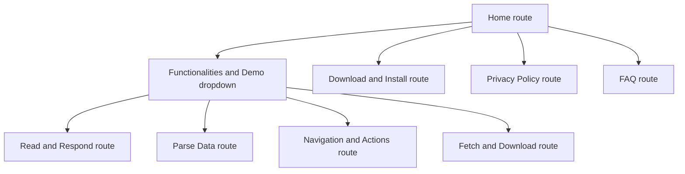
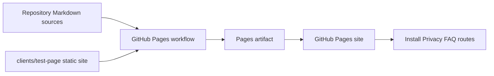

# ADR 0058: GitHub Pages Marketing Site

## Status

Accepted

## Date

2026-06-19

## Context

ADR 0053 through ADR 0057 turned the local demo pages into a polished static
SPA under `clients/test-page/`. The same static files are now published through
GitHub Pages, so the public demo surface can become the public Brijio marketing
site instead of remaining only a tool-validation fixture.

The site needs more than the current Home and demo routes. It should explain
what Brijio does, let visitors try the four browser-agent demo surfaces, and
provide public install, privacy, and FAQ pages. Privacy and installation content
already belongs in repository documentation, so the marketing site should render
those pages from Markdown source files instead of duplicating long-form copy in
HTML.

## Decision

Keep `clients/test-page` as the static GitHub Pages source and extend its
hash-routed SPA into a public marketing site.

Marketing pages and demo pages will use separate layouts.

- Marketing routes (`#home`, `#install`, `#privacy`, `#faq`) use a public site
  layout optimized for product positioning, installation guidance, policy text,
  and FAQ reading.
- Demo routes (`#read`, `#parse`, `#actions`, `#downloads`) keep the existing
  demo layout optimized for interactive browser-agent fixtures.

The marketing layout should define its own sections, typography scale,
navigation behavior, Markdown content styling, and responsive rules instead of
reusing the demo page working-row layout. The visual identity should remain
consistent with the demo pages: same Brijio mark, same color scheme, same
overall look and feel, and compatible typography/token choices.

The top navigation will be:

- Home
- Functionalities and Demo
  - Read and Respond
  - Parse Data
  - Navigation and Actions
  - Fetch and Download
- Download and Install
- Privacy Policy
- FAQ

`Functionalities and Demo` is only a menu label and dropdown trigger. It does
not have its own route. The four existing demo pages remain the destination
routes for that dropdown.



Long-form content pages will render Markdown copied into the published static
artifact:

- `#install` renders from `docs/artifacts/download-and-install.md`.
- `#privacy` renders from `clients/extensions/chrome/PRIVACY-POLICY.md`.
- `#faq` renders from `docs/artifacts/faq.md`.

The Pages workflow will assemble a publish directory instead of uploading
`clients/test-page` directly. It will copy the site files plus the Markdown
sources into a stable static content path, for example:

```text
published-site/
  index.html
  read-respond.html
  parse-data.html
  navigation.html
  download.html
  assets/
  content/
    download-and-install.md
    privacy-policy.md
    faq.md
```



The site will include a small Markdown renderer for this controlled repo
content. It should support the Markdown syntax already used by the selected
source files: headings, paragraphs, emphasis, links, lists, tables, and fenced
code blocks. The renderer is not intended to render untrusted user-authored
content.

## Consequences

Positive:

- GitHub Pages becomes the public Brijio marketing surface without introducing
  a framework or build system.
- The interactive demo pages remain static and continue working on local static
  servers and GitHub Pages.
- Privacy, install, and FAQ copy remain maintainable as Markdown in the repo.
- Policy and install copy do not drift between documentation and the site.

Negative:

- The static SPA grows more complex because it now handles marketing pages,
  dropdown navigation, separate layout systems, and Markdown rendering.
- GitHub Pages deployment needs an artifact assembly step instead of uploading
  `clients/test-page` directly.
- Markdown rendering must be tested carefully enough to avoid broken policy,
  install, or FAQ pages on the public site.

## Testing

Implementation should verify:

- Home route still renders as the first public viewport.
- Marketing routes use their own marketing layout, not the demo route layout.
- Demo routes continue using the existing shared demo layout.
- Marketing and demo layouts share the same Brijio visual identity and color
  scheme.
- `Functionalities and Demo` opens a keyboard- and pointer-accessible dropdown
  and does not navigate to a `#functionalities` route.
- Each dropdown item opens the existing demo route:
  - `#read`
  - `#parse`
  - `#actions`
  - `#downloads`
- `#install` loads and renders `download-and-install.md`.
- `#privacy` loads and renders `privacy-policy.md` copied from the Chrome
  extension privacy policy.
- `#faq` loads and renders `faq.md`.
- The Pages workflow artifact contains both the static site files and the copied
  Markdown content files.
- Desktop and mobile layouts have no overlapping nav, dropdown, marketing
  content, demo content, or Markdown content.
