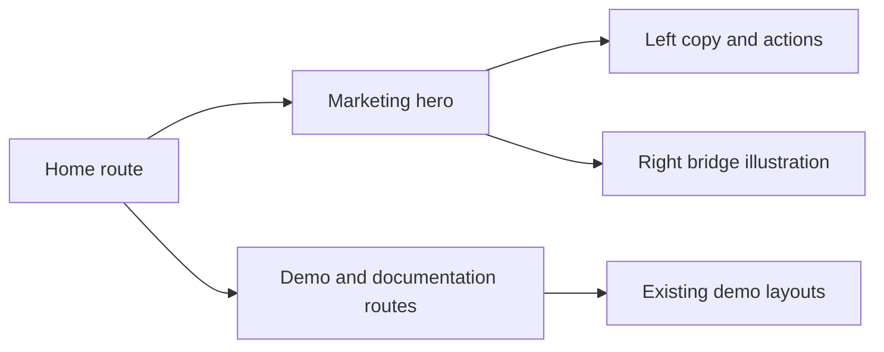

# ADR 0059: Home Hero Layout Restoration

## Status

Accepted

## Date

2026-06-19

## Context

ADR 0058 expanded the static demo site into a public marketing surface. The Home
route has since drifted from the older deployed Home composition. The desired
Home layout should keep the current marketing site routes but visually preserve
the older Home rhythm: centered 1280px hero, left-side product headline, and
right-side dark bridge illustration.

The Home page is separate from the interactive demo pages, but it lives in the
same static site. The change should therefore restore the Home marketing hero
without changing demo route layouts or browser-action fixture behavior.

## Decision

Restore the Home first viewport to match the supplied reference composition:

- Use a two-column desktop hero with copy on the left and the bridge visual on
  the right, matching the older deployed Home proportions.
- Keep the first viewport spacious while preserving the existing top navigation
  on Home.
- Make the eyebrow a pill reading "User-controlled browser bridge for AI
  agents".
- Render the product name "Brijio" as the dominant left-side signal.
- Use the deployed Home calls to action: "Run the form demo" and "Parse
  structured data".
- Rebuild the right-side illustration as a dark rounded panel containing the
  Brijio mark, a browser-tab card, a connecting line, and a stacked agent tool
  panel.
- Scope the CSS to the Home marketing layout so demo pages retain their shared
  fixture grid and sticky rail behavior.
- Keep the visual implemented with HTML/CSS and existing local assets rather
  than introducing new image generation or a framework dependency.

Responsive behavior:

- On wide screens, preserve the deployed Home balance: a centered 1280px hero
  with a 550px-tall right visual.
- On tablet and mobile widths, stack copy above the visual, reduce type and
  panel sizes, and prevent text or illustration overlap.
- Keep the next section reachable below the first viewport without hiding Home
  content behind fixed elements.

## Consequences

Positive:

- Home returns to a screenshot-ready public first viewport.
- The product name and controlled-browser positioning are visible immediately.
- Demo route layout risk stays low because the change is scoped to marketing
  Home selectors.

Negative:

- The marketing hero has custom illustration CSS that must be visually checked
  at desktop and mobile sizes.
- Preserving the top navigation means the visual crop will not exactly match
  the supplied screenshot, but navigation remains consistent across marketing
  routes.

## Testing

Implementation should verify:

- `http://localhost:3000` renders the Home hero close to the supplied screenshot
  at desktop width.
- Home desktop layout has two columns: copy/actions on the left and the dark
  bridge visual on the right.
- Home mobile layout stacks without overlap and keeps all hero text readable.
- Home keeps the main navigation visible.
- Demo routes (`#read`, `#parse`, `#actions`, `#downloads`) still load and keep
  their existing demo layouts.
- No console errors occur when loading Home or switching to demo routes.
