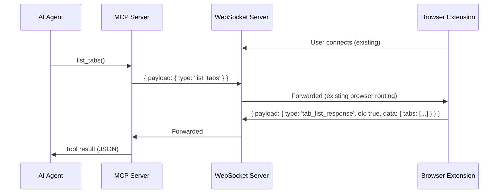
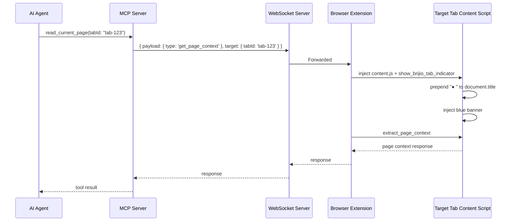

# ADR 0060: Explicit Tab Listing and Selection

## Status

Proposed

## Date

2026-06-26

## Context

Brijio currently operates on a single implicit tab — the active tab in the
current window. Every page read, action, batch, navigation, and approval uses
`chrome.tabs.query({ active: true, currentWindow: true })` (or the Safari
`browser.tabs` equivalent) to resolve the target tab. There is no concept of
"which tab" at the protocol level.

Authenticated workflows often span multiple tabs. The agent needs to read
context from one tab, fill a form in another, and navigate a third. Today this
is impossible — the user must manually switch tabs for each operation.

The `list_browsers` tool already exists for multi-browser targeting (multiple
connected extensions). P2.1 extends targeting to the multi-tab axis within a
single browser.

**Critical constraints:**

1. **Per-call targeting, not session state.** The agent must be able to target
   a specific tab on each tool call without hidden "selected tab" state. This
   is consistent with how `browserInstanceId` works today — stateless,
   explicit, no stale session.
2. **Chrome and Safari parity.** Safari is a competitive lever. Both browsers
   must support tab listing and targeting in the same PR. The WebExtensions
   `browser.tabs.query({})` API is available on Safari and returns all tabs
   across all windows.
3. **User awareness is non-negotiable.** When the agent targets a tab that is
   not the active tab, the user must see a visual indicator on that tab. This
   follows the existing approval banner injection pattern (ADR 0048).
4. **No ambient monitoring.** Tab list is fetched on demand via an explicit
   tool call. The extension does not continuously stream tab updates.

## Decision

Add a `list_tabs` MCP tool, a `tabId` targeting parameter on all existing
tools, and a persistent content-script banner on the controlled tab.

### 1. New protocol messages: `list_tabs` and `tab_list_response`

A new `list_tabs` request type flows through the existing WS server → extension
routing, mirroring `list_browsers`:



**TabInfo shape:**

```ts
interface TabInfo {
  /** Opaque tab identifier (raw Chrome/Safari tab ID as string) */
  tabId: string;
  /** Opaque window identifier (raw Chrome/Safari window ID as string) */
  windowId: string;
  /** Page title */
  title: string;
  /** Full URL (HTTP/HTTPS only) */
  url: string;
  /** Whether this is the user's currently focused tab */
  active: boolean;
  /** Whether the tab is eligible for Brijio actions (always true for listed tabs) */
  supported: boolean;
}
```

### 2. New MCP tool: `list_tabs`

Registered alongside `list_browsers`. Returns the tab list for the connected
browser instance. Accepts optional `browserInstanceId` for multi-browser
targeting (same pattern as all other tools).

### 3. Tab targeting: per-call `tabId` parameter

Every existing tool that operates on a tab gains an optional `tabId` input
parameter:

- `read_current_page`
- `click_element`
- `fill_input`
- `fill_editable`
- `set_checked`
- `select_options`
- `submit_form`
- `upload_file`
- `navigate_to_url`
- `perform_batch`
- `read_resource` (page content)

When `tabId` is omitted, behaviour is unchanged — the active tab is used. When
provided, the extension resolves the tab ID and targets that specific tab
instead.

No `select_tab` session-level default is introduced. Per-call targeting is
stateless and explicit, consistent with `browserInstanceId`.

### 4. Tab exclusion logic

Only regular HTTP/HTTPS tabs are listed. The extension filters using the
existing `isRegularPageUrl()` check:

- `chrome://`, `chrome-extension://`, `about:`, `file://`, `safari://` →
  excluded.
- Incognito tabs → excluded for P2.1 (extension would need `"incognito":
"split"` mode).

### 5. Extension changes

#### 5.1 `TabsApi` widening

The `TabsApi` interface in `@brijio/shared` is widened to support querying all
tabs (not just `{ active: true, currentWindow: true }`):

```ts
interface TabsApi {
  query: (queryInfo?: {
    active?: boolean;
    currentWindow?: boolean;
  }) => Promise<TabHandle[]>;
  sendMessage: (tabId: number, message: unknown) => Promise<unknown>;
}
```

`readActiveTabPage` and `performActiveTabAction` gain an optional `tabId`
parameter. When provided, they skip the `query({ active: true, currentWindow:
true })` call and use the specified tab ID directly (still validating
`isRegularPageUrl`).

#### 5.2 New `listTabs` adapter method

A new method on the extension queries all tabs via `tabs.query({})` and filters
to regular pages using `isRegularPageUrl()`.

#### 5.3 Chrome and Safari parity

Both extensions implement the same `TabsApi` widening. The `browser.*`
namespace in Safari supports `browser.tabs.query({})` returning all tabs across
all windows.

### 6. Content-script tab indicator — in-page banner and tab-level visual

The user must be able to see which tab Brijio is currently targeting. Two
visual signals work together: a tab-level indicator visible in the browser tab
bar (like a recording dot) and a persistent in-page banner following the
existing approval banner injection pattern (ADR 0048).

**Tab-level indicator (title prefix):**

The content script prepends a visual marker to `document.title` when Brijio
targets a tab (e.g. `● Original Page Title`). This is visible in the browser
tab bar even when the tab is in the background or not active — the same UX
pattern used by Google Meet's recording indicator.

- On `show_brijio_tab_indicator`: store the original `document.title`, prepend
  `● ` (U+25CF BLACK CIRCLE + space).
- On `hide_brijio_tab_indicator`: restore the original title.
- If the page changes its own title while Brijio is active, the content script
  re-applies the prefix via a `MutationObserver` on `<title>`.
- This works identically on Chrome and Safari — no extension API needed, just
  DOM manipulation the content script already does for the banner.

**In-page banner:**

A small persistent banner (blue accent, positioned top-left) inside the page
content area.

**Two new content-script message types:**

- `show_brijio_tab_indicator` — prepend title marker + inject in-page banner.
- `hide_brijio_tab_indicator` — restore title + remove banner.

**Banner characteristics:**

- Persistent (stays until explicitly hidden or the tab navigates).
- Non-interactive for P2.1 (informational only — "Brijio is active on this
  tab").
- Visually distinct from the approval banner (blue `#1a56db` accent vs. amber
  `#fff8d6`).
- `role="status"`, `aria-live="polite"`.

**Flow:**



When the agent targets a different tab on the next call, the extension sends
`hide_brijio_tab_indicator` to the previous tab (restores title, removes banner)
and `show_brijio_tab_indicator` to the new one (prepends title, injects banner).

### 7. WS server routing

The `tabId` parameter rides on the existing `target` field of the
`WebSocketEnvelope`:

```ts
target: {
  browserInstanceId?: string;  // existing
  tabId?: string;              // new
}
```

The WS server already routes to the correct browser extension via
`browserInstanceId`. The `tabId` is passed through to the extension, which
resolves it to a real Chrome/Safari tab ID.

### 8. MCP protocol types

New types mirroring the `list_browsers` pattern:

```ts
interface ListTabsRequest {
  type: "list_tabs";
}

interface TabListResponse {
  type: "tab_list_response";
  ok: true;
  data: { tabs: TabInfo[] };
}

interface TabListErrorResponse {
  type: "tab_list_response";
  ok: false;
  error: { code: string; message: string };
}
```

New `BrijioTabListResult` type and `parseTabListEnvelope` parser, following the
existing `parseBrowserListEnvelope` pattern.

## Cross-Browser Capability Matrix

| Browser | `list_tabs` | `tabId` targeting | Tab title indicator | In-page banner |
| ------- | ----------- | ----------------- | ------------------- | -------------- |
| Chrome  | ✅ Full     | ✅ Full           | ✅ Full             | ✅ Full        |
| Safari  | ✅ Full     | ✅ Full           | ✅ Full             | ✅ Full        |

Both extensions use the same `BrijioBackgroundController` from `@brijio/shared`
and the same `TabsApi` interface. The `browser.*` namespace in Safari supports
`browser.tabs.query({})` returning all tabs across all windows.

**Safari-specific notes:**

- Safari may not expose all tabs in private mode the same way. If
  `browser.tabs.query({})` returns an empty list in private mode, the tool
  reports an empty tab list — the agent can still target the active tab by
  omitting `tabId`.
- Safari uses `browser.*` namespace (already handled in the existing
  `BrowserApi` interface).
- Safari badges are text-only (already handled via `SafariActionBadge` no-ops).

## Internal WebSocket Messages

| Direction         | Message Type                | Purpose                                              |
| ----------------- | --------------------------- | ---------------------------------------------------- |
| Agent → Extension | `list_tabs`                 | Request list of open tabs                            |
| Extension → Agent | `tab_list_response`         | Tab list with metadata                               |
| Extension → Tab   | `show_brijio_tab_indicator` | Prepend `● ` to tab title + inject persistent banner |
| Extension → Tab   | `hide_brijio_tab_indicator` | Restore original title + remove banner               |

## Consequences

### Positive

- Agent can enumerate and target specific tabs — multi-tab workflows become
  possible.
- Stateless per-call targeting — no hidden session state, no stale "selected
  tab".
- Full Chrome and Safari parity — same protocol, same tools, same banner
  pattern.
- Minimal protocol addition — `list_tabs` mirrors `list_browsers`; `tabId`
  mirrors `browserInstanceId`.
- User can see which tab Brijio is currently serving via the persistent banner.

### Negative

- Every tool gains a new optional parameter — slight input schema bloat.
- Tab IDs are raw Chrome/Safari integers exposed as strings — will need UUID
  aliasing for the cloud model (deferred).
- The persistent banner on non-active tabs could confuse users if they don't
  expect Brijio to be "watching" a background tab. The banner text should make
  clear the agent is using this tab for a specific operation.
- Safari private mode may return an empty tab list.

### Risks

- **Tab lifecycle races:** A tab could close between `list_tabs` and a
  subsequent `tabId`-targeted action. The extension must return a clear
  `no_active_tab` or `tab_not_found` error.
- **Tab ID aliasing for cloud:** Raw tab IDs are acceptable for local dev but
  must be replaced with opaque UUIDs before the cloud model. The `TabInfo`
  shape already uses `string` to allow this transition without protocol
  changes.
- **Banner injection on restricted pages:** Content script injection may fail
  on some pages. The extension should fail gracefully — the action still
  executes, but the banner is not shown. This is consistent with how approval
  banners handle injection failures.

## Scope

### In scope

- Shared protocol types for `list_tabs`, `tab_list_response`, and `tabId`
  targeting on the `WebSocketEnvelope` target field.
- `list_tabs` MCP tool with `parseTabListEnvelope`.
- `tabId` optional input parameter on all existing tab-operating tools.
- `TabsApi` widening in `@brijio/shared` to support `query({})`.
- `listTabs` adapter method on Chrome and Safari extensions.
- `readActiveTabPage` and `performActiveTabAction` accepting optional `tabId`.
- Content-script `show_brijio_tab_indicator` / `hide_brijio_tab_indicator`
  messages with persistent blue banner.
- Tab exclusion logic (HTTP/HTTPS only, no incognito).
- Tests for protocol validation, MCP envelope creation, extension tab listing,
  tab-targeted actions, and banner injection/removal.

### Out of scope

- `select_tab` session-level default (syntactic sugar on top of per-call
  `tabId`).
- Tab ID UUID aliasing (needed for cloud model security).
- Privacy stance (origin-only URLs for non-active tabs).
- Incognito tab support.
- Banner interactivity (disconnect button, tab switching).
- Continuous tab update streaming (push events).

## Testing

Use TDD:

1. Add failing shared protocol tests for `list_tabs` request validation and
   `tab_list_response` parsing.
2. Add failing MCP tests proving `list_tabs` tool returns structured tab list
   and `tabId` is forwarded on targeted tool calls.
3. Add failing extension background tests for:
   - `listTabs` querying all tabs and filtering to regular pages;
   - `tabId`-targeted reads and actions using the specified tab instead of the
     active tab;
   - `show_brijio_tab_indicator` and `hide_brijio_tab_indicator` content-script
     message dispatch.
4. Add failing content-script tests for:
   - banner injection and removal;
   - title prefix application (`● ` prepended to `document.title`);
   - title restoration on `hide_brijio_tab_indicator`;
   - `MutationObserver` re-applies prefix when page changes its own title.
5. Implement the smallest code needed to pass.

Verification should include:

- `pnpm --filter @brijio/shared test`
- `pnpm --filter @brijio/chrome-extension test`
- `pnpm --filter @brijio/safari-extension test`
- `pnpm --filter @brijio/mcp test`
- `pnpm lint:ts`
- `pnpm lint:md`
- `pnpm test`
