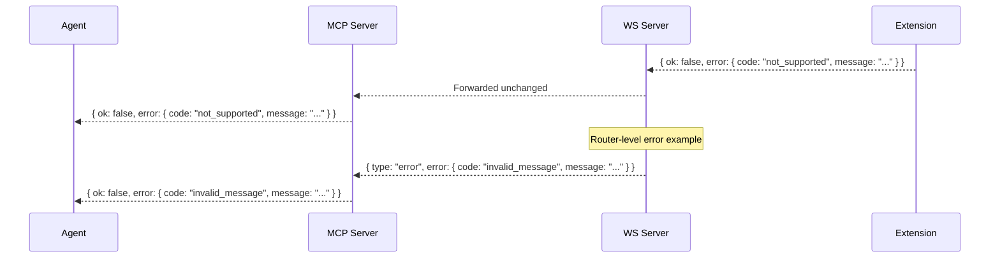

# ADR 0061: Forward Error Codes and Messages Through the MCP Server

## Status

Proposed

## Date

2026-06-27

## Context

The Brijio MCP server sits between the AI agent and the WebSocket server + browser
extension. When something goes wrong — the extension doesn't support an action,
the WS server rejects a malformed message, or the browser raises an error — the
error flows back through the chain:

```
Extension → WS Server → MCP Server → Agent
```

Two functions in `servers/mcp/src/protocol.ts` currently discard the original
error information and replace it with a generic message:

### 1. `parseRouterErrorEnvelope` (router-level errors)

When the WS server sends a `{ type: 'error', error: { code, message } }` envelope,
`parseRouterErrorEnvelope` checks `isBrijioErrorCode(value.error.code)` against
the MCP server's **local** `BrijioErrorCode` union. This union is out of sync
with the shared package's `BrijioErrorCode` that the WS server actually uses.

**MCP recognizes:** `auth_required`, `auth_failed`, `invalid_auth_message`,
`browser_unavailable`, `ambiguous_browser_target`, `invalid_browser_target`,
`connection_failed`, `timeout`, `invalid_response`, `browser_error`,
`batch_failed`, `stale_context`, `page_navigated`, `invalid_resource_uri`,
`unsupported_scheme`

**WS server emits (shared package):** `invalid_json`, `invalid_message`,
`auth_required`, `auth_failed`, `browser_unavailable`,
`ambiguous_browser_target`, `unsupported_action`, and more

Codes like `invalid_message` and `invalid_json` are **not recognized** — the
function returns `invalidResponse()` and the agent sees `"Received an invalid
Brijio response."` instead of the actual error.

### 2. `parseErrorPayload` (action-level errors)

When the extension returns `{ ok: false, error: { code, message } }` inside an
`action_result`, `parseErrorPayload` preserves the **message** but replaces
every non-`stale_context`/non-`page_navigated` code with `'browser_error'`.

So `not_supported`, `cors_blocked`, `http_error`, `size_exceeded` — all
meaningful codes the agent could act on — are flattened to `browser_error`.

### Impact

The agent receives generic error messages like:

- `"Received an invalid Brijio response."` (when the WS server said something
  specific like `"Invalid message: extension messages must announce browser
presence or respond to a pending request."`)
- `{ code: 'browser_error', message: 'chrome.downloads API not available.' }`
  (when the extension said `code: 'not_supported'`)

The agent cannot distinguish between "this action is permanently unsupported on
this browser" and "a transient error occurred", nor can it surface the actual
problem to the user.

## Decision

**Forward the original error code and message from the WS server and extension
through to the MCP tool result.**

### Router-level errors (`parseRouterErrorEnvelope`)

Replace the `isBrijioErrorCode` guard with a passthrough strategy:

- If the error envelope has a string `code` and string `message`, forward both
  as-is.
- Stop returning `invalidResponse()` for unrecognized codes — that was the
  bug. The original message is always more useful than `"Received an invalid
Brijio response."`.
- Only return `invalidResponse()` when the envelope structure itself is
  malformed (missing `error` object, missing `message` string).

### Action-level errors (`parseErrorPayload`)

Forward the original `code` string from the extension:

- Preserve `stale_context` and `page_navigated` with their `detail` as today
  (these have structured detail the agent relies on).
- For all other codes, pass through the original `code` string instead of
  wrapping as `'browser_error'`.
- The `message` is already preserved — keep that behavior.

### Type changes

The MCP server's `BrijioErrorCode` type and `BrijioToolErrorCode` type must
accept arbitrary string codes, since the extension and WS server may emit
codes not known to the MCP server. The cleanest approach:

- Change `parseRouterErrorEnvelope` and `parseErrorPayload` to return `code` as
  `string` rather than `BrijioErrorCode`.
- Update `BrijioResourceResult` and `BrijioToolResult` error types to use
  `code: string` instead of `code: BrijioErrorCode`.
- Keep the known codes in `BrijioErrorCode` for internal use (constructors like
  `timeoutResponse`, `connectionFailedResponse`, etc.) but don't constrain
  the result type to them.

## Message Flow



## Scope

In scope:

- `parseRouterErrorEnvelope`: forward unknown error codes instead of returning
  `invalidResponse()`
- `parseErrorPayload`: forward the original error code instead of wrapping as
  `browser_error`
- Relax `BrijioResourceResult` and `BrijioToolResult` error `code` field to
  `string`
- Update existing tests that assert `browser_error` wrapping to assert
  pass-through
- Add tests for unrecognized router codes (e.g. `invalid_message`)

Out of scope:

- Changing the shared package's `BrijioErrorCode` union
- Adding new error codes to the extension or WS server
- Changing the MCP SDK's `isError` flag behavior (errors are returned in the
  `content` text field as JSON, not as MCP-level errors)

## Testing

Use TDD:

1. Add failing tests for `parseRouterErrorEnvelope` with unrecognized codes
   (e.g. `invalid_message`, `invalid_json`) — assert the code and message are
   forwarded, not `invalid_response`.
2. Add failing tests for `parseErrorPayload` with extension-specific codes
   (e.g. `not_supported`, `cors_blocked`) — assert the original code is
   forwarded, not `browser_error`.
3. Update existing tests that assert `browser_error` wrapping to assert
   pass-through of the original code.
4. Implement the smallest code change to pass all tests.

Verification:

- `pnpm --filter @brijio/mcp test`
- `pnpm lint:ts`
- `pnpm build`

## Consequences

- Agents receive specific, actionable error codes instead of generic
  `browser_error` or `invalid_response`.
- The MCP server no longer needs to maintain a parallel `BrijioErrorCode` union
  that must stay in sync with the shared package.
- Breaking change for agents that switch on `code === 'browser_error'` — they
  must handle arbitrary string codes. Since Brijio is pre-1.0 and the agent
  prompts already instruct the LLM to read the `message` field, this is
  acceptable.
- The `fetch_resource_error` path (line 1313–1328) already forwards a composite
  code — this ADR aligns the rest of the protocol with that precedent.
