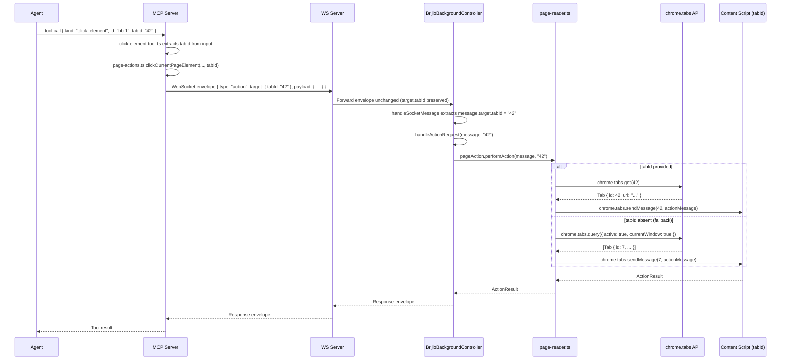

# ADR 0062: Thread tabId Through the Entire Action Stack

## Status

Proposed

## Date

2026-06-27

## Context

ADR 0060 introduced explicit tab listing and added an optional `tabId` parameter
to every MCP tool input schema. The MCP-side wiring is complete:

- **MCP websocket-client.ts** already places `tabId` into `envelope.target.tabId`,
  and `PageContextRequestOptions` carries a `tabId` field.
- **WS server** forwards the full message envelope — including `target` — to the
  extension unchanged.
- **MCP tool files** (click-element-tool, fill-input-tool, form-action-tools,
  page-reading-tool, etc.) extract `tabId` from tool input and pass it through
  to `page-actions.ts` and `page-context.ts` functions, which in turn include it
  in the WebSocket request envelope.

**The extension layer, however, ignores `tabId` entirely.** Every action still
targets the active foreground tab:

- `BrijioBackgroundController.handleSocketMessage` never reads
  `message.target.tabId`. The `tabId` arrives in the envelope but is silently
  dropped.
- `page-reader.ts` functions — `readActiveTabPage`, `performActiveTabAction`,
  `performActiveTabBatch` — are hardcoded to
  `chrome.tabs.query({ active: true, currentWindow: true })`.
- `navigateActiveTabToUrl` in `background.ts` also uses
  `chrome.tabs.query({ active: true, currentWindow: true })`.
- The `ChromeApi` interface has `tabs.query` but not `tabs.get`, so there is no
  way to resolve a specific tab by ID.
- The `TabsApi` interface in `page-reader.ts` has `query` but not `get`.
- The adapter interfaces in `background-controller.ts`
  (`PageReaderAdapter`, `PageActionAdapter`, `PageBatchAdapter`,
  `PageNavigationAdapter`) do not accept a `tabId` parameter.

This means an agent that calls `list_tabs`, receives a `tabId` for a background
tab, and then passes that `tabId` to `click_element` or `read_current_page` will
unknowingly operate on the foreground tab instead of the intended background tab.
The `tabId` parameter is accepted by the MCP schema but is a no-op end-to-end.

## Decision

Thread `tabId` from the MCP tool input all the way through to
`chrome.tabs.sendMessage(tabId, message)` and
`chrome.tabs.update(tabId, { url })` in the extension, with a backward-compatible
fallback to the active tab when `tabId` is absent.

### Layer-by-layer changes

#### 1. `page-reader.ts` (shared) — accept optional `tabId`

Add an optional `tabId?: string` parameter to `readActiveTabPage`,
`performActiveTabAction`, and `performActiveTabBatch`.

When `tabId` is provided:

```ts
const tab = await deps.tabs.get(Number(tabId))
```

When `tabId` is absent, fall back to the existing behaviour:

```ts
const tabs = await deps.tabs.query({ active: true, currentWindow: true })
const tab = tabs[0]
```

Add `get: (tabId: number) => Promise<TabHandle>` to the `TabsApi` interface in
`page-reader.ts`. This mirrors `chrome.tabs.get(tabId)` which returns a single
`chrome.tabs.Tab` by numeric ID.

The existing `ActiveTabDeps` interface already provides `tabs: TabsApi`; the
only change is adding `get` to `TabsApi` and using it in the three exported
functions.

#### 2. `background-controller.ts` — extract `tabId` from message target

`BrijioBackgroundController.handleSocketMessage` must extract
`message.target?.tabId` and pass it through to the handler methods:

```ts
const tabId = (message as { target?: { tabId?: string } }).target?.tabId
```

Then forward `tabId` to each handler:

- `handlePageContextRequest(message, tabId)` → `this.options.pageReader.readPage(message, tabId)`
- `handleActionRequest(message, tabId)` → `this.options.pageAction.performAction(message, tabId)`
- `handleBatchRequest(message, tabId)` → `this.options.pageBatch.performBatch(message, tabId)`
- `handleNavigateToUrlRequest(message, tabId)` → `this.options.pageNavigation.navigateToUrl(url, tabId)`

Update the adapter interfaces to accept `tabId?: string`:

```ts
interface PageReaderAdapter {
  readPage (message: ContentRequest, tabId?: string): Promise<ContentResponse>
}

interface PageActionAdapter {
  performAction (message: ActionRequest, tabId?: string): Promise<ActionResult>
}

interface PageBatchAdapter {
  performBatch (message: BatchRequest, tabId?: string): Promise<BatchResult>
}

interface PageNavigationAdapter {
  navigateToUrl (url: string, tabId?: string): Promise<PageNavigationResult>
}
```

#### 3. `background.ts` (Chrome) — `navigateActiveTabToUrl` and `ChromeApi`

Add `tabs.get` to the `ChromeApi` interface:

```ts
interface ChromeApi {
  tabs: {
    query: (info: chrome.tabs.QueryInfo) => Promise<chrome.tabs.Tab[]>
    get: (tabId: number) => Promise<chrome.tabs.Tab>
    update: (tabId: number, props: chrome.tabs.UpdateProperties) => Promise<chrome.tabs.Tab>
  }
  // ... other existing members
}
```

Update `navigateActiveTabToUrl` to accept an optional `tabId`:

```ts
export async function navigateActiveTabToUrl (
  url: string,
  tabId?: string
): Promise<PageNavigationResult> {
  // ...
  if (tabId !== undefined) {
    const tab = await chrome.tabs.get(Number(tabId))
    await chrome.tabs.update(tab.id!, { url })
  } else {
    const tabs = await chrome.tabs.query({ active: true, currentWindow: true })
    if (tabs.length === 0 || tabs[0].id === undefined) {
      return { ok: false, error: { code: 'no_active_tab', message: '...' } }
    }
    await chrome.tabs.update(tabs[0].id, { url })
  }
  // ... wait for navigation, return result
}
```

The Chrome adapter functions that wrap `readActiveTabPage`,
`performActiveTabAction`, and `performActiveTabBatch` must forward `tabId`:

```ts
const pageReader: PageReaderAdapter = {
  readPage: (message, tabId) => sharedReadActiveTabPage(message, deps, options, tabId)
}
```

#### 4. Safari `background.ts` — mirror Chrome changes

The Safari adapters (`SafariPageReaderAdapter`, `SafariPageActionAdapter`,
`SafariPageBatchAdapter`, `SafariPageNavigationAdapter`) must also accept and
forward `tabId`. Safari's `browser.tabs.get(tabId)` API is equivalent.

#### 5. MCP `page-actions.ts` — accept and forward `tabId`

The `page-actions.ts` functions (`clickCurrentPageElement`,
`fillInputControl`, `fillEditableTarget`, `setCheckboxState`,
`selectControlOptions`, `submitFormAction`, `uploadFileToInput`) must accept
an optional `tabId?: string` and include it in the WebSocket request envelope's
`target.tabId` field.

This was partially done in the ADR 0060 implementation commit, but the
`tabId` must be threaded through the function signatures, not just the envelope
construction.

#### 6. MCP tool files — pass `tabId` from input through to `page-actions`

Each tool file (click-element-tool.ts, fill-input-tool.ts, form-action-tools.ts,
page-reading-tool.ts, navigate-to-url-tool.ts, batch-tool.ts, etc.) must extract
`tabId` from the parsed tool input and pass it as the final argument to the
corresponding `page-actions.ts` function.

Example (click-element-tool.ts):

```ts
const { kind, id, expectedText, expectedHref, expectedRole,
        pageContextId, visibleContextId, tabId } = input

const result = await clickCurrentPageElement(
  { kind, id, expectedText, expectedHref, expectedRole,
    pageContextId, visibleContextId },
  config,
  tabId
)
```

#### 7. Backward compatibility — fallback to active tab

When `tabId` is `undefined` or not provided, every function in the stack must
fall back to `chrome.tabs.query({ active: true, currentWindow: true })`. This
ensures all existing callers that omit `tabId` continue to work unchanged.

## Message Flow

The following sequence diagram shows the complete flow when an agent passes a
`tabId` through to a background tab:



## Scope

### In scope

- Add `get: (tabId: number) => Promise<TabHandle>` to `TabsApi` in
  `page-reader.ts`.
- Add optional `tabId?: string` parameter to `readActiveTabPage`,
  `performActiveTabAction`, `performActiveTabBatch` in `page-reader.ts`.
- Update `PageReaderAdapter`, `PageActionAdapter`, `PageBatchAdapter`,
  `PageNavigationAdapter` interfaces in `background-controller.ts` to accept
  `tabId?: string`.
- Update `BrijioBackgroundController.handleSocketMessage` to extract
  `message.target?.tabId` and pass it to handler methods.
- Add `tabs.get` to `ChromeApi` interface in Chrome `background.ts`.
- Update `navigateActiveTabToUrl` in Chrome `background.ts` to accept
  `tabId?: string` and use `chrome.tabs.get` / `chrome.tabs.update` when
  provided.
- Update Chrome adapter wrappers to forward `tabId` to shared `page-reader.ts`
  functions.
- Mirror all Chrome changes in Safari `background.ts` and `background-entry.ts`.
- Verify MCP `page-actions.ts` functions accept and forward `tabId` in the
  WebSocket request envelope's `target.tabId`.
- Verify MCP tool files extract `tabId` from input and pass it through to
  `page-actions.ts`.
- Unit tests for `page-reader.ts` tabId-targeted reads/actions.
- Unit tests for `background-controller.ts` tabId extraction and forwarding.
- Unit tests for `navigateActiveTabToUrl` with and without `tabId`.
- Unit tests for Chrome and Safari adapter `tabId` forwarding.

### Out of scope

- Cross-window tab targeting (e.g., targeting tabs in a specific window by
  `windowId`). The `tabId` alone is globally unique within a browser session.
- Tab lifecycle management (creating, closing, or rearranging tabs).
- Content script injection into tabs that have not yet been visited by the
  extension. If a `tabId` references a tab without a loaded content script,
  `chrome.tabs.sendMessage` will fail with "Could not establish connection" —
  this is an existing limitation and is not addressed here.
- Per-tab stale-context isolation. The `pageContextId` / `visibleContextId`
  validation already works per-tab because context is returned per read. No
  additional cross-tab context validation is needed.
- Changes to the WS server. It already forwards the full envelope unchanged.

## Testing

### TDD steps

1. **`page-reader.ts` — `TabsApi.get` and tabId-targeted reads**

   Write tests in `packages/shared/src/page-reader.test.ts`:

   - Test that `readActiveTabPage` calls `deps.tabs.get(Number(tabId))` when
     `tabId` is provided, and does NOT call `deps.tabs.query`.
   - Test that `readActiveTabPage` falls back to
     `deps.tabs.query({ active: true, currentWindow: true })` when `tabId` is
     `undefined`.
   - Test that `performActiveTabAction` uses `tabs.get(tabId)` when provided.
   - Test that `performActiveTabBatch` uses `tabs.get(tabId)` when provided.
   - Test that `tabs.get` throwing (tab not found) produces an appropriate
     error result with `code: 'no_such_tab'`.

2. **`background-controller.ts` — tabId extraction**

   Write tests in `packages/shared/src/background-controller.test.ts`:

   - Test that `handleSocketMessage` extracts `target.tabId` from the incoming
     envelope and passes it to `pageReader.readPage`.
   - Test that `handleSocketMessage` passes `tabId` to `pageAction.performAction`.
   - Test that `handleSocketMessage` passes `tabId` to `pageBatch.performBatch`.
   - Test that `handleSocketMessage` passes `tabId` to
     `pageNavigation.navigateToUrl`.
   - Test that when `target.tabId` is absent, `undefined` is passed (fallback
     path).

3. **Chrome `background.ts` — `navigateActiveTabToUrl` with tabId**

   Write tests in `clients/extensions/chrome/src/background.test.ts`:

   - Test that `navigateActiveTabToUrl(url, "42")` calls
     `chrome.tabs.get(42)` and `chrome.tabs.update(42, { url })`.
   - Test that `navigateActiveTabToUrl(url)` (no tabId) calls
     `chrome.tabs.query({ active: true, currentWindow: true })` as before.
   - Test that `navigateActiveTabToUrl(url, "999")` where `tabs.get` throws
     returns `{ ok: false, error: { code: 'no_such_tab', ... } }`.

4. **Chrome adapter — tabId forwarding**

   Write tests verifying that the Chrome `pageReader` adapter calls
   `sharedReadActiveTabPage(message, deps, options, tabId)` with the `tabId`
   received from the controller.

5. **Safari adapter — tabId forwarding**

   Write equivalent tests for the Safari adapters.

### Verification commands

```bash
# Run shared package tests (page-reader, background-controller)
npm test --workspace=packages/shared

# Run Chrome extension tests (background, navigateActiveTabToUrl)
npm test --workspace=clients/extensions/chrome

# Run Safari extension tests
npm test --workspace=clients/extensions/safari

# Run MCP server tests (page-actions, tool files, websocket-client)
npm test --workspace=servers/mcp

# Run all tests
npm test

# Lint check
npm run lint

# Build check
npm run build
```

## Consequences

### Positive

- **Enables multi-tab automation.** Agents can now read, click, fill, and
  navigate in background tabs without stealing focus from the active tab. This
  is critical for workflows that involve comparing pages across tabs or
  performing actions on a tab discovered via `list_tabs`.

- **Backward compatible.** Every function accepts `tabId?` and falls back to
  the active tab when it is absent. Existing callers, tests, and MCP clients
  that omit `tabId` continue to work without changes.

- **Minimal API surface change.** The only new interface member is
  `TabsApi.get`, which mirrors the standard `chrome.tabs.get` API. The adapter
  interfaces gain one optional parameter.

- **Consistent with ADR 0060.** This ADR completes the end-to-end `tabId`
  threading that ADR 0060 started. The MCP and WS layers were already wired;
  this ADR closes the extension-layer gap.

### Negative

- **Error surface expansion.** A new error code `no_such_tab` is needed for
  when `chrome.tabs.get(tabId)` fails (tab closed, invalid ID, etc.). MCP
  error forwarding (ADR 0061) must handle this code.

- **Testing complexity.** Every shared function and adapter now has two code
  paths (tabId provided vs. fallback). Tests must cover both paths for each
  function, increasing the test count.

- **Safari `browser.tabs.get` reliability.** On iOS Safari, the non-persistent
  background context (ADR 0050) may not have a valid `tabs.get` implementation
  at all times. If the background service worker has been suspended, the first
  `tabs.get` call may fail. This is the same class of issue as the existing
  `tabs.query` calls and is mitigated by the reconnect-on-wake mechanism
  (ADR 0052).

### Neutral

- **No changes to the WS server.** It already forwards the full envelope
  unchanged, so `target.tabId` is already present in messages delivered to the
  extension.

- **No changes to the MCP tool schemas.** ADR 0060 already added `tabId` to
  every tool input schema. This ADR only ensures the value is actually used
  downstream.

- **No changes to the content script.** The content script receives messages
  via `chrome.tabs.sendMessage(tabId, message)` — it does not need to know
  whether it is the active tab or a background tab. The message format is
  identical.