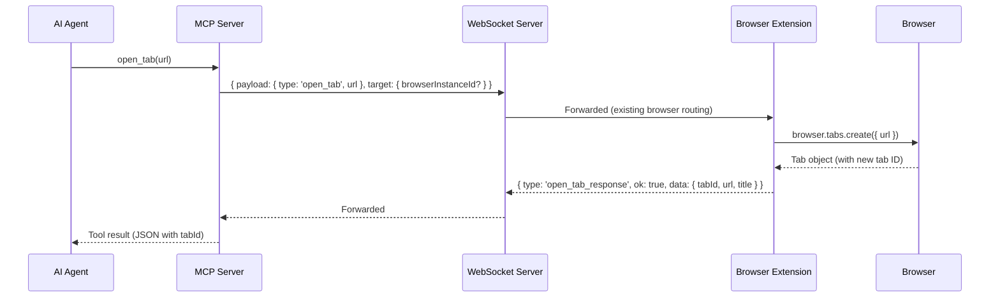

# ADR 0063: Open Tab Action

## Status

Proposed

## Date

2026-07-12

## Context

With P2.1 (ADR 0060) the agent can list tabs and target any existing tab via
`tabId`. However, it cannot **create** a new tab. When the agent needs to check
a reference page or open an auth flow, it has two options today — both
unsatisfactory:

1. **`navigate_to_url`** on the current tab — destroys the page state the agent
   was working on (form input, scroll position, dynamic content).
2. **`fetch_resource`** — retrieves raw HTML without JavaScript rendering or
   DOM interaction. Cannot handle SPA pages, auth-gated content that requires
   the browser session, or pages that need rendering to be useful.

`open_tab` fills this gap: the agent opens a new tab, reads it, interacts with
it if needed, and the user's original tab remains untouched.

The `tabs.create({ url })` API is already used in both extensions — Safari's
`SafariDownloadAdapter.downloadFile()` calls `this.tabs.create({ url })` as a
fire-and-forget download fallback, and Chrome's `background.ts` calls
`chrome.tabs.create()` to open the popup page. No new browser APIs are needed.

**Critical constraints:**

1. **Chrome and Safari parity.** Both extensions must support `open_tab` in the
   same PR. `tabs.create({ url })` is a standard WebExtensions API available on
   both browsers.
2. **URL validation.** Only HTTP/HTTPS URLs are allowed. The same
   `isRegularPageUrl()` check used by `list_tabs` and `navigate_to_url` applies
   here.
3. **Return the new tab's `tabId`.** The agent needs the new tab's ID to
   immediately target it with `read_current_page` or other tools. `tabs.create()`
   returns a `Tab` object containing the new tab's numeric ID.
4. **No tab ownership tracking.** `close_tab` and ownership tracking are
   deferred to P2.5. The agent can `list_tabs` to discover tabs it opened.
5. **User awareness.** The user sees a new tab appear in their browser — this
   is inherently non-destructive and visible. No additional banner or indicator
   is needed for `open_tab` beyond the existing P2.1 tab indicator that appears
   when the agent targets the new tab with a subsequent action.

## Decision

Add an `open_tab` MCP tool, a new `open_tab` / `open_tab_response` protocol
message pair, and an `openTab` adapter method on both Chrome and Safari
extensions.

### 1. New protocol messages: `open_tab` and `open_tab_response`

A new `open_tab` request type flows through the existing WS server → extension
routing, mirroring `navigate_to_url`:



### 2. Shared protocol types

New types in `packages/shared/src/protocol.ts`:

```ts
interface OpenTabRequestPayload {
  type: 'open_tab'
  url: string
}

interface OpenTabResult {
  /** New tab ID (raw Chrome/Safari tab ID as string) */
  tabId: string
  /** The URL the tab was opened with */
  url: string
  /** Page title (may be empty until the page loads) */
  title: string
}

interface OpenTabResponse {
  type: 'open_tab_response'
  ok: true
  data: OpenTabResult
}

interface OpenTabErrorResponse {
  type: 'open_tab_response'
  ok: false
  error: { code: OpenTabErrorCode, message: string }
}

type OpenTabErrorCode =
  | 'unsupported_scheme'
  | 'open_tab_failed'
  | 'timeout'
```

New envelope creators and type guards:

- `createOpenTabEnvelope(requestId, url)` — mirrors `createNavigateToUrlEnvelope`.
- `createOpenTabResponse(requestId, data)` — mirrors `createNavigateToUrlResponse`.
- `createOpenTabErrorResponse(requestId, code, message)`.
- `isOpenTabEnvelope(message)` — mirrors `isNavigateToUrlEnvelope`.
- `isOpenTabResponsePayload(value)` — validates the response shape.

Add `OpenTabResponse | OpenTabErrorResponse` to the `ExtensionResponse` union.

### 3. New MCP tool: `open_tab`

Registered in `mcp-server.ts` alongside `navigate_to_url`:

```ts
server.registerTool(
  'open_tab',
  {
    title: 'Open Tab',
    description:
      'Open a new browser tab with the specified HTTP/HTTPS URL. ' +
      'Returns the new tab ID for subsequent targeting. ' +
      'On Safari, triggers a content-script download (fire-and-forget) and returns status "initiated_fire_and_forget" with a null download ID.',
    inputSchema: {
      url: z.string().describe('The HTTP or HTTPS URL to open in a new tab.'),
      browserInstanceId: browserInstanceIdInput
    }
  },
  async (input) => { ... }
)
```

New files:

- `servers/mcp/src/open-tab-tool.ts` — thin wrapper, mirrors
  `navigate-to-url-tool.ts`. Contains `openTab()` function, `normalizeInput()`,
  URL validation (reuse `parseUrl` + `unsupportedSchemeResponse` pattern).
  Returns `BrijioOpenTabResult`.

### 4. MCP protocol types

New types in `servers/mcp/src/protocol.ts`:

```ts
export type BrijioOpenTabResult = BrijioResourceResult<OpenTabResult>
export type OpenTabParseResult = BrijioOpenTabResult | { ok: false, ignored: true }
```

New parser `parseOpenTabEnvelope(value, requestId)` — mirrors
`parseNavigateToUrlEnvelope`.

### 5. WebSocket client

New function in `servers/mcp/src/websocket-client.ts`:

```ts
export interface OpenTabRequestOptions extends PageContextRequestOptions {
  url: string
}

export async function requestOpenTab(
  options: OpenTabRequestOptions
): Promise<BrijioOpenTabResult>
```

Mirrors `requestNavigateToUrl`. Uses `createOpenTabEnvelope` and
`parseOpenTabEnvelope`.

### 6. Page actions wiring

New function in `servers/mcp/src/page-actions.ts`:

```ts
export async function openNewTab(
  config: BrijioPageActionsConfig,
  url: string,
  browserInstanceId?: string
): Promise<BrijioOpenTabResult>
```

Mirrors `navigateToCurrentPageUrl`. Calls `requestOpenTab` with config defaults.

### 7. Background controller

New adapter interface in `packages/shared/src/background-controller.ts`:

```ts
export type OpenTabResult =
  | { ok: true, data: { tabId: string, url: string, title: string } }
  | { ok: false, error: { code: string, message: string } }

export interface PageOpenTabAdapter {
  openTab: (url: string) => Promise<OpenTabResult>
}
```

New optional field on `BrijioBackgroundControllerOptions`:
`pageOpenTab?: PageOpenTabAdapter`.

New handler method `handleOpenTabRequest(requestId, url)`:
- If `pageOpenTab` is undefined, return `not_supported` error (same pattern as
  `tabLister`).
- Otherwise call `pageOpenTab.openTab(url)`, send response or error back.

New dispatch in `handleSocketMessage`:
```ts
if (isOpenTabEnvelope(message)) {
  this.pendingRequestCount++
  try {
    await this.handleOpenTabRequest(message.id, message.payload.url)
  } finally {
    this.pendingRequestCount--
  }
  return
}
```

### 8. Extension adapters

#### Chrome (`clients/extensions/chrome/src/background.ts`)

```ts
pageOpenTab: {
  async openTab(url: string): Promise<OpenTabResult> {
    try {
      const tab = await chrome.tabs.create({ url })
      return {
        ok: true,
        data: {
          tabId: String(tab.id),
          url: tab.url ?? url,
          title: tab.title ?? ''
        }
      }
    } catch (error: unknown) {
      return {
        ok: false,
        error: {
          code: 'open_tab_failed',
          message: error instanceof Error ? error.message : 'Failed to open tab.'
        }
      }
    }
  }
}
```

#### Safari (`clients/extensions/safari/src/background.ts`)

Same pattern using `browser.tabs.create({ url })`. Safari's
`browser.tabs.create()` returns a `Tab` object with an `id` property.

### 9. WS server routing

The `open_tab` payload is forwarded to the extension exactly like
`navigate_to_url` — no special handling in `servers/websocket/src/server.ts`
beyond the existing `selectBrowser` routing. The `open_tab` type just needs to
pass through the generic forwarding path (no `isListTabsMessage`-style
interception needed — it goes through the standard forwarding flow).

## Cross-Browser Capability Matrix

| Browser | `open_tab` | Returns new `tabId` | URL validation |
| ------- | --------- | ------------------- | -------------- |
| Chrome  | ✅ Full   | ✅ Full             | ✅ HTTP/HTTPS  |
| Safari  | ✅ Full   | ✅ Full             | ✅ HTTP/HTTPS  |

Both extensions use the same `PageOpenTabAdapter` interface. The
`browser.tabs.create({ url })` / `chrome.tabs.create({ url })` API is standard
WebExtensions and works identically on both browsers.

## Internal WebSocket Messages

| Direction         | Message Type        | Purpose                                         |
| ----------------- | ------------------- | ----------------------------------------------- |
| Agent → Extension | `open_tab`          | Request to open a new tab with the given URL    |
| Extension → Agent | `open_tab_response` | New tab info (tabId, url, title) or error       |

## Consequences

### Positive

- Agent can open reference pages and auth flows without disrupting the user's
  current tab — the core multi-tab workflow gap is closed.
- Minimal protocol addition — `open_tab` mirrors `navigate_to_url` in shape;
  `open_tab_response` mirrors `navigate_to_url_response`.
- No new browser APIs — `tabs.create()` is already used in both extensions.
- Stateless — the agent uses the returned `tabId` to target the new tab with
  existing tools. No session state, no ownership tracking.
- Full Chrome and Safari parity — same protocol, same adapter interface.

### Negative

- One new MCP tool — slight schema bloat in `index.test.ts` snapshot (index
  shift for tools after `open_tab`).
- The agent cannot close tabs it opens (deferred to P2.5). In practice, the
  user closes them. This is acceptable for now.
- `tabs.create()` may be subject to browser-level pop-up blocking if too many
  tabs are opened rapidly. The extension should fail gracefully with a clear
  `open_tab_failed` error.

### Risks

- **Pop-up blocker:** Browsers may block `tabs.create()` if called outside a
  user gesture context. Since the call originates from an MCP request through
  the extension's background script (not a content script), the extension's
  background context should have the necessary permissions. If not, the error
  is surfaced as `open_tab_failed`.
- **Tab lifecycle races:** The new tab could fail to load (network error, DNS
  failure). The `open_tab` response returns immediately after `tabs.create()`
  resolves — it does not wait for the page to fully load. The agent should call
  `read_current_page` on the new tab to verify it loaded correctly, same as
  `navigate_to_url`.
- **Snapshot index shift:** Adding `open_tab` to `mcp-server.ts` shifts all
  subsequent tool indices in `index.test.ts` by +1. Use a Python script
  iterating from the end backwards to shift indices safely (per the
  `tabid-parameter-wiring.md` reference).

## Scope

### In scope

- Shared protocol types for `open_tab`, `open_tab_response`, and
  `OpenTabErrorCode`.
- Envelope creators, type guards, and response parsers in `@brijio/shared`.
- `open_tab` MCP tool with `parseOpenTabEnvelope` in `servers/mcp/src/protocol.ts`.
- `requestOpenTab` in `servers/mcp/src/websocket-client.ts`.
- `openNewTab` in `servers/mcp/src/page-actions.ts`.
- `open-tab-tool.ts` — thin wrapper with URL validation.
- `PageOpenTabAdapter` interface and `handleOpenTabRequest` in
  `background-controller.ts`.
- `pageOpenTab` adapter implementations on Chrome and Safari extensions.
- Tests for protocol validation, MCP tool, extension adapter on both browsers.
- `index.test.ts` snapshot index shift.
- Skills update (`using-brijio/SKILL.md`, `navigation/SKILL.md`).

### Out of scope

- `close_tab` and tab ownership tracking (deferred to P2.5).
- Waiting for the new tab's page to fully load before returning (the agent
  calls `read_current_page` to verify).
- Tab indicator/banner on the new tab (the existing P2.1 indicator appears
  when the agent targets the new tab with a subsequent action).
- Incognito tab support.

## Testing

Use TDD:

1. Add failing shared protocol tests for `open_tab` request validation and
   `open_tab_response` parsing.
2. Add failing MCP tests proving `open_tab` tool returns structured result
   with `tabId` and forwards `browserInstanceId`.
3. Add failing extension background tests for:
   - `openTab` calling `tabs.create({ url })` and returning the new tab ID.
   - Error handling when `tabs.create` throws.
4. Add `index.test.ts` snapshot for the new `open_tab` tool and fix index
   shifts for subsequent tools.
5. Implement the smallest code needed to pass.

Verification should include:

- `pnpm --filter @brijio/shared test`
- `pnpm --filter @brijio/chrome-extension test`
- `pnpm --filter @brijio/safari-extension test`
- `pnpm --filter @brijio/mcp test`
- `pnpm lint:ts`
- `pnpm lint:md`
- `pnpm test`