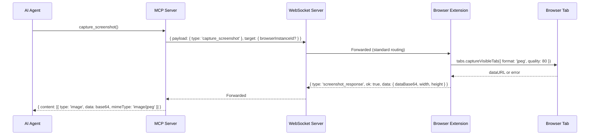

# ADR 0064: Visual Action Verification — Screenshot Tool

## Status

Proposed

## Date

2026-07-12

## Context

P3.3 — Visual action verification requires an explicit screenshot tool. Brijio currently provides structured page snapshots (accessibility tree, interactive elements, readable content) but some scenarios need visual confirmation:

1. **CAPTCHA detection** — OCR or visual recognition of the challenge
2. **Layout debugging** — overlapping elements, responsive breaks, hidden content
3. **Visual confirmation after actions** — "Did the click work?"
4. **Browser console warnings** — visual evidence of errors not in structured logs

Screenshots must be explicit (no auto-capture) and work within MCP transport constraints.

## Decision

Add `capture_screenshot` MCP tool returning MCP image content (JPEG) from the active tab.

### Why not full-page?

Viewport-only keeps this MEDIUM scope. Full-page scroll-stitch (lazy loading, fixed elements, SPA infinite scroll) is Enterprise-tier (P4.5 Visual Evidence).

### Why JPEG?

- ~50-150KB typical viewport size (manageable context)
- Vision models can process JPEG quality 80 losslessly enough
- PNG is larger; no format parameter for P3.3 simplicity

### Why active tab only?

- `chrome.tabs.captureVisibleTab()` / `browser.tabs.captureVisibleTab()` only captures the visible tab in a window
- Capturing a background tab would require switching focus (user-disruptive)
- Agent can already `list_tabs` and discover what tabs exist; if they need a specific one, they can `open_tab` to create a dedicated tab

### Safari considerations

Safari MV2's `captureVisibleTab` support is limited. The extension already has `*://*/*` host permissions. If Safari does not support viewport capture, the tool returns `capability_not_supported` error (matching `download_status` pattern in P1.7).

### Protocol messages



### New protocol types (packages/shared/src/protocol.ts)

```ts
// Add to BrowserCapability enum
| 'screenshot'

// Request
export interface CaptureScreenshotRequest {
  type: 'capture_screenshot'
}

// Response
export interface CaptureScreenshotResponse {
  type: 'screenshot_response'
  ok: true
  data: {
    /** Base64-encoded JPEG (data URL without prefix) */
    dataBase64: string
    /** Image dimensions in pixels */
    width: number
    height: number
    /** Tab that was captured (raw tab ID) */
    tabId: string
    /** When the screenshot was taken */
    capturedAt: string
  }
}

export interface CaptureScreenshotErrorResponse {
  type: 'screenshot_response'
  ok: false
  error: {
    code: 'capability_not_supported' | 'capture_failed' | 'no_visible_tab' | 'timeout'
    message: string
  }
}
```

### Shared adapter (packages/shared/src/background-controller.ts)

```ts
export type ScreenshotResult =
  | { ok: true; data: { dataBase64: string; width: number; height: number } }
  | { ok: false; error: { code: string; message: string } }

export interface PageScreenshotAdapter {
  captureScreenshot: () => Promise<ScreenshotResult>
}
```

### MCP tool (servers/mcp/src/screenshot-tool.ts)

```ts
export interface CaptureScreenshotInput {
  browserInstanceId?: unknown
  tabId?: unknown  // Optional - must be the active tab if provided
}

export async function captureScreenshot(
  config: BrijioPageActionsConfig,
  input: CaptureScreenshotInput
): Promise<{
  content: Array<
    | { type: 'image'; data: string; mimeType: 'image/jpeg' }
    | { type: 'text'; text: string }
  >
}>
```

**tabId handling logic:**
- If `tabId` is provided: query for active tab, validate it matches the provided `tabId`, error with `invalid_browser_target` if not
- If no `tabId`: use `captureVisibleTab()` on the active tab in the current window

This gives forward compatibility: the parameter exists, but for P3.3 it only works for the active tab.

Returns MCP image content directly. No temp file for P3.3 (simpler, no cleanup). A text content block advises vision-capable agents.

### Extension adapters

**Chrome** (`clients/extensions/chrome/src/background.ts`):

```ts
pageScreenshot: {
  async captureScreenshot(): Promise<ScreenshotResult> {
    try {
      // Requires host permissions (already in manifest)
      const dataUrl = await chrome.tabs.captureVisibleTab(undefined, {
        format: 'jpeg',
        quality: 80
      })
      // dataUrl is "data:image/jpeg;base64,...."
      const dataBase64 = dataUrl.split(',')[1] ?? ''
      return { ok: true, data: { dataBase64, width, height } }
    } catch (error) {
      if (error.message?.includes('permissions')) {
        return { ok: false, error: { code: 'capability_not_supported', ... } }
      }
      return { ok: false, error: { code: 'capture_failed', ... } }
    }
  }
}
```

**Safari** (`clients/extensions/safari/src/background.ts`):

```ts
// Add to BrowserApi interface
export interface BrowserApi {
  // ... existing properties
  tabs: {
    // ... existing methods
    captureVisibleTab?: (windowId: number | undefined, options: { format?: string; quality?: number }) => Promise<string>
  }
}
```

Safari MV2's `captureVisibleTab` support is limited. If the API is unavailable or throws a permission error, return `capability_not_supported`. This matches the pattern used in P1.7 for Safari download limitations.

### Capability announcement

Extension includes `'screenshot'` in its `BrowserPresence.capabilities` array when the browser supports it. Safari may omit this capability.

## Consequences

### Positive

- Agent can visually verify page state without disrupting the user
- Works for CAPTCHA, layout issues, and post-action confirmation
- No new permissions needed (host permissions already cover `captureVisibleTab`)
- MCP image content works directly with vision-enabled agents

### Negative

- Safari may not support screenshots (returns `capability_not_supported`)
- Only viewport — content below the fold is missed
- Agent cannot screenshot background tabs

### Risks

- Large screenshots (~200KB JPEG for dense pages) may still stress context
- User may not expect visual capture; skill must document this explicitly
- Pop-up blockers could interfere (rare, but possible)

## Scope

### In scope

- Shared `PageScreenshotAdapter` interface and `ScreenshotResult` types
- `capture_screenshot` / `screenshot_response` protocol messages
- `captureScreenshot` MCP tool returning MCP image content
- Chrome extension implementation
- Safari extension implementation (best-effort, may return not_supported)
- Tests for protocol validation, MCP tool, both extensions
- Skill documentation noting vision-agent requirement

### Out of scope

- Full-page scrolling/stitching (P4.5 Visual Evidence)
- Annotation/highlighting (P4.5 Visual Evidence)
- Screencast/video capture (P4.5 Visual Evidence)
- Policy controls/redaction (P4.5 Visual Evidence)
- Targeting background tabs (always active tab for P3.3)