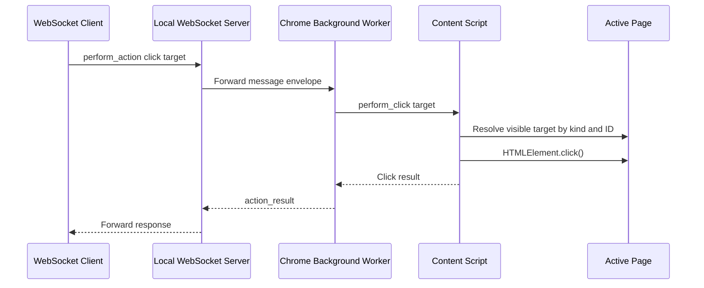

# Extension Click Actions Over WebSocket

## Summary

BrowserBridge now supports a narrow browser-side click action path for the
Chrome extension. A WebSocket peer can send a `perform_action` request through
the existing local WebSocket server, and the connected extension can click a
visible link or button-like action in the active regular HTTP or HTTPS page.

The MCP server is not part of this implementation.

## Approved Design

This work implements ADR 0012. The action surface is intentionally limited:

- Request payload: `perform_action`.
- Supported action: `click`.
- Supported targets: `target.kind` of `link` or `action`.
- Target IDs: short-lived page-context IDs such as `bb-1`.
- Response payload: `action_result`.

Callers should read page context first, choose a target from
`structure.links[]` or `structure.actions[]`, then send a click request using
that target kind and ID.

## Runtime Flow



## Message Shape

Request:

```json
{
  "type": "message",
  "id": "action-1",
  "payload": {
    "type": "perform_action",
    "action": {
      "type": "click",
      "target": {
        "kind": "link",
        "id": "bb-1"
      }
    }
  }
}
```

Success response:

```json
{
  "type": "message",
  "id": "action-1",
  "payload": {
    "type": "action_result",
    "ok": true,
    "data": {
      "action": "click",
      "target": {
        "kind": "link",
        "id": "bb-1"
      }
    }
  }
}
```

Error response:

```json
{
  "type": "message",
  "id": "action-1",
  "payload": {
    "type": "action_result",
    "ok": false,
    "error": {
      "code": "target_not_found",
      "message": "No matching click target was found."
    }
  }
}
```

## Boundaries

The WebSocket server remains a simple envelope validator and peer-forwarding
server. It does not inspect or authorize action payloads.

The Chrome extension performs actions only while the user-started WebSocket
connection is active. Actions are explicit request-response interactions, not a
stream or background observer.

Out of scope for this milestone:

- MCP action tools.
- Form fill or submit.
- Arbitrary CSS selectors.
- Keyboard, hover, drag, or multi-step actions.
- Persistent element IDs across page reloads.
- Authenticated private routing changes.

## Verification

Implementation verification should include:

- `pnpm --filter @browserbridge/chrome-extension test`
- `pnpm --filter @browserbridge/chrome-extension build`
- `pnpm lint:ts`
- `pnpm lint:md`
- `pnpm test`
