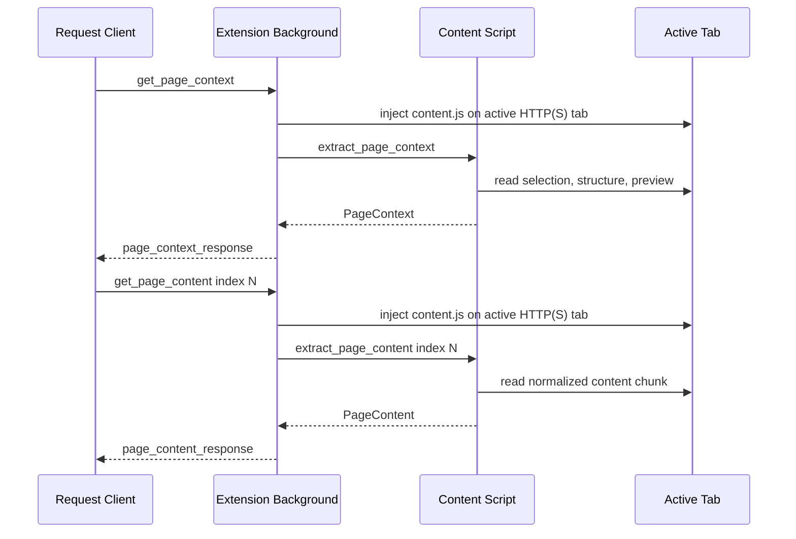

# Extension Rich Page Context And Paginated Content

## Summary

The Chrome extension now answers two explicit page-read requests while the
user-started bridge is connected:

- `get_page_context`: returns active-tab metadata, selected text, a small
  readable preview, structure, and a pointer to paginated content.
- `get_page_content`: returns normalized readable content in 1-based chunks.

The extension remains reactive. It does not continuously stream browser state,
read background tabs, or persist page content.

## Request Flow



## Context Response

`get_page_context` returns:

- `url`, `title`, and extraction `timestamp`.
- `selectedText`, or `null` when there is no current selection.
- `preview`, capped separately at a small byte budget.
- `structure.headings`, `landmarks`, `links`, `images`, `forms`, and
  `actions`.
- `content`, a descriptor showing that `get_page_content` is available from
  index `1`.

Landmark names are intentionally structural. They prefer explicit labels,
`aria-labelledby`, `title`, and then the first visible heading. They do not fall
back to full descendant page text.

## Content Response

`get_page_content` accepts an optional 1-based `index`, defaulting to `1`.
Responses include:

- `content`: normalized text with light Markdown.
- `index`: the returned chunk index.
- `truncated`: whether another chunk is available at the next index.
- `maxPayloadBytes`: the serialized WebSocket message upper bound.

The content renderer emits:

- Headings as Markdown headings.
- Links as `[text](href)`.
- Images as ``.
- Simple tables as Markdown tables.

The response is not HTML and does not include raw DOM.

## Privacy And Safety

The extension reads page content only after an explicit request while the bridge
is connected. Requests are limited to the active HTTP or HTTPS tab.

Sensitive controls are still visible structurally so an agent can understand
that a field exists, but sensitive values are omitted. Password, hidden, and
form-control values are not copied into readable content.

The extractor skips scripts, styles, templates, noscript content, hidden
elements, `aria-hidden="true"` elements, hidden inputs, and form control values.

## Limits

The default serialized message limit is `131072` bytes. Content chunking uses a
smaller internal text budget so the full JSON WebSocket envelope can remain
under that upper bound.

`get_page_context` still includes structure arrays. Large documentation pages
can have many links and actions, but long-form page body content is separated
into `get_page_content`.

## Local Verification

Build the extension:

```sh
pnpm --filter @browserbridge/chrome-extension build
```

Run extension tests:

```sh
pnpm --filter @browserbridge/chrome-extension test
```

Run TypeScript checks:

```sh
pnpm --filter @browserbridge/chrome-extension check
```

Load the unpacked extension from:

```text
clients/extensions/chrome/dist
```

## Out Of Scope

This implementation does not add MCP resources or tools for paginated content.
A future MCP change can expose the content chunks with a resource URI such as:

```text
browser://page/current/content/{index}
```
