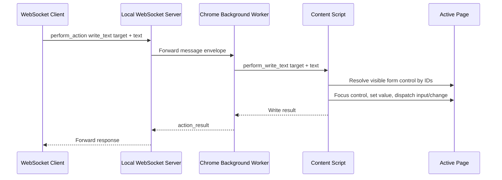

# Extension Write Text Actions Over WebSocket

## Summary

BrowserBridge now supports a narrow browser-side text writing action path for
the Chrome extension. A WebSocket peer can send a `perform_action` request
through the existing local WebSocket server, and the connected extension can
write provided text into a supported visible form control in the active regular
HTTP or HTTPS page.

The MCP server is not part of this implementation.

## Approved Design

This work implements ADR 0014. The action surface is intentionally limited:

- Request payload: `perform_action`.
- Supported action: `write_text`.
- Supported targets: `target.formId` and `target.controlId`.
- Target IDs: short-lived page-context IDs such as `bb-1`.
- Response payload: `action_result`.

Callers should read page context first, choose a target from
`structure.forms[]` and `structure.forms[].controls[]`, then send a write
request using the form ID and form-scoped control ID.

## Runtime Flow



## Message Shape

Request:

```json
{
  "type": "message",
  "id": "action-1",
  "payload": {
    "type": "perform_action",
    "action": {
      "type": "write_text",
      "target": {
        "formId": "bb-1",
        "controlId": "bb-2"
      },
      "text": "Ada Lovelace"
    }
  }
}
```

Success response:

```json
{
  "type": "message",
  "id": "action-1",
  "payload": {
    "type": "action_result",
    "ok": true,
    "data": {
      "action": "write_text",
      "target": {
        "formId": "bb-1",
        "controlId": "bb-2"
      },
      "textLength": 12
    }
  }
}
```

Error response:

```json
{
  "type": "message",
  "id": "action-1",
  "payload": {
    "type": "action_result",
    "ok": false,
    "error": {
      "code": "unsupported_control",
      "message": "The requested form control does not support text writing."
    }
  }
}
```

## Boundaries

The WebSocket server remains a simple envelope validator and peer-forwarding
server. It does not inspect or authorize action payloads.

The Chrome extension performs text writes only while the user-started WebSocket
connection is active. Actions are explicit request-response interactions, not a
stream or background observer. Successful responses include the written text
length but do not echo or store the written text.

Supported controls for this milestone:

- Visible `<textarea>` controls.
- Visible `<input type="text">` controls.
- Visible `<input type="search">` controls.
- Visible `<input>` controls without an explicit type.

Out of scope for this milestone:

- MCP action tools.
- Form submission.
- Password, file, checkbox, radio, select, and contenteditable controls.
- Arbitrary CSS selectors.
- Keyboard, paste, hover, drag, or multi-step actions.
- Persistent element IDs across page reloads.
- Authenticated private routing changes.

## Verification

Implementation verification should include:

- `pnpm --filter @browserbridge/chrome-extension test`
- `pnpm --filter @browserbridge/chrome-extension build`
- `pnpm lint:ts`
- `pnpm lint:md`
- `pnpm test`
