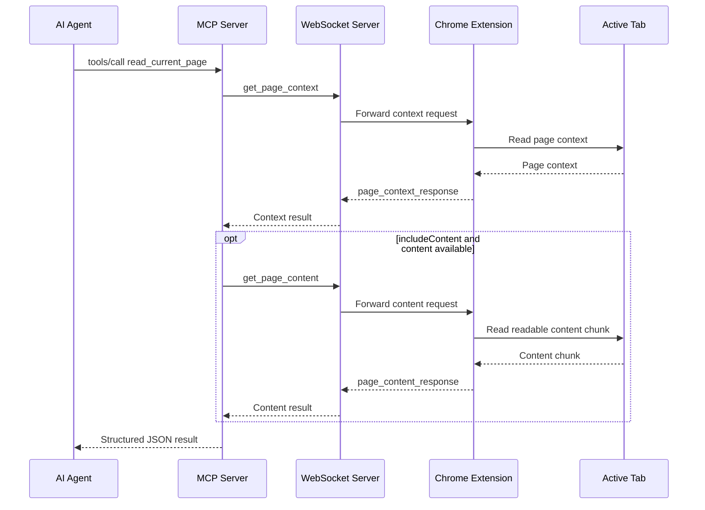

# First MCP Page Reading Tool

ADR 0010 adds the first read-only MCP tool to `servers/mcp`:

- `read_current_page`

The tool gives tool-first agents a direct way to read the active browser page
without removing the existing resources:

- `browser://page/current`
- `browser://page/current/content/{index}`

## Behavior

`read_current_page` calls the existing BrowserBridge request helpers:

1. `get_page_context` for page metadata, selected text, preview, structure, and
   content availability.
2. `get_page_content` for bounded readable content chunks when requested.

By default, the tool reads page context and one readable content chunk. Callers
can pass:

```json
{
  "includeContent": false
}
```

to read only context, or:

```json
{
  "maxContentChunks": 3
}
```

to read up to three chunks. `maxContentChunks` is bounded to integers from `0`
through `5`.

## Result Shape

Successful calls return one JSON text content item:

```json
{
  "ok": true,
  "data": {
    "context": {
      "url": "https://example.com/",
      "title": "Example"
    },
    "content": [],
    "contentTruncated": false,
    "nextContentIndex": null
  }
}
```

If the tool stops because the maximum chunk count was reached and the last
chunk is still truncated, it returns:

```json
{
  "contentTruncated": true,
  "nextContentIndex": 3
}
```

Errors keep the existing structured BrowserBridge envelope:

```json
{
  "ok": false,
  "error": {
    "code": "invalid_tool_input",
    "message": "maxContentChunks must be an integer from 0 through 5."
  }
}
```

## Flow



## Security Boundary

The tool does not create a new browser capability. It reuses the accepted
request-driven WebSocket protocol and only works while the user-started Chrome
extension is connected.

The MCP server does not stream page state, store page content, perform browser
actions, or generate a server-side LLM summary. Summarization remains the
calling agent's responsibility.

## Verification

The implementation added tests for:

- MCP tool discovery.
- SDK-backed `tools/call` behavior.
- Context-only reads.
- Default context plus first content chunk reads.
- Multiple content chunk reads.
- Truncated chunk continuation metadata.
- Structured invalid input and request error handling.
