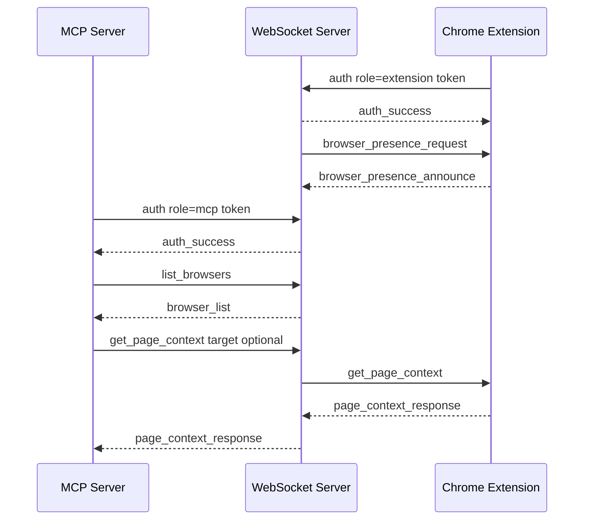

# Local Pairing Presence Routing

## Summary

BrowserBridge now has a local-first security foundation for routing browser
requests without adding new browser powers.

The local pairing token defines the private routing scope. The WebSocket server
authenticates extension and MCP connections with that token, tracks live browser
presence in memory, and routes MCP requests only to browser instances in the
same scope. The Chrome extension owns durable local browser identity settings
and announces presence after auth and whenever the WebSocket server requests it.

## Setup

Generate a local pairing token:

```sh
pnpm token
```

Set the token for the server runtime:

```sh
BROWSERBRIDGE_PAIRING_TOKEN=your-local-token
```

Configure the Chrome extension setup page with:

- WebSocket URL, for example `ws://127.0.0.1:8787`.
- Pairing token.
- Profile name.
- Optional browser label override.

Configure the MCP server with the same token:

```sh
BROWSERBRIDGE_WEBSOCKET_URL=ws://127.0.0.1:8787
BROWSERBRIDGE_PAIRING_TOKEN=your-local-token
```

Optionally set a default MCP target:

```sh
BROWSERBRIDGE_BROWSER_INSTANCE_ID=chrome-default-test
```

## Runtime Flow



## MCP Behavior

The MCP server exposes `list_browsers` and accepts optional
`browserInstanceId` on browser-facing tools. If a tool call does not provide a
target and `BROWSERBRIDGE_BROWSER_INSTANCE_ID` is not set, the WebSocket server
routes automatically only when exactly one browser is online in the pairing
token scope.

When more than one browser is online, the WebSocket server returns
`ambiguous_browser_target` with the available browser presence records. The
agent can call `list_browsers`, choose a browser, and retry with that
`browserInstanceId`.

## Security Notes

- The token is never included in presence records.
- Presence is in-memory runtime state only.
- Presence does not include page URL, title, selected text, page content, or DOM
  state.
- Browser state is still returned only in response to explicit MCP resource or
  tool requests while the user-controlled extension connection is active.
- `BROWSERBRIDGE_TOKEN` remains accepted as a compatibility alias for
  `BROWSERBRIDGE_PAIRING_TOKEN`.

## Verification

Implemented with focused tests across:

- Token generation.
- Shared protocol auth and presence parsing.
- WebSocket auth, presence, listing, routing, and routing errors.
- Chrome extension auth, setup persistence, and presence announcements.
- MCP auth, browser listing, targeting, and tool schema exposure.
