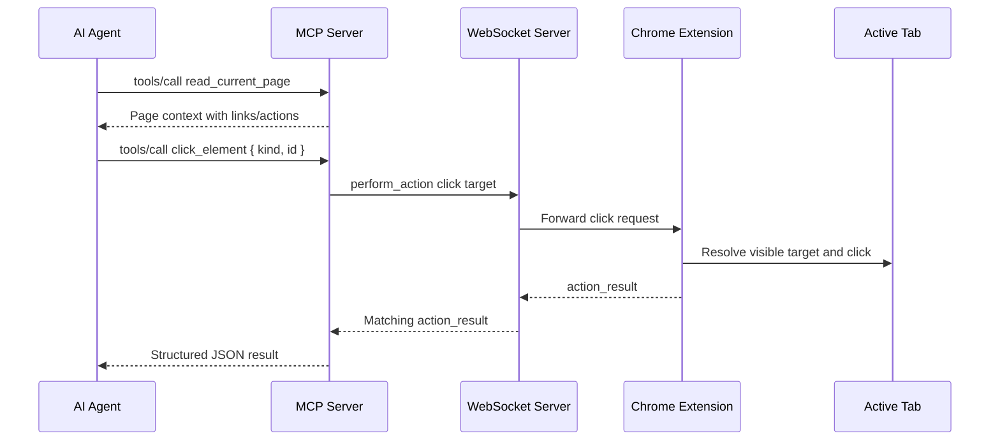

# MCP Click Element Tool

## Summary

BrowserBridge now exposes a narrow MCP click tool:

- `click_element`

The tool lets an MCP client click a visible link or button-like action from the
current browser page while the user-started Chrome extension bridge is active.
It implements ADR 0013 and reuses ADR 0012's extension-side
`perform_action`/`action_result` protocol.

## Behavior

The intended workflow is explicit:

1. Call `read_current_page`.
2. Choose a target from `data.context.structure.links[]` or
   `data.context.structure.actions[]`.
3. Call `click_element` with the target kind and ID.

The MCP server does not read page context automatically before clicking. It
does not store page state, resolve CSS selectors, or infer targets from text.
The target ID is short-lived and should be treated as valid only for the
current page state.

## Tool Input

```json
{
  "kind": "link",
  "id": "bb-1"
}
```

`kind` must be either `link` or `action`. `id` must be a non-empty
BrowserBridge page-context target ID.

## Result Shape

Successful calls return one JSON text content item:

```json
{
  "ok": true,
  "data": {
    "action": "click",
    "target": {
      "kind": "link",
      "id": "bb-1"
    }
  }
}
```

Invalid tool input returns:

```json
{
  "ok": false,
  "error": {
    "code": "invalid_tool_input",
    "message": "kind must be either \"link\" or \"action\"."
  }
}
```

Browser-side action failures are returned as `browser_error` with the
extension-provided message:

```json
{
  "ok": false,
  "error": {
    "code": "browser_error",
    "message": "No matching click target was found."
  }
}
```

## Flow



## Security Boundary

`click_element` is browser-mutating, so it remains intentionally narrow. It
only works while the user-controlled extension connection is active, and it
requires a discrete MCP tool call for each click.

The MCP server does not continuously observe the page, store action history, or
add a broader browser automation surface. Navigation, fill, submit, selector,
coordinate, keyboard, hover, drag, and multi-step actions remain out of scope.

## Verification

The implementation added tests for:

- `perform_action` click envelope creation.
- Matching `action_result` parsing.
- Mismatched request ID handling.
- Malformed action result handling.
- Extension action error mapping.
- WebSocket click request routing.
- `click_element` input validation and result shaping.
- MCP SDK tool discovery and `tools/call` behavior.
