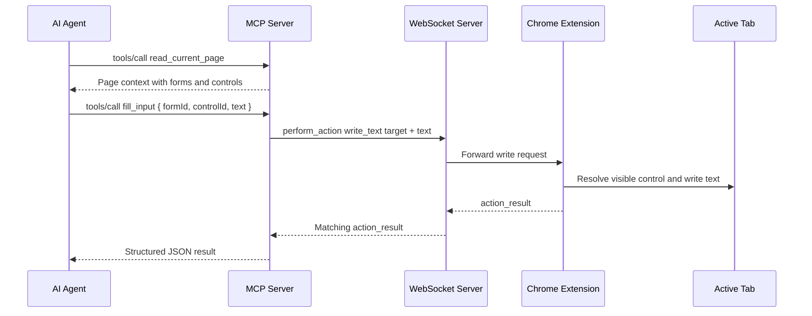

# MCP Fill Input Tool

## Summary

BrowserBridge now exposes a narrow MCP form-fill tool:

- `fill_input`

The tool lets an MCP client write text into a supported visible form control
from the current browser page while the user-started Chrome extension bridge is
active. It implements ADR 0015 and reuses ADR 0014's extension-side
`perform_action` `write_text` protocol.

## Behavior

The intended workflow is explicit:

1. Call `read_current_page`.
2. Choose a control from `data.context.structure.forms[].controls[]`.
3. Call `fill_input` with the containing form ID, control ID, and text.

The MCP server does not read page context automatically before filling. It does
not store page state, resolve CSS selectors, infer controls from labels, or
submit forms. Form and control IDs are short-lived and should be treated as
valid only for the current page state.

## Tool Input

```json
{
  "formId": "form-1",
  "controlId": "control-1",
  "text": "hello"
}
```

`formId` and `controlId` must be non-empty BrowserBridge page-context IDs.
`text` must be a string. Empty text is valid and clears the targeted control.

## Result Shape

Successful calls return one JSON text content item:

```json
{
  "ok": true,
  "data": {
    "action": "write_text",
    "target": {
      "formId": "form-1",
      "controlId": "control-1"
    },
    "textLength": 5
  }
}
```

Invalid tool input returns:

```json
{
  "ok": false,
  "error": {
    "code": "invalid_tool_input",
    "message": "formId must be a non-empty string."
  }
}
```

Browser-side action failures are returned as `browser_error` with the
extension-provided message:

```json
{
  "ok": false,
  "error": {
    "code": "browser_error",
    "message": "No matching form control was found."
  }
}
```

## Flow



## Security Boundary

`fill_input` is browser-mutating, so it remains intentionally narrow. It only
works while the user-controlled extension connection is active, and it requires
a discrete MCP tool call for each write.

The MCP server does not continuously observe the page, store written text, store
action history, or add a broader browser automation surface. Navigation,
submit, selector, coordinate, keyboard, paste, hover, drag, and multi-step
actions remain out of scope.

## Verification

The implementation added tests for:

- `perform_action` `write_text` envelope creation.
- Matching `action_result` parsing.
- WebSocket fill request routing.
- `fill_input` input validation and result shaping.
- Empty string text support.
- Extension action error mapping.
- MCP SDK tool discovery and `tools/call` behavior.
