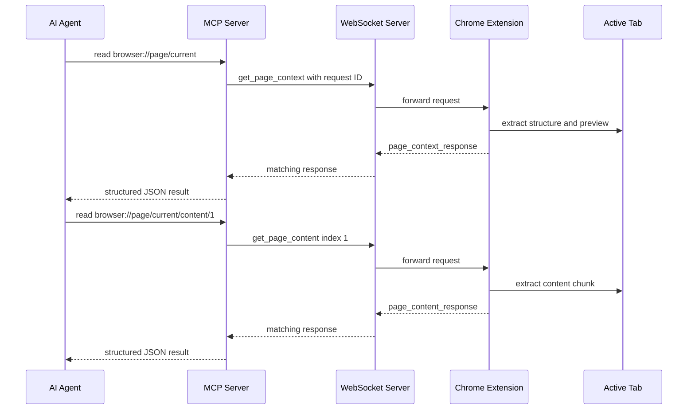

# MCP Rich Page Context And Paginated Content Resources

## Summary

`servers/mcp` now exposes the richer BrowserBridge page context protocol from
ADR 0008 through MCP resources.

- `browser://page/current` returns the full rich page context object from
  `page_context_response.data`, including selected text, preview, structure,
  and the content descriptor.
- `browser://page/current/content/{index}` returns one normalized readable page
  content chunk from `page_content_response.data`.

Both resources remain read-only. The MCP server does not stream browser state,
store page content, or add browser action tools.

## Flow



## Runtime Pieces

- `servers/mcp/src/protocol.ts` creates `get_page_context` and
  `get_page_content` envelopes, validates rich context and content responses,
  and maps extension errors to `browser_error`.
- `servers/mcp/src/websocket-client.ts` shares one short-lived request path for
  context and content reads with request ID correlation and timeout handling.
- `servers/mcp/src/page-context.ts` provides resource helper functions,
  environment configuration, and page content resource index parsing.
- `servers/mcp/src/index.ts` registers the fixed context resource and the
  content resource template through the official MCP TypeScript SDK.

## Resource Results

Context reads return:

```json
{
  "ok": true,
  "data": {
    "url": "https://example.com/",
    "title": "Example",
    "timestamp": "2026-05-25T10:00:00.000Z",
    "selectedText": null,
    "preview": {
      "content": "Example preview",
      "truncated": false,
      "maxBytes": 4096
    },
    "structure": {
      "headings": [],
      "landmarks": [],
      "links": [],
      "images": [],
      "forms": [],
      "actions": []
    },
    "content": {
      "available": true,
      "requestType": "get_page_content",
      "firstIndex": 1,
      "defaultMaxPayloadBytes": 131072
    }
  }
}
```

Content reads return:

```json
{
  "ok": true,
  "data": {
    "url": "https://example.com/",
    "title": "Example",
    "timestamp": "2026-05-25T10:00:00.000Z",
    "index": 1,
    "content": "# Example\n\nReadable content",
    "truncated": false,
    "maxPayloadBytes": 131072
  }
}
```

Invalid content resource URIs return `invalid_resource_uri` without opening a
WebSocket connection.

## Verification

Run:

```sh
pnpm --filter @browserbridge/mcp test
pnpm --filter @browserbridge/mcp check
```

The tests cover rich context parsing, content request envelopes, content chunk
routing, invalid resource indexes, resource template discovery, and SDK-backed
resource reads.

## Limits

Browser action tools, authentication and session routing, multiple sessions,
storage, streaming, and HTTP MCP transport remain out of scope and require
separate ADR approval.
