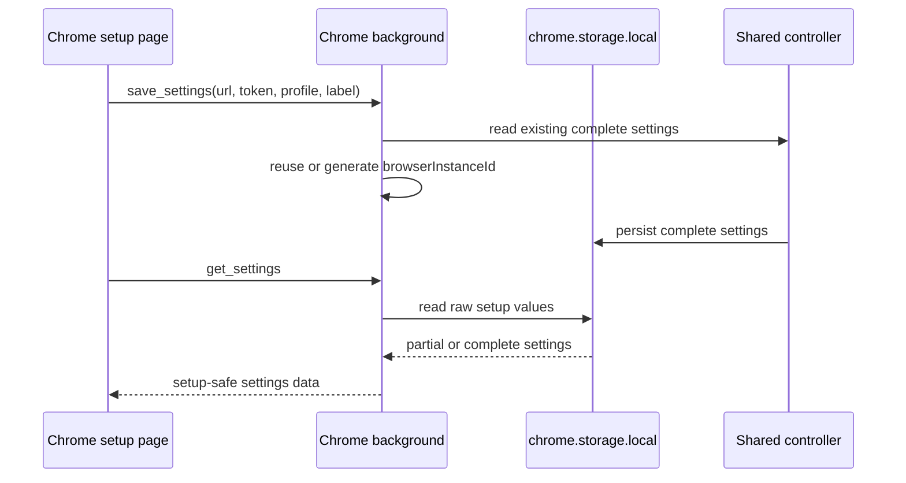

# Chrome Extension Settings Persistence

## Summary

The Chrome extension setup page now reloads saved configuration values directly
from `chrome.storage.local`, even when the stored runtime identity is incomplete.
This prevents the setup page from appearing to lose the pairing token, profile
name, or browser label when older or partial storage entries exist.

The complete bridge connection path still requires all runtime settings before
connecting. The setup page read path is intentionally more tolerant because it is
used to edit and repair local configuration.

## Stored Values

The setup page persists these values through the background script:

- WebSocket URL.
- Pairing token.
- Browser instance ID.
- Browser name.
- Profile name.
- Browser label.

On save, the background script generates a Chrome browser instance ID if one is
missing and preserves that ID across later saves.

## Flow



## Browser-Safe Shared Code

The shared protocol module no longer imports Node's `node:crypto` module. The
WebSocket server owns token scope hashing because that hashing is server-only
behavior. This keeps shared modules safe for Chrome extension background and
content-script output.

The Chrome build now bundles `background.ts` into `dist/background.js` so the
Manifest V3 service worker does not contain workspace package imports that
Chrome cannot resolve from an unpacked extension. The build verifier fails if
the background output contains workspace package imports or Node built-in
imports.

## Verification

Verified with:

```sh
pnpm --filter @browserbridge/shared test
pnpm --filter @browserbridge/websocket test
pnpm --filter @browserbridge/chrome-extension test
pnpm --filter @browserbridge/chrome-extension build
pnpm lint:ts
pnpm lint:md
```
