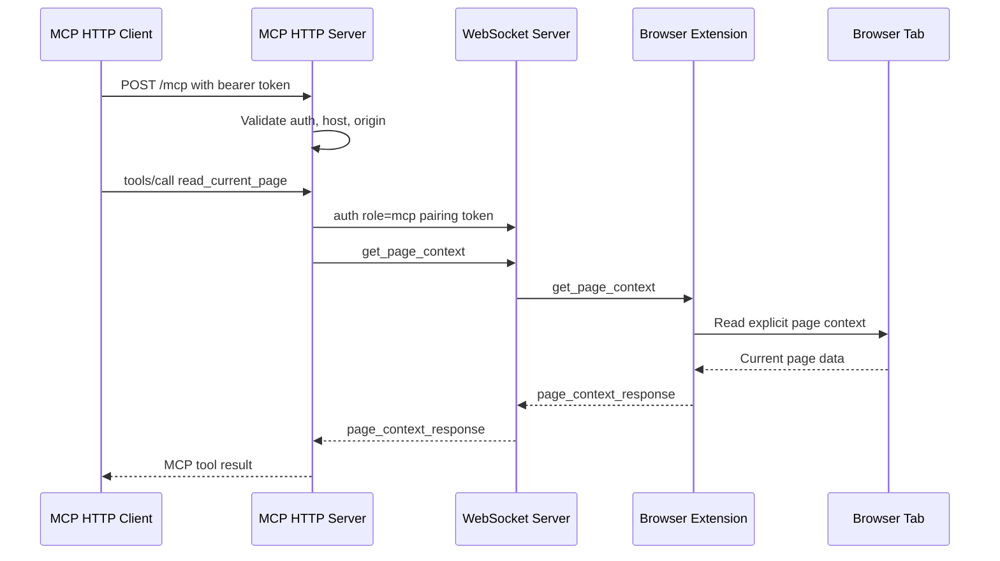

# HTTP MCP Server Transport

## Summary

The BrowserBridge MCP server now runs as an HTTP service using the official MCP
Streamable HTTP transport. Local development and Docker Compose can expose a
stable `/mcp` endpoint instead of requiring an MCP client to spawn the server
over stdio.

The HTTP boundary is authenticated separately from BrowserBridge pairing:

- `MCP_HTTP_AUTH_TOKEN` authenticates MCP clients to the MCP HTTP endpoint.
- `BROWSERBRIDGE_PAIRING_TOKEN` scopes private routing between the MCP server,
  WebSocket server, and browser extension.

## Runtime

Default local endpoint:

```text
http://127.0.0.1:8788/mcp
```

Required client header:

```text
Authorization: Bearer your-mcp-http-token
```

The MCP server validates:

- Request path, default `/mcp`.
- Bearer token.
- Host header against `MCP_HTTP_ALLOWED_HOSTS`.
- Origin header against `MCP_HTTP_ALLOWED_ORIGINS` when an Origin is present.

## Local Environment

```sh
BROWSERBRIDGE_WEBSOCKET_URL=ws://127.0.0.1:8787
BROWSERBRIDGE_REQUEST_TIMEOUT_MS=5000
BROWSERBRIDGE_PAIRING_TOKEN=your-local-pairing-token
BROWSERBRIDGE_BROWSER_INSTANCE_ID=
MCP_HTTP_HOST=127.0.0.1
MCP_HTTP_PORT=8788
MCP_HTTP_PATH=/mcp
MCP_HTTP_AUTH_TOKEN=your-mcp-http-token
MCP_HTTP_ALLOWED_HOSTS=127.0.0.1,localhost
MCP_HTTP_ALLOWED_ORIGINS=
```

Run locally:

```sh
pnpm --filter @browserbridge/websocket dev
pnpm --filter @browserbridge/mcp dev
```

Run with Docker Compose:

```sh
docker compose --profile runtime up --build
```

## Request Flow



## Design Notes

MCP tool and resource registration is transport-neutral. Each HTTP MCP request
creates a fresh stateless MCP server and Streamable HTTP transport, registers
the same BrowserBridge tools/resources, handles one request, and then closes
the server. Browser-facing behavior remains unchanged: the MCP server makes
explicit WebSocket requests only when an MCP tool or resource is invoked.

The HTTP layer does not store page content, URLs, selected text, form values, or
action results.

## Verification

Verified with:

```sh
pnpm --filter @browserbridge/mcp test
pnpm --filter @browserbridge/mcp build
pnpm lint:ts
pnpm lint:md
docker compose --profile runtime config --quiet
docker compose --profile runtime up --build -d
```

The Docker runtime was started with throwaway MCP and pairing tokens, then
checked with:

- An unauthenticated HTTP request to `/mcp`, which returned `401`.
- An authenticated Streamable HTTP MCP client, which initialized and listed the
  expected tools.

The Compose stack was stopped after verification.
