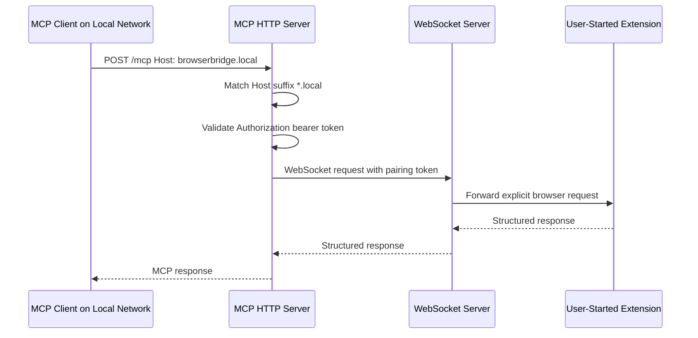

# Local Domain-Friendly MCP HTTP Hosts

## Summary

The BrowserBridge MCP HTTP server can now accept local network hostnames ending
in `.local` without listing each host explicitly. The behavior is opt-in and
uses the same wildcard suffix matching path as the Tailscale `.ts.net`
allowance.

## Configuration

Enable local-domain-friendly host and origin checks with:

```sh
MCP_HTTP_ALLOW_LOCAL_HOSTS=true
```

For a local network-reachable server, use a bind host reachable from that
network:

```sh
MCP_HTTP_HOST=0.0.0.0
MCP_HTTP_PORT=8788
MCP_HTTP_AUTH_TOKEN=your-mcp-http-token
MCP_HTTP_ALLOW_LOCAL_HOSTS=true
```

When enabled, the server appends `*.local` to:

- `MCP_HTTP_ALLOWED_HOSTS`
- `MCP_HTTP_ALLOWED_ORIGINS`

The same wildcard can also be configured explicitly:

```sh
MCP_HTTP_ALLOWED_HOSTS=127.0.0.1,localhost,*.local
MCP_HTTP_ALLOWED_ORIGINS=*.local
```

`MCP_HTTP_ALLOW_LOCAL_HOSTS` and `MCP_HTTP_ALLOW_TAILSCALE_HOSTS` are
independent. They can be enabled together when both `.local` and `.ts.net`
names should be accepted.

## Request Handling



The wildcard check accepts hostnames ending in `.local`, including host headers
with ports such as `browserbridge.local:8788`. Browser `Origin` headers are
accepted when the origin hostname ends in `.local`.

## Security Notes

Local hostname matching is not authentication. It only relaxes the MCP HTTP
`Host` and `Origin` allow-list checks for local DNS or mDNS-style names. Every
MCP HTTP request must still include:

```text
Authorization: Bearer your-mcp-http-token
```

If the MCP HTTP server is bound to `0.0.0.0`, use host firewall rules or
interface-specific binding where practical so the endpoint is not exposed
outside the intended local network.

BrowserBridge still does not stream browser state. MCP tools and resources
request browser data only while the user-controlled extension is connected and
only for explicit MCP calls.

## Verification

Verified with:

```sh
pnpm --filter @browserbridge/mcp test
pnpm --filter @browserbridge/mcp build
pnpm lint:ts
pnpm lint:md
docker compose --profile runtime config --quiet
```

The targeted coverage confirms:

- `.local` hosts are allowed when local allowance is enabled.
- `.local` hosts with ports are allowed.
- Non-local hosts are rejected when not explicitly allowed.
- Local host requests still receive `401` without the MCP bearer token.
- Local origin hostnames are allowed through the same opt-in behavior.
- `MCP_HTTP_ALLOW_LOCAL_HOSTS=true` expands host and origin allow-lists.
- Local and Tailscale host allowances can be enabled together.
