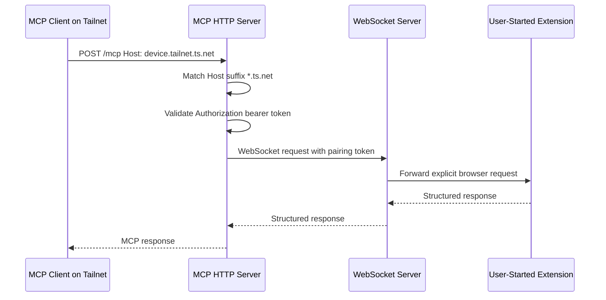

# Tailscale-Friendly MCP HTTP Hosts

## Summary

The BrowserBridge MCP HTTP server can now accept Tailscale MagicDNS hostnames
without enumerating each device name. The behavior is opt-in and keeps the
existing MCP HTTP bearer token as the authentication boundary.

## Configuration

Enable Tailscale-friendly host and origin checks with:

```sh
MCP_HTTP_ALLOW_TAILSCALE_HOSTS=true
```

For a tailnet-reachable local server, use a bind host reachable from the
tailnet:

```sh
MCP_HTTP_HOST=0.0.0.0
MCP_HTTP_PORT=8788
MCP_HTTP_AUTH_TOKEN=your-mcp-http-token
MCP_HTTP_ALLOW_TAILSCALE_HOSTS=true
```

When enabled, the server appends `*.ts.net` to:

- `MCP_HTTP_ALLOWED_HOSTS`
- `MCP_HTTP_ALLOWED_ORIGINS`

The same wildcard can also be configured explicitly:

```sh
MCP_HTTP_ALLOWED_HOSTS=127.0.0.1,localhost,*.ts.net
MCP_HTTP_ALLOWED_ORIGINS=*.ts.net
```

## Request Handling



The wildcard check accepts hostnames ending in `.ts.net`, including host
headers with ports such as `device.tailnet.ts.net:8788`. Browser `Origin`
headers are accepted when the origin hostname ends in `.ts.net`.

## Security Notes

Tailscale host matching is not authentication. It only relaxes the MCP HTTP
`Host` and `Origin` allow-list checks for MagicDNS names. Every MCP HTTP
request must still include:

```text
Authorization: Bearer your-mcp-http-token
```

If the MCP HTTP server is bound to `0.0.0.0`, use host firewall rules,
Tailscale ACLs, or interface-specific binding where practical so the endpoint
is not exposed outside the intended tailnet.

BrowserBridge still does not stream browser state. MCP tools and resources
request browser data only while the user-controlled extension is connected and
only for explicit MCP calls.

## Verification

Verified with:

```sh
pnpm --filter @browserbridge/mcp test
pnpm --filter @browserbridge/mcp build
pnpm lint:ts
pnpm lint:md
docker compose --profile runtime config --quiet
```

The targeted coverage confirms:

- `.ts.net` hosts are allowed when Tailscale allowance is enabled.
- `.ts.net` hosts with ports are allowed.
- Non-Tailscale hosts are rejected when not explicitly allowed.
- Tailscale host requests still receive `401` without the MCP bearer token.
- Tailscale origin hostnames are allowed through the same opt-in behavior.
- `MCP_HTTP_ALLOW_TAILSCALE_HOSTS=true` expands host and origin allow-lists.
