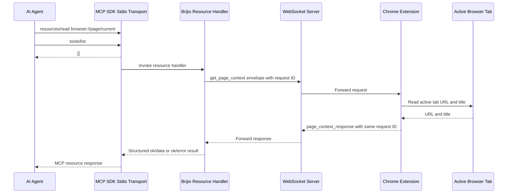

# First MCP Page Context Resource

## Summary

`servers/mcp` now provides the first Brijio agent-facing runtime path.
It exposes the `browser://page/current` MCP resource and routes explicit
resource reads through the local WebSocket server to the user-started Chrome
extension.

For MCP client startup compatibility, the server also responds to `tools/list`
with an empty tool list. No browser action tools are exposed in this milestone.

This milestone returns only the active tab URL and title. The resource URI is
intended to remain stable when the extension later returns full page context. It
does not perform browser actions, stream state, or store page context.

## Flow



## Runtime Pieces

- `servers/mcp/src/protocol.ts` creates `get_page_context` envelopes and parses
  matching `page_context_response` envelopes.
- `servers/mcp/src/websocket-client.ts` opens a local WebSocket connection,
  sends the request, correlates responses by request ID, and handles timeouts.
- `servers/mcp/src/page-context.ts` exposes the package-level
  `getCurrentPageContext` resource helper and environment configuration.
- `servers/mcp/src/index.ts` uses the official TypeScript MCP SDK to run a
  stdio MCP server with one resource: `browser://page/current`.

## Environment

```sh
BRIJIO_WEBSOCKET_URL=ws://127.0.0.1:8787
BRIJIO_REQUEST_TIMEOUT_MS=5000
```

`WEBSOCKET_URL` remains accepted as an alias for older local configuration.

## Local Commands

```sh
pnpm --filter @brijio/mcp test
pnpm --filter @brijio/mcp build
pnpm --filter @brijio/mcp check
pnpm --filter @brijio/mcp exec tsx src/index.ts
```

The MCP tests use local loopback WebSocket servers with ephemeral ports, so they
may require permission for local networking in restricted environments. They
also verify SDK-backed MCP initialize, resource discovery, resource reads, and
ping behavior.

## Limits

The current WebSocket transport is still the temporary local peer-forwarding
channel. Authenticated private routing, multiple browser sessions, cloud
deployment behavior, and browser-mutating tools remain future work and need
separate ADR approval.
