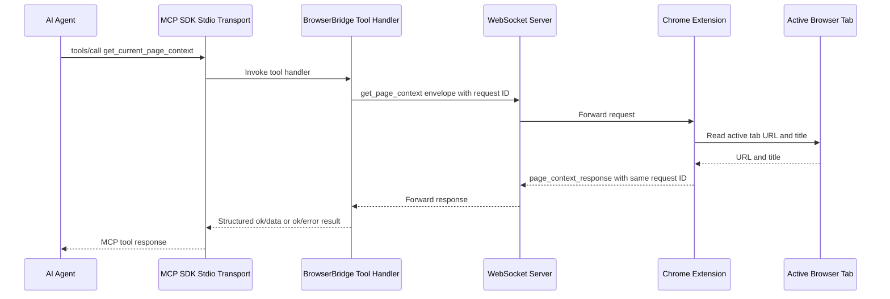

# First MCP Page Context Tool

## Summary

`servers/mcp` now provides the first BrowserBridge agent-facing runtime path.
It exposes the `get_current_page_context` MCP tool and routes that explicit
tool call through the local WebSocket server to the user-started Chrome
extension.

This milestone returns only the active tab URL and title. It does not read page
body text, perform browser actions, stream state, or store page context.

## Flow



## Runtime Pieces

- `servers/mcp/src/protocol.ts` creates `get_page_context` envelopes and parses
  matching `page_context_response` envelopes.
- `servers/mcp/src/websocket-client.ts` opens a local WebSocket connection,
  sends the request, correlates responses by request ID, and handles timeouts.
- `servers/mcp/src/tools.ts` exposes the package-level
  `getCurrentPageContext` tool function and environment configuration.
- `servers/mcp/src/index.ts` uses the official TypeScript MCP SDK to run a
  stdio MCP server with one tool: `get_current_page_context`.

## Environment

```sh
BROWSERBRIDGE_WEBSOCKET_URL=ws://127.0.0.1:8787
BROWSERBRIDGE_REQUEST_TIMEOUT_MS=5000
```

`WEBSOCKET_URL` remains accepted as an alias for older local configuration.

## Local Commands

```sh
pnpm --filter @browserbridge/mcp test
pnpm --filter @browserbridge/mcp build
pnpm --filter @browserbridge/mcp check
pnpm --filter @browserbridge/mcp exec tsx src/index.ts
```

The MCP tests use local loopback WebSocket servers with ephemeral ports, so they
may require permission for local networking in restricted environments. They
also verify SDK-backed MCP initialize, tool discovery, and ping behavior.

## Limits

The current WebSocket transport is still the temporary local peer-forwarding
channel. Authenticated private routing, multiple browser sessions, cloud
deployment behavior, and browser-mutating tools remain future work and need
separate ADR approval.
