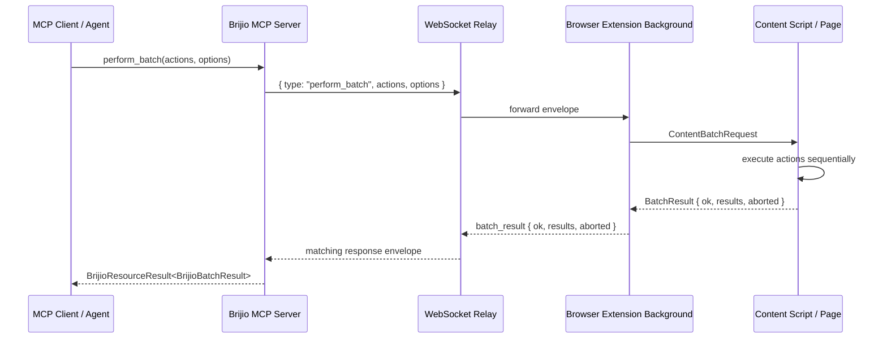

# P1.8 Batch Request Tool

## Summary

The P1.8 batch request tool lets an MCP client execute a short sequence of
explicit browser write actions in one request instead of making one round trip
per action.

The feature is intentionally narrow:

- actions execute sequentially in the active page context
- up to 20 actions per batch
- supported action types: `click`, `write_text`, `set_checked`,
  `select_options`, and `submit_form`
- arbitrary reads are not batch steps
- `readAfterActions` optionally appends one fresh page-context read after the
  completed actions
- navigation aborts the remaining actions so agents can re-read before retrying

## MCP Tool

Tool name: `perform_batch`

Example input:

```json
{
  "actions": [
    { "type": "click", "target": { "kind": "link", "id": "bb-1" } },
    {
      "type": "write_text",
      "target": { "formId": "form-1", "controlId": "control-1" },
      "text": "hello"
    },
    {
      "type": "set_checked",
      "target": { "formId": "form-1", "controlId": "control-2" },
      "checked": true
    },
    {
      "type": "select_options",
      "target": { "formId": "form-1", "controlId": "control-3" },
      "values": ["alpha"]
    },
    { "type": "submit_form", "target": { "formId": "form-1" } }
  ],
  "continueOnError": false,
  "readAfterActions": true,
  "pageContextId": 42,
  "browserInstanceId": "chrome-default-test"
}
```

Example result with per-action failure data:

```json
{
  "ok": true,
  "data": {
    "ok": false,
    "results": [
      {
        "ok": true,
        "data": {
          "action": "click",
          "target": { "kind": "link", "id": "bb-1" }
        }
      },
      {
        "ok": false,
        "error": {
          "code": "target_not_found",
          "message": "Target not found",
          "aborted": false
        }
      }
    ],
    "aborted": false
  }
}
```

The outer `ok` is the MCP/transport outcome. The inner `data.ok` is the batch
outcome. Partial failures still return data so agents can inspect per-action
results and recover.

## Protocol Flow



## Failure Semantics

- `continueOnError: false` is the default. A recoverable action failure stops
  the remaining actions.
- `continueOnError: true` keeps going after recoverable element/action errors.
- Page navigation always aborts remaining actions because short-lived IDs may no
  longer describe the current page.
- `aborted: true` means the caller should call `read_current_page` before
  retrying.
- Unexpected background/controller failures return a batch-level tool error with
  code `batch_failed`.

## Validation

Verified during implementation:

```sh
pnpm --filter @brijio/shared test
pnpm --filter @brijio/mcp test
npx tsc --noEmit --project packages/shared/tsconfig.json
npx tsc --noEmit --project servers/mcp/tsconfig.json
```

Results at completion:

- shared tests: 348 passing
- MCP tests: 194 passing
- shared typecheck: clean
- MCP typecheck: blocked only by pre-existing `servers/mcp/src/page-context.ts`
  strictness error unrelated to P1.8

## Related Documents

- ADR 0044: `docs/architecture/decisions/0044-batch-request-tool.md`
- Capability matrix: `docs/project/CAPABILITY_MATRIX.md`
- MCP server README: `servers/mcp/README.md`
- Brijio skill: `servers/mcp/skills/using-brijio/SKILL.md`
