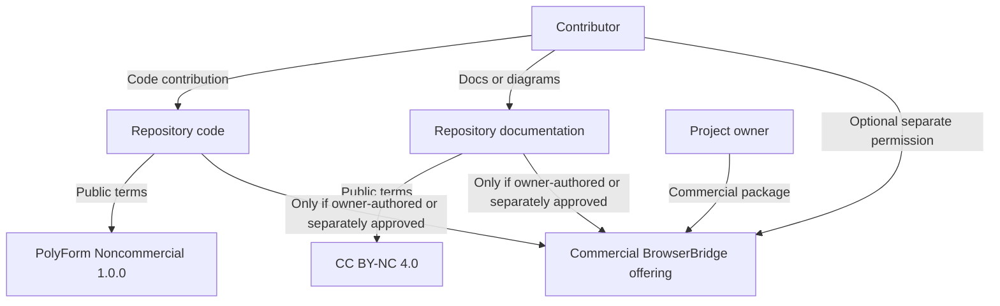
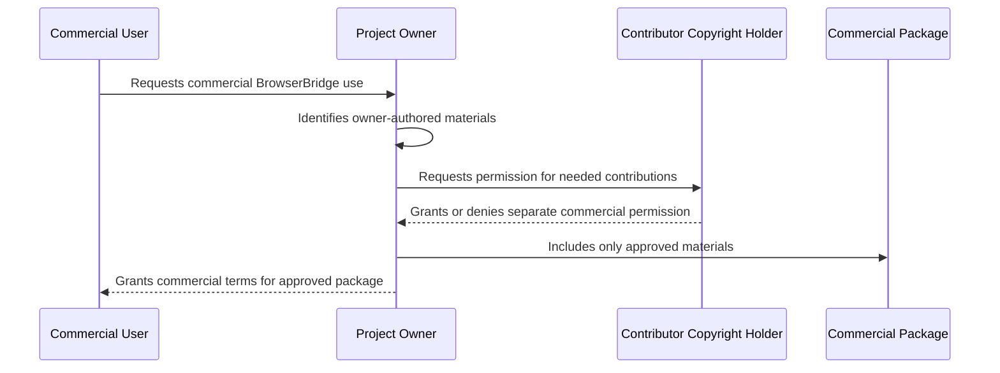

# BrowserBridge License Policy Implementation Plan

> **For agentic workers:** REQUIRED SUB-SKILL: Use superpowers:subagent-driven-development (recommended) or superpowers:executing-plans to implement this plan task-by-task. Steps use checkbox (`- [ ]`) syntax for tracking.

**Goal:** Replace BrowserBridge's AGPL policy with the approved source-available, non-commercial licensing model.

**Architecture:** Keep licensing as repository-level policy rather than runtime code. Add an ADR first, enforce package/documentation metadata through repository tooling tests, then update license, contribution, commercial-use, and README documentation in separate commits.

**Tech Stack:** Markdown documentation, Node.js built-in test runner, pnpm workspace package metadata.

---

## File Map

- Create: `docs/architecture/decisions/0018-source-available-non-commercial-license-policy.md`
  - Records the license policy decision required by `AGENTS.md`.
- Modify: `scripts/tooling.test.mjs`
  - Adds repository policy checks for package metadata and license documents.
- Modify: `LICENSE`
  - Replaces AGPL text with PolyForm Noncommercial License 1.0.0 text.
- Create: `LICENSE-DOCS.md`
  - Adds CC BY-NC 4.0 notice for documentation, diagrams, and non-code materials.
- Create: `COMMERCIAL-LICENSING.md`
  - Explains that commercial use requires separate written permission.
- Create: `CONTRIBUTING.md`
  - Explains inbound-equals-outbound contribution terms.
- Modify: `README.md`
  - Updates positioning, contribution, and license language.
- Modify: `package.json`
  - Changes `license` from `AGPL-3.0-only` to `PolyForm-Noncommercial-1.0.0`.
- Modify: `packages/shared/package.json`
  - Same package metadata change.
- Modify: `servers/websocket/package.json`
  - Same package metadata change.
- Modify: `servers/mcp/package.json`
  - Same package metadata change.
- Modify: `clients/extensions/chrome/package.json`
  - Same package metadata change.

## Task 1: ADR For License Policy

**Files:**

- Create: `docs/architecture/decisions/0018-source-available-non-commercial-license-policy.md`

- [ ] **Step 1: Create the ADR**

Add this file:

````markdown
# ADR 0018: Source-Available Non-Commercial License Policy

## Status

Accepted

## Date

2026-05-25

## Context

BrowserBridge is currently licensed as AGPL-3.0-only. That is a strong
network-copyleft open-source license, but it still permits commercial use by
anyone who complies with the license.

The project goal has changed. BrowserBridge should remain publicly readable,
forkable, and collaborative, but free only for non-commercial use. Commercial
use should require separate written permission from the relevant copyright
holder or holders.

The project owner also wants to offer commercial BrowserBridge packages,
including a cloud-hosted WebSocket server and cloud-hosted MCP server.

## Decision

Adopt a source-available, non-commercial repository policy:

- Source code is licensed under PolyForm Noncommercial License 1.0.0.
- Documentation, diagrams, and other non-code written materials are licensed
  under Creative Commons Attribution-NonCommercial 4.0 International unless a
  file says otherwise.
- Names, logos, and branding remain outside those public content licenses unless
  a future brand policy grants specific rights.
- Contributions use an inbound-equals-outbound model.
- Commercial use requires separate written permission from the relevant
  copyright holder or holders.

## Contribution Flow



## Commercial Permission Flow



## Consequences

BrowserBridge should no longer describe itself as OSI open source. The accurate
positioning is source-available and free for non-commercial use.

Contributors keep copyright in their contributions. The project owner does not
receive automatic commercial relicensing rights for contributor-owned work.
Commercial BrowserBridge packages can include contributor-owned work only when
the contributor separately grants commercial permission.

Package metadata should use the SPDX license identifier
`PolyForm-Noncommercial-1.0.0` for code packages. Repository documentation
should separately document the CC BY-NC 4.0 terms for documentation and
non-code written materials.

## Non-Goals

- Do not introduce a contributor license agreement.
- Do not require copyright assignment.
- Do not design commercial pricing or hosted-service terms.
- Do not change runtime browser, WebSocket, or MCP behavior.

## Verification

Add repository tooling tests that fail while AGPL metadata or AGPL README
language remains and pass once the new license policy files and package metadata
are in place.
````

- [ ] **Step 2: Run Markdown formatting check**

Run:

```sh
pnpm lint:md
```

Expected: PASS, or FAIL only on formatting in the new ADR.

- [ ] **Step 3: Fix Markdown formatting if needed**

If `pnpm lint:md` fails, run:

```sh
pnpm format:md
pnpm lint:md
```

Expected: PASS.

- [ ] **Step 4: Commit the ADR**

Run:

```sh
git add docs/architecture/decisions/0018-source-available-non-commercial-license-policy.md
PRE_COMMIT_ALLOW_NO_CONFIG=1 git commit -m "Add ADR for license policy"
```

Expected: commit succeeds.

## Task 2: Failing License Policy Tests

**Files:**

- Modify: `scripts/tooling.test.mjs`

- [ ] **Step 1: Add repository policy tests**

In `scripts/tooling.test.mjs`, add this helper after the imports:

```js
const packageJsonPaths = [
  "package.json",
  "packages/shared/package.json",
  "servers/websocket/package.json",
  "servers/mcp/package.json",
  "clients/extensions/chrome/package.json",
];

async function readJson(path) {
  return JSON.parse(await readFile(path, "utf8"));
}
```

Then add these tests inside the existing `describe("repository tooling", () => { ... })` block:

```js
it("uses source-available package license metadata", async () => {
  for (const path of packageJsonPaths) {
    const packageJson = await readJson(path);

    assert.equal(
      packageJson.license,
      "PolyForm-Noncommercial-1.0.0",
      `${path} should use the PolyForm Noncommercial SPDX identifier`,
    );
  }
});

it("documents the non-commercial repository license policy", async () => {
  const readme = await readFile("README.md", "utf8");
  const license = await readFile("LICENSE", "utf8");
  const docsLicense = await readFile("LICENSE-DOCS.md", "utf8");
  const commercialLicensing = await readFile("COMMERCIAL-LICENSING.md", "utf8");
  const contributing = await readFile("CONTRIBUTING.md", "utf8");

  assert.match(license, /PolyForm Noncommercial License 1\.0\.0/);
  assert.match(
    docsLicense,
    /Creative Commons Attribution-NonCommercial 4\.0 International/,
  );
  assert.match(
    commercialLicensing,
    /Commercial use requires separate written permission/,
  );
  assert.match(contributing, /inbound-equals-outbound/);
  assert.match(readme, /source-available and free for non-commercial use/);
  assert.doesNotMatch(readme, /GNU Affero General Public License/);
});
```

- [ ] **Step 2: Run test to verify it fails**

Run:

```sh
node --test scripts/tooling.test.mjs
```

Expected: FAIL because package metadata still says `AGPL-3.0-only` and
`LICENSE-DOCS.md`, `COMMERCIAL-LICENSING.md`, and `CONTRIBUTING.md` do not
exist yet.

- [ ] **Step 3: Commit the failing tests**

Run:

```sh
git add scripts/tooling.test.mjs
PRE_COMMIT_ALLOW_NO_CONFIG=1 git commit -m "Add license policy coverage"
```

Expected: commit succeeds even though the targeted test currently fails when
run by itself. Note the failure in the commit message body if using an editor;
if using one-line commit messages only, record it in the implementation notes.

## Task 3: License Documents

**Files:**

- Modify: `LICENSE`
- Create: `LICENSE-DOCS.md`
- Create: `COMMERCIAL-LICENSING.md`
- Create: `CONTRIBUTING.md`

- [ ] **Step 1: Replace the code license**

Replace `LICENSE` with the official PolyForm Noncommercial License 1.0.0 text.
Use the canonical PolyForm license text for version 1.0.0 and keep the title
line:

```text
PolyForm Noncommercial License 1.0.0
```

Expected: `LICENSE` no longer contains `GNU AFFERO GENERAL PUBLIC LICENSE`.

- [ ] **Step 2: Add documentation license notice**

Create `LICENSE-DOCS.md`:

```markdown
# Documentation License

BrowserBridge documentation, diagrams, examples, and other non-code written
materials are licensed under the Creative Commons Attribution-NonCommercial 4.0
International License unless a file says otherwise.

You may share and adapt these materials for non-commercial purposes with
attribution. Commercial use requires separate written permission from the
relevant copyright holder or holders.

This notice does not grant rights to BrowserBridge names, logos, trademarks, or
branding. Those remain reserved unless a separate brand policy grants specific
rights.

The full Creative Commons Attribution-NonCommercial 4.0 International legal code
is available from Creative Commons.
```

- [ ] **Step 3: Add commercial licensing document**

Create `COMMERCIAL-LICENSING.md`:

```markdown
# Commercial Licensing

Commercial use requires separate written permission from the relevant copyright
holder or holders.

BrowserBridge is source-available and free for non-commercial use. The public
repository license does not grant commercial use rights.

For code and materials authored by the project owner, commercial permission can
be granted by the project owner.

For third-party contributions, commercial use requires either:

- excluding the contribution from the commercial package; or
- obtaining separate written permission from the contributor who owns the
  relevant rights.

The official hosted BrowserBridge offering, including any cloud-hosted
WebSocket server or cloud-hosted MCP server, will include only owner-authored
materials or third-party contributions with separate commercial permission.

This document is a project policy notice, not legal advice. Review commercial
terms with a qualified lawyer before relying on them for production use.
```

- [ ] **Step 4: Add contribution policy**

Create `CONTRIBUTING.md`:

```markdown
# Contributing

BrowserBridge accepts contributions under an inbound-equals-outbound model.

By contributing code, you agree that your contribution is provided under the
same public code license used by the repository: PolyForm Noncommercial License
1.0.0.

By contributing documentation, diagrams, examples, or other non-code written
materials, you agree that your contribution is provided under the repository
documentation license: Creative Commons Attribution-NonCommercial 4.0
International, unless the file says otherwise.

You keep copyright in your contributions. You are not assigning copyright to the
project owner, and you are not granting automatic commercial relicensing rights.

Commercial use of contributor-owned work requires separate written permission
from the relevant contributor.

Before opening a pull request:

- Keep changes focused and reviewable.
- Include tests for behavior changes.
- Update documentation for completed project areas.
- Follow the ADR-first workflow in `AGENTS.md` for feature or behavior changes.
- Do not include code or content you do not have the right to contribute.
```

- [ ] **Step 5: Run policy test to verify partial progress**

Run:

```sh
node --test scripts/tooling.test.mjs
```

Expected: FAIL only on package metadata and README wording, not on missing
license documents.

- [ ] **Step 6: Commit license documents**

Run:

```sh
git add LICENSE LICENSE-DOCS.md COMMERCIAL-LICENSING.md CONTRIBUTING.md
PRE_COMMIT_ALLOW_NO_CONFIG=1 git commit -m "Adopt non-commercial license documents"
```

Expected: commit succeeds.

## Task 4: Package Metadata

**Files:**

- Modify: `package.json`
- Modify: `packages/shared/package.json`
- Modify: `servers/websocket/package.json`
- Modify: `servers/mcp/package.json`
- Modify: `clients/extensions/chrome/package.json`

- [ ] **Step 1: Update package license fields**

In each listed `package.json`, change:

```json
"license": "AGPL-3.0-only"
```

to:

```json
"license": "PolyForm-Noncommercial-1.0.0"
```

- [ ] **Step 2: Run policy test to verify remaining README failure**

Run:

```sh
node --test scripts/tooling.test.mjs
```

Expected: FAIL only because `README.md` still contains AGPL language or does
not yet contain `source-available and free for non-commercial use`.

- [ ] **Step 3: Commit package metadata**

Run:

```sh
git add package.json packages/shared/package.json servers/websocket/package.json servers/mcp/package.json clients/extensions/chrome/package.json
PRE_COMMIT_ALLOW_NO_CONFIG=1 git commit -m "Update package license metadata"
```

Expected: commit succeeds.

## Task 5: README License And Contribution Language

**Files:**

- Modify: `README.md`

- [ ] **Step 1: Update project positioning**

In the opening section of `README.md`, keep the existing purpose text and add
this paragraph after the local-first sentence:

```markdown
BrowserBridge is source-available and free for non-commercial use. Commercial
use requires separate written permission from the relevant copyright holder or
holders.
```

- [ ] **Step 2: Update the License section**

Replace the current `## License` section with:

```markdown
## License

BrowserBridge source code is licensed under the PolyForm Noncommercial License
1.0.0. See `LICENSE`.

Documentation, diagrams, examples, and other non-code written materials are
licensed under Creative Commons Attribution-NonCommercial 4.0 International
unless a file says otherwise. See `LICENSE-DOCS.md`.

Commercial use requires separate written permission from the relevant copyright
holder or holders. See `COMMERCIAL-LICENSING.md`.

Contributions are accepted under an inbound-equals-outbound model. Contributors
keep copyright in their contributions and do not grant automatic commercial
relicensing rights. See `CONTRIBUTING.md`.
```

- [ ] **Step 3: Run policy test to verify it passes**

Run:

```sh
node --test scripts/tooling.test.mjs
```

Expected: PASS.

- [ ] **Step 4: Run Markdown lint**

Run:

```sh
pnpm lint:md
```

Expected: PASS.

- [ ] **Step 5: Commit README updates**

Run:

```sh
git add README.md
PRE_COMMIT_ALLOW_NO_CONFIG=1 git commit -m "Document source-available license policy"
```

Expected: commit succeeds.

## Task 6: Full Verification

**Files:**

- No file changes expected.

- [ ] **Step 1: Run repository tests**

Run:

```sh
pnpm test
```

Expected: PASS.

- [ ] **Step 2: Run repository lint**

Run:

```sh
pnpm lint
```

Expected: PASS.

- [ ] **Step 3: Run repository build**

Run:

```sh
pnpm build
```

Expected: PASS.

- [ ] **Step 4: Check for stale AGPL references**

Run:

```sh
rg -n "AGPL|GNU Affero|Affero General Public License" .
```

Expected: no matches in active project policy files. Historical mentions are
acceptable only if they appear in the new ADR as context for the license change.

- [ ] **Step 5: Check git status**

Run:

```sh
git status --short
```

Expected: clean working tree.

## Self-Review

Spec coverage:

- PolyForm Noncommercial code license: Task 3.
- CC BY-NC documentation license: Task 3.
- Branding reserved outside content licenses: Tasks 1 and 3.
- Source-available wording, not OSI open source: Tasks 1 and 5.
- Inbound-equals-outbound contributions: Tasks 1, 3, and 5.
- Commercial permission from relevant copyright holders: Tasks 1, 3, and 5.
- Package metadata update: Task 4.
- Legal-review note: Tasks 1 and 3.
- Verification: Tasks 2 and 6.

Placeholder scan:

- No unfinished placeholder markers or unspecified test steps remain.
- The only external text dependency is the official PolyForm Noncommercial
  License 1.0.0 text, explicitly identified in Task 3 because license text must
  be copied verbatim from the canonical license rather than rewritten.

Type and naming consistency:

- Package metadata consistently uses `PolyForm-Noncommercial-1.0.0`.
- Documentation consistently uses `Creative Commons Attribution-NonCommercial
4.0 International`.
- Contribution model consistently uses `inbound-equals-outbound`.
