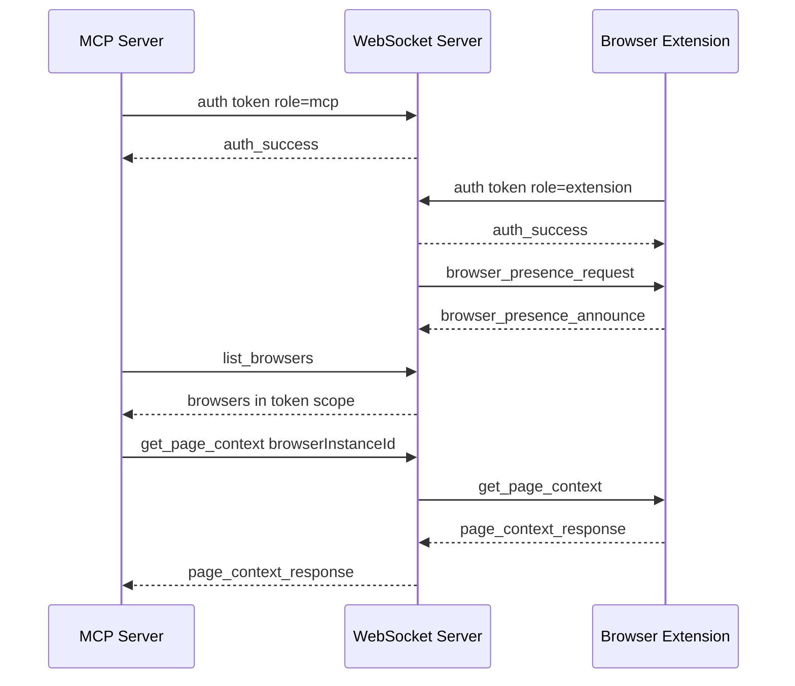

# Local Pairing Presence Routing Implementation Plan

> **For agentic workers:** REQUIRED SUB-SKILL: Use
> superpowers:subagent-driven-development (recommended) or
> superpowers:executing-plans to implement this plan task-by-task. Steps use
> checkbox (`- [ ]`) syntax for tracking.

**Goal:** Add local pairing token authentication, in-memory browser presence,
and MCP browser targeting without adding new browser capabilities.

**Architecture:** The pairing token defines a private local routing scope. The
WebSocket server authenticates MCP and extension connections, stores only a
token-derived scope key, tracks browser instance presence in memory, and routes
MCP requests only to browser instances inside the same scope. The extension owns
durable local identity settings and announces presence; the MCP server exposes
browser discovery and optional browser targeting.

**Tech Stack:** TypeScript, Node.js `node:test`, `ws`, MCP TypeScript SDK,
Chrome Manifest V3 extension APIs, pnpm workspaces, Prettier, ts-standard.

---

## File Structure

- Create `docs/architecture/decisions/0019-local-pairing-presence-routing.md`:
  ADR for the approved design. This must be approved before implementation.
- Create `scripts/browserbridge-token.mjs`: local token generator CLI.
- Create `scripts/browserbridge-token.test.mjs`: token generator tests.
- Create `packages/shared/src/index.ts`: shared protocol export surface.
- Create `packages/shared/src/protocol.ts`: shared message, presence, auth, and
  routing types plus parsers/builders.
- Create `packages/shared/src/protocol.test.ts`: shared protocol unit tests.
- Modify `packages/shared/package.json`: replace echo scripts with build/check
  and test scripts.
- Modify `servers/websocket/src/protocol.ts`: consume or mirror shared parsing
  helpers for authenticated envelopes.
- Modify `servers/websocket/src/server.ts`: add auth, presence registry,
  presence requests, list browsers, scoped targeted routing, and structured
  routing errors.
- Modify `servers/websocket/src/server.test.ts`: replace peer-forwarding tests
  with authenticated routing and presence tests.
- Modify `servers/mcp/src/protocol.ts`: add browser presence and new routing
  error result types.
- Modify `servers/mcp/src/websocket-client.ts`: authenticate, request browser
  lists, attach optional `browserInstanceId`, and parse routing errors.
- Modify `servers/mcp/src/websocket-client.test.ts`: cover auth, list browsers,
  target routing, and ambiguity.
- Modify `servers/mcp/src/page-context.ts`: add token/default browser config and
  pass target options.
- Modify `servers/mcp/src/page-reading-tool.ts`: accept optional
  `browserInstanceId`.
- Modify `servers/mcp/src/click-element-tool.ts`: accept optional
  `browserInstanceId`.
- Modify `servers/mcp/src/fill-input-tool.ts`: accept optional
  `browserInstanceId`.
- Modify `servers/mcp/src/form-action-tools.ts`: accept optional
  `browserInstanceId`.
- Modify `servers/mcp/src/page-actions.ts`: pass optional browser targets to the
  WebSocket client.
- Create `servers/mcp/src/browser-list-tool.ts`: `list_browsers` tool logic.
- Create `servers/mcp/src/browser-list-tool.test.ts`: tool-level tests for
  browser discovery.
- Modify `servers/mcp/src/index.ts`: register `list_browsers` and expose
  optional `browserInstanceId` on browser tools.
- Modify `servers/mcp/src/index.test.ts`: assert MCP schemas expose
  `list_browsers` and optional browser targeting.
- Modify `clients/extensions/chrome/src/protocol.ts`: add auth and presence
  message builders/parsers for the extension runtime.
- Modify `clients/extensions/chrome/src/background-controller.ts`: load full
  bridge settings, authenticate after open, announce presence, respond to
  presence requests, and keep existing page/action handlers.
- Modify `clients/extensions/chrome/src/background-controller.test.ts`: cover
  auth, presence announce/request, and config changes.
- Modify `clients/extensions/chrome/src/background.ts`: persist token,
  instance ID, profile name, and label.
- Modify `clients/extensions/chrome/src/setup.html`: add token/profile/label
  fields.
- Modify `clients/extensions/chrome/src/setup.ts`: load and save new fields.
- Create or extend `clients/extensions/chrome/src/setup.test.ts`: cover setup
  form load/save behavior if existing tooling supports DOM tests.
- Modify `.env.example` or create it if absent: document local token env vars.
- Modify `README.md`, `servers/websocket/README.md`, `servers/mcp/README.md`,
  and `clients/extensions/chrome/README.md`: document setup and routing.
- Create `docs/artifacts/2026-05-25-local-pairing-presence-routing.md` after
  implementation.

## Task 1: ADR

**Files:**

- Create:
  `docs/architecture/decisions/0019-local-pairing-presence-routing.md`
- Reference:
  `docs/superpowers/specs/2026-05-25-local-pairing-presence-routing-design.md`

- [ ] **Step 1: Write the ADR**

Use this content:

````markdown
# ADR 0019: Local Pairing Presence Routing

## Status

Proposed

## Date

2026-05-25

## Context

BrowserBridge currently uses a local peer-forwarding WebSocket transport. It can
forward MCP-originated browser requests to a connected extension, but it does
not authenticate connections, track browser instance presence, isolate private
request delivery by token scope, or let MCP target a specific browser when more
than one browser is online.

BrowserBridge needs a local-first security foundation before adding more
browser power. The local foundation should match the future cloud concepts while
remaining small: a pairing token defines the private routing scope, browser
instances announce runtime presence, and MCP routes requests only inside the
authenticated scope.

## Decision

Implement local pairing, browser presence, and targeted routing.

- Add a local token generator command.
- Use one high-entropy pairing token as the local private routing scope.
- Authenticate MCP and extension WebSocket connections before routing messages.
- Derive an internal scope key from the token and avoid exposing raw tokens in
  logs, responses, or presence state.
- Store runtime browser presence in WebSocket server memory only.
- Have extensions announce presence after authentication and in response to
  server presence requests.
- Add MCP browser discovery with `list_browsers`.
- Let browser tools accept optional `browserInstanceId`.
- Route automatically only when exactly one browser is online in the
  authenticated scope.
- Return structured errors for no browser, ambiguous target, invalid target,
  auth failure, invalid messages, unsupported actions, and timeouts.

## Flow


````

## Scope

In scope:

- Token generation.
- Local token configuration for WebSocket, MCP, and Chrome extension.
- WebSocket authentication and in-memory presence registry.
- Extension identity configuration and presence announcements.
- MCP browser discovery and optional targeted routing.
- Documentation and tests for the local-first flow.

Out of scope:

- Cloud token issuance.
- Hosted identity or accounts.
- Durable server-side presence storage.
- New browser capabilities beyond routing and discovery.
- Storing page content, URL, title, selected text, or DOM state as presence.
- Explicit channel IDs.

## Consequences

The local runtime will stop being an open peer-forwarding channel. MCP and
extension clients must authenticate before participating in routing. Multi-browser
users get deterministic discovery and target selection. Future cloud work can
replace local token issuance and in-memory presence without changing the main
conceptual model.

## Verification

Implementation must verify:

- `node --test scripts/browserbridge-token.test.mjs`
- `pnpm --filter @browserbridge/shared test`
- `pnpm --filter @browserbridge/websocket test`
- `pnpm --filter @browserbridge/mcp test`
- `pnpm --filter @browserbridge/chrome-extension test`
- `pnpm --filter @browserbridge/chrome-extension build`
- `pnpm lint:ts`
- `pnpm lint:md`
- `pnpm test`

````

- [ ] **Step 2: Run markdown formatting check**

Run:

```bash
pnpm lint:md
````

Expected: FAIL if Prettier needs to wrap the new ADR, otherwise PASS.

- [ ] **Step 3: Format the ADR if needed**

Run if Step 2 fails:

```bash
pnpm exec prettier --write docs/architecture/decisions/0019-local-pairing-presence-routing.md
pnpm lint:md
```

Expected: PASS.

- [ ] **Step 4: Commit the ADR**

Run:

```bash
git add docs/architecture/decisions/0019-local-pairing-presence-routing.md
PRE_COMMIT_ALLOW_NO_CONFIG=1 git commit -m "Add local pairing routing ADR"
```

Expected: commit succeeds.

- [ ] **Step 5: Stop for user approval**

Ask the user to approve the ADR before Task 2. Do not edit implementation files
until the ADR is approved.

## Task 2: Token Generator

**Files:**

- Create: `scripts/browserbridge-token.mjs`
- Create: `scripts/browserbridge-token.test.mjs`
- Modify: `package.json`

- [ ] **Step 1: Write failing token generator tests**

Create `scripts/browserbridge-token.test.mjs`:

```js
import assert from "node:assert/strict";
import { describe, it } from "node:test";
import { generatePairingToken } from "./browserbridge-token.mjs";

void describe("browserbridge token generator", () => {
  void it("generates a high-entropy url-safe token", () => {
    const token = generatePairingToken();

    assert.match(token, /^[A-Za-z0-9_-]{43}$/);
  });

  void it("generates non-repeating tokens", () => {
    const tokens = new Set(
      Array.from({ length: 100 }, () => generatePairingToken()),
    );

    assert.equal(tokens.size, 100);
  });
});
```

- [ ] **Step 2: Run the failing test**

Run:

```bash
node --test scripts/browserbridge-token.test.mjs
```

Expected: FAIL with a module export error because `browserbridge-token.mjs` does
not exist.

- [ ] **Step 3: Implement the token generator**

Create `scripts/browserbridge-token.mjs`:

```js
import { randomBytes } from "node:crypto";
import { fileURLToPath } from "node:url";

export function generatePairingToken() {
  return randomBytes(32).toString("base64url");
}

function printToken() {
  const token = generatePairingToken();

  console.log(token);
  console.error("");
  console.error("Use this token for local BrowserBridge pairing:");
  console.error("- BROWSERBRIDGE_PAIRING_TOKEN for the WebSocket server");
  console.error("- BROWSERBRIDGE_PAIRING_TOKEN for the MCP server");
  console.error("- Pairing token in the Chrome extension setup page");
}

if (process.argv[1] === fileURLToPath(import.meta.url)) {
  printToken();
}
```

- [ ] **Step 4: Add the package script**

Modify root `package.json` scripts:

```json
{
  "scripts": {
    "browserbridge": "node scripts/browserbridge-token.mjs",
    "token": "node scripts/browserbridge-token.mjs"
  }
}
```

Keep existing scripts and add these two keys without removing current commands.

- [ ] **Step 5: Run tests**

Run:

```bash
node --test scripts/browserbridge-token.test.mjs
pnpm test
```

Expected: both PASS.

- [ ] **Step 6: Commit**

Run:

```bash
git add package.json scripts/browserbridge-token.mjs scripts/browserbridge-token.test.mjs
PRE_COMMIT_ALLOW_NO_CONFIG=1 git commit -m "Add local pairing token generator"
```

Expected: commit succeeds.

## Task 3: Shared Auth And Presence Protocol

**Files:**

- Create: `packages/shared/src/index.ts`
- Create: `packages/shared/src/protocol.ts`
- Create: `packages/shared/src/protocol.test.ts`
- Modify: `packages/shared/package.json`

- [ ] **Step 1: Write failing shared protocol tests**

Create `packages/shared/src/protocol.test.ts`:

```ts
import assert from "node:assert/strict";
import { describe, it } from "node:test";
import {
  createAuthEnvelope,
  createBrowserPresenceAnnounceEnvelope,
  createBrowserPresenceRequestEnvelope,
  createScopeKey,
  parseBrowserBridgeEnvelope,
} from "./protocol.js";

void describe("shared BrowserBridge protocol", () => {
  void it("creates stable non-token scope keys", () => {
    const first = createScopeKey("local-token");
    const second = createScopeKey("local-token");

    assert.equal(first, second);
    assert.notEqual(first, "local-token");
    assert.match(first, /^[a-f0-9]{64}$/);
  });

  void it("parses auth envelopes", () => {
    const envelope = createAuthEnvelope({
      requestId: "auth-1",
      token: "local-token",
      role: "extension",
    });

    assert.deepEqual(parseBrowserBridgeEnvelope(JSON.stringify(envelope)), {
      ok: true,
      message: envelope,
    });
  });

  void it("parses browser presence request envelopes", () => {
    const envelope = createBrowserPresenceRequestEnvelope("presence-1");

    assert.deepEqual(parseBrowserBridgeEnvelope(JSON.stringify(envelope)), {
      ok: true,
      message: envelope,
    });
  });

  void it("parses browser presence announce envelopes", () => {
    const envelope = createBrowserPresenceAnnounceEnvelope({
      requestId: "presence-2",
      browserInstanceId: "chrome-default-abc123",
      label: "Chrome Default",
      browserName: "Chrome",
      profileName: "Default",
      capabilities: ["page_context", "click"],
    });

    assert.deepEqual(parseBrowserBridgeEnvelope(JSON.stringify(envelope)), {
      ok: true,
      message: envelope,
    });
  });

  void it("rejects invalid JSON", () => {
    assert.deepEqual(parseBrowserBridgeEnvelope("{not json"), {
      ok: false,
      error: {
        type: "error",
        error: {
          code: "invalid_json",
          message: "Message must be valid JSON.",
        },
      },
    });
  });
});
```

- [ ] **Step 2: Run the failing test**

Run:

```bash
pnpm --filter @browserbridge/shared test
```

Expected: FAIL because the shared package has no test script and no protocol
implementation.

- [ ] **Step 3: Add shared package scripts**

Modify `packages/shared/package.json`:

```json
{
  "scripts": {
    "build": "tsc --noEmit",
    "check": "tsc --noEmit",
    "dev": "echo \"Shared package dev workflow is not implemented yet\"",
    "test": "node --import tsx --test src/**/*.test.ts"
  },
  "devDependencies": {
    "@types/node": "^22.15.21",
    "tsx": "^4.19.4",
    "typescript": "^5.8.3"
  }
}
```

- [ ] **Step 4: Implement shared protocol**

Create `packages/shared/src/protocol.ts`:

```ts
import { createHash } from "node:crypto";

export type BrowserBridgeRole = "extension" | "mcp";

export type BrowserCapability =
  | "page_context"
  | "page_content"
  | "click"
  | "fill_input"
  | "fill_editable"
  | "set_checked"
  | "select_options"
  | "submit_form";

export interface BrowserPresence {
  browserInstanceId: string;
  label: string;
  browserName: string;
  profileName: string;
  connectedAt?: string;
  lastSeenAt?: string;
  capabilities: BrowserCapability[];
}

export interface BrowserBridgeEnvelope {
  type: "message";
  id?: string;
  target?: {
    browserInstanceId?: string;
  };
  payload: unknown;
}

export interface AuthPayload {
  type: "auth";
  role: BrowserBridgeRole;
  token: string;
}

export interface AuthSuccessPayload {
  type: "auth_success";
}

export interface BrowserPresenceRequestPayload {
  type: "browser_presence_request";
}

export interface BrowserPresenceAnnouncePayload extends BrowserPresence {
  type: "browser_presence_announce";
}

export type BrowserBridgeErrorCode =
  | "invalid_json"
  | "invalid_message"
  | "auth_required"
  | "auth_failed"
  | "invalid_auth_message"
  | "browser_unavailable"
  | "ambiguous_browser_target"
  | "invalid_browser_target"
  | "timeout"
  | "unsupported_action";

export interface BrowserBridgeErrorEnvelope {
  type: "error";
  error: {
    code: BrowserBridgeErrorCode;
    message: string;
    browsers?: BrowserPresence[];
  };
}

export type ParseBrowserBridgeEnvelopeResult =
  | { ok: true; message: BrowserBridgeEnvelope }
  | { ok: false; error: BrowserBridgeErrorEnvelope };

export function createScopeKey(token: string): string {
  return createHash("sha256").update(token).digest("hex");
}

export function createAuthEnvelope(input: {
  requestId?: string;
  token: string;
  role: BrowserBridgeRole;
}): BrowserBridgeEnvelope {
  return {
    type: "message",
    id: input.requestId,
    payload: {
      type: "auth",
      role: input.role,
      token: input.token,
    },
  };
}

export function createAuthSuccessEnvelope(
  requestId: string | undefined,
): BrowserBridgeEnvelope {
  return {
    type: "message",
    id: requestId,
    payload: {
      type: "auth_success",
    },
  };
}

export function createBrowserPresenceRequestEnvelope(
  requestId?: string,
): BrowserBridgeEnvelope {
  return {
    type: "message",
    id: requestId,
    payload: {
      type: "browser_presence_request",
    },
  };
}

export function createBrowserPresenceAnnounceEnvelope(
  input: BrowserPresence & { requestId?: string },
): BrowserBridgeEnvelope {
  return {
    type: "message",
    id: input.requestId,
    payload: {
      type: "browser_presence_announce",
      browserInstanceId: input.browserInstanceId,
      label: input.label,
      browserName: input.browserName,
      profileName: input.profileName,
      capabilities: input.capabilities,
    },
  };
}

export function createErrorEnvelope(
  code: BrowserBridgeErrorCode,
  message: string,
  browsers?: BrowserPresence[],
): BrowserBridgeErrorEnvelope {
  return {
    type: "error",
    error: {
      code,
      message,
      ...(browsers === undefined ? {} : { browsers }),
    },
  };
}

export function parseBrowserBridgeEnvelope(
  rawMessage: string,
): ParseBrowserBridgeEnvelopeResult {
  let parsed: unknown;

  try {
    parsed = JSON.parse(rawMessage);
  } catch {
    return {
      ok: false,
      error: createErrorEnvelope("invalid_json", "Message must be valid JSON."),
    };
  }

  if (!isEnvelope(parsed)) {
    return {
      ok: false,
      error: createErrorEnvelope(
        "invalid_message",
        'Message must be an object with type "message" and a payload property.',
      ),
    };
  }

  return { ok: true, message: parsed };
}

export function isAuthPayload(value: unknown): value is AuthPayload {
  return (
    isRecord(value) &&
    value.type === "auth" &&
    (value.role === "extension" || value.role === "mcp") &&
    typeof value.token === "string" &&
    value.token.length > 0
  );
}

export function isBrowserPresenceAnnouncePayload(
  value: unknown,
): value is BrowserPresenceAnnouncePayload {
  return (
    isRecord(value) &&
    value.type === "browser_presence_announce" &&
    typeof value.browserInstanceId === "string" &&
    value.browserInstanceId.length > 0 &&
    typeof value.label === "string" &&
    value.label.length > 0 &&
    typeof value.browserName === "string" &&
    value.browserName.length > 0 &&
    typeof value.profileName === "string" &&
    value.profileName.length > 0 &&
    Array.isArray(value.capabilities) &&
    value.capabilities.every(isBrowserCapability)
  );
}

export function isBrowserPresenceRequestPayload(
  value: unknown,
): value is BrowserPresenceRequestPayload {
  return isRecord(value) && value.type === "browser_presence_request";
}

function isEnvelope(value: unknown): value is BrowserBridgeEnvelope {
  return (
    isRecord(value) &&
    value.type === "message" &&
    (!Object.hasOwn(value, "id") || typeof value.id === "string") &&
    (!Object.hasOwn(value, "target") || isTarget(value.target)) &&
    Object.hasOwn(value, "payload")
  );
}

function isTarget(value: unknown): value is { browserInstanceId?: string } {
  return (
    isRecord(value) &&
    (!Object.hasOwn(value, "browserInstanceId") ||
      typeof value.browserInstanceId === "string")
  );
}

function isBrowserCapability(value: unknown): value is BrowserCapability {
  return (
    value === "page_context" ||
    value === "page_content" ||
    value === "click" ||
    value === "fill_input" ||
    value === "fill_editable" ||
    value === "set_checked" ||
    value === "select_options" ||
    value === "submit_form"
  );
}

function isRecord(value: unknown): value is Record<PropertyKey, unknown> {
  return typeof value === "object" && value !== null && !Array.isArray(value);
}
```

Create `packages/shared/src/index.ts`:

```ts
export * from "./protocol.js";
```

- [ ] **Step 5: Run shared tests**

Run:

```bash
pnpm --filter @browserbridge/shared test
pnpm --filter @browserbridge/shared check
```

Expected: both PASS.

- [ ] **Step 6: Commit**

Run:

```bash
git add packages/shared/package.json packages/shared/src/index.ts packages/shared/src/protocol.ts packages/shared/src/protocol.test.ts
PRE_COMMIT_ALLOW_NO_CONFIG=1 git commit -m "Add shared auth presence protocol"
```

Expected: commit succeeds.

## Task 4: WebSocket Auth, Presence, And Routing

**Files:**

- Modify: `servers/websocket/src/protocol.ts`
- Modify: `servers/websocket/src/server.ts`
- Modify: `servers/websocket/src/server.test.ts`

- [ ] **Step 1: Write failing WebSocket tests**

Replace `servers/websocket/src/server.test.ts` coverage with tests named:

```ts
void describe("WebSocket authenticated browser routing", () => {
  void it("rejects messages before authentication with auth_required", async () => {});
  void it("rejects invalid tokens with auth_failed", async () => {});
  void it("requests presence after extension authentication", async () => {});
  void it("lists only browsers in the authenticated token scope", async () => {});
  void it("routes to the only online browser by default", async () => {});
  void it("returns ambiguous_browser_target when multiple browsers are online", async () => {});
  void it("routes to an explicit browser instance", async () => {});
  void it("returns browser_unavailable for a missing explicit browser", async () => {});
  void it("removes browser presence after disconnect", async () => {});
});
```

Use these helper messages in the tests:

```ts
const validToken = "local-token";
const otherToken = "other-local-token";

function authMessage(role: "extension" | "mcp", token = validToken): unknown {
  return {
    type: "message",
    id: `${role}-auth`,
    payload: {
      type: "auth",
      role,
      token,
    },
  };
}

function presenceMessage(browserInstanceId: string, label: string): unknown {
  return {
    type: "message",
    id: `presence-${browserInstanceId}`,
    payload: {
      type: "browser_presence_announce",
      browserInstanceId,
      label,
      browserName: "Chrome",
      profileName: "Default",
      capabilities: ["page_context", "click"],
    },
  };
}

function listBrowsersMessage(): unknown {
  return {
    type: "message",
    id: "list-1",
    payload: {
      type: "list_browsers",
    },
  };
}
```

- [ ] **Step 2: Run failing WebSocket tests**

Run:

```bash
pnpm --filter @browserbridge/websocket test
```

Expected: FAIL because the server still forwards unauthenticated peer messages.

- [ ] **Step 3: Implement authenticated connection state**

Update `servers/websocket/src/server.ts` with connection state:

```ts
interface ConnectionState {
  role: "extension" | "mcp" | undefined;
  scopeKey: string | undefined;
  browserInstanceId: string | undefined;
}

interface PresenceRecord {
  scopeKey: string;
  browserInstanceId: string;
  label: string;
  browserName: string;
  profileName: string;
  connectedAt: string;
  lastSeenAt: string;
  capabilities: string[];
  socket: WebSocket;
}
```

`createWebSocketServer` should accept:

```ts
export interface WebSocketServerOptions {
  host?: string;
  port?: number;
  pairingToken?: string;
  now?: () => Date;
}
```

Default `pairingToken` should come from `process.env.BROWSERBRIDGE_PAIRING_TOKEN`
or `process.env.BROWSERBRIDGE_TOKEN`. If no token is configured, local tests may
pass a token explicitly. Runtime startup without a configured token should throw
an error from `createWebSocketServer`.

- [ ] **Step 4: Implement auth handling**

On each message:

```ts
if (state.scopeKey === undefined) {
  if (!isAuthPayload(result.message.payload)) {
    sendJson(
      socket,
      createErrorEnvelope(
        "auth_required",
        "Authenticate before sending BrowserBridge messages.",
      ),
    );
    return;
  }

  if (result.message.payload.token !== pairingToken) {
    sendJson(
      socket,
      createErrorEnvelope(
        "auth_failed",
        "BrowserBridge pairing token was not accepted.",
      ),
    );
    return;
  }

  state.role = result.message.payload.role;
  state.scopeKey = createScopeKey(result.message.payload.token);
  sendJson(socket, createAuthSuccessEnvelope(result.message.id));

  if (state.role === "extension") {
    sendJson(
      socket,
      createBrowserPresenceRequestEnvelope(`presence-${Date.now()}`),
    );
  }

  return;
}
```

- [ ] **Step 5: Implement presence and list handling**

When an extension sends `browser_presence_announce`, upsert by
`${scopeKey}:${browserInstanceId}` and include `connectedAt` and `lastSeenAt`.

When MCP sends `list_browsers`, respond:

```json
{
  "type": "message",
  "id": "list-1",
  "payload": {
    "type": "browser_list",
    "ok": true,
    "data": {
      "browsers": []
    }
  }
}
```

Return only presence records with the MCP connection's `scopeKey`.

- [ ] **Step 6: Implement scoped routing**

For MCP request payloads other than auth/list:

```ts
const targetBrowserInstanceId = result.message.target?.browserInstanceId;
const candidates = getPresenceForScope(state.scopeKey);
const selected = selectBrowser(candidates, targetBrowserInstanceId);
```

Selection rules:

- no candidates: send `browser_unavailable`;
- explicit target missing: send `browser_unavailable`;
- no explicit target and one candidate: forward to that browser socket;
- no explicit target and multiple candidates: send `ambiguous_browser_target`
  with presence metadata;
- explicit target found: forward only to that browser socket.

When forwarding, preserve the original envelope including `id`, `payload`, and
`target`.

- [ ] **Step 7: Run WebSocket tests**

Run:

```bash
pnpm --filter @browserbridge/websocket test
pnpm --filter @browserbridge/websocket check
```

Expected: both PASS.

- [ ] **Step 8: Commit**

Run:

```bash
git add servers/websocket/src/protocol.ts servers/websocket/src/server.ts servers/websocket/src/server.test.ts
PRE_COMMIT_ALLOW_NO_CONFIG=1 git commit -m "Add authenticated browser routing"
```

Expected: commit succeeds.

## Task 5: Chrome Extension Settings, Auth, And Presence

**Files:**

- Modify: `clients/extensions/chrome/src/protocol.ts`
- Modify: `clients/extensions/chrome/src/background-controller.ts`
- Modify: `clients/extensions/chrome/src/background-controller.test.ts`
- Modify: `clients/extensions/chrome/src/background.ts`
- Modify: `clients/extensions/chrome/src/setup.html`
- Modify: `clients/extensions/chrome/src/setup.ts`
- Create or modify: `clients/extensions/chrome/src/setup.test.ts`

- [ ] **Step 1: Write failing controller tests**

Add tests to `background-controller.test.ts`:

```ts
void it("opens setup when required bridge settings are missing", async () => {});
void it("authenticates when the socket opens", async () => {});
void it("announces presence after auth success", async () => {});
void it("announces presence when the server requests presence", async () => {});
void it("saves token profile label and stable instance id", async () => {});
```

Expected auth message:

```json
{
  "type": "message",
  "payload": {
    "type": "auth",
    "role": "extension",
    "token": "local-token"
  }
}
```

Expected presence message:

```json
{
  "type": "message",
  "payload": {
    "type": "browser_presence_announce",
    "browserInstanceId": "chrome-default-test",
    "label": "Chrome Default",
    "browserName": "Chrome",
    "profileName": "Default",
    "capabilities": [
      "page_context",
      "page_content",
      "click",
      "fill_input",
      "fill_editable",
      "set_checked",
      "select_options",
      "submit_form"
    ]
  }
}
```

- [ ] **Step 2: Run failing extension tests**

Run:

```bash
pnpm --filter @browserbridge/chrome-extension test
```

Expected: FAIL because the controller only stores a WebSocket URL and sends no
auth or presence messages.

- [ ] **Step 3: Extend controller settings types**

Update `StorageAdapter` in `background-controller.ts`:

```ts
export interface BridgeSettings {
  websocketUrl: string;
  pairingToken: string;
  browserInstanceId: string;
  browserName: string;
  profileName: string;
  label: string;
}

export interface StorageAdapter {
  getBridgeSettings: () => Promise<BridgeSettings | undefined>;
  setBridgeSettings: (settings: BridgeSettings) => Promise<void>;
}
```

Replace `getWebSocketUrl` and `setWebSocketUrl` controller methods with
`getBridgeSettings` and `saveBridgeSettings`.

- [ ] **Step 4: Authenticate on socket open**

In `connect(settings: BridgeSettings)`, create the socket from
`settings.websocketUrl`. On `socket.onopen`, send:

```ts
socket.send(
  JSON.stringify({
    type: "message",
    payload: {
      type: "auth",
      role: "extension",
      token: settings.pairingToken,
    },
  }),
);
```

Keep the existing keepalive behavior after the socket opens.

- [ ] **Step 5: Announce presence**

Add a private method:

```ts
private announcePresence (socket: BrowserBridgeSocket, settings: BridgeSettings): void {
  socket.send(JSON.stringify({
    type: 'message',
    payload: {
      type: 'browser_presence_announce',
      browserInstanceId: settings.browserInstanceId,
      label: settings.label,
      browserName: settings.browserName,
      profileName: settings.profileName,
      capabilities: [
        'page_context',
        'page_content',
        'click',
        'fill_input',
        'fill_editable',
        'set_checked',
        'select_options',
        'submit_form'
      ]
    }
  }))
}
```

Call it after receiving `auth_success` and whenever a
`browser_presence_request` message arrives.

- [ ] **Step 6: Persist new settings in background.ts**

Use storage keys:

```ts
const bridgeSettingsKeys = [
  "websocketUrl",
  "pairingToken",
  "browserInstanceId",
  "browserName",
  "profileName",
  "label",
];
```

When settings are saved without an instance ID, generate:

```ts
function createBrowserInstanceId(): string {
  return `chrome-${crypto.randomUUID()}`;
}
```

Default identity:

```ts
const browserName = "Chrome";
const profileName = "Default";
const label = `${browserName} ${profileName}`;
```

- [ ] **Step 7: Update setup page**

Add fields in `setup.html`:

```html
<label for="pairing-token">Pairing token</label>
<input id="pairing-token" name="pairingToken" required type="password" />

<label for="profile-name">Profile name</label>
<input id="profile-name" name="profileName" required type="text" />

<label for="browser-label">Browser label</label>
<input id="browser-label" name="label" required type="text" />
```

Update `setup.ts` to load and save `websocketUrl`, `pairingToken`,
`profileName`, and `label`. Preserve the stored `browserInstanceId` unless it is
missing.

- [ ] **Step 8: Run extension verification**

Run:

```bash
pnpm --filter @browserbridge/chrome-extension test
pnpm --filter @browserbridge/chrome-extension build
pnpm --filter @browserbridge/chrome-extension check
```

Expected: all PASS.

- [ ] **Step 9: Commit**

Run:

```bash
git add clients/extensions/chrome/src/protocol.ts clients/extensions/chrome/src/background-controller.ts clients/extensions/chrome/src/background-controller.test.ts clients/extensions/chrome/src/background.ts clients/extensions/chrome/src/setup.html clients/extensions/chrome/src/setup.ts clients/extensions/chrome/src/setup.test.ts
PRE_COMMIT_ALLOW_NO_CONFIG=1 git commit -m "Add extension pairing presence"
```

Expected: commit succeeds. If `setup.test.ts` was not created because no setup
test harness was needed, omit it from `git add`.

## Task 6: MCP WebSocket Client Auth, Discovery, And Targeting

**Files:**

- Modify: `servers/mcp/src/protocol.ts`
- Modify: `servers/mcp/src/websocket-client.ts`
- Modify: `servers/mcp/src/websocket-client.test.ts`
- Modify: `servers/mcp/src/page-context.ts`
- Modify: `servers/mcp/src/page-actions.ts`
- Create: `servers/mcp/src/browser-list-tool.ts`
- Create: `servers/mcp/src/browser-list-tool.test.ts`

- [ ] **Step 1: Write failing MCP client tests**

Add tests to `websocket-client.test.ts` for:

```ts
void it("authenticates before sending a page context request", async () => {});
void it("requests the browser list", async () => {});
void it("adds browserInstanceId targets to page requests", async () => {});
void it("returns ambiguous_browser_target errors from the router", async () => {});
```

Expected auth message from client:

```json
{
  "type": "message",
  "payload": {
    "type": "auth",
    "role": "mcp",
    "token": "local-token"
  }
}
```

Expected targeted request:

```json
{
  "type": "message",
  "id": "request-1",
  "target": {
    "browserInstanceId": "chrome-default-test"
  },
  "payload": {
    "type": "get_page_context"
  }
}
```

- [ ] **Step 2: Run failing MCP tests**

Run:

```bash
pnpm --filter @browserbridge/mcp test
```

Expected: FAIL because MCP currently sends browser requests without auth or
target metadata.

- [ ] **Step 3: Extend MCP config**

Update `BrowserBridgePageContextConfig` in `page-context.ts`:

```ts
export interface BrowserBridgePageContextConfig {
  websocketUrl: string;
  pairingToken: string;
  timeoutMs: number;
  defaultBrowserInstanceId?: string;
  requestPageContext?: (
    options: PageContextRequestOptions,
  ) => Promise<BrowserBridgePageContextResult>;
  requestPageContent?: (
    options: PageContentRequestOptions,
  ) => Promise<BrowserBridgePageContentResult>;
}
```

Read env vars:

```ts
pairingToken: env.BROWSERBRIDGE_PAIRING_TOKEN ?? env.BROWSERBRIDGE_TOKEN ?? "";
defaultBrowserInstanceId: env.BROWSERBRIDGE_BROWSER_INSTANCE_ID;
```

If `pairingToken` is empty, request helpers should return `auth_required`
instead of connecting.

- [ ] **Step 4: Add request option targeting**

Extend request option interfaces in `websocket-client.ts`:

```ts
export interface BrowserBridgeRequestOptions {
  websocketUrl: string;
  pairingToken: string;
  timeoutMs: number;
  browserInstanceId?: string;
  createRequestId?: () => string;
}
```

Use `browserInstanceId` to add:

```ts
target: {
  browserInstanceId: options.browserInstanceId;
}
```

only when a target is defined.

- [ ] **Step 5: Authenticate before request send**

In `requestBrowserBridge`, on `open`, send auth first:

```ts
socket.send(
  JSON.stringify({
    type: "message",
    payload: {
      type: "auth",
      role: "mcp",
      token: options.pairingToken,
    },
  }),
);
```

Wait for `auth_success`, then send the browser request. If an error envelope
arrives before auth success, settle with that error.

- [ ] **Step 6: Implement list browsers**

Add to `websocket-client.ts`:

```ts
export async function requestBrowserList(options: {
  websocketUrl: string;
  pairingToken: string;
  timeoutMs: number;
  createRequestId?: () => string;
}): Promise<BrowserBridgeResourceResult<{ browsers: BrowserPresence[] }>> {
  const requestId = options.createRequestId?.() ?? createRequestId();

  return await requestBrowserBridge({
    websocketUrl: options.websocketUrl,
    pairingToken: options.pairingToken,
    timeoutMs: options.timeoutMs,
    requestEnvelope: {
      type: "message",
      id: requestId,
      payload: {
        type: "list_browsers",
      },
    },
    parseEnvelope: (value) => parseBrowserListEnvelope(value, requestId),
    timeoutMessage: "Timed out waiting for a browser list response.",
  });
}
```

Create `servers/mcp/src/browser-list-tool.ts`:

```ts
import { type BrowserBridgePageContextConfig } from "./page-context.js";
import { requestBrowserList as defaultRequestBrowserList } from "./websocket-client.js";

export async function listBrowsers(
  config: BrowserBridgePageContextConfig,
): Promise<unknown> {
  return await defaultRequestBrowserList({
    websocketUrl: config.websocketUrl,
    pairingToken: config.pairingToken,
    timeoutMs: config.timeoutMs,
  });
}
```

- [ ] **Step 7: Pass targets through page/context/action helpers**

Add optional `browserInstanceId` to:

- `getCurrentPageContext`
- `getCurrentPageContent`
- `clickCurrentPageElement`
- `fillCurrentPageInput`
- `writeCurrentPageEditable`
- `setCurrentPageChecked`
- `selectCurrentPageOptions`
- `submitCurrentPageForm`

Each helper should use `input.browserInstanceId ?? config.defaultBrowserInstanceId`.

- [ ] **Step 8: Run MCP tests**

Run:

```bash
pnpm --filter @browserbridge/mcp test
pnpm --filter @browserbridge/mcp check
```

Expected: both PASS.

- [ ] **Step 9: Commit**

Run:

```bash
git add servers/mcp/src/protocol.ts servers/mcp/src/websocket-client.ts servers/mcp/src/websocket-client.test.ts servers/mcp/src/page-context.ts servers/mcp/src/page-actions.ts servers/mcp/src/browser-list-tool.ts servers/mcp/src/browser-list-tool.test.ts
PRE_COMMIT_ALLOW_NO_CONFIG=1 git commit -m "Add MCP browser discovery routing"
```

Expected: commit succeeds.

## Task 7: MCP Tool Schemas And Tool-Level Targeting

**Files:**

- Modify: `servers/mcp/src/index.ts`
- Modify: `servers/mcp/src/index.test.ts`
- Modify: `servers/mcp/src/page-reading-tool.ts`
- Modify: `servers/mcp/src/page-reading-tool.test.ts`
- Modify: `servers/mcp/src/click-element-tool.ts`
- Modify: `servers/mcp/src/click-element-tool.test.ts`
- Modify: `servers/mcp/src/fill-input-tool.ts`
- Modify: `servers/mcp/src/fill-input-tool.test.ts`
- Modify: `servers/mcp/src/form-action-tools.ts`
- Modify: `servers/mcp/src/form-action-tools.test.ts`

- [ ] **Step 1: Write failing tool tests**

For each tool test file, add one assertion that `browserInstanceId` is accepted
and passed to the lower-level config request. Example for `click-element`:

```ts
assert.deepEqual(
  await clickElement(config, {
    kind: "link",
    id: "bb-1",
    browserInstanceId: "chrome-default-test",
  }),
  {
    ok: true,
    data: {
      action: "click",
      target: {
        kind: "link",
        id: "bb-1",
      },
    },
  },
);
```

Add one invalid input test:

```ts
assert.deepEqual(
  await clickElement(config, {
    kind: "link",
    id: "bb-1",
    browserInstanceId: "",
  }),
  {
    ok: false,
    error: {
      code: "invalid_tool_input",
      message: "browserInstanceId must be a non-empty string when provided.",
    },
  },
);
```

- [ ] **Step 2: Run failing MCP tool tests**

Run:

```bash
pnpm --filter @browserbridge/mcp test
```

Expected: FAIL because `browserInstanceId` is ignored or not validated.

- [ ] **Step 3: Add shared target input normalization**

Add to `page-reading-tool.ts` or a new focused helper if duplication grows:

```ts
export interface BrowserTargetInput {
  browserInstanceId?: unknown;
}

export function normalizeBrowserInstanceId(
  input: BrowserTargetInput,
): BrowserBridgeToolResult<string | undefined> {
  if (input.browserInstanceId === undefined) {
    return {
      ok: true,
      data: undefined,
    };
  }

  if (
    typeof input.browserInstanceId !== "string" ||
    input.browserInstanceId.length === 0
  ) {
    return invalidToolInputResponse(
      "browserInstanceId must be a non-empty string when provided.",
    );
  }

  return {
    ok: true,
    data: input.browserInstanceId,
  };
}
```

Export `invalidToolInputResponse` if the helper remains in this file.

- [ ] **Step 4: Update tool input interfaces**

Add `browserInstanceId?: unknown` to all browser tool input interfaces. Include
the normalized value in calls to lower-level helpers.

Example:

```ts
export interface ClickElementInput {
  kind?: unknown;
  id?: unknown;
  browserInstanceId?: unknown;
}
```

- [ ] **Step 5: Register `list_browsers` and schemas in index**

In `servers/mcp/src/index.ts`, import `listBrowsers` and register:

```ts
server.registerTool(
  "list_browsers",
  {
    title: "List Browsers",
    description:
      "List online BrowserBridge browser instances available in the authenticated pairing scope.",
    inputSchema: {},
  },
  async () => {
    const result = await listBrowsers(pageContextConfig);

    return {
      content: [
        {
          type: "text",
          text: JSON.stringify(result),
        },
      ],
    };
  },
);
```

Add optional `browserInstanceId` zod fields to existing browser tools:

```ts
browserInstanceId: z.string()
  .optional()
  .describe("Optional BrowserBridge browser instance ID from list_browsers.");
```

- [ ] **Step 6: Run MCP verification**

Run:

```bash
pnpm --filter @browserbridge/mcp test
pnpm --filter @browserbridge/mcp check
```

Expected: both PASS.

- [ ] **Step 7: Commit**

Run:

```bash
git add servers/mcp/src/index.ts servers/mcp/src/index.test.ts servers/mcp/src/page-reading-tool.ts servers/mcp/src/page-reading-tool.test.ts servers/mcp/src/click-element-tool.ts servers/mcp/src/click-element-tool.test.ts servers/mcp/src/fill-input-tool.ts servers/mcp/src/fill-input-tool.test.ts servers/mcp/src/form-action-tools.ts servers/mcp/src/form-action-tools.test.ts
PRE_COMMIT_ALLOW_NO_CONFIG=1 git commit -m "Add MCP browser target inputs"
```

Expected: commit succeeds.

## Task 8: Documentation And Environment

**Files:**

- Modify or create: `.env.example`
- Modify: `README.md`
- Modify: `servers/websocket/README.md`
- Modify: `servers/mcp/README.md`
- Modify: `clients/extensions/chrome/README.md`
- Create: `docs/artifacts/2026-05-25-local-pairing-presence-routing.md`

- [ ] **Step 1: Update `.env.example`**

Ensure it contains:

```sh
BROWSERBRIDGE_WEBSOCKET_URL=ws://127.0.0.1:8787
BROWSERBRIDGE_PAIRING_TOKEN=
BROWSERBRIDGE_REQUEST_TIMEOUT_MS=5000
BROWSERBRIDGE_BROWSER_INSTANCE_ID=
```

- [ ] **Step 2: Update root README**

Document the local setup:

````markdown
Generate a local pairing token:

```sh
pnpm run token
```
````

Configure the same token for the WebSocket server, MCP server, and Chrome
extension setup page. The token identifies the private local bridge scope.
Browser instances inside that scope announce presence when the user starts the
extension bridge.

````

Also document routing rules:

```markdown
When one browser is online, MCP browser tools route to it by default. When more
than one browser is online, call `list_browsers` and pass `browserInstanceId` to
the browser tool you want to run.
````

- [ ] **Step 3: Update package READMEs**

Document:

- WebSocket env vars and auth behavior in `servers/websocket/README.md`.
- MCP env vars, `list_browsers`, and optional `browserInstanceId` in
  `servers/mcp/README.md`.
- Extension setup fields and profile-aware labels in
  `clients/extensions/chrome/README.md`.

- [ ] **Step 4: Write artifact**

Create `docs/artifacts/2026-05-25-local-pairing-presence-routing.md`:

```markdown
# Local Pairing Presence Routing

## Completed

- Added local pairing token generation.
- Added authenticated WebSocket connections for MCP and extension clients.
- Added in-memory browser presence keyed by token scope and browser instance.
- Added extension presence announcements with editable profile-aware labels.
- Added MCP browser discovery with `list_browsers`.
- Added optional `browserInstanceId` targeting to browser tools.

## Security Notes

Presence stores browser identity and capability metadata only. Browser page URL,
title, selected text, content, and DOM state remain available only through
explicit MCP requests while the user-controlled extension bridge is active.

## Verification

- `node --test scripts/browserbridge-token.test.mjs`
- `pnpm --filter @browserbridge/shared test`
- `pnpm --filter @browserbridge/websocket test`
- `pnpm --filter @browserbridge/mcp test`
- `pnpm --filter @browserbridge/chrome-extension test`
- `pnpm --filter @browserbridge/chrome-extension build`
- `pnpm lint:ts`
- `pnpm lint:md`
- `pnpm test`
```

- [ ] **Step 5: Run markdown verification**

Run:

```bash
pnpm lint:md
```

Expected: PASS after formatting with:

```bash
pnpm exec prettier --write README.md servers/websocket/README.md servers/mcp/README.md clients/extensions/chrome/README.md docs/artifacts/2026-05-25-local-pairing-presence-routing.md .env.example
```

- [ ] **Step 6: Commit**

Run:

```bash
git add .env.example README.md servers/websocket/README.md servers/mcp/README.md clients/extensions/chrome/README.md docs/artifacts/2026-05-25-local-pairing-presence-routing.md
PRE_COMMIT_ALLOW_NO_CONFIG=1 git commit -m "Document local pairing routing"
```

Expected: commit succeeds.

## Task 9: Full Verification

**Files:**

- No planned edits.

- [ ] **Step 1: Run focused verification**

Run:

```bash
node --test scripts/browserbridge-token.test.mjs
pnpm --filter @browserbridge/shared test
pnpm --filter @browserbridge/websocket test
pnpm --filter @browserbridge/mcp test
pnpm --filter @browserbridge/chrome-extension test
pnpm --filter @browserbridge/chrome-extension build
```

Expected: all PASS.

- [ ] **Step 2: Run repo verification**

Run:

```bash
pnpm lint:ts
pnpm lint:md
pnpm test
pnpm build
```

Expected: all PASS.

- [ ] **Step 3: Inspect git history and status**

Run:

```bash
git status --short
git log --oneline -8
```

Expected: no uncommitted implementation changes unless verification generated
ignored files; recent commits are small and task-scoped.
