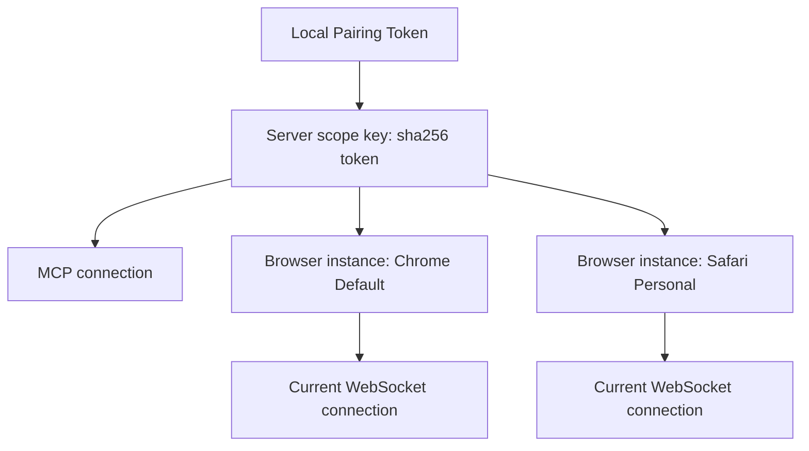
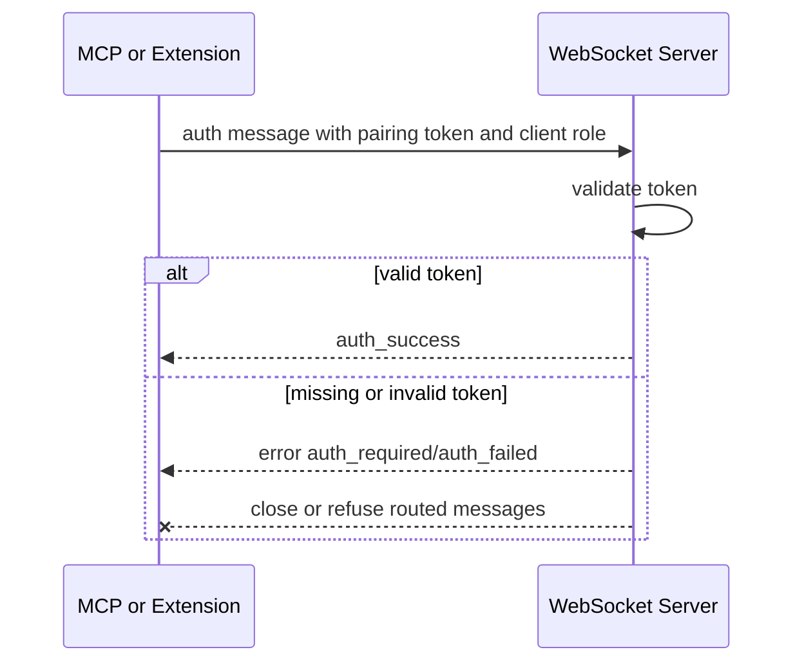
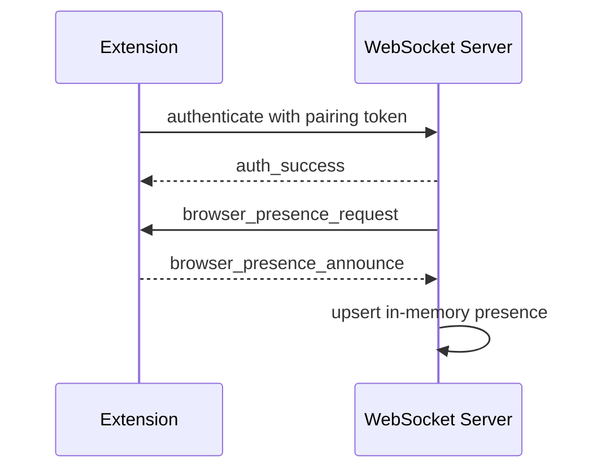
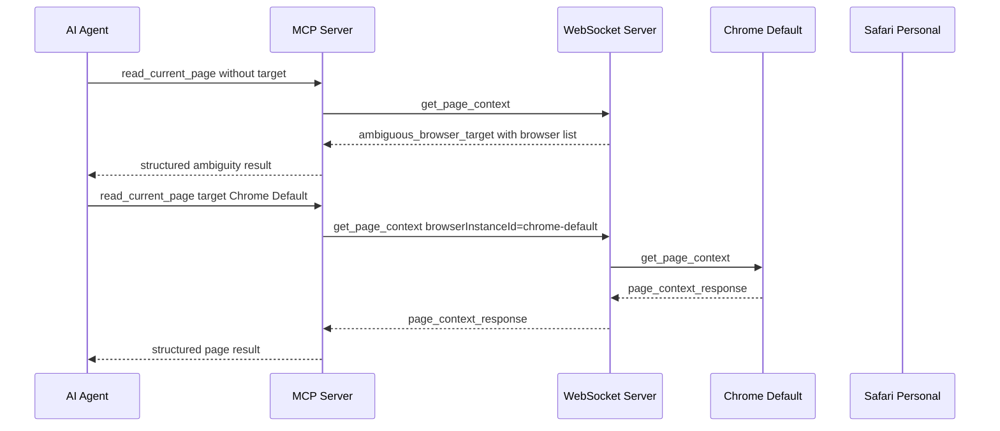

# Local Pairing Presence Routing Design

## Status

Draft for review

## Date

2026-05-25

## Goal

BrowserBridge should become local-first and cloud-ready before adding more
browser power. The local runtime should authenticate browser and MCP
connections, keep private request delivery scoped to the user's pairing token,
track which browser instances are online, and let MCP tools target a specific
browser when more than one browser is connected.

The cloud version will be a separate milestone. This design intentionally avoids
cloud token issuance, hosted identity, durable presence storage, multi-tenant
operations, and deployment-specific infrastructure.

## Decision

Implement a local pairing, presence, and targeted routing milestone.

- Generate one high-entropy local pairing token with a local command.
- Use that token as the user's private local routing scope.
- Authenticate WebSocket clients before accepting routed messages.
- Derive an internal scope key from the token and avoid storing or exposing the
  raw token after authentication.
- Let each extension announce browser presence after authentication and in
  response to server presence requests.
- Store presence in WebSocket server memory only.
- Add MCP browser discovery and browser-targeted routing.
- Keep page URL, title, page content, selected text, and DOM state out of
  presence.

## Architecture

The pairing token identifies the private local bridge space. Browser instance
identity is separate from the token so multiple devices, browsers, or browser
profiles can be online in the same private space.



The WebSocket server owns routing and presence state. The MCP server owns tool
semantics and user-facing structured errors. The extension owns durable local
configuration and announces its safe browser metadata when connected.

## Token And Configuration Model

Add a local command, for example `pnpm browserbridge token`, that prints a
high-entropy pairing token and short setup instructions.

The generated token is configured in three places:

- WebSocket server environment as the accepted local pairing token.
- MCP server environment as the token it uses when connecting to WebSocket.
- Chrome extension setup page as the token used when the user starts the
  bridge.

The extension stores durable local configuration in `chrome.storage.local`:

```ts
interface ExtensionBridgeSettings {
  websocketUrl: string;
  pairingToken: string;
  browserInstanceId: string;
  browserName: string;
  profileName: string;
  label: string;
}
```

The browser instance ID is generated once per extension install/profile and
then reused. The default browser identity should be conservative:

- `browserName`: `Chrome`
- `profileName`: `Default` or `Profile`
- `label`: generated from browser and profile, for example `Chrome Default`

The setup page should let the user edit `profileName` and `label`. The profile
name must be part of the generated label so users can distinguish browser
profiles. The implementation should not add invasive permissions or platform
assumptions solely to discover the human Chrome profile name.

The WebSocket server should derive a non-secret scope key from the token, such
as `sha256(pairingToken)`. It should not log, return, forward, or expose the raw
token after authentication.

## Authentication Flow

Every WebSocket connection must authenticate before it can participate in
routing.



Authentication should distinguish the connection role enough for routing:

- `extension`
- `mcp`

The role is not a replacement for token authentication. It tells the server how
to interpret follow-up messages. In this local milestone, one shared pairing
token is sufficient; role-specific or short-lived tokens belong to the later
cloud milestone.

## Presence Flow

Presence is runtime availability metadata, not browser page state. It exists
only while a browser connection is online.



The extension should announce presence:

- after successful authentication or connect;
- when the server sends `browser_presence_request`;
- when identity configuration changes while connected;
- when capabilities change;
- after reconnecting with a new socket.

The WebSocket server should request presence:

- immediately after authenticating an extension connection;
- when it receives a message from an authenticated extension that has no
  registered presence.

Presence payloads should include only safe routing metadata:

```ts
interface BrowserPresence {
  browserInstanceId: string;
  label: string;
  browserName: string;
  profileName: string;
  connectedAt: string;
  lastSeenAt: string;
  capabilities: BrowserCapability[];
}

type BrowserCapability =
  | "page_context"
  | "page_content"
  | "click"
  | "fill_input"
  | "fill_editable"
  | "set_checked"
  | "select_options"
  | "submit_form";
```

The server should remove presence on disconnect. If a browser reconnects with
the same browser instance ID in the same scope, the new connection replaces the
old active connection for that browser instance.

## Routing Model

MCP requests are routed only within the MCP connection's authenticated scope
key.

If an MCP request includes `browserInstanceId`, the WebSocket server forwards
the request only to that active browser instance in the same scope. If no target
is supplied, routing follows deterministic default rules:

- zero online browsers: return `browser_unavailable`;
- one online browser: route to that browser;
- multiple online browsers: return `ambiguous_browser_target` with safe browser
  metadata.



The WebSocket server must never forward requests across token scopes. An MCP
connection authenticated with token A cannot list or target browser instances
authenticated with token B.

## MCP Tools And Resources

Add a browser discovery tool:

```ts
list_browsers() -> {
  ok: true,
  data: {
    browsers: BrowserPresence[]
  }
}
```

Existing browser tools should accept optional `browserInstanceId`:

- `read_current_page`
- `click_element`
- `fill_input`
- `fill_editable`
- `set_checked`
- `select_options`
- `submit_form`

MCP resources should use the same default routing rules as tools:

- `browser://page/current`
- `browser://page/current/content/{index}`

Resource-specific explicit targeting can be deferred unless the implementation
can add it cleanly without widening scope. Tool targeting is the primary user
path for this milestone.

The MCP server may support an optional default browser instance ID from
configuration. If configured, it should behave the same as an explicit
`browserInstanceId` supplied to a tool call.

## Error Handling

Use structured errors with stable codes and readable messages.

Initial error codes:

- `auth_required`
- `auth_failed`
- `invalid_auth_message`
- `browser_unavailable`
- `ambiguous_browser_target`
- `invalid_browser_target`
- `timeout`
- `invalid_message`
- `unsupported_action`

Authentication failures should not disclose the accepted token or the internal
scope key. Ambiguous browser errors may include safe browser presence metadata
so the agent can ask the user which browser to target.

## Tests

Use TDD for the implementation. Tests should fail before implementation and
then pass with the smallest working change.

Required coverage:

- token generator returns high-entropy, non-empty, non-repeating tokens;
- WebSocket rejects missing or invalid tokens;
- WebSocket authenticates MCP and extension roles with a valid token;
- authenticated extension is asked for presence;
- extension announces presence after connect;
- extension saves WebSocket URL, token, profile name, label, and stable
  browser instance ID;
- server lists only browsers in the authenticated token scope;
- MCP with token A cannot see or route to token B browsers;
- one browser routes by default;
- multiple browsers without target returns `ambiguous_browser_target`;
- explicit `browserInstanceId` routes only to that browser;
- disconnected browser is removed from presence;
- reconnecting with the same browser instance ID replaces the old connection.

## Documentation

The implementation milestone should update:

- an ADR in `docs/architecture/decisions`;
- root `README.md`;
- `servers/websocket/README.md`;
- `servers/mcp/README.md`;
- `clients/extensions/chrome/README.md`;
- a completion artifact in `docs/artifacts`.

The documentation should explain that BrowserBridge presence is not browser
state storage. Page data remains available only through explicit MCP tool or
resource requests while the user-controlled extension connection is active.

## Non-Goals

- Do not design or implement cloud token issuance.
- Do not add hosted identity, accounts, organizations, or billing concepts.
- Do not add durable server-side presence storage.
- Do not store page content, page URL, page title, selected text, or DOM state
  as presence.
- Do not add new browser capabilities beyond routing and discovery changes
  required by this milestone.
- Do not introduce explicit channel IDs unless a later milestone needs multiple
  private spaces under one account.

## Risks And Mitigations

The main security risk is accidentally treating the pairing token as ordinary
metadata. Mitigate this by hashing it into a scope key, excluding it from logs
and responses, and testing cross-scope isolation.

The main usability risk is ambiguous routing when multiple browsers are online.
Mitigate this with `list_browsers`, editable labels, profile-aware generated
labels, and structured ambiguity errors.

The main architecture risk is letting local choices block the cloud design.
Mitigate this by keeping token issuance, durable presence, and cloud identity
out of scope while preserving the same concepts: token scope, browser instance,
connection session, presence, and targeted routing.
