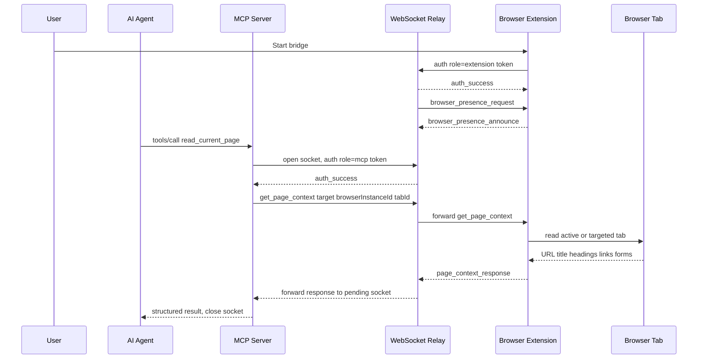

# Architecture Overview

Brijio connects remote AI agents to the browser session a user already controls.
Instead of launching a separate browser, cloning sessions, exporting cookies, or
streaming screenshots, Brijio routes explicit, per-call requests through a local
relay to a user-started browser extension. The canonical runtime chain is:

```text
Agent -> MCP Server -> WebSocket Server -> Browser Extension -> Browser Session
```

This chain is described in the root README and in `docs/architecture/ARCHITECTURE.md`.
The defining property is that **the browser remains the source of truth**: agents
never receive a cloned browser or a continuously streamed view of the page. Every
read or action is initiated by an explicit MCP tool or resource request, answered
with a structured result, and targeted per-call at a specific `browserInstanceId`
and optional `tabId`.

## Core components

The repository is a pnpm workspace with three package roots — `packages/*`,
`servers/*`, and `clients/extensions/*` — declared in `pnpm-workspace.yaml`.

### MCP server (`servers/mcp`)

The MCP server is the agent-facing API surface. It exposes MCP tools, resources,
and a prompt, translates each call into a relay message, and returns structured
results to the agent.

- Entrypoint: `servers/mcp/src/index.ts` reads options from environment and calls
  `startBrijioMcpHttpServer`.
- HTTP/MCP runtime: `servers/mcp/src/http-server.ts` assembles a Node HTTP server
  over the MCP SDK `StreamableHTTPServerTransport`. It validates the bearer token
  (`MCP_HTTP_AUTH_TOKEN`), allowed origins, and request method, then creates a
  fresh `McpServer` per request via `createBrijioMcpServer` and closes it after
  the request completes. It also serves a `/health` endpoint.
- Tool/resource/prompt registration: `servers/mcp/src/mcp-server.ts` registers the
  full MCP surface (listed below).
- Relay client: `servers/mcp/src/websocket-client.ts` (`requestBrijio`) opens a
  **new WebSocket connection per request**, authenticates with the pairing token,
  sends the target envelope, awaits the matching response or timeout, and closes
  the socket. There is no persistent MCP-to-relay session.

### WebSocket server (`servers/websocket`)

The WebSocket server is the local relay. It authenticates clients with the pairing
token, tracks browser presence, and routes messages between MCP and extension
sockets.

- Entrypoint: `servers/websocket/src/index.ts` reads `WEBSOCKET_HOST` /
  `WEBSOCKET_PORT` (default `0.0.0.0:8787`) and calls `createWebSocketServer`.
- Relay core: `servers/websocket/src/server.ts`. It binds a `ws` WebSocketServer
  onto a Node HTTP server that also serves `/health` (reporting online extension
  count and browser list).
- Authentication: the first message on a socket must be an `auth` payload carrying
  a `role` (`extension` or `mcp`) and a pairing token. Accepted tokens are
  `BRIJIO_PAIRING_TOKEN` plus any `additionalPairingTokens`. A `scopeKey`
  (derived from the token) scopes all presence and routing so distinct tokens do
  not see each other's browsers.
- Presence: after authenticating an `extension`, the relay sends a
  `browser_presence_request`; the extension replies with
  `browser_presence_announce` carrying `browserInstanceId`, label, browser/profile
  names, and capabilities. The relay stores this in an in-memory `presence` map
  keyed by `scopeKey:browserInstanceId` and cleans it up on socket close.
- Routing: `handleMcpMessage` resolves the target browser via `selectBrowser`
  (explicit `browserInstanceId`; if omitted and exactly one browser is online it is
  auto-selected; zero yields `browser_unavailable`; more than one yields
  `ambiguous_browser_target`). `list_browsers` is answered directly from the
  presence table; all other requests are forwarded to the selected extension
  socket, and the extension's response is routed back to the pending MCP socket via
  the `pendingRequests` map keyed by `scopeKey:requestId`.

### Shared package (`packages/shared`)

This package owns the protocol and browser-agnostic logic used by both extensions
and server-side code. `packages/shared/src/index.ts` re-exports the main modules:
`protocol`, `page-content`, `page-context`, `background-controller`,
`content-handler`, `page-reader`, `batch-handler`, `timers`, `logger`, popup
helpers, and bridge settings. `packages/shared/src/protocol.ts` defines the
canonical envelope and payload shapes (`BrijioEnvelope`, `AuthPayload`,
`BrowserPresence`, `BrowserCapability`, tab-listing types, etc.) and the
create/parse helpers used on both sides.

The central shared runtime piece for extensions is
`BrijioBackgroundController` (`packages/shared/src/background-controller.ts`): it
owns the extension's connection lifecycle (connect/disconnect on explicit user
action, reconnect with backoff, keepalive timer), authenticates, announces
presence on `auth_success` or `browser_presence_request`, tracks pending request
count, and dispatches incoming relay messages (page context, page content,
actions, batch, navigation, open tab, list tabs, screenshot, downloads, fetch
resource) to browser-agnostic handlers backed by injected adapters.

### Browser extensions (`clients/extensions/*`)

Chrome (`clients/extensions/chrome`) and Safari
(`clients/extensions/safari`) are thin adapters around
`BrijioBackgroundController`. Each `background.ts` injects browser-specific
adapters for tabs, scripting, downloads, storage, badges, approval prompts, and
page reading (`chrome.*` for Chrome, `browser.*` for Safari), then constructs the
shared controller. Safari uses MV2 background scripts, the `browser.*` namespace,
and text-only badges (ADR 0019, ADR 0051); Chrome uses `chrome.*` and colored
badges. Both share the same protocol, page-extraction, action, and approval logic
from `@brijio/shared`.

Firefox (`clients/extensions/firefox`) is a **planned placeholder only** — its
directory contains a README stating support is planned but not implemented, and no
ADR exists for it yet.

## Request and response flow

The extension is reactive: it answers explicit requests and returns structured
results; it does not publish ambient browser state. Two distinct lifecycles exist.

**Extension connection lifecycle** (long-lived, user-initiated):

1. The user starts the browser bridge in the extension UI (popup/action click).
2. `BrijioBackgroundController` opens a WebSocket to the relay and sends an `auth`
   envelope with `role=extension` and the pairing token.
3. The relay validates the token, replies `auth_success`, and sends a
   `browser_presence_request`.
4. The extension replies with `browser_presence_announce` (instance ID, label,
   capabilities). The relay records presence.
5. A keepalive timer sends `extension_keepalive` messages (no browser state) to
   keep the socket alive; on close the relay removes presence and cleans up
   pending requests.

**Per-request agent flow** (short-lived, one WebSocket per call):

1. The agent calls an MCP tool or resource.
2. The MCP server's `requestBrijio` opens a fresh WebSocket to the relay and sends
   an `auth` envelope with `role=mcp` and the pairing token.
3. On `auth_success`, the MCP server sends the request envelope, carrying an
   `id`, an optional `target.browserInstanceId`, and an optional `target.tabId`.
4. The relay resolves the target browser (`selectBrowser`) and forwards the
   envelope to that extension's socket, recording the MCP socket as pending for
   the request `id`.
5. The extension reads browser state or performs an approved action in the
   targeted tab, then returns a structured response.
6. The relay routes the extension response back to the pending MCP socket
   (`routeExtensionResponse`).
7. The MCP server parses the response, returns it to the agent, and closes the
   WebSocket. Timeouts, router errors, and connection failures are returned as
   structured error results.



_Caption: Extension presence handshake (long-lived) followed by a single per-call
agent request flowing Agent -> MCP -> Relay -> Extension -> Tab and back._

## MCP surface

The MCP surface is registered in `servers/mcp/src/mcp-server.ts`.

**Tools** (each action tool accepts optional `browserInstanceId` and `tabId` for
per-call targeting, and most action tools accept optional `pageContextId` /
`visibleContextId` / `expected*` fields for stale-context detection):

`list_browsers`, `list_tabs`, `read_current_page`, `navigate_to_url`,
`click_element`, `fill_input`, `fill_editable`, `set_checked`, `select_options`,
`submit_form`, `perform_batch`, `open_tab`, `capture_screenshot`,
`download_status`, `download_file`, `fetch_resource`, `upload_file`.

`perform_batch` executes 1–20 sequential actions (click, write_text, set_checked,
select_options, upload_file, submit_form) with optional `continueOnError` and an
optional trailing page read via `readAfterActions`; page navigation aborts
remaining actions so agents re-read before retrying.

**Resources**: `current-page-context` (URI `browser://page/current`), a templated
`current-page-content` (URI `browser://page/current/content/{index}`), and one
`skill://{name}` resource per skill markdown file loaded from
`servers/mcp/skills/`.

**Prompt**: `brijio-context`, which injects a session-start summary of connected
browsers, available skills, and key pitfalls (password fields, radio buttons,
short-lived target IDs, never auto-submit).

## Stale-context and failure semantics

Browser target IDs (links, actions, form controls, editables) are **short-lived**:
they are valid only against the latest page context. Action tools accept
`pageContextId` and `visibleContextId` to detect staleness. If the page has
navigated since the last read, the action fails with `page_navigated`; if visible
form state changed, it fails with `stale_context`. Agents are expected to re-read
page context after navigation or any mutation that can invalidate target IDs.

Relay-level failures are structured: `browser_unavailable` (no matching online
browser), `ambiguous_browser_target` (multiple browsers online and no explicit
`browserInstanceId`), `auth_required` / `auth_failed` (missing or rejected
pairing token), and request timeouts from the MCP relay client. Password fields
return `browser_error` on fill attempts — credential extraction is an
intentionally unsupported security boundary.

## Why this architecture exists

Brijio is intentionally not a remote desktop or browser cloning system. The
architecture preserves authenticated sessions, reduces privacy exposure, and keeps
browser control with the user. This is why the repo favors:

- short-lived, explicit requests over background monitoring;
- a per-call MCP-to-relay connection rather than a persistent agent session;
- shared protocol types in `packages/shared` over duplicated client/server
  schemas;
- browser-agnostic logic in `packages/shared` with thin browser-specific adapters
  at the edges;
- progressive disclosure — structured page context before larger content or visual
  data.

These invariants are reinforced by the security posture (no cookie export, no
session cloning, no continuous streaming, no background surveillance, no
credential/MFA interception) and the capability contract in
`docs/project/CAPABILITY_MATRIX.md`.

## Change guidance

When changing architecture, start by deciding which layer owns the behavior
(matching the AGENTS.md Ownership section):

- **Protocol and data shapes** belong in `packages/shared`
  (`packages/shared/src/protocol.ts` and the shared modules it re-exports). Do
  not duplicate protocol definitions in the servers or extensions.
- **Relay authentication, presence, and routing** belong in `servers/websocket`
  (`servers/websocket/src/server.ts`).
- **Agent-facing tools, resources, prompts, and skills** belong in `servers/mcp`
  (registration in `servers/mcp/src/mcp-server.ts`; relay client in
  `websocket-client.ts`).
- **Browser-specific integration** belongs in `clients/extensions/chrome` and
  `clients/extensions/safari`; keep adapters thin and keep shared behavior in
  `packages/shared` (`BrijioBackgroundController`). Firefox requires a separate
  ADR before implementation.

When changing a protocol or browser capability, check the full cross-layer path:

```text
shared protocol -> WebSocket relay -> MCP surface -> shared controller
                -> Chrome adapter -> Safari adapter -> integration tests
```

Additional rules (from AGENTS.md):

- Preserve explicit per-call `browserInstanceId` and `tabId` targeting. Do not
  introduce hidden selected-browser or selected-tab session state. When `tabId`
  is optional, preserve the documented active-tab fallback unless an accepted ADR
  changes it.
- Re-read page context after navigation or a mutation that can invalidate
  short-lived target IDs.
- When tool behavior changes, update its tests, MCP registration, relevant
  skills under `servers/mcp/skills`, the capability matrix, and relevant OpenWiki
  workflow pages.
- Consider both Chrome and Safari for shared browser behavior; document and test
  intentional platform differences.

Cross-cutting flow changes usually warrant an ADR under
`docs/architecture/decisions/`. Relevant accepted/proposed decisions include the
tab-targeting series (ADR 0060 explicit tab listing and selection, ADR 0062
threading `tabId` through the action stack, ADR 0063 open-tab action) and ADR 0064
(visual action verification / `capture_screenshot`). The canonical runtime chain
and component responsibilities are also summarized in
`docs/architecture/ARCHITECTURE.md`.
