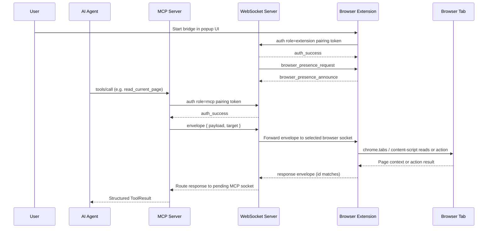

# Architecture Overview

Brijio's runtime architecture is a simple explicit chain:

```text
Agent -> MCP Server -> WebSocket Server -> Browser Extension -> Browser Session
```

That chain is described in the root README and in `docs/architecture/ARCHITECTURE.md`. The important property is that the browser remains the source of truth: agents do not get a cloned browser or a continuously streamed view of the page. Instead, every piece of information the agent sees and every action it performs travels as one short-lived, explicit request through this chain.

## Core components

### MCP server (`servers/mcp`)

The MCP server is the agent-facing API surface. It exposes resources and tools, translates MCP calls into relay messages, and returns structured results to the agent. Its package entrypoint is `servers/mcp/src/index.ts`, which boots the HTTP/MCP runtime assembled around `servers/mcp/src/http-server.ts`; the tool and resource registrations live in `servers/mcp/src/mcp-server.ts`.

Each tool is a thin wrapper over a `*-tool.ts` module (for example `open-tab-tool.ts`, `capture-screenshot-tool.ts`) that builds a WebSocket envelope, sends it through `servers/mcp/src/websocket-client.ts`, awaits the extension's response, and parses it back into a structured `ToolResult`. Tool and resource results use a predictable discriminated shape:

```ts
type ToolResult<T> =
  | { ok: true; data: T }
  | { ok: false; error: { code: string; message: string } };
```

### WebSocket server (`servers/websocket`)

The WebSocket server is the local relay. It authenticates clients with the pairing token, tracks browser presence, and routes messages to the correct browser instance. Its entrypoint is `servers/websocket/src/index.ts`, with the implementation in `servers/websocket/src/server.ts`.

The relay is connection-stateful but request-stateless. Each connection carries a `ConnectionState` holding `role` (`'extension'` or `'mcp'`), a `scopeKey` derived from the pairing token, and the announced `browserInstanceId` for extension connections. Presence is stored in a `Map<scopeKey:browserInstanceId, PresenceRecord>` and only browsers sharing the caller's `scopeKey` are visible, so one pairing token scopes all participants together. `list_browsers` is answered directly from this presence table; every other request is forwarded to the selected browser socket, with the requesting MCP socket recorded in a `pendingRequests` map keyed by `scopeKey:messageId` so the asynchronous response can be routed back.

### Shared package (`packages/shared`)

This package contains the protocol and browser-agnostic logic used by both extensions and server-side code. `packages/shared/src/index.ts` re-exports the main shared modules, and `packages/shared/src/protocol.ts` defines the canonical message/data shapes (the `WebSocketEnvelope`, `BrowserCapability` enum, the request/response pairs, and the `BrijioErrorCode` catalog). `packages/shared/src/background-controller.ts` holds the `BrijioBackgroundController` that both Chrome and Safari build their adapters around, and `page-reader.ts` provides the active-tab read/action helpers the extension adapters call.

### Browser extensions (`clients/extensions/*`)

Three browser extension boundaries exist, at different maturity levels:

- **Chrome** (`clients/extensions/chrome`) — implemented. `background.ts` constructs a `BrijioBackgroundController` wired to `chrome.*` APIs: `tabs.query`/`tabs.update`/`tabs.create`/`tabs.captureVisibleTab`, `scripting.executeScript` for content-script injection, `storage.local` for bridge settings, and the optional `chrome.downloads` API for download status/files.
- **Safari** (`clients/extensions/safari`) — implemented, sharing the same `@brijio/shared` logic through Safari-specific adapters. It has full Chrome feature parity, using `browser.tabs.*` equivalents; the download path is fire-and-forget on Safari because the `chrome.downloads` API is unavailable.
- **Firefox** (`clients/extensions/firefox`) — placeholder, planned. The directory reserves the client boundary and notes that Firefox packaging, permissions, and user-control behavior should be designed in a separate ADR before implementation starts.

Every extension connects only after explicit user action (the user clicks Connect in the popup), authenticates with the relay using the pairing token, announces browser presence, and answers explicit browser requests. The user stays in control of the browser at all times.

## Request flow

The end-to-end flow for a single agent tool call is grounded in the source above. The MCP server authenticates to the relay with the same pairing token family as the extension; the relay scopes both sides together so the MCP caller can only see and target browsers that paired with that token.



The flow mirrors the one documented in the README's Communication Flow section. The steps that matter architecturally are:

1. The user starts the browser bridge in the extension UI.
2. The extension authenticates to the WebSocket relay with a pairing token.
3. The relay sends a `browser_presence_request`; the extension responds with `browser_presence_announce`, which populates the presence table.
4. The agent calls an MCP tool or resource.
5. The MCP server authenticates with a token from the same pairing-token family, builds a structured `WebSocketEnvelope` (`payload` plus an optional `target.browserInstanceId`/`tabId`), and sends it to the relay.
6. The relay resolves the target browser from its presence table (directly for `list_browsers`; via `selectBrowser` for everything else) and forwards the envelope to that browser socket, recording the request id against the MCP socket.
7. The extension's `BrijioBackgroundController` dispatches the payload to the right adapter (page reader, page action, batch, navigation, open tab, screenshot, download, fetch) which reads browser state or performs an approved action on the active or targeted tab.
8. The structured result flows back through the relay to the MCP server, which parses it into the `ToolResult` returned to the agent.

This explicit request/response model is a core product boundary. The browser never streams screenshots, DOM updates, or history; the agent must ask for each piece of information. It is reinforced by the security posture in `docs/security/THREAT_MODEL.md` and the capability matrix in `docs/project/CAPABILITY_MATRIX.md`.

## MCP tool surface

The MCP server exposes the following tools, each of which maps to a registered `*-tool.ts` module and flows through the same envelope → relay → extension path:

| Tool                 | Purpose                                                                                                |
| -------------------- | ------------------------------------------------------------------------------------------------------ |
| `list_browsers`      | List online Brijio browser instances for the pairing token.                                            |
| `list_tabs`          | List open browser tabs for a connected instance.                                                       |
| `read_current_page`  | Read the current page context and optional readable content chunks.                                    |
| `click_element`      | Click a visible link or action target.                                                                 |
| `fill_input`         | Write text into a visible form control.                                                                |
| `fill_editable`      | Write text into a visible contenteditable target.                                                      |
| `set_checked`        | Set a checkbox or select a radio option.                                                               |
| `select_options`     | Select option values in a visible select control.                                                      |
| `upload_file`        | Write text into a visible file input (staged upload).                                                  |
| `submit_form`        | Submit a visible form.                                                                                 |
| `navigate_to_url`    | Navigate the browser to an HTTP/HTTPS URL and wait for load.                                           |
| `open_tab`           | Open a new browser tab with a URL and return its tab id.                                               |
| `perform_batch`      | Execute multiple actions in one request (sequential, optional continue-on-error, optional read-after). |
| `download_status`    | Get browser download status (capability full or not_supported).                                        |
| `download_file`      | Initiate a file download in the browser.                                                               |
| `fetch_resource`     | Fetch a URL using the browser's session (cookies, auth).                                               |
| `capture_screenshot` | Capture a viewport JPEG screenshot of the current tab.                                                 |

In addition to tools, the server exposes two resources (`browser://page/current` and `browser://page/current/content/{index}`), skill resources loaded from the `skills/` directory, and a `brijio-context` session-start prompt.

## Tab targeting

ADR 0060 introduced explicit `list_tabs` and an optional `tabId` parameter on the tools above; ADR 0062 threaded `tabId` through the action stack so the extension can resolve a specific tab rather than always falling back to the active tab. ADR 0063 (open-tab-action, **Accepted**) added the `open_tab` tool that creates a new tab and returns its id for subsequent targeting, without disturbing the user's current tab. ADR 0064 (visual-action-verification / screenshot, **Proposed**) adds `capture_screenshot` for visual action verification — viewport-only JPEG, active tab only, no auto-capture. Together these give the agent per-call tab targeting while keeping the user's foreground tab intact.

## Why this architecture exists

Brijio is intentionally not a remote desktop or browser cloning system. The architecture exists to preserve authenticated sessions, reduce privacy exposure, and keep browser control with the user.

That is why the repo favors:

- short-lived, explicit requests over background monitoring
- shared protocol types over duplicated client/server schemas
- browser-agnostic logic in `packages/shared`
- thin browser-specific adapters at the edges
- per-call, stateless targeting (`browserInstanceId`, `tabId`) over hidden session state

## Change guidance

When changing architecture, start by deciding which layer owns the behavior:

- **protocol and data shape changes** usually belong in `packages/shared` — new request/response pairs, capability enum entries, and type guards all start here.
- **routing and authentication changes** belong in `servers/websocket` — the presence table, pairing-token handling, and request/response routing live in `servers/websocket/src/server.ts`.
- **agent-facing tool/resource changes** belong in `servers/mcp` — each tool is a `*-tool.ts` module registered in `mcp-server.ts`, with the envelope/parse plumbing in `websocket-client.ts`.
- **browser capability changes** belong in the browser extensions and shared adapters — `BrijioBackgroundController` and the `pageReader`/`pageActions`/`pageScreenshot`/`pageOpenTab`/`tabLister` adapter interfaces define the extension boundary, with Chrome and Safari each providing concrete `chrome.*`/`browser.*` implementations.

If you add or change a cross-cutting flow, check the relevant ADRs under `docs/architecture/decisions/`, especially the recent tab-targeting and visual-verification decisions: `0060` (explicit tab listing and selection), `0062` (thread `tabId` through the action stack), `0063` (open-tab action, **Accepted**), and `0064` (visual action verification / screenshot, **Proposed**). The deeper source of truth for the overall component model is `docs/architecture/ARCHITECTURE.md`.
