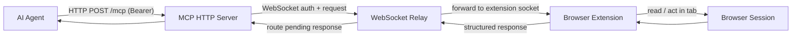
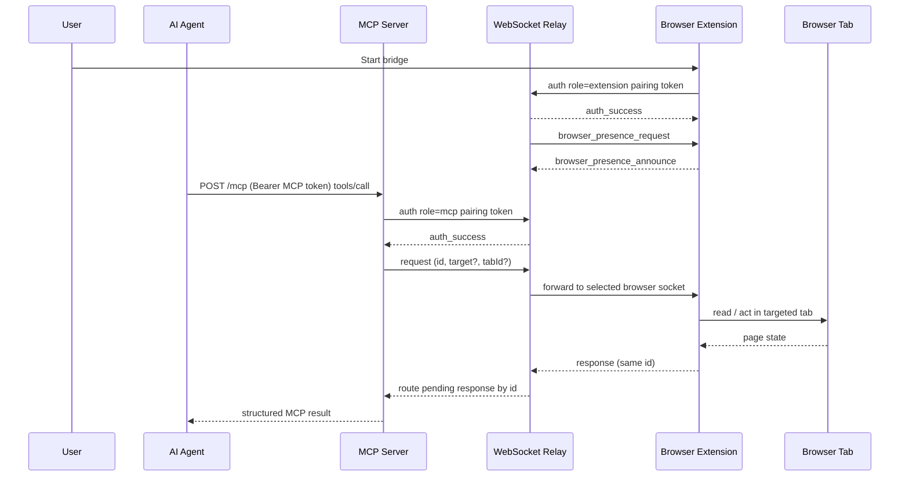

# Architecture Overview

Brijio connects remote AI agents to the browser session a user already controls. Its runtime is a short, **explicit** request/response chain rather than a browser clone, remote desktop, or continuous stream:

```text
Agent -> MCP Server (HTTP) -> WebSocket Relay -> Browser Extension -> Browser Session
```

The browser remains the **source of truth**: agents never receive a cloned browser, exported cookies, or an ambient view of the page. Browser state is only available while the user-controlled extension is connected, and every read or action is initiated by an explicit MCP tool or resource request.



## Core invariants

The non-negotiable product invariants from `AGENTS.md` shape every layer:

- **User-controlled activation.** The user explicitly starts and stops the browser bridge in the extension UI. The extension is reactive — it answers explicit requests and returns structured results; it does not publish ambient browser state.
- **Explicit request/response.** Every browser read or action is initiated by an explicit MCP tool or resource request. There is no continuous page, DOM, screenshot, history, or browser-state streaming.
- **Browser is source of truth.** Browser state is available only while the user-controlled extension is connected, and routed with explicit request IDs, structured errors, and timeouts.
- **No session capture.** Do not implement silent background surveillance, cookie export, credential extraction, session cloning, or MFA interception. Do not persist page content unless an accepted ADR explicitly requires it.
- **User-visible control.** Preserve user-visible connection state and configured client-side action approval; do not bypass approval checks.
- **Progressive disclosure.** Return structured context before larger page content or visual data.

These invariants are reinforced by the capability matrix in `docs/project/CAPABILITY_MATRIX.md` (cookie export ❌, session cloning ❌, continuous streaming ❌) and the threat model under `docs/security`.

## The four core components

### Shared package (`packages/shared`)

`@brijio/shared` is the single source of truth for the **protocol and browser-agnostic logic** used by both extensions and server-side code. `packages/shared/src/index.ts` re-exports the canonical modules: `protocol` (envelope types, request/response types, guards, response constructors), `page-context` and `page-content` (pure DOM extraction that takes a `Document` and environment), `background-controller` (the shared controller behind injected browser adapters), `content-handler`, `page-reader`, `popup-*`, `bridge-settings`, `batch-handler`, and `logger`.

The key architectural rule: protocol shapes and browser-agnostic behavior live here and are **not duplicated** across Chrome, Safari, MCP, and WebSocket. The WebSocket server imports protocol helpers from `@brijio/shared` (re-exported through `servers/websocket/src/protocol.ts`), and both browser extensions import the shared controller and DOM logic while keeping only thin browser-specific adapters at the edges.

### WebSocket relay (`servers/websocket`)

The WebSocket server is the local relay that routes messages between the MCP server and browser extensions. Its entrypoint `servers/websocket/src/index.ts` reads `WEBSOCKET_HOST` (default `0.0.0.0`) and `WEBSOCKET_PORT` (default `8787`) and calls `createWebSocketServer`; the implementation lives in `servers/websocket/src/server.ts`.

Key responsibilities and mechanisms:

- **Pairing-token authentication.** A high-entropy pairing token (`BRIJIO_PAIRING_TOKEN`, or `BRIJIO_TOKEN`, plus optional `additionalPairingTokens`) defines the private routing scope. Both MCP and extension connections must send an `auth` payload with this token before routing; unauthenticated messages are rejected with `auth_required` / `auth_failed`.
- **scopeKey isolation.** The token is never exposed in logs, responses, or presence state. `createScopeKey` derives a SHA-256 hash of the token; all presence and pending-request keys are scoped by this derived key, so two different tokens never see each other's browsers or requests.
- **In-memory presence map.** Browser presence lives only in a `Map<string, PresenceRecord>` keyed by `${scopeKey}:${browserInstanceId}`. After an extension authenticates, the server sends a `browser_presence_request` and the extension replies with `browser_presence_announce` (browserInstanceId, label, browserName, profileName, capabilities). On disconnect, the presence entry is removed and any pending requests owned by that socket are cleaned up.
- **Pending-request routing.** When an MCP-originated request carries an `id`, the relay stores `${scopeKey}:${requestId} -> mcpSocket` in a `pendingRequests` map and forwards the message to the selected extension socket. When the extension responds with that `id`, `routeExtensionResponse` looks up the waiting MCP socket, deletes the pending entry, and delivers the response. This is how explicit request/response is preserved across two WebSocket hops.
- **Targeted browser selection.** `list_browsers` is answered directly from the presence table (scoped to the caller's scopeKey). Other MCP requests are forwarded to a selected browser: an explicit `browserInstanceId` is matched; with no ID and exactly one online browser, it auto-routes; with no browser online it returns `browser_unavailable`; with more than one and no ID it returns `ambiguous_browser_target` listing the candidates. `list_tabs` is **forwarded** to the extension (not answered by the relay) and its `tab_list_response` is routed back like any other response.
- **Health endpoint.** `GET /health` returns version, uptime, and the count/list of currently connected browser instances (only those with an open socket).

### MCP server (`servers/mcp`)

The MCP server is the agent-facing API surface. It exposes resources and tools, translates MCP calls into relay messages, and returns structured results. `servers/mcp/src/index.ts` is the entrypoint; the HTTP runtime is assembled in `servers/mcp/src/http-server.ts` and the transport-neutral MCP server factory is `servers/mcp/src/mcp-server.ts`.

HTTP transport (ADR 0023):

- **StreamableHTTP transport.** The server uses the official MCP SDK `StreamableHTTPServerTransport` at a single endpoint, `/mcp` by default. It is **stateless**: `sessionIdGenerator: undefined`, `enableJsonResponse: true`, and each request builds a fresh `McpServer` via `createBrijioMcpServer`, connects it to a new transport, handles the request, and closes the server. There is no resumability, server-side MCP session persistence, or durable request log.
- **Bearer-token auth.** `MCP_HTTP_AUTH_TOKEN` is required (startup throws if empty). Every `/mcp` request is checked with `isAuthorized` (`Authorization: Bearer <token>`); failures return `401 unauthorized` **before** reaching MCP tool handling. This MCP HTTP token is separate from the pairing token used between MCP, WebSocket, and extension.
- **CORS / origin validation.** `MCP_HTTP_ALLOWED_ORIGINS` (comma-separated) is validated via `validateOrigin`; missing/disallowed origins return `403 forbidden_origin`. The check supports exact origin matches and `*.` wildcard host suffixes. `OPTIONS` is answered with `204`.
- **Path and method gating.** Only the configured path is served (others get `404 not_found`); only `GET`, `POST`, `DELETE` are allowed (`405 method_not_allowed` otherwise).
- **Health endpoint.** `GET /health` returns `status: ok`, version, uptime, and the configured WebSocket URL with `status: 'unknown'` (the MCP layer does not own relay health).
- **Timeouts.** `BRIJIO_MCP_HTTP_TIMEOUT_MS` (default `60000`) sets both the HTTP server timeout and request timeout; the approval timeout is derived as `httpTimeoutMs - BRIJIO_APPROVAL_TIMEOUT_BUFFER_MS` (default buffer `5000`), floored at `1000`.
- **Configuration.** `MCP_HTTP_HOST` (default `0.0.0.0`), `MCP_HTTP_PORT` (default `8788`), `MCP_HTTP_PATH` (default `/mcp`), plus page-context config (including the WebSocket URL the MCP server connects to as a relay client).

The MCP server itself registers the Brijio tools and resources (`list_browsers`, `list_tabs`, `read_current_page`, `click_element`, `fill_input`, form actions, navigation, batch, downloads, screenshot, etc.) and the page resources. The tool-by-tool inventory and the protocol message shapes are documented in the related pages rather than here.

### Browser extensions (`clients/extensions/*`)

Chrome and Safari (and Firefox) each provide **thin browser-specific adapters** around the shared `@brijio/shared` logic. The shared `background-controller` depends on injected adapter interfaces (`StorageAdapter`, `ActionAdapter`, `PageReaderAdapter`, `PageActionAdapter`, `SetupAdapter`, `TimersAdapter`, `BrijioSocket`); each browser supplies only the concrete wiring (e.g., Chrome's `chrome.*` APIs, Safari's `browser.*` namespace and native container app, badge/service-worker lifecycle differences).

Extension behavior is uniformly reactive:

1. The extension connects only after explicit user action (start bridge in the UI).
2. It authenticates to the relay with the pairing token.
3. It announces browser presence (and re-announces on server request).
4. It answers explicit relay-forwarded requests by reading browser state or performing an approved action in the targeted tab.
5. It returns a structured response through the relay; it does not stream ambient state.

Tab targeting (ADR 0060 / 0062) is per-call and stateless: an optional `tabId` flows MCP → relay → extension → `chrome.tabs.sendMessage(tabId, ...)`, with a documented active-tab fallback when `tabId` is absent. There is no hidden "selected tab" session state.

## Request flow



Two distinct tokens are in play: the **MCP HTTP bearer token** (agent → MCP server) and the **pairing token** (MCP server → relay and extension → relay), which defines the shared routing scope.

## Why this architecture exists

Brijio is intentionally not a remote desktop or browser cloning system. Launching a separate browser, cloning sessions, exporting cookies, or streaming screenshots would forfeit the authenticated sessions the user already holds and expand the privacy and security surface. Instead the architecture preserves authenticated sessions, keeps the browser under user control, and minimizes data movement by favoring:

- short-lived, explicit requests over background monitoring;
- shared protocol types over duplicated client/server schemas;
- browser-agnostic logic in `packages/shared`;
- thin browser-specific adapters at the edges;
- structured context before larger content or visual data (progressive disclosure).

## Change guidance

When changing architecture, first decide **which layer owns the behavior**, then follow the full path so a change stays consistent end to end:

```text
shared protocol -> WebSocket relay -> MCP surface -> shared controller
                -> Chrome adapter -> Safari adapter -> integration tests
```

Layer ownership:

- **Protocol and data-shape changes** belong in `packages/shared` (do not duplicate protocol definitions elsewhere).
- **Relay authentication, presence, and routing** belong in `servers/websocket`.
- **Agent-facing tools, resources, prompts, and skills** belong in `servers/mcp`.
- **Browser-specific integration** belongs in `clients/extensions/chrome`, `clients/extensions/safari`, and `clients/extensions/firefox`; keep adapters thin and shared behavior shared.

Cross-cutting rules to preserve:

- Keep per-call `browserInstanceId` and `tabId` targeting explicit and stateless; do not introduce hidden selected-browser or selected-tab session state. Preserve the documented active-tab fallback unless an accepted ADR changes it.
- Re-read page context after navigation or any mutation that can invalidate short-lived target IDs.
- When tool behavior changes, update its tests, MCP registration, skills under `servers/mcp/skills`, the capability matrix, and relevant OpenWiki pages.
- Consider both Chrome and Safari for shared browser behavior; document and test intentional platform differences.

For changes that introduce or alter a product capability, cross-package protocol/schema, architectural boundary, authentication/authorization/privacy/storage/trust boundary, browser routing/targeting/lifecycle semantics, or a materially new dependency, write an ADR under `docs/architecture/decisions/` as `Proposed` and wait for explicit approval before implementing. Relevant recent ADRs for this layer include the HTTP MCP transport (0023), local pairing/presence routing (0021), Safari + shared extension package (0019), explicit tab listing/selection (0060), threading `tabId` through the action stack (0062), and the `open_tab` action (0063).
