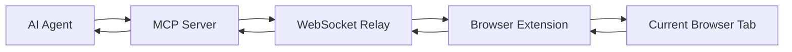

# Architecture Overview

Brijio connects remote AI agents to the browser session a user already controls. Its runtime is an explicit, request/response chain rather than a cloned browser or a continuously streamed view:

```text
Agent -> MCP Server -> WebSocket Relay -> Browser Extension -> Browser Session
```

The browser remains the source of truth. Agents do not get their own browser, exported cookies, or a background feed of page state; every browser read or action is initiated by an explicit MCP tool or resource request, and the extension only answers those requests.


```mermaid
flowchart LR
  Agent[AI Agent] --> MCP[MCP Server]
  MCP --> WS[WebSocket Relay]
  WS --> Ext[Browser Extension]
  Ext --> Browser[Current Browser Tab]

  Browser --> Ext
  Ext --> WS
  WS --> MCP
  MCP --> Agent
```

## The four owned systems

The repository is split into four owned systems. The ownership rule from `AGENTS.md` is:

- **Shared package** (`packages/shared`): protocol shapes and browser-agnostic logic. `packages/shared/src/protocol.ts` defines the canonical message/data shapes and the `WebSocketEnvelope` / `BrijioEnvelope` routing envelope; `packages/shared/src/background-controller.ts` owns the extension-side message dispatch and the adapter interfaces both browsers implement.
- **WebSocket relay** (`servers/websocket`): relay authentication, presence tracking, and routing. `servers/websocket/src/server.ts` authenticates clients with the pairing token, maintains a per-scope presence table, and forwards MCP requests to the selected browser socket.
- **MCP server** (`servers/mcp`): the agent-facing surface — tools, resources, prompts, and skills. `servers/mcp/src/mcp-server.ts` assembles the `McpServer`; `servers/mcp/src/http-server.ts` mounts it on an HTTP transport; `servers/mcp/src/index.ts` is the package entrypoint.
- **Browser extensions** (`clients/extensions/*`): browser-specific adapters kept thin around the shared controller. Chrome (`clients/extensions/chrome`) and Safari (`clients/extensions/safari`) both instantiate the shared `BrijioBackgroundController` with platform-specific adapters. Firefox is a placeholder only — support is planned but not implemented.

State shared across the chain lives in `packages/shared`; behavior specific to one role lives in its owned system.

## Request flow

The typical flow is:

1. The user starts the browser bridge from the extension UI.
2. The extension authenticates to the WebSocket relay with the pairing token.
3. The relay requests presence; the extension announces its browser instance, profile, label, and capabilities.
4. The agent calls an MCP tool or resource.
5. The MCP server authenticates to the relay with the same pairing token and sends a structured, IDed request.
6. The relay selects the target browser (by explicit `browserInstanceId`, or the sole online browser) and forwards the request.
7. The extension reads browser state or performs an approved action via the shared controller.
8. The structured result flows back through the relay to the MCP server and to the agent.

A few requests are answered directly by the relay rather than forwarded: `list_browsers` is answered from the relay's in-memory presence table, while `list_tabs` and all browser reads/actions are forwarded to the extension. Per-call `browserInstanceId` and `tabId` targeting is preserved end to end; there is no hidden selected-browser or selected-tab session state. When `tabId` is omitted, tools fall back to the active foreground tab.

## MCP server surface

The MCP server exposes the v0.3.0 tool surface. Tools currently registered in `mcp-server.ts`:

- `list_browsers`, `list_tabs`
- `read_current_page`
- `click_element`, `fill_input`, `fill_editable`, `set_checked`, `select_options`, `submit_form`, `upload_file`
- `navigate_to_url`, `open_tab` (ADR 0063), `perform_batch`
- `download_status`, `download_file`, `fetch_resource`
- `capture_screenshot` (ADR 0064)

Resources:

- `browser://page/current` (named `current-page-context`) and `browser://page/current/content/{index}` (named `current-page-content`) for progressive disclosure — structured context first, content chunks on request.
- `skill://brijio/{name}` resources, one per skill (see below).

Prompts:

- `brijio-context`, which injects connected-browser guidance, multi-tab targeting notes, the skill list, and key pitfalls into the agent's session.

Tool and resource results use a predictable structured envelope — `{ ok: true, data }` or `{ ok: false, error: { code, message } }` — so failures carry explicit error codes rather than exceptions.

### Skills system

Skills are detailed workflow guides stored as markdown in `servers/mcp/skills` (e.g. `form-filling`, `navigation`, `web-qa`). `servers/mcp/src/skills.ts` loads each skill directory's `SKILL.md` at server startup, parses optional frontmatter, and exposes every skill two ways:

- as an MCP resource at `skill://brijio/{name}` (mime `text/markdown`), so any MCP client can read the full instructions;
- summarized in the `brijio-context` prompt's context message, which also lists connected browsers, multi-tab targeting, and pitfalls.

The skills system is part of the MCP server surface, so changes to agent-facing workflow guidance belong in `servers/mcp` rather than the protocol.

### Visual verification: `capture_screenshot`

`capture_screenshot` (ADR 0064) is the only tool that returns non-text content. It captures the visible viewport of the active tab as JPEG (quality 80) and returns MCP **image** content (`{ type: 'image', data: base64, mimeType: 'image/jpeg' }`) alongside a small JSON metadata block. It is **explicit-only**: there is no continuous or automatic capture, consistent with the reactive model and the non-negotiable invariant against streaming screenshots. The adapter uses `tabs.captureVisibleTab()` on both Chrome and Safari; runtime permission failures fall back to a `capability_not_supported` error.

### Opening tabs: `open_tab`

`open_tab` (ADR 0063) lets an agent create a new HTTP/HTTPS tab and receive its `tabId` for subsequent targeting, without destroying the page state of the current tab (unlike `navigate_to_url`). Both extensions implement it via `tabs.create({ url })`; the new tab's ID is returned so the agent can immediately target it with `read_current_page` or other tools.

## Why this architecture exists

Brijio is intentionally not a remote desktop or browser-cloning system. The architecture preserves authenticated sessions, reduces privacy exposure, and keeps browser control with the user. That is why the repo favors short-lived, explicit requests over background monitoring, shared protocol types over duplicated client/server schemas, browser-agnostic logic in `packages/shared`, and thin browser-specific adapters at the edges.

The reactive posture is reinforced by the security threat model and the capability matrix, which mark cookie export, session cloning, continuous streaming, and browser recording as explicitly unsupported.

## Change guidance

When changing architecture, first decide which layer owns the behavior:

- protocol and data-shape changes usually belong in `packages/shared`;
- routing, authentication, and presence changes belong in `servers/websocket`;
- agent-facing tool, resource, prompt, and skill changes belong in `servers/mcp`;
- browser capability changes belong in the browser extensions and their shared adapters.

For a protocol or browser-capability change that cuts across layers, check the full path:

```text
shared protocol -> WS relay -> MCP surface -> shared controller -> Chrome adapter -> Safari adapter -> integration tests
```

Keep protocol definitions in `packages/shared` and do not duplicate them; preserve explicit per-call `browserInstanceId` and `tabId` targeting; re-read page context after navigation or any mutation that can invalidate short-lived target IDs; and when tool behavior changes, update its tests, MCP registration, relevant skills, the capability matrix, and the related OpenWiki pages. Consider both Chrome and Safari for shared browser behavior and document intentional platform differences.

Check the relevant ADRs under `docs/architecture/decisions/` before changing a cross-cutting flow; recent tab-targeting and tool-surface decisions include ADR 0060 (explicit tab listing/selection), ADR 0062 (thread `tabId` through the action stack), ADR 0063 (`open_tab`), and ADR 0064 (`capture_screenshot`).
