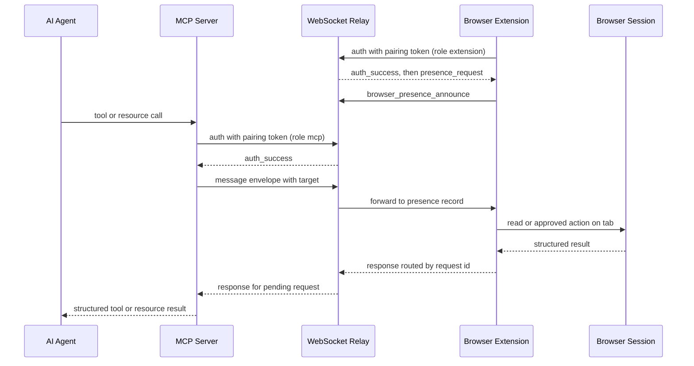

# Architecture Overview

Brijio is a user-controlled bridge between AI agents and the browser session the user already controls. Its runtime is an explicit request/response chain, not a remote desktop, browser clone, or ambient stream.

```text
Agent -> MCP Server -> WebSocket Relay -> Browser Extension -> Browser Session
```

The browser remains the source of truth. Agents never receive a cloned browser or a continuously streamed view of the page; the extension is reactive — it answers explicit requests and returns structured results.

This page is the high-level overview. The end-to-end runtime path is detailed in [MCP ↔ WebSocket ↔ Extension Flow](architecture/mcp-extension-flow.md), the protocol shapes in [Protocol and Data Model](data-and-protocol.md), the trust assumptions in [Security and Trust Model](security.md), and the source domains in [Major Domains](domains.md).

## Runtime chain


```mermaid
sequenceDiagram
    participant Agent as AI Agent
    participant MCP as MCP Server
    participant WS as WebSocket Relay
    participant Ext as Browser Extension
    participant Browser as Browser Session
    Ext->>WS: auth with pairing token (role extension)
    WS-->>Ext: auth_success, then presence_request
    Ext->>WS: browser_presence_announce
    Agent->>MCP: tool or resource call
    MCP->>WS: auth with pairing token (role mcp)
    WS-->>MCP: auth_success
    MCP->>WS: message envelope with target
    WS->>Ext: forward to presence record
    Ext->>Browser: read or approved action on tab
    Browser-->>Ext: structured result
    Ext-->>WS: response routed by request id
    WS-->>MCP: response for pending request
    MCP-->>Agent: structured tool or resource result
```

The diagram above shows a single request lifecycle. The extension connects once and announces presence; the MCP server authenticates per tool or resource call, sends one request, and waits for one routed response.

## Core components

### MCP server (`servers/mcp`)

The MCP server is the agent-facing API surface. It owns MCP tools, resources, prompts, and skills and translates each MCP call into a relay message, then back into a structured result.

- **Entrypoint and transport.** `servers/mcp/src/index.ts` starts an HTTP MCP runtime built in `src/http-server.ts` over the official MCP Streamable HTTP transport (`ADR 0023`). The MCP HTTP token (`MCP_HTTP_AUTH_TOKEN`) is separate from the Brijio pairing token and authenticates agent clients; `Host`/`Origin` validation and conservative bind defaults reduce DNS rebinding risk. A `/health` endpoint reports version, uptime, and the configured WebSocket URL (`ADR 0033`).
- **Per-request WebSocket client.** The MCP server holds no persistent WebSocket connection. Each tool/resource call opens a throwaway WebSocket to the relay via `src/websocket-client.ts`, authenticates as role `mcp`, sends one request envelope, and resolves on the first matching response or timeout. This keeps the MCP server state-light.
- **Server assembly.** `src/mcp-server.ts` registers the tools (`list_browsers`, `list_tabs`, `read_current_page`, `click_element`, `fill_input`, `fill_editable`, `set_checked`, `select_options`, `upload_file`, `submit_form`, `navigate_to_url`, `open_tab`, `perform_batch`, `download_status`, `download_file`, `fetch_resource`, `capture_screenshot`), the `browser://page/current` and `browser://page/current/content/{index}` resources, skill markdown resources, and the `brijio-context` prompt. Most tools accept optional `browserInstanceId` and `tabId` for per-call targeting.
- **Error forwarding.** Router-level and action-level errors are forwarded with their original code and message rather than collapsed to generic codes (`ADR 0061`). `stale_context` and `page_navigated` keep their structured `detail`; other extension codes (e.g. `not_supported`, `cors_blocked`, `http_error`, `size_exceeded`) pass through as strings.

### WebSocket relay (`servers/websocket`)

The relay authenticates clients, tracks browser presence, and routes messages between MCP and extension peers. It is intentionally state-light.

- **Auth and scope.** `servers/websocket/src/server.ts` authenticates both `mcp` and `extension` roles against the pairing token set (`BRIJIO_PAIRING_TOKEN` plus optional additional tokens) and derives an internal `scopeKey` from the token (`servers/websocket/src/protocol.ts`). Presence and routing are namespaced by that scope key; raw tokens never appear in logs, responses, or presence state (`ADR 0021`).
- **Presence.** Browser presence lives only in an in-memory `Map` keyed by `scopeKey:browserInstanceId`. The relay requests presence after extension auth and upserts it on `browser_presence_announce`. Records disappear on socket close; there is no durable presence storage.
- **Routing.** `list_browsers` is answered directly from the presence table for the caller's scope. All other MCP requests select a target browser: explicit `browserInstanceId`, the single online browser, or an `ambiguous_browser_target` error when more than one is online. The relay stores the pending request by `scopeKey:requestId`, forwards the envelope unchanged (including `target.tabId`) to the extension, and routes the extension's response back to the waiting MCP socket. Extension keepalives are pass-through.
- **Operations.** `GET /health` reports version, uptime, and connected extension count/labels (`ADR 0033`). Defaults: host `0.0.0.0`, port `8787` (`servers/websocket/src/index.ts`).

### Shared package (`packages/shared`)

This package owns the protocol and the browser-agnostic logic used by both extensions and server-side code. `packages/shared/src/index.ts` re-exports the main modules.

- **Protocol (`src/protocol.ts`).** The canonical `WebSocketEnvelope` (`type: 'message'`, optional `id`, optional `target`, `payload`), `BrijioRole`, auth/presence payloads, `BrowserPresence`, `BrowserCapability`, `TabInfo`, file-upload staging, and download/fetch result shapes. See [Protocol and Data Model](data-and-protocol.md).
- **Background controller (`src/background-controller.ts`).** `BrijioBackgroundController` is the extension-side brain. It owns the WebSocket lifecycle (connect/reconnect with exponential backoff plus jitter, keepalive, manual disconnect), drives user-visible badge state, dispatches incoming envelopes to page-read/action/batch/navigation/download/fetch/screenshot handlers, threads `tabId` from `message.target.tabId` to every adapter, and enforces client-side approval (`ADR 0048`) for `submit_form`, `fetch_resource`, and `download_file`. Approval state is in-memory only and cleared on disconnect.
- **Adapters and helpers.** `src/page-reader.ts` exposes `readActiveTabPage`, `performActiveTabAction`, and `performActiveTabBatch` with an optional `tabId` (preferring `tabs.get(tabId)` over the active-tab fallback when present). `src/page-context.ts`, `src/page-content.ts`, `src/content-handler.ts`, `src/batch-handler.ts`, `src/popup-*.ts`, `src/bridge-settings.ts`, `src/timers.ts`, and `src/logger.ts` complete the browser-agnostic surface.

### Browser extensions (`clients/extensions/*`)

Chrome and Safari are thin browser-specific adapters around the shared controller. They wire browser APIs into the shared adapter interfaces (`PageReaderAdapter`, `PageActionAdapter`, `PageBatchAdapter`, `PageNavigationAdapter`, `PageOpenTabAdapter`, `DownloadAdapter`, `ApprovalAdapter`, `TabListerAdapter`, `PageScreenshotAdapter`), start the bridge only after explicit user action, authenticate with the relay, announce presence, and answer explicit browser requests.

- **Chrome (`clients/extensions/chrome/src/background.ts`).** MV3, `chrome.*` namespace, `chrome.action` colored badges, `chrome.downloads`, `chrome.scripting` for idempotent content-script injection, and `chrome.tabs.captureVisibleTab` for screenshots.
- **Safari (`clients/extensions/safari/src/background.ts`).** MV2, `browser.*` namespace (`ADR 0019`, `ADR 0051`), text-only badges (color APIs are no-ops), fire-and-forget `tabs.create` download fallback with `initiated_fire_and_forget`, and a navigation timeout wrapper because `browser.tabs.update` can hang on restricted pages (`ADR 0052`).
- **Firefox (`clients/extensions/firefox`).** Currently only a `README.md` placeholder. Firefox support is planned but not implemented and must be designed in a separate ADR before implementation starts.

## Why this architecture exists

Brijio is intentionally not a remote desktop or browser cloning system. The architecture exists to preserve authenticated sessions, minimize privacy exposure, and keep browser control with the user. The non-negotiable invariants in `AGENTS.md` encode this: the user explicitly starts and stops the bridge, browser state is available only while the user-controlled extension is connected, every read or action is an explicit MCP request, and there is no continuous page/DOM/screenshot/history streaming, cookie export, credential extraction, session cloning, or MFA interception.

That is why the repo favors:

- short-lived, explicit requests over background monitoring;
- a single shared protocol over duplicated client/server schemas;
- browser-agnostic logic in `packages/shared` and thin adapters at the edges;
- progressive disclosure — page context before page content, structured snapshots before screenshots.

## Change guidance

Classify a change by the layer that owns the behavior. The full cross-layer path, from `AGENTS.md`, is:

```text
shared protocol -> WebSocket relay -> MCP surface -> shared controller
              -> Chrome adapter -> Safari adapter -> integration tests
```

- **Protocol and data shape -> `packages/shared`.** Add or change message/data shapes in `packages/shared/src/protocol.ts` first; do not duplicate protocol definitions. Changes here ripple to the relay, MCP, both adapters, and integration tests.
- **Routing and auth -> `servers/websocket`.** Pairing-token auth, scope keys, presence, target selection, and relay error envelopes live in `servers/websocket/src/server.ts` and `servers/websocket/src/protocol.ts`.
- **Agent-facing tool/resource/skill -> `servers/mcp`.** New tools, resources, prompts, skills, input schemas, and error forwarding behavior live under `servers/mcp/src`. Keep per-call `browserInstanceId`/`tabId` targeting explicit; re-read page context after navigation that can invalidate short-lived target IDs.
- **Browser capability -> extensions plus shared adapters.** Browser-specific behavior belongs in `clients/extensions/chrome` or `clients/extensions/safari`; keep adapters thin and shared behavior shared. Preserve per-call `tabId` (no hidden selected-tab session state) and the active-tab fallback when `tabId` is absent. Consider both browsers and document intentional platform differences.

Most cross-cutting changes require an ADR before implementation (capability, protocol, ownership, auth/routing, browser lifecycle, or a material dependency). Write ADRs as `Proposed`, wait for explicit user approval, then mark them `Accepted`; never reuse an ADR number. ADRs under `docs/architecture/decisions/` are the design-history source of truth. The recent ones are especially relevant when touching this area:

- `0048` client-side action approval (in-memory, `submit_form` / `fetch_resource` / `download_file`, `approve_session` grants cleared on disconnect).
- `0060` explicit tab listing and selection (`list_tabs`, per-call `tabId`, on-demand only).
- `0062` threading `tabId` through the whole action stack with active-tab fallback.
- `0063` `open_tab` action returning the new `tabId`.
- `0064` `capture_screenshot` viewport JPEG (no auto-capture).
- `0061` forwarding original error codes/messages through the MCP server.

For focused verification, run the smallest package set that covers the changed layer (`pnpm --filter @brijio/<package> test` and `check`); for cross-package changes run `pnpm test` and `pnpm check`, matching CI with `pnpm lint`, `pnpm build`, `pnpm test`.
