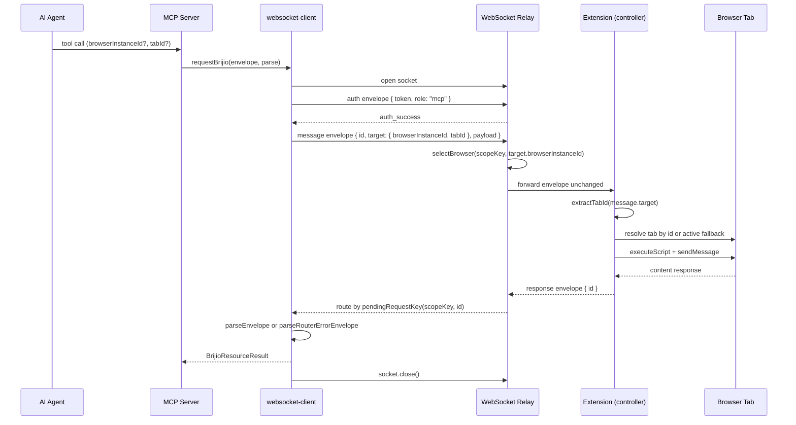

# MCP ↔ WebSocket ↔ Extension Flow

Brijio is built around **explicit, per-request** browser control rather than continuous mirroring. An agent invokes an MCP tool; the MCP server builds a protocol envelope, opens a short-lived WebSocket to the relay, and targets a specific browser and (optionally) a specific tab. The relay forwards the envelope to the connected extension session that announced presence for the same pairing token; the extension's shared background controller dispatches it to page-reader, action, navigation, batch, download, or screenshot handlers; the browser adapter performs tab-level work; and the structured result flows back through the relay to the waiting MCP socket.

The flow is **stateless per request**: there is no selected-tab session state, and every tool call can independently target a `browserInstanceId` and a `tabId`. This mirrors how `browserInstanceId` already worked for multi-browser targeting and is extended to the multi-tab axis (ADR 0060, ADR 0062).

## Components and their responsibilities

- **MCP server** (`servers/mcp/src/mcp-server.ts`) registers each tool with a Zod input schema. Shared input fields `browserInstanceId` and `tabId` are declared once and reused across tools; action tools additionally carry `pageContextId`/`visibleContextId` for staleness validation.
- **MCP tool wrappers** (e.g. `click-element-tool.ts`, `page-reading-tool.ts`) normalize raw tool input, validate `tabId`/`browserInstanceId`, and delegate to `page-actions.ts` / `page-context.ts` helpers. These helpers thread the targets into `websocket-client.ts` request options.
- **MCP websocket-client** (`servers/mcp/src/websocket-client.ts`) owns the per-request lifecycle. `requestBrijio` opens a fresh socket, performs the auth handshake, attaches the target via `targetEnvelope()`, awaits the parsed result or a router error, and settles on timeout/error/close.
- **WebSocket relay** (`servers/websocket/src/server.ts`) authenticates both MCP and extension roles with the same pairing token, maintains a presence table keyed by `scopeKey:browserInstanceId`, routes MCP messages to the selected extension, and routes extension responses back to the pending MCP socket by request id.
- **Shared background controller** (`packages/shared/src/background-controller.ts`) runs inside the extension. `BrijioBackgroundController.handleSocketMessage` extracts `target.tabId`, dispatches by envelope payload type, and sends structured response envelopes back over the extension's persistent socket.
- **Shared page-reader** (`packages/shared/src/page-reader.ts`) provides the tab-resolution and content-script messaging primitives (`readActiveTabPage`, `performActiveTabAction`, `performActiveTabBatch`) that the Chrome/Safari adapters wrap.
- **Browser adapters** (`clients/extensions/chrome/src/background.ts`, Safari) inject platform-specific `chrome.tabs` / `browser.tabs` behavior into the shared controller and page-reader, including tab resolution by ID and the active-tab fallback.

## Per-request lifecycle in the MCP websocket-client

Each MCP tool call maps to exactly one `requestBrijio(...)` invocation. The client uses a **one-shot socket per request** rather than a pooled connection.

The diagram shows a page-read/action request; `list_browsers` is answered directly by the relay from its presence table and never reaches the extension.

The lifecycle steps, in order:

1. **Open.** `requestBrijio` creates `new WebSocket(url)` and starts a `timeoutMs` timer. If `pairingToken` is empty it short-circuits with `authRequiredResponse` without connecting.
2. **Auth.** On `open`, the client sends `createAuthEnvelope(pairingToken)` with role `mcp`. It waits for an `auth_success` envelope; anything else before auth settles as `invalidResponse()`.
3. **Targeted request.** On `auth_success`, the client sends `targetEnvelope(options)`, which spreads the tool's `requestEnvelope` and adds a `target` object when `browserInstanceId` and/or `tabId` are present. When both are absent, the envelope is sent unchanged (the relay then requires exactly one online browser for that scope).
4. **Await.** Incoming messages are checked in order: `parseRouterErrorEnvelope` first (relay-originated errors such as `browser_unavailable`, `ambiguous_browser_target`, `invalid_message` settle immediately and forward the real error code), then the auth-success gate, then the tool-specific `parseEnvelope`. Messages the parser marks `ignored` are left for a later message on the same socket.
5. **Settle.** A non-ignored result calls `settle()`, which is idempotent: clears the timeout, closes the socket, and resolves the promise. The `error` and `close` events also settle with `connectionFailedResponse`; the timeout settles with `timeoutResponse(timeoutMessage)`.

## Target attachment: `targetEnvelope()` and relay routing

`targetEnvelope()` is the single point where per-call targeting is attached. It only adds a `target` field when at least one of `browserInstanceId`/`tabId` is defined, so envelope shape stays backward compatible.

The relay does **not** interpret `tabId`. Routing is by `scopeKey` (a SHA-256 of the pairing token, computed identically on both sides) plus browser presence:

- `createScopeKey(token)` derives the same `scopeKey` for any client authenticating with the same token, so an MCP client and an extension using the same pairing token share a scope.
- `handleMcpMessage` calls `selectBrowser(listRecordsForScope(presence, scopeKey), message.target?.browserInstanceId)`. With a `browserInstanceId`, it matches that record or returns `browser_unavailable`. Without one, zero online browsers returns `browser_unavailable` and more than one returns `ambiguous_browser_target` (listing the candidates). Exactly one online browser is the implicit target.
- The selected extension socket receives the **entire message envelope unchanged**, including `target.tabId` and `target.browserInstanceId`. The relay records `pendingRequests[scopeKey:requestId] = mcpSocket` so the eventual extension response can be routed back.
- Extension responses are matched in `routeExtensionResponse` by `pendingRequestKey(scopeKey, message.id)`; the pending entry is deleted and the message is forwarded to the original MCP socket. `list_browsers` is special-cased: the relay answers from its presence table directly. `list_tabs`, by contrast, is forwarded to the extension like any other tool.

## Extension side: dispatch and tab resolution

The extension maintains a **persistent** socket (reconnecting with exponential backoff) and announces `browser_presence_announce` after auth and on relay request. `BrijioBackgroundController.handleSocketMessage` is the dispatch entrypoint:

1. It extracts `tabId` via `extractTabId(message)`, which reads `message.target.tabId` (a string), parses it with `Number.parseInt`, and returns `undefined` when absent or not a safe integer. This numeric `tabId` is threaded through every handler that operates on a tab.
2. It branches by payload type (`isGetPageContextEnvelope`, `isPerformActionEnvelope`, `isNavigateToUrlEnvelope`, `isPerformBatchEnvelope`, `isOpenTabEnvelope`, `isDownloadStatusEnvelope`, `isDownloadFileEnvelope`, `isFetchResourceEnvelope`, `isCaptureScreenshotEnvelope`, `isListTabsEnvelope`, etc.), increments `pendingRequestCount`, and awaits the matching handler. Download/fetch/screenshot and `list_tabs` handlers do not consume `tabId`; the page-reader, action, batch, and navigation handlers do.
3. Handlers call the injected adapter methods (`pageReader.getPageContext(tabId)`, `pageActions.click(..., tabId)`, `pageBatch.performBatch(message, tabId)`, `pageNavigation.navigateToUrl(url, tabId)`) and send back a structured success or error envelope over the same socket using the request id.

The browser adapter resolves the tab. In the Chrome adapter, the shared `readActiveTabPage`/`performActiveTabAction`/`performActiveTabBatch` functions and `navigateActiveTabToUrl` all follow the same contract: **when `tabId` is provided, use it directly; otherwise query the active tab in the current window as the fallback.** The page-reader additionally validates that the fallback tab has a URL and is an `isRegularPageUrl` (HTTP/HTTPS) page before injecting the content script. The content script is re-injected per request (`scripting.executeScript` with `content.js`) per ADR 0043 to guarantee the latest listener, then `tabs.sendMessage(tabId, message)` delivers the read/action request and the response is normalized back to `PageReadResult`/`PageActionResult`.

## Active-tab fallback and stale-context / `page_navigated` semantics

Targeting is **stateless and explicit**. When `tabId` is omitted, the extension falls back to `chrome.tabs.query({ active: true, currentWindow: true })` (or the Safari equivalent). This preserves backward compatibility: tools written before ADR 0062 keep working on the foreground tab. A tool that should operate on a background tab must accept and pass `tabId`; without it the action silently targets the active tab.

The action path enforces freshness using two short-lived IDs returned by `read_current_page`:

- **`pageContextId`** is a page-context version. The content handler compares the request's `pageContextId` against the live `pageContextVersion`; a mismatch returns `page_navigated` with a `detail` showing the previous and current context ids. This tells the agent the page navigated since the last read and it must call `read_current_page` again.
- **`visibleContextId`** tracks visible form-state. If visible controls changed since the read, the handler returns `stale_context` (`reason: visible_controls_changed`) so the agent refreshes context before retrying. Successful form actions may still complete but attach `contextStale: true` plus `currentVisibleContextId` when the visible form structure shifted, signaling the agent that a re-read is advisable.

In batches (`perform_batch`), `page_navigated` is treated as a hard abort: remaining actions are skipped with `page_navigated` error entries regardless of `continueOnError`, because the page the agent planned against no longer exists. Other action errors respect `continueOnError`. The shared `performActiveTabBatch` also falls back to single-action execution when the content script returns an unexpected response type, preserving batch semantics on older content scripts.

## Error codes crossing the boundary

The MCP client surfaces errors from three layers, all funneled into the `BrijioResourceResult` shape:

- **Relay/router errors** — `{ type: 'error', error: { code, message, browsers? } }` — are caught by `parseRouterErrorEnvelope` before any payload parsing. The parser forwards the real code verbatim (e.g. `browser_unavailable`, `ambiguous_browser_target`, `auth_required`, `auth_failed`, `invalid_message`, `invalid_json`) so the agent sees the actual failure rather than a generic replacement. `ambiguous_browser_target` includes the candidate browser list.
- **Tool/extension errors** — `ok: false` payloads with `error.code`/`message` — are parsed by the tool-specific `parse*Envelope` functions, which also validate the action kind (e.g. a click parser rejects a `write_text` data shape as `invalid_response`).
- **Transport errors** — `connectionFailedResponse` on socket `error`/unexpected `close`, `timeoutResponse` on `timeoutMs`, `authRequiredResponse` when the token is empty — settle the promise without a relay round trip.

## What to watch for when editing this area

- **Tool input changes require coordinated edits.** A new input field must be added to the Zod schema in `servers/mcp/src/mcp-server.ts`, threaded through the tool wrapper, into the `request*` options in `servers/mcp/src/websocket-client.ts`, and into the envelope builder/parser in `servers/mcp/src/protocol.ts`. The background controller dispatch and the shared page-reader must accept and use the new field together; the editing guidance in the page seed notes that `protocol.ts` and the background controller move in lockstep.
- **Extension adapters must stay in sync with shared page-reader behavior.** The `TabsApi`/`ActiveTabDeps` interfaces define the contract the Chrome and Safari adapters implement; adding a tab-resolution capability (e.g. `tabs.get`) requires updating the interface and both adapters.
- **`tabId` is a string on the wire and a number in the adapter.** `targetEnvelope()` writes `target.tabId` as a string; `extractTabId()` parses it to a number for `chrome.tabs.*` calls. Don't pass the raw string to a tab API.
- **Background-tab support requires `tabId`.** A tool that should work on a non-active tab must accept and propagate `tabId`; without it the active-tab fallback applies and the action will hit the foreground tab.
- **`page_navigated` aborts batches.** Any new batch action type must respect the abort semantics in `packages/shared/src/page-reader.ts` and `batch-handler.ts`.

## Related docs

- [MCP tools and skills](../architecture/mcp-tools-and-skills.md)

<!-- openwiki: broken internal link [../architecture/data-and-protocol.md] file "../architecture/data-and-protocol.md" does not exist. Fix the href or restore the target, then delete this comment. -->

- [Data and protocol](../architecture/data-and-protocol.md)
- [Action approval workflow](../workflows/action-approval.md)
- [Multi-tab workflow](../workflows/multi-tab.md)
- ADR 0060 — Explicit Tab Listing and Selection (`docs/architecture/decisions/0060-explicit-tab-listing-and-selection.md`)
- ADR 0062 — Thread tabId Through the Entire Action Stack (`docs/architecture/decisions/0062-thread-tabid-through-action-stack.md`)
