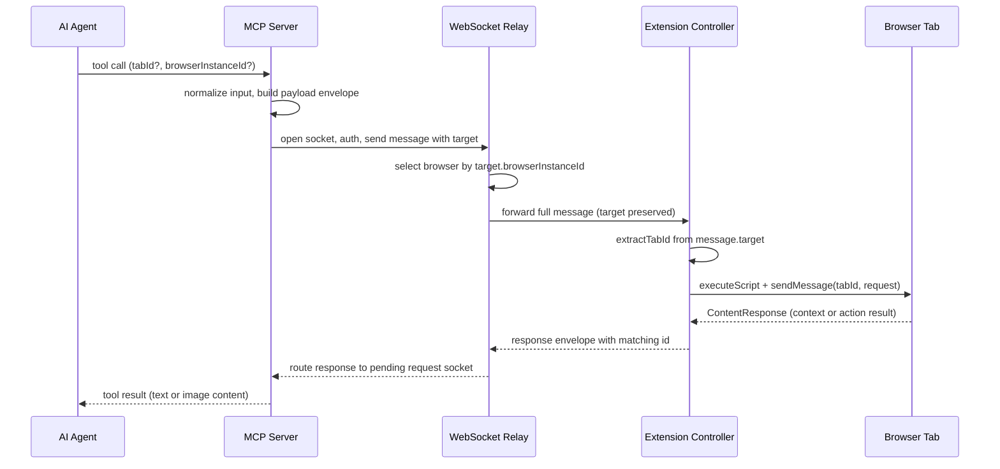

# MCP ↔ WebSocket ↔ Extension Flow

Brijio moves an agent request from the MCP server to a browser tab and back over a
short-lived, authenticated WebSocket hop. There is no continuous browser
mirroring: every read, action, navigation, download, fetch, and screenshot is
initiated by an explicit MCP tool or resource call, executes one round trip, and
returns a structured result (success data or a typed error). This page traces
that path end to end and names the source files that own each layer.

## Layers and canonical source files

The flow crosses four ownership boundaries. Each is a thin, replaceable layer; the
shared protocol and shared browser-agnostic logic live in `packages/shared`.

- **MCP surface** — `servers/mcp/src/mcp-server.ts` registers tools, resources,
  and prompts; per-tool modules (`page-reading-tool.ts`, `page-actions.ts`,
  `capture-screenshot-tool.ts`, `open-tab-tool.ts`, `batch-tool.ts`,
  `form-action-tools.ts`, `navigate-to-url-tool.ts`, `list-tabs-tool.ts`,
  `download-*-tool.ts`, `fetch-resource-tool.ts`) normalize input and delegate.
- **Relay client / protocol** — `servers/mcp/src/websocket-client.ts` opens a
  per-request WebSocket, authenticates, and sends the targeted envelope;
  `servers/mcp/src/protocol.ts` defines the `WebSocketEnvelope` shape and the
  `create*Envelope` / `parse*Envelope` helpers.
- **WebSocket relay** — `servers/websocket/src/server.ts` authenticates
  connections, tracks browser presence, routes MCP requests to the selected
  extension, and routes extension responses back to the waiting MCP socket.
- **Extension** — `packages/shared/src/background-controller.ts` dispatches
  relayed messages to adapter interfaces; `packages/shared/src/page-reader.ts`
  and `content-handler.ts` perform the tab-level work; the Chrome
  (`clients/extensions/chrome/src/background.ts`) and Safari
  (`clients/extensions/safari/src/background.ts` +
  `background-entry.ts`) adapters bind those interfaces to `chrome.*` /
  `browser.*`.

## End-to-end request flow

The end-to-end flow, grounded in the source above, from a tab-targeted read or action through to the screenshot return path.

### 1. Tool call to envelope

`createBrijioMcpServer` registers every tool with two shared optional inputs:
`browserInstanceId` (string) and `tabId` (string). Each tool handler logs the call
and delegates to a tool-module function with the `BrijioPageContextConfig`
(WebSocket URL, pairing token, timeout, optional `defaultBrowserInstanceId`).
Tool modules normalize loosely typed input into a `BrijioToolResult`, then call a
`page-actions.ts` helper.

`page-actions.ts` is the single fan-out point. Each helper resolves
`tabId ?? config.defaultTabId` and `browserInstanceId ??
config.defaultBrowserInstanceId`, then calls the matching `request*` function in
`websocket-client.ts`. This is where per-call `tabId` becomes a request-level
concern; `openNewTab` is the exception — it takes no `tabId` because the tab does
not exist yet.

### 2. Relay client to relay

`requestBrijio` is the shared core. For each call it opens a fresh WebSocket to
`websocketUrl`, sends an auth envelope with the pairing token, and on auth
success sends `targetEnvelope(options)`. `targetEnvelope` injects a `target`
field (`{ browserInstanceId?, tabId? }`) onto the request envelope only when
either value is present; the envelope otherwise carries just `type`, `id`, and
`payload`. A timeout (`timeoutMs`, or `approvalTimeoutMs` for approval-gated
calls) bounds the wait. Router errors, auth failures, timeouts, and connection
failures are mapped to typed `BrijioResourceResult` errors; otherwise the
`parseEnvelope` callback validates the matching response by `id`.

### 3. Relay routing

The relay authenticates each connection with a pairing token and scopes it by a
`scopeKey` (hash of the token), so an MCP client and an extension can only see
each other when they share the same token. Extensions announce browser presence
(`browserInstanceId`, label, capabilities); the relay stores it per
`scopeKey:browserInstanceId`.

For an MCP message the relay handles `list_browsers` directly from its presence
table. Every other request goes through `selectBrowser`: it picks the extension
matching `message.target?.browserInstanceId`, or the single online browser if
none is specified, or returns `ambiguous_browser_target` / `browser_unavailable`.
It then records `pendingRequestKey(scopeKey, message.id)` → the MCP socket and
forwards the **full message** — including `target` — to the selected extension
unchanged. Extension responses are routed back by `routeExtensionResponse`:
lookup by `scopeKey:message.id`, delete the pending entry, and send the response
to the original MCP socket. Pending requests are cleaned up when either socket
closes.

### 4. Extension dispatch

`BrijioBackgroundController` owns the extension's persistent relay connection:
auth, presence announce, keepalive, and reconnect with exponential backoff. Its
`handleSocketMessage` parses each relayed message and calls `extractTabId` to
read `message.target?.tabId` (a string) and parse it to a number — returning
`undefined` when absent, which means "fall back to the active tab". It then
dispatches by payload type to handler methods, threading `tabId` (numeric) into
the page-reader, action, batch, and navigation handlers. `list_tabs`,
`open_tab`, `download_status`, and `capture_screenshot` do not receive a tabId
argument because they are not scoped to an existing tab.

Each handler calls the corresponding adapter interface
(`PageReaderAdapter`, `PageActionAdapter`, `PageBatchAdapter`,
`PageNavigationAdapter`, `PageOpenTabAdapter`, `DownloadAdapter`,
`TabListerAdapter`, `PageScreenshotAdapter`). When an adapter is absent the
controller returns a `not_supported` error, so capabilities degrade gracefully
per browser (for example Safari's download-status adapter returns
`not_supported`). `submit_form`, `download_file`, and `fetch_resource` are
approval-gated: when `approvalRequest` is set the controller asks the
`ApprovalAdapter` (which injects a banner via the content script) before
performing the action.

### 5. Tab-level execution

`page-reader.ts` provides the shared `readActiveTabPage`,
`performActiveTabAction`, and `performActiveTabBatch`. When a numeric `tabId`
is provided they use it directly as the target; otherwise they query
`{ active: true, currentWindow: true }` and validate the URL with
`isRegularPageUrl`. They then `executeScript({ target: { tabId }, files:
['content.js'] })` to (re)inject the content script — the listener-replacement
mechanism in `content-handler.ts` prevents duplicate listeners — send a
`show_brijio_tab_indicator` message, and `tabs.sendMessage(tabId, request)`.
The content script's `handleContentRequest` returns a `ContentResponse`.

`content-handler.ts` is where staleness is enforced. A module-scoped
`pageContextVersion` increments on `pageshow` (navigation). Action requests
carrying a `pageContextId` fail with `page_navigated` if it no longer matches,
and requests carrying a `visibleContextId` fail with `stale_context` if the
visible form structure changed. This is the mechanism behind the invariant
"re-read page context after navigation or DOM mutation".

The Chrome and Safari adapters both delegate to these shared helpers via an
`ActiveTabDeps` object (`tabs`, `scripting`, `isRegularPageUrl`, optional
`onCatchPermissionCheck`). They keep their platform differences thin and
explicit: Chrome uses `chrome.*` with full download support and colored badges;
Safari uses `browser.*`, MV2 background scripts, text-only badges, a
fire-and-forget `downloadFile` via `tabs.create`, and a navigation timeout
wrapper.

## Tab targeting (ADR 0060, ADR 0062)

Tab targeting is **per-call and stateless**. There is no hidden "selected tab"
session state — `tabId` is an explicit optional input on every tab-scoped tool,
mirroring how `browserInstanceId` targets a browser. When `tabId` is omitted the
system falls back to the active tab in the current window, preserving backward
compatibility.

The threading path:

- **MCP input** — every tab-scoped tool schema includes the optional `tabId`
  string (ADR 0060).
- **MCP client** — `websocket-client.ts` carries `tabId` on each
  `*RequestOptions` and `targetEnvelope` places it into `envelope.target.tabId`
  (ADR 0062).
- **Relay** — forwards the full envelope, so `target.tabId` reaches the
  extension unchanged.
- **Controller** — `extractTabId` reads `message.target?.tabId` and parses it
  to a number, passing it to the reader/action/batch/navigation handlers.
- **Shared helpers** — `page-reader.ts` uses the provided `tabId` directly, or
  queries the active tab when it is absent.
- **Adapters** — both Chrome and Safari pass the provided tab ID into
  `tabs.sendMessage(tabId, …)` / `tabs.update(tabId, …)`.

`list_tabs` returns `TabInfo` records (raw tab ID as `tabId` string, window ID,
title, URL, active, supported) for HTTP/HTTPS tabs only, filtered by
`isRegularPageUrl`. An agent uses `list_tabs` to discover a tab, then passes
that `tabId` to subsequent tools to target a background tab without switching
focus. Note that `capture_screenshot` accepts `tabId` in its schema but the
screenshot adapter captures the visible tab only (see below).

## open_tab (ADR 0063)

`open_tab` creates a new tab rather than targeting an existing one. It takes a
required HTTP/HTTPS `url` and an optional `browserInstanceId`, but **no `tabId`**
(the tab does not exist yet). The MCP tool validates the URL scheme and delegates
to `page-actions.ts` `openNewTab`, which builds an `open_tab` envelope. The
controller's `handleOpenTabRequest` calls `PageOpenTabAdapter.openTab(url)`,
which both Chrome and Safari implement with `tabs.create({ url })`. The
response returns the new tab's `tabId` (raw ID as a string), `url`, and `title`,
so the agent can immediately target the new tab with `read_current_page` or
other tools. `open_tab` is Accepted (ADR 0063).

## Download, fetch, and screenshot paths

These share the round-trip above but differ in adapter and return shape:

- **download_status** — queries `chrome.downloads.search` (Chrome; capability
  `full`) or returns `not_supported` with an empty list (Safari).
- **download_file** — Chrome uses `chrome.downloads.download` and returns a
  numeric `downloadId` with status `initiated`; Safari opens the URL via
  `tabs.create` and returns `initiated_fire_and_forget` with a null id. This
  call is approval-gated.
- **fetch_resource** — the adapter performs a `fetch` with `credentials:
'include'` in the browser session, enforces `maxSizeBytes` and an optional
  timeout, and returns `dataBase64`, `sha256`, `contentType`, and `totalBytes`
  in a single message. CORS/timeout/network failures map to typed errors. This
  call is approval-gated.
- **capture_screenshot** — see below.

## capture_screenshot path (ADR 0064, Proposed)

`capture_screenshot` returns MCP **image** content, not just text. The path is:

1. `capture-screenshot-tool.ts` normalizes `browserInstanceId` / `tabId` and
   calls `page-actions.ts` `captureScreenshot`.
2. `page-actions.ts` calls `websocket-client.ts` `requestCaptureScreenshot`,
   which sends a `capture_screenshot` payload envelope.
3. The relay forwards it to the extension; the controller's
   `handleScreenshotRequest` calls `PageScreenshotAdapter.captureScreenshot()`.
4. The Chrome and Safari adapters call `tabs.captureVisibleTab(undefined,
{ format: 'jpeg', quality: 80 })`, strip the `data:image/...;base64,`
   prefix, and return `dataBase64`, `width`, `height`, `tabId`, and `capturedAt`.
5. The relay routes the `screenshot_response` back; the MCP tool returns MCP
   content with one `image` block (`data`, `mimeType: 'image/jpeg'`) and one
   `text` block with dimensions, `tabId`, and `capturedAt`. Errors return
   `isError: true` with a text body.

This capture is **active-tab / viewport-only**: `captureVisibleTab` can only
capture the visible tab in a window, so a background tab cannot be screenshotted
without switching focus. It is JPEG quality 80, with no full-page scroll-stitch
(deferred to a later tier). Permission errors at runtime surface as
`capability_not_supported`. ADR 0064 is still Proposed.

## Invariants and failure semantics

- **No hidden selected-tab state.** `tabId` and `browserInstanceId` are
  per-call; nothing remembers a "current" tab or browser between requests
  (AGENTS.md).
- **Re-read after mutation.** Short-lived target IDs from a page context are
  invalidated by navigation (`pageContextId` → `page_navigated`) or visible-form
  changes (`visibleContextId` → `stale_context`). After navigating or mutating,
  call `read_current_page` before reusing IDs.
- **Explicit, bounded requests.** Each call is one relay round trip with a
  timeout; the relay cleans up pending requests on socket close. There is no
  ambient streaming of page, DOM, screenshot, or browser state.
- **Approval is enforced.** `submit_form`, `download_file`, and `fetch_resource`
  gate behind the `ApprovalAdapter` when `approvalRequest` is set; do not bypass
  it.
- **Adapters stay in sync.** Extension adapters must match the shared
  `page-reader.ts` behavior (same content-script reinjection, same tab
  resolution, same staleness model). Platform differences are documented and
  tested, not accidental.
- **Capability degradation.** Missing adapters return `not_supported` rather
  than throwing, so a Safari connection behaves predictably for downloads,
  open-tab, and screenshots.

## Editing this area

- A change to tool inputs usually requires coordinated updates in
  `servers/mcp/src/protocol.ts` (envelope shape), `websocket-client.ts`
  (request/parse), the relevant tool module, and the background controller /
  adapter interfaces together.
- To make a tool work on a background tab, accept `tabId` and thread it through
  `page-actions.ts` → `websocket-client.ts` → `target.tabId` →
  `extractTabId` → the shared helper; do not assume the active tab.
- When `tabId` is optional, preserve the active-tab fallback unless an accepted
  ADR changes it.
- After any navigation or DOM mutation that can invalidate short-lived IDs,
  ensure the staleness checks in `content-handler.ts` still cover the new path.
- Run the per-package test and check commands for `@brijio/shared`,
  `@brijio/websocket`, `@brijio/mcp`, `@brijio/chrome-extension`, and
  `@brijio/safari-extension`; for cross-layer changes run `pnpm test` and
  `pnpm check`.

## Related pages

- [Architecture](../architecture.md)
- [Data and Protocol](../data-and-protocol.md)
- [Domains](../domains.md)
- [Security](../security.md)
- [Multi-tab workflow](../workflows/multi-tab.md)
- ADR 0060 — Explicit Tab Listing and Selection
- ADR 0062 — Thread tabId Through the Action Stack
- ADR 0063 — Open Tab Action (Accepted)
- ADR 0064 — Visual Action Verification: Screenshot Tool (Proposed)
