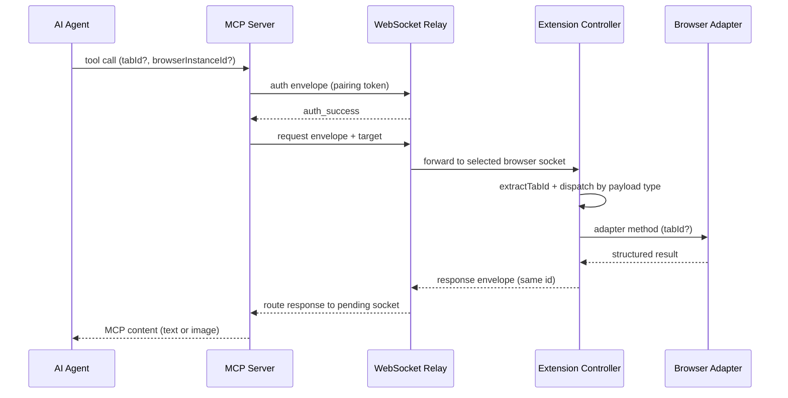

# MCP ↔ WebSocket ↔ Extension Flow

This page describes the runtime path Brijio uses to move an agent request from the MCP server to a browser tab and back. The agent talks to the MCP server; the MCP server opens a short-lived WebSocket connection to the relay, authenticates, and sends a single targeted envelope; the relay forwards it to the connected extension session; the extension's shared background controller dispatches it to a browser adapter; the adapter performs the tab-level work and returns a structured result that travels back through the same sockets.

## Canonical source files

MCP server tool sources (`servers/mcp/src/`):

- `mcp-server.ts` — tool registration, input schemas, and result shaping.
- `page-reading-tool.ts` — `read_current_page` (page context + paginated content).
- `navigate-to-url-tool.ts`, `open-tab-tool.ts` — navigation and tab creation.
- `click-element-tool.ts`, `fill-input-tool.ts`, `form-action-tools.ts` — element interactions.
- `batch-tool.ts` — multi-action batching.
- `list-tabs-tool.ts`, `browser-list-tool.ts` — tab and browser enumeration.
- `capture-screenshot-tool.ts` — viewport screenshot (returns image content).
- `download-file-tool.ts`, `download-status-tool.ts` — download initiation and status.
- `fetch-resource-tool.ts` — browser-session fetch.
- `page-actions.ts` — per-action helpers that normalize `browserInstanceId`/`tabId` defaults and call the WebSocket client.
- `page-context.ts` — page-context config and resource-index parsing.

MCP server transport and protocol:

- `servers/mcp/src/websocket-client.ts` — opens the relay socket, authenticates, sends the targeted envelope, and parses the routed response.
- `servers/mcp/src/protocol.ts` (~2195 lines) — the MCP server's local protocol module. It builds and parses relay envelopes (request/response/error shape helpers, `is*Envelope` predicates) and is separate from but aligned with `packages/shared/src/protocol.ts`, which the extension side imports. A change to tool inputs usually requires touching both protocol modules together.

Relay and extension side:

- `servers/websocket/src/server.ts` — the WebSocket relay: auth, presence table, browser selection, request forwarding, and response routing.
- `packages/shared/src/background-controller.ts` — the shared `BrijioBackgroundController` that the extension background layer instantiates. It receives forwarded envelopes, dispatches to adapter methods, and sends responses back over its socket.
- `packages/shared/src/page-reader.ts` — shared page-reading helpers used by both Chrome and Safari.
- `clients/extensions/chrome/src/background.ts` — Chrome adapters (page reader, actions, navigation, open tab, screenshot, downloads, tab listing).
- `clients/extensions/safari/src/background-entry.ts` — Safari adapters with the same surface.

## Request flow

1. An agent calls an MCP tool registered in `mcp-server.ts`.
2. The tool wrapper (`page-reading-tool.ts`, `page-actions.ts`, or a dedicated tool file) normalizes input, resolves `browserInstanceId`/`tabId` against `BrijioPageActionsConfig` defaults, and calls a `request*` function in `websocket-client.ts`.
3. `websocket-client.ts` opens a fresh WebSocket to the relay, authenticates with the pairing token, and — once authenticated — sends the request envelope. `targetEnvelope()` attaches `target: { browserInstanceId?, tabId? }` only when one is set, so the default active-tab path sends no target.
4. The relay (`servers/websocket/src/server.ts`) authenticates the MCP socket, looks up browser presence for the token scope, selects a browser by `target.browserInstanceId` (or errors on ambiguity / no browser), records the pending request id, and forwards the whole envelope to the selected extension socket.
5. The extension's `BrijioBackgroundController.handleSocketMessage` parses the envelope, calls `extractTabId(message)` to pull `target.tabId` (string → number), and dispatches by payload type to the matching adapter (`pageReader`, `pageActions`, `pageNavigation`, `pageOpenTab`, `pageScreenshot`, `tabLister`, `download`, `pageBatch`).
6. The Chrome or Safari adapter performs the tab-level work (content-script injection, `tabs.update`, `tabs.create`, `tabs.captureVisibleTab`, `downloads.download`, etc.) and returns a structured result.
7. The controller serializes the response (e.g. `createPageContextResponse`, `createScreenshotResponse`) and sends it back over its socket.
8. The relay matches the response id to the pending MCP socket and forwards it; `websocket-client.ts` parses it with the tool-specific `parse*` helper, closes the socket, and resolves the promise.
9. `mcp-server.ts` shapes the parsed result into MCP content and returns it to the agent.

The diagram above traces a normal action/reading request end to end.

## Tab targeting

`tabId` is threaded through the whole stack so the agent can act on a specific background tab without disturbing the active one.

- MCP tool wrappers accept a per-call `tabId` (zod `string().optional()`) alongside `browserInstanceId`; the `page-actions.ts` helpers pass `tabId ?? config.defaultTabId` into each `request*` call.
- `websocket-client.ts` carries `tabId` on the request options and `targetEnvelope()` injects it into `target.tabId` on the wire envelope.
- On the extension side, `BrijioBackgroundController` calls `extractTabId(message)` to read `target.tabId` (a string, parsed to a number) and forwards it to `pageReader.getPageContext(tabId)`, `pageActions.click(..., tabId)`, `pageNavigation.navigateToUrl(url, tabId)`, and `pageBatch.performBatch(message, tabId)`.
- The Chrome and Safari adapters use the provided tab id for content-script messaging and `tabs.update`-based navigation; when no tab id is supplied they fall back to the active tab.

When `tabId` is omitted the system stays backward compatible: `targetEnvelope` omits the target entirely and the extension operates on the active tab. `open_tab` is the exception — it creates a new tab and returns the new tab's id, so it does not accept `tabId`.

## Screenshot image content

`capture_screenshot` is the one tool whose result shape departs from the standard text-result flow. On success `mcp-server.ts` returns MCP **image** content (`{ type: 'image', data: result.data.dataBase64, mimeType: 'image/jpeg' }`) alongside a text part carrying the width, height, tab id, and capture timestamp. On failure it falls back to a normal text result with `isError: true`. The extension adapter captures the visible tab via `tabs.captureVisibleTab({ format: 'jpeg', quality: 80 })`, strips the `data:image/jpeg;base64,` prefix, and reports `capability_not_supported` for permission errors. See ADR 0064 for the rationale (viewport-only, JPEG, active tab).

## Protocol modules

There are two protocol modules that must stay aligned:

- `servers/mcp/src/protocol.ts` — the MCP server's local module (~2195 lines): envelope constructors (`create*Envelope`), response parsers (`parse*Envelope`, `parseRouterErrorEnvelope`), predicates, and the `WebSocketEnvelope`/`BrowserPresence`/`TabInfo` types the relay wire format depends on.
- `packages/shared/src/protocol.ts` — the shared module the extension imports: request/response type pairs, `is*Envelope` dispatch predicates, and response builders used by `BrijioBackgroundController`.

A change to a request field, response field, or payload type must be made in the module that owns that side and mirrored where the other side reads it.

## Why this exists

Brijio is designed around explicit, per-call requests rather than continuous browser mirroring. Each MCP tool call opens its own relay connection, performs one round trip, and closes. This keeps the browser local, keeps the extension reactive, makes a specific tab targetable, and preserves the core privacy model: no page content leaves the machine unless an agent explicitly requests it.

## What to watch for when editing this area

- Adding or changing a tool input usually requires updates in `mcp-server.ts`, the relevant tool file, `page-actions.ts`/`page-reading-tool.ts`, `websocket-client.ts`, both protocol modules, the background controller dispatch, and each extension adapter.
- Extension adapters must stay in sync with the shared `page-reader` and `background-controller` adapter interfaces.
- If a tool should work on a background tab, it must accept `tabId` and thread it through; do not assume the active tab.
- `capture_screenshot` returns image content, not text — preserve that when touching the result shaping.
- Tools that return approval-gated actions (`submit_form`, `download_file`, `fetch_resource`) carry an `actionUUID` and `approvalRequest` through the envelope; the controller consults the `ApprovalAdapter` before performing them.

## Related docs

- [Multi-tab workflow](../workflows/multi-tab.md)
- [ADR 0062 — Thread tabId through the action stack](../../docs/architecture/decisions/0062-thread-tabid-through-action-stack.md)
- [ADR 0063 — Open tab action](../../docs/architecture/decisions/0063-open-tab-action.md)
- [ADR 0064 — Visual action verification (screenshot)](../../docs/architecture/decisions/0064-visual-action-verification.md)
