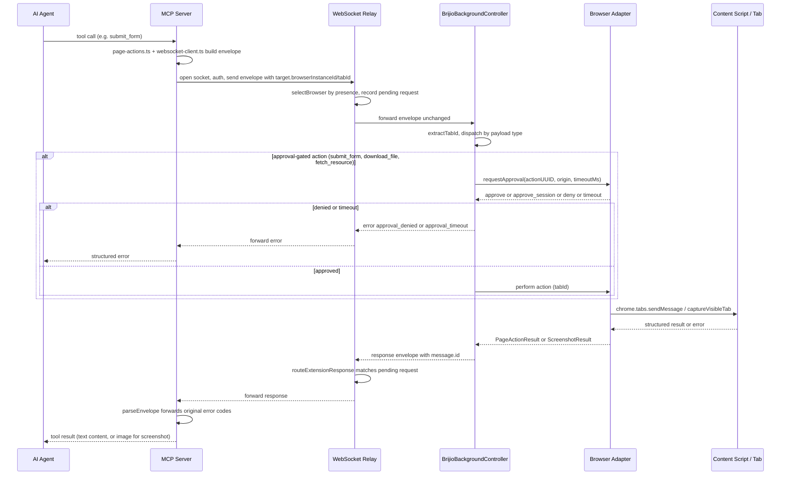

# MCP ↔ WebSocket ↔ Extension Flow

Brijio moves an agent request from an MCP tool call to a browser tab and back through a three-hop relay: the MCP server (`servers/mcp`), a stateless WebSocket relay (`servers/websocket`), and the browser extension's shared background controller (`packages/shared`). The browser stays local, the extension stays user-controlled, and the relay only routes envelopes between authenticated peers that share the same pairing token.

## Request flow

Every tool call follows the same path regardless of tool:

1. **Agent calls an MCP tool.** `createBrijioMcpServer` in `servers/mcp/src/mcp-server.ts` registers each tool with a Zod input schema and a handler that logs the call, delegates to a per-tool function, and returns the JSON-serialized result as MCP `text` content.
2. **The tool builds a protocol envelope.** Per-tool files (`click-element-tool.ts`, `page-reading-tool.ts`, etc.) normalize input and call into `servers/mcp/src/page-actions.ts` / `page-context.ts`, which call `servers/mcp/src/websocket-client.ts`. `requestBrijio` opens a fresh WebSocket, authenticates with the pairing token, and after `auth_success` sends the request envelope via `targetEnvelope`, which stamps `target: { browserInstanceId?, tabId? }` onto the message.
3. **The WebSocket server relays to the connected extension.** `servers/websocket/src/server.ts` authenticates each connection by pairing token, derives a `scopeKey` from the token hash, and tracks extension presence. `handleMcpMessage` selects a browser from the presence table (by `browserInstanceId`, or the single connected browser, or rejects with `ambiguous_browser_target`), records the pending request keyed by `scopeKey:requestId`, and forwards the full envelope unchanged to the extension's socket.
4. **The extension background hands the request to the shared controller.** `clients/extensions/chrome/src/background.ts` (and the Safari equivalent) construct a `BrijioBackgroundController` with browser-adapter implementations of the reader/action/navigation/batch/screenshot/download/approval/tab-listing interfaces. The controller's `handleSocketMessage` parses the envelope and dispatches by payload type.
5. **The controller dispatches to handlers and adapters.** Page-context/content, action, navigation, batch, screenshot, download, and fetch handlers each call the matching adapter, which performs tab-level work via `chrome.tabs`/content-script messages and returns a structured `{ ok, data | error }` result.
6. **The response relays back.** The controller sends the response envelope on its socket; `routeExtensionResponse` in the WS server matches it by `message.id` to the pending MCP socket and forwards it; `requestBrijio` parses the envelope (forwarding router and action errors per ADR 0061) and resolves the tool result back to the agent.

```mermaid
sequenceDiagram
    participant Agent as AI Agent
    participant MCP as MCP Server
    participant WS as WebSocket Relay
    participant Ctrl as BrijioBackgroundController
    participant Adapter as Browser Adapter
    participant Tab as Content Script / Tab

    Agent->>MCP: tool call (e.g. submit_form)
    MCP->>MCP: page-actions.ts + websocket-client.ts build envelope
    MCP->>WS: open socket, auth, send envelope with target.browserInstanceId/tabId
    WS->>WS: selectBrowser by presence, record pending request
    WS->>Ctrl: forward envelope unchanged
    Ctrl->>Ctrl: extractTabId, dispatch by payload type
    alt approval-gated action (submit_form, download_file, fetch_resource)
        Ctrl->>Adapter: requestApproval(actionUUID, origin, timeoutMs)
        Adapter-->>Ctrl: approve or approve_session or deny or timeout
        alt denied or timeout
            Ctrl-->>WS: error approval_denied or approval_timeout
            WS-->>MCP: forward error
            MCP-->>Agent: structured error
        else approved
            Ctrl->>Adapter: perform action (tabId)
        end
    end
    Adapter->>Tab: chrome.tabs.sendMessage / captureVisibleTab
    Tab-->>Adapter: structured result or error
    Adapter-->>Ctrl: PageActionResult or ScreenshotResult
    Ctrl-->>WS: response envelope with message.id
    WS->>WS: routeExtensionResponse matches pending request
    WS-->>MCP: forward response
    MCP->>MCP: parseEnvelope forwards original error codes
    MCP-->>Agent: tool result (text content, or image for screenshot)
```

The diagram above shows the request/response flow including the approval branch for gated actions.

## MCP tool surface

`createBrijioMcpServer` registers exactly 17 tools. Each tool's input schema includes optional `browserInstanceId` and `tabId` for targeting (except `open_tab`, which creates a new tab and therefore has no `tabId`). All results are returned as `text` JSON content except `capture_screenshot`, which returns MCP `image` content plus a text metadata block.

| Tool                 | Canonical source file                        | Notes                                                                          |
| -------------------- | -------------------------------------------- | ------------------------------------------------------------------------------ |
| `list_browsers`      | `servers/mcp/src/browser-list-tool.ts`       | Answered by the relay from its presence table, not forwarded to the extension. |
| `list_tabs`          | `servers/mcp/src/list-tabs-tool.ts`          | Forwarded to the extension's `tabLister` adapter.                              |
| `read_current_page`  | `servers/mcp/src/page-reading-tool.ts`       | Page context and optional content chunks.                                      |
| `click_element`      | `servers/mcp/src/click-element-tool.ts`      |                                                                                |
| `fill_input`         | `servers/mcp/src/fill-input-tool.ts`         |                                                                                |
| `fill_editable`      | `servers/mcp/src/form-action-tools.ts`       |                                                                                |
| `set_checked`        | `servers/mcp/src/form-action-tools.ts`       |                                                                                |
| `select_options`     | `servers/mcp/src/form-action-tools.ts`       |                                                                                |
| `upload_file`        | `servers/mcp/src/form-action-tools.ts`       |                                                                                |
| `submit_form`        | `servers/mcp/src/form-action-tools.ts`       | Approval-gated.                                                                |
| `navigate_to_url`    | `servers/mcp/src/navigate-to-url-tool.ts`    |                                                                                |
| `open_tab`           | `servers/mcp/src/open-tab-tool.ts`           | Returns the new `tabId` for subsequent targeting. No `tabId` input.            |
| `perform_batch`      | `servers/mcp/src/batch-tool.ts`              | 1–20 actions; approval-aware when a gated action is present.                   |
| `download_status`    | `servers/mcp/src/download-status-tool.ts`    | Capability `not_supported` on Safari.                                          |
| `download_file`      | `servers/mcp/src/download-file-tool.ts`      | Approval-gated. Fire-and-forget on Safari.                                     |
| `fetch_resource`     | `servers/mcp/src/fetch-resource-tool.ts`     | Approval-gated; uses browser session cookies.                                  |
| `capture_screenshot` | `servers/mcp/src/capture-screenshot-tool.ts` | JPEG viewport of the active tab (ADR 0064).                                    |

## Tab targeting

Tab targeting threads an optional per-call `tabId` through the entire stack so an agent can act on a background tab discovered via `list_tabs` rather than always operating on the active foreground tab (ADR 0062).

- **MCP tool wrappers** accept `tabId` in the Zod input schema. Per-tool files extract and normalize it and pass it to `page-actions.ts` / `page-context.ts`, which include it in the WebSocket request options.
- **`websocket-client.ts`** carries `tabId` on `PageContextRequestOptions` and stamps it into `envelope.target.tabId` via `targetEnvelope` (only added when `browserInstanceId` or `tabId` is present).
- **The WS server** forwards the full message envelope — including `target` — to the extension unchanged; it does not interpret `tabId`.
- **`BrijioBackgroundController.handleSocketMessage`** calls `extractTabId(message)`, which reads `message.target.tabId` as a string, parses it to an integer, and returns `undefined` when absent. The numeric `tabId` is forwarded to every handler and ultimately to the adapter interfaces.
- **Shared `page-reader.ts`** functions (`readActiveTabPage`, `performActiveTabAction`, `performActiveTabBatch`) use the provided `tabId` directly when present (`resolvedTabId = tabId`) and skip the `chrome.tabs.query({ active: true, currentWindow: true })` lookup. When `tabId` is `undefined`, they fall back to the active tab. `navigateActiveTabToUrl` in the Chrome background applies the same pattern: `chrome.tabs.update(tabId, { url })` when `tabId` is present, active-tab query otherwise.

This fallback preserves backward compatibility: callers that omit `tabId` continue to target the active tab unchanged. `open_tab` returns the new tab's ID so an agent can target it on subsequent calls.

## Stale-context and re-reading after navigation

Action targets use short-lived positional IDs (`bb-1`, `bb-2`, …) generated by `read_current_page`. To prevent silently acting on the wrong element, the content script validates targets against optional `expected*` fields and tracks page navigation (ADR 0036, ADR 0041):

- **`pageContextId`** is a monotonic counter in the content script's module scope, incremented on every `pageshow` event (full navigation, back/forward). `read_current_page` returns the current `pageContextId` under `data.context`.
- Action envelopes carry an optional `pageContextId` and `visibleContextId`. If the supplied `pageContextId` does not match the content script's current version, the action fails with `page_navigated` (the entire previous snapshot is stale — re-read). If validation fields mismatch but the page has not navigated, the action fails with `stale_context` (re-read and retry).
- After actions that navigate, an agent must call `read_current_page` again to obtain fresh IDs. `perform_batch` can set `readAfterActions: true` to have the controller append a fresh page-context read to the batch result.

## Action-approval gate

A small hardcoded set of browser-mutating operations require explicit user approval before they execute on the extension (ADR 0048): `submit_form`, `download_file`, and `fetch_resource`. Other actions (click, fill, set_checked, select_options, upload_file, navigate, screenshot) need no approval. The approval gate is a step within the normal request flow, not a separate feature.

- **Envelope metadata.** Approval-gated operations carry a unique `actionUUID` and `approvalRequest: true`. `websocket-client.ts` generates the `actionUUID` via `createApprovalRequestOptions` for single actions and via `addBatchActionApprovalMetadata` for every batch item (gated items also get `approvalRequest: true`).
- **In-memory state.** The `BrijioBackgroundController` holds approval state in the `approvalSessionGrants` set in background memory only — never in `localStorage`, extension storage, or IndexedDB. `approve_session` adds a grant keyed by `origin\u0000actionType` so subsequent gated actions of the same type from the same origin skip the prompt during the connection. Grants are cleared on `disconnect()`, extension reload, or session end.
- **Decision flow (`ensureApprovedAction`).** For a gated action with `approvalRequest: true`, the controller: resolves the active tab origin via `approval.getActiveOrigin()`; short-circuits with `{ ok: true }` if a session grant already exists; otherwise races `approval.requestApproval(request)` against a timeout (default 55s). Outcomes map to error codes: `approval_timeout` (hides the banner via `approval.hideApproval`), `approval_denied`, or `approval_origin_changed` (the active origin changed between approval and execution). An `approve_session` decision records the grant before execution proceeds.
- **Timeout budget.** `requestBrijio` uses `approvalTimeoutMs` for gated requests (falling back to `timeoutMs`) so the approval window can elapse before the MCP HTTP timeout.
- **Batch behavior.** `performApprovalAwareBatch` checks each action's approval in order. On `approval_timeout` the batch aborts and remaining actions are marked `approval_timeout` / skipped. Other approval failures become per-action errors; with `continueOnError` the batch continues, otherwise it aborts.

## Error forwarding

The MCP server forwards the original error code and message from the relay and extension to the agent rather than replacing them with generic messages (ADR 0061). Errors flow back `Extension → WS Server → MCP Server → Agent`.

- **Router-level errors.** `parseRouterErrorEnvelope` in `servers/mcp/src/protocol.ts` forwards any string `code` and `message` from `{ type: 'error', error: { code, message } }` envelopes. It no longer validates the code against the MCP server's local `BrijioErrorCode` union, so relay codes like `invalid_message` and `invalid_json` reach the agent instead of being collapsed to `invalid_response`. Only structurally malformed envelopes fall back to `invalidResponse()`.
- **Action-level errors.** `parseErrorPayload` preserves `stale_context` and `page_navigated` with their structured `detail`, and forwards any other string code (e.g. `not_supported`, `cors_blocked`, `http_error`, `size_exceeded`) instead of wrapping it as `browser_error`.
- **Sync invariant.** The relay and extension use `packages/shared/src/protocol.ts`'s `BrijioErrorCode` union, while the MCP server keeps its own `BrijioErrorCode` in `servers/mcp/src/protocol.ts` for constructing local responses. Because forwarding is now passthrough and result error `code` is typed as `string` (see `BrijioResourceResult` / `BrijioToolErrorCode`), the two unions need not enumerate identical codes — but they must be kept coherent so local constructors emit codes the agent can still understand. `BrijioToolErrorCode` in `servers/mcp/src/page-reading-tool.ts` is already `string`, accepting arbitrary codes the extension may emit.

## WebSocket relay and session scoping

The relay authenticates each connection by pairing token and scopes all routing by the token hash (`scopeKey`). Two roles connect: `mcp` clients (short-lived, one per tool invocation) and `extension` clients (long-lived, one per browser).

- **Presence.** After authenticating as `extension`, the relay sends a presence-request and the extension announces itself with `browser_presence_announce` carrying `browserInstanceId`, label, browser/profile names, and capabilities. The relay stores this in a `presence` map keyed by `scopeKey:browserInstanceId`.
- **`list_browsers`** is answered directly by the relay from the presence table (filtered by `scopeKey` and open sockets); it is never forwarded to an extension.
- **`list_tabs` and all action/read requests** go through `selectBrowser`: by `browserInstanceId` when provided, the single connected browser, or `ambiguous_browser_target` / `browser_unavailable` errors. The relay records the pending MCP socket keyed by `scopeKey:requestId`, then forwards the envelope to the extension socket. When the extension responds with a matching `message.id`, `routeExtensionResponse` looks up and forwards the response to the waiting MCP socket and deletes the pending entry.
- **Cleanup.** On socket close the relay drops the presence record and cleans up any pending requests owned by that socket.

## Editing guidance

When changing this area, several files must move together:

- **Tool input changes** usually require updates in `servers/mcp/src/protocol.ts` (envelope constructors/parsers) and the shared `packages/shared/src/background-controller.ts` adapter interfaces and dispatch together. A new field accepted by the MCP schema but ignored by the controller becomes a silent no-op.
- **Extension adapters** must stay in sync with shared `page-reader.ts` / `content-handler.ts` behavior. The Chrome and Safari background scripts both wire the shared adapter functions (`readActiveTabPage`, `performActiveTabAction`, `performActiveTabBatch`, `navigateActiveTabToUrl`) and must forward `tabId` to them.
- **Background-tab tools** must accept `tabId` and not assume the active tab. If a tool should work against a background tab, thread `tabId` through `page-actions.ts` → `websocket-client.ts` (`target.tabId`) → `extractTabId` → the adapter; otherwise it silently targets the foreground tab.
- **New error codes** added to the extension or relay are forwarded automatically by `parseRouterErrorEnvelope` and `parseErrorPayload` as long as they are string codes; only local MCP constructors draw from `BrijioErrorCode`. Keep `packages/shared/src/protocol.ts` and `servers/mcp/src/protocol.ts` coherent when adding codes the agent should distinguish.
- **New approval-gated actions** must be added to `getApprovalActionType` and the envelope must carry `actionUUID` + `approvalRequest`; the controller's `ensureApprovedAction` handles the rest.

## Related docs

- [Multi-tab workflow](../workflows/multi-tab.md)
- [Architecture overview](../architecture.md)
- [Data and protocol](../data-and-protocol.md)
- [Security](../security.md)
- [ADR 0036 — Stale context validation](../../docs/architecture/decisions/0036-stale-context-validation.md)
- [ADR 0041 — Reliable target identity and stale-target handling](../../docs/architecture/decisions/0041-reliable-target-identity-and-stale-target-handling.md)
- [ADR 0048 — Client-side action approval](../../docs/architecture/decisions/0048-client-side-action-approval.md)
- [ADR 0061 — Forward error codes through MCP](../../docs/architecture/decisions/0061-forward-error-codes-through-mcp.md)
- [ADR 0062 — Thread tabId through the action stack](../../docs/architecture/decisions/0062-thread-tabid-through-action-stack.md)
- [ADR 0064 — Visual action verification (screenshot)](../../docs/architecture/decisions/0064-visual-action-verification.md)
