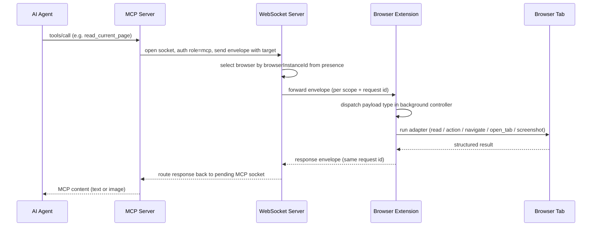
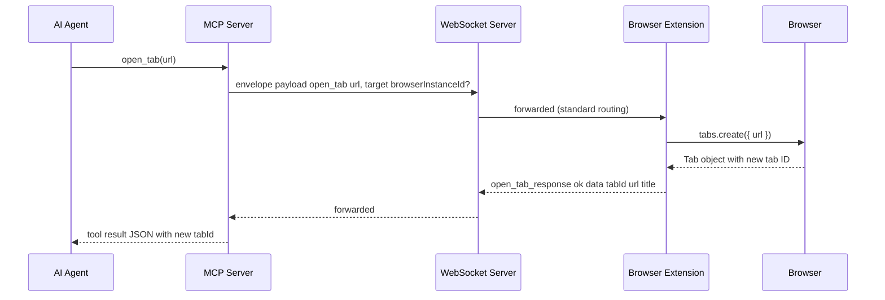
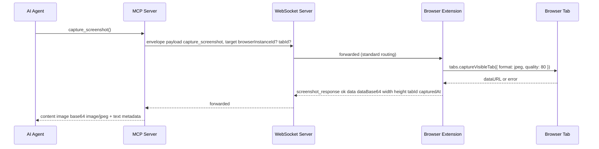

# MCP ↔ WebSocket ↔ Extension Flow

This page describes the runtime path Brijio uses to move an agent request from the MCP server to a browser tab and back. Brijio is built around explicit, request/response tool calls rather than a continuously mirrored browser view, so every browser read or action is one round trip through the chain below. The browser remains the source of truth; the extension only answers requests it receives.

## The four layers

Each layer has a single owner and a narrow responsibility. A tool call crosses all of them exactly once.

| Layer                | Owner                                                                                                                  | Responsibility in this flow                                                                                                             |
| -------------------- | ---------------------------------------------------------------------------------------------------------------------- | --------------------------------------------------------------------------------------------------------------------------------------- |
| MCP server           | `servers/mcp/src/mcp-server.ts`                                                                                        | Exposes tools to the agent, validates inputs, builds protocol envelopes, and converts extension responses back into MCP content.        |
| WebSocket relay      | `servers/websocket/src/server.ts`                                                                                      | Authenticates both peers, tracks browser presence, selects the target browser, and forwards request/response envelopes by request ID.   |
| Extension background | `packages/shared/src/background-controller.ts` (dispatch) + per-browser `background.ts`/`background-entry.ts` adapters | Receives envelopes, dispatches by payload type, runs the adapter, and sends the response envelope.                                      |
| Shared browser logic | `packages/shared/src/page-reader.ts`                                                                                   | Browser-agnostic active-tab read/action helpers that resolve a `tabId` (or fall back to the active tab) and talk to the content script. |

The MCP side does not open a long-lived socket to the relay. For each tool call, `servers/mcp/src/websocket-client.ts` (`requestBrijio`) opens a fresh WebSocket to the relay, authenticates with the pairing token, sends the envelope, waits for the matching response (or a timeout), and closes the socket. The extension side, by contrast, holds one persistent WebSocket owned by `BrijioBackgroundController` and re-announces presence on reconnect.

## Canonical source files

Refresh the list below when a new tool or adapter is added; tool input changes usually require coordinated edits in more than one file (see Editing guidance).

- `servers/mcp/src/mcp-server.ts` — tool/resource registration and MCP content assembly.
- `servers/mcp/src/page-actions.ts` — server-side wrappers that call the WebSocket client and apply per-call `browserInstanceId`/`tabId`.
- `servers/mcp/src/websocket-client.ts` — `requestBrijio` relay round trip and per-tool envelope builders/parsers.
- `servers/mcp/src/page-reading-tool.ts` — `read_current_page` tool.
- `servers/mcp/src/navigate-to-url-tool.ts` — `navigate_to_url` tool.
- `servers/mcp/src/open-tab-tool.ts` — `open_tab` tool (ADR 0063).
- `servers/mcp/src/capture-screenshot-tool.ts` — `capture_screenshot` tool (ADR 0064).
- `servers/mcp/src/batch-tool.ts` — `perform_batch` tool.
- `servers/mcp/src/form-action-tools.ts` — form action tools (fill, set_checked, select_options, submit_form, upload_file, fill_editable).
- `servers/mcp/src/protocol.ts` — MCP-side envelope builders/parsers and result types.
- `servers/websocket/src/server.ts` — relay: auth, presence, forwarding.
- `packages/shared/src/protocol.ts` — canonical message/data shapes and `isOpenTabEnvelope`, `isCaptureScreenshotEnvelope`, response builders used by the extension.
- `packages/shared/src/background-controller.ts` — extension-side dispatch and adapter interfaces.
- `packages/shared/src/page-reader.ts` — shared active-tab read/action helpers.
- `clients/extensions/chrome/src/background.ts` — Chrome adapters and controller wiring.
- `clients/extensions/safari/src/background-entry.ts` — Safari adapters and controller wiring.

## Request flow

```mermaid
sequenceDiagram
    participant Agent as AI Agent
    participant MCP as MCP Server
    participant WS as WebSocket Server
    participant Ext as Browser Extension
    participant Tab as Browser Tab

    Agent->>MCP: tools/call (e.g. read_current_page)
    MCP->>WS: open socket, auth role=mcp, send envelope with target
    WS->>WS: select browser by browserInstanceId from presence
    WS->>Ext: forward envelope (per scope + request id)
    Ext->>Ext: dispatch payload type in background controller
    Ext->>Tab: run adapter (read / action / navigate / open_tab / screenshot)
    Tab-->>Ext: structured result
    Ext-->>WS: response envelope (same request id)
    WS-->>MCP: route response back to pending MCP socket
    MCP-->>Agent: MCP content (text or image)
```

Caption: One tool call is one synchronous round trip. The relay pairs the extension response back to the requesting MCP socket by request ID; the MCP socket then closes.

1. The agent calls an MCP tool (`mcp-server.ts` registers each tool with its Zod input schema).
2. The tool validates input, then calls a server-side wrapper in `page-actions.ts`, which calls a per-tool request function in `websocket-client.ts`.
3. `requestBrijio` opens a WebSocket to the relay, sends an `auth` envelope, and after `auth_success` sends the tool envelope (with an optional `target` carrying `browserInstanceId`/`tabId`).
4. The relay (`servers/websocket/src/server.ts`) authenticates the MCP peer, selects a browser from its per-scope presence table, records the pending request keyed by `scope:requestId`, and forwards the envelope to that extension's socket.
5. The extension's `BrijioBackgroundController.handleSocketMessage` parses the envelope, extracts `tabId`, and dispatches by payload type (`get_page_context`, `get_page_content`, `perform_action`, `perform_batch`, `navigate_to_url`, `open_tab`, `capture_screenshot`, `list_tabs`, downloads, fetch).
6. The controller calls the matching adapter, which performs tab-level work through the browser API and/or content script and returns a structured result.
7. The controller sends the response envelope (same request ID) back over the persistent socket.
8. The relay's `routeExtensionResponse` looks up the pending MCP socket by `scope:requestId`, forwards the response, and deletes the pending entry. The MCP client parses it and resolves the tool promise.

## Browser selection and request routing

The relay does not interpret tool payloads (except `list_browsers`, which it answers directly from presence). For all other messages it:

- Selects a browser record scoped to the same pairing token (`scopeKey`). If `target.browserInstanceId` is set, it matches that exact browser; otherwise a single online browser is auto-selected, while multiple online browsers return `ambiguous_browser_target`.
- Returns `browser_unavailable` when no matching browser is online.
- Keys pending requests by `scopeKey:requestId` so an extension response with the same ID is routed back to exactly the MCP socket that sent it. On socket close, pending requests for that socket are cleaned up.

`list_tabs` is forwarded to the extension like any other tool (the relay only logs it); the extension answers with a `tab_list_response`.

## Tab targeting

Tab ID threading (ADR 0062) lets the agent target a specific existing tab rather than always assuming the active one.

- MCP tool wrappers accept an optional per-call `tabId` (Zod `tabIdInput`) and include it in the envelope `target`. `requestBrijio` only adds a `target` block when `browserInstanceId` and/or `tabId` are present, so requests without a target stay minimal.
- The shared read/action helpers in `page-reader.ts` (`readActiveTabPage`, `performActiveTabAction`) accept `tabId?: number` and **prefer it over the active-tab lookup** when present. When omitted they fall back to `tabs.query({ active: true, currentWindow: true })`, preserving backward compatibility.
- The extension background controller extracts `tabId` from the envelope `target` once (`extractTabId`) and threads that numeric ID into the page-reader, page-action, batch, and navigation handlers.
- Chrome and Safari adapters both accept the resolved numeric `tabId` and use it for reads, actions, and navigation.

`open_tab` and `capture_screenshot` are the exceptions to this threading (see below): `open_tab` creates a tab and returns its new ID; `capture_screenshot` captures the active tab's viewport.

## open_tab flow (ADR 0063)

`open_tab(url)` lets the agent create a new tab instead of navigating the current one away (which would destroy form state) or using `fetch_resource` (which cannot render JavaScript).

```mermaid
sequenceDiagram
    participant Agent as AI Agent
    participant MCP as MCP Server
    participant WS as WebSocket Server
    participant Ext as Browser Extension
    participant Browser as Browser

    Agent->>MCP: open_tab(url)
    MCP->>WS: envelope payload open_tab url, target browserInstanceId?
    WS->>Ext: forwarded (standard routing)
    Ext->>Browser: tabs.create({ url })
    Browser-->>Ext: Tab object with new tab ID
    Ext-->>WS: open_tab_response ok data tabId url title
    WS-->>MCP: forwarded
    MCP-->>Agent: tool result JSON with new tabId
```

Caption: `open_tab` is tab-creating, so it ignores `tabId` and returns the new tab's ID for subsequent targeting.

- MCP tool (`servers/mcp/src/open-tab-tool.ts`) validates that `url` is a non-empty HTTP/HTTPS string and forwards only `url` + optional `browserInstanceId`. It deliberately does **not** accept `tabId` because it creates a new tab.
- The relay forwards the `open_tab` envelope to the selected extension.
- The controller's `handleOpenTabRequest` calls `pageOpenTab.openTab(url)`. If no `pageOpenTab` adapter is configured it returns a `not_supported` `open_tab_response`.
- The Chrome adapter (`clients/extensions/chrome/src/background.ts`) calls `chrome.tabs.create({ url })` and returns `{ tabId: String(tab.id), url, title }`. The Safari adapter (`clients/extensions/safari/src/background-entry.ts`) does the same via `browser.tabs.create({ url })`.
- The response (`open_tab_response` with `ok`/`data`) is built by `packages/shared/src/protocol.ts` (`createOpenTabResponse`/`createOpenTabErrorResponse`) and parsed on the MCP side by `parseOpenTabEnvelope`.
- The returned `tabId` is the raw browser tab ID as a string; the agent uses it with `read_current_page` or other tools to target the new tab. No tab ownership/close tracking exists yet (deferred to P2.5).

## capture_screenshot flow (ADR 0064)

`capture_screenshot` returns a JPEG image of the **active tab's viewport** only. It is the one tool that returns MCP image content rather than JSON text.

```mermaid
sequenceDiagram
    participant Agent as AI Agent
    participant MCP as MCP Server
    participant WS as WebSocket Server
    participant Ext as Browser Extension
    participant Browser as Browser Tab

    Agent->>MCP: capture_screenshot()
    MCP->>WS: envelope payload capture_screenshot, target browserInstanceId? tabId?
    WS->>Ext: forwarded (standard routing)
    Ext->>Browser: tabs.captureVisibleTab({ format: jpeg, quality: 80 })
    Browser-->>Ext: dataURL or error
    Ext-->>WS: screenshot_response ok data dataBase64 width height tabId capturedAt
    WS-->>MCP: forwarded
    MCP-->>Agent: content image base64 image/jpeg + text metadata
```

Caption: For P3.3 the screenshot is viewport-only and active-tab-only; a background tab would require switching focus, so the agent is expected to `open_tab` for a dedicated capture.

- The MCP tool (`servers/mcp/src/capture-screenshot-tool.ts`) accepts optional `browserInstanceId` and `tabId` (the `tabId` is normalized but the active-tab capture API ignores it) and calls `captureScreenshot` in `page-actions.ts`.
- `requestCaptureScreenshot` builds a `capture_screenshot` envelope and parses the reply with `parseScreenshotEnvelope` (expects `screenshot_response`).
- The controller's `handleScreenshotRequest` returns `capability_not_supported` when no `pageScreenshot` adapter is configured, otherwise calls `pageScreenshot.captureScreenshot()`.
- Both adapters (`clients/extensions/chrome/src/background.ts` and `clients/extensions/safari/src/background-entry.ts`) query the active tab for its ID, call `tabs.captureVisibleTab(undefined, { format: 'jpeg', quality: 80 })`, strip the `data:image/jpeg;base64,` prefix, and return `{ dataBase64, width, height, tabId, capturedAt }`. Dimensions are returned as `0` from the adapter today (real dimensions are not decoded at capture time).
- The controller wraps the result with `createScreenshotResponse` (or `createScreenshotErrorResponse` with `capability_not_supported` / `capture_failed`).
- On success the MCP server returns two content items: an `image` block (`data`, `mimeType: 'image/jpeg'`) and a `text` block with `width`, `height`, `tabId`, and `capturedAt`. On error it returns the JSON error with `isError: true`.

## Tool result assembly

Most tools return a single `text` content item containing the JSON result. Two tools differ:

- `capture_screenshot` returns MCP `image` content (base64 JPEG) plus a metadata `text` block, and sets `isError: true` on failure.
- Tools whose result is a resource (e.g. `read_current_page`) serialize the structured page context as JSON text.

Error codes from the extension are forwarded through the relay unchanged (ADR 0061); the MCP layer does not rewrite browser/relay errors into generic failures, so agents can distinguish `browser_unavailable`, `no_active_tab`, `stale_context`, `capability_not_supported`, etc.

## Why this exists

Brijio is designed around explicit requests rather than continuous browser mirroring. This flow keeps the browser local, keeps the extension reactive, and makes it possible to target a specific tab or open a new one without changing the core privacy model: no agent-owned browser, no exported cookies, and no background feed of page state.

## Editing guidance

- A tool input change usually requires coordinated updates in `servers/mcp/src/protocol.ts` (or `packages/shared/src/protocol.ts`) **and** the background controller together: the envelope shape, the type guard, and the response builder must all stay aligned.
- Extension adapters must stay in sync with the shared `page-reader.ts` behavior. When you add a new browser capability, add an optional adapter interface on the controller (e.g. `pageOpenTab`, `pageScreenshot`) and implement it in **both** `clients/extensions/chrome/src/background.ts` and `clients/extensions/safari/src/background-entry.ts` in the same change.
- If a tool should work on a background tab, it must accept `tabId`, thread it through `target.tabId`, and let the shared helpers prefer it over the active-tab lookup. The screenshot tool is the documented exception: `captureVisibleTab` is active-tab-only by API constraint.
- `open_tab` must not accept `tabId` (it creates a tab) and must return the new tab's ID so subsequent calls can target it.

## Related docs

- [Architecture Overview](../architecture.md)
- [Multi-tab workflow](../workflows/multi-tab.md)
- [ADR 0062: Thread tabId through the action stack](../../docs/architecture/decisions/0062-thread-tabid-through-action-stack.md)
- [ADR 0063: Open Tab Action](../../docs/architecture/decisions/0063-open-tab-action.md)
- [ADR 0064: Visual Action Verification — Screenshot Tool](../../docs/architecture/decisions/0064-visual-action-verification.md)
