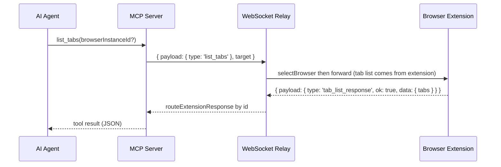
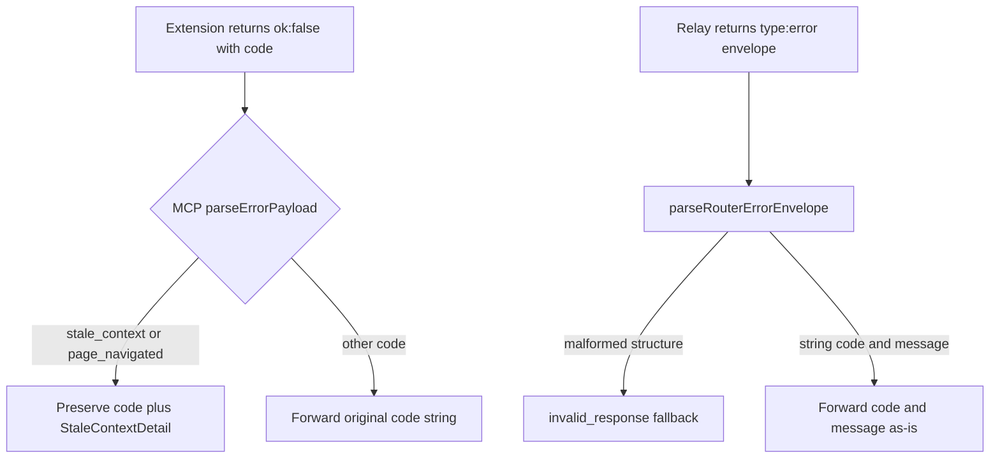

# Protocol and Data Model Guide

This page is the canonical OpenWiki home for the shared data structures and protocol shapes that flow between the AI agent, the MCP server, the WebSocket relay, and the browser extensions. `packages/shared/src/protocol.ts` is the **source of truth** for these shapes; the relay and MCP server consume it rather than redefining it.

## Source of truth and the no-duplication rule

Protocol definitions live only in `packages/shared/src/protocol.ts` (re-exported by `packages/shared/src/index.ts`). The two server-side modules are deliberately thin:

- `servers/mcp/src/protocol.ts` is the MCP-side wrapper. It defines MCP-specific result/parse types (`BrijioResourceResult`, `BrijioToolResult`, the per-response `parse*Envelope` functions) but does **not** redefine the wire envelope or the shared payloads. It still declares local `TabInfo`, `WebSocketEnvelope`, and `BrowserPresence` interfaces that mirror the shared shapes, and emits its own `BrijioErrorCode` union only for internal result constructors.
- `servers/websocket/src/protocol.ts` is a thin relay-facing module. It re-exports the shared `createAuthSuccessEnvelope`, `createBrowserPresenceRequestEnvelope`, `createErrorEnvelope`, `isAuthPayload`, `isBrowserPresenceAnnouncePayload`, `parseBrijioEnvelope`, and the `BrijioEnvelope`, `BrowserPresence`, `BrowserPresenceAnnouncePayload`, `BrijioRole` types, and adds one relay-local helper `createScopeKey` (a SHA-256 of the pairing token used to namespace presence and pending requests).

When a shape changes here, the relay, the MCP server, and both extensions must move together; changing the wire shape without updating all of them will usually break interoperability.

## The canonical envelope

The main message envelope used across the relay and browser clients is `WebSocketEnvelope` (aliased as `BrijioEnvelope`):

```ts
interface WebSocketEnvelope {
  type: "message";
  id?: string;
  target?: { browserInstanceId?: string; tabId?: string };
  payload: unknown;
}
```

Key properties:

- `type` is always `'message'` on the wire. Errors use a separate `BrijioErrorEnvelope` with `type: 'error'` (see [Forwarded error codes](#forwarded-error-codes)).
- `id` is the request id used for request/response correlation. The relay keys pending requests by `scopeKey:requestId` so it can route the extension's response back to the requesting MCP socket.
- `target` carries routing: `browserInstanceId` selects which connected extension handles the call, and `tabId` selects which tab inside that browser. **Targeting is per-call and explicit.** There is no hidden session-level "selected tab" or "selected browser" state — consistent with how `browserInstanceId` already worked.
- `payload` is the typed command or response (`get_page_context`, `perform_action`, `list_tabs`, `tab_list_response`, `batch_result`, `download_status`, `capture_screenshot`, …).

`parseBrijioEnvelope(rawMessage)` is the entry point on the relay: it JSON-parses and structurally validates the envelope, returning `{ ok: false, error: BrijioErrorEnvelope }` with code `invalid_json` (parse failure) or `invalid_message` (not `{ type: 'message', payload }`) instead of a thrown exception.

The protocol also defines the auth and presence payloads that bootstrap a connection:

- `BrijioRole` — `'extension' | 'mcp'`, used in `AuthPayload`.
- `AuthPayload` / `AuthSuccessPayload` — the unauthenticated client sends `{ type: 'auth', role, token }`; the relay replies `{ type: 'auth_success' }`.
- `BrowserPresenceRequestPayload` / `BrowserPresenceAnnouncePayload` — after an extension authenticates, the relay requests presence with `browser_presence_request`; the extension announces `browser_presence_announce` carrying its `BrowserPresence` fields. The relay stores this in its presence table and uses it to answer `list_browsers`.

## Browser presence and capabilities

`BrowserPresence` is a browser instance's identity and advertised feature set:

```ts
interface BrowserPresence {
  browserInstanceId: string;
  label: string;
  browserName: string;
  profileName: string;
  connectedAt?: string;
  lastSeenAt?: string;
  capabilities: BrowserCapability[];
}
```

`BrowserCapability` is the union of named browser features the extension advertises. The complete list, in source order, is:

`page_context`, `page_content`, `click`, `fill_input`, `fill_editable`, `set_checked`, `select_options`, `submit_form`, `navigate`, `batch`, `upload_file`, `download_status`, `download_file`, `fetch_resource`, `screenshot`

Note that this includes both `screenshot` and `fetch_resource` (added by the screenshot and download/fetch work). `isBrowserPresenceAnnouncePayload` validates the announce payload and uses `isBrowserCapability` to ensure every advertised capability is a member of this union. The relay surfaces presence via `list_browsers`, which it answers directly from its presence table (no extension round-trip).

## Tab listing and tab targeting

Tab-awareness primitives (ADR 0060) add multi-tab targeting within a single browser:

```ts
interface TabInfo {
  tabId: string; // opaque, raw Chrome/Safari tab ID as string
  windowId: string; // opaque, raw Chrome/Safari window ID as string
  title: string;
  url: string; // full URL, HTTP/HTTPS only
  active: boolean; // user's currently focused tab
  supported: boolean; // eligible for Brijio actions (always true for listed tabs)
}
```

The `tabId` and `windowId` fields are **opaque** — the raw Chrome/Safari integer IDs exposed as strings. ADR 0060 notes the `string` type is intentional so the cloud model can later alias these to opaque UUIDs without a protocol change.

Request/response payloads:

- `ListTabsRequestPayload` — `{ type: 'list_tabs' }`.
- `TabListResponsePayload` — `{ type: 'tab_list_response', ok: true, data: { tabs: TabInfo[] } }`.
- `TabListErrorResponsePayload` — `{ type: 'tab_list_response', ok: false, error: { code, message } }`.

The MCP side adds `BrijioTabListResult = BrijioResourceResult<{ tabs: TabInfo[] }>` and `parseTabListEnvelope`, mirroring the existing `parseBrowserListEnvelope` / `BrijioBrowserListResult` pattern.

### How `list_tabs` and `tabId` routing differ

`list_tabs` and `list_browsers` look symmetric but route differently on the relay:



The relay answers `list_browsers` **itself** from its presence table. By contrast `list_tabs` is **forwarded** to the selected extension through the normal `selectBrowser` + `sendJson` path; `isListTabsMessage` only logs the request before forwarding. The extension enumerates tabs via `tabs.query({})`, filters to regular HTTP/HTTPS pages (excluding `chrome://`, `chrome-extension://`, `about:`, `file://`, `safari://`, and incognito), and returns the `tab_list_response`, which the relay routes back by `requestId`.

`tabId` targeting rides on the envelope `target.tabId`. Every tab-operating tool gains an optional `tabId` input; when omitted, behaviour is unchanged (the active tab is used). The relay already resolves `browserInstanceId` to the right extension and passes `tabId` through unchanged — the extension resolves the opaque id to a real Chrome/Safari tab. There is deliberately **no** `select_tab` session-level default; per-call targeting is stateless, consistent with `browserInstanceId`.

## Actions, approval metadata, and batch

Browser actions flow as a `PerformActionRequest` (`type: 'perform_action'`) carrying an `action` union. Each action extends `ApprovalMetadata`:

```ts
interface ApprovalMetadata {
  actionUUID?: string;
  approvalRequest?: boolean;
}
```

`actionUUID` and `approvalRequest` gate approval-required operations. `hasValidApprovalMetadata` validates them when present (`actionUUID` must be a non-empty string, `approvalRequest` must be boolean) and they are threaded through the action stack so an approval banner can be keyed to the specific action. The action union is `PerformClickAction | PerformWriteTextAction | PerformSetCheckedAction | PerformSelectOptionsAction | PerformSubmitFormAction | PerformUploadFileAction`, all extending `ApprovalMetadata`.

Batch (ADR 0044) wraps an array of those same actions:

```ts
interface PerformBatchRequest {
  type: "perform_batch";
  pageContextId?: number;
  visibleContextId?: string;
  actions: BatchAction[]; // 1..BATCH_MAX_ACTIONS (20)
  continueOnError?: boolean;
  readAfterActions?: boolean;
}
```

`BATCH_MAX_ACTIONS = 20` is enforced by `isPerformBatchEnvelope`, which rejects empty or over-long arrays and validates every entry via `isBatchAction`. `continueOnError` lets later actions run after a failure; `readAfterActions` appends a fresh `PageContext` as the final `BatchResultEntry`. The batch result is `BatchResultResponse` (`type: 'batch_result'`, with `results: BatchResultEntry[]` and `aborted`), or a batch-level `BatchResultErrorResponse`. The MCP `parseBatchResultEnvelope` reassembles per-entry outcomes and maps `page_navigated` to `stale_context` via `mapBatchErrorCode` while preserving other action codes.

## File uploads, download, and fetch

### Staged file upload

Staged uploads are a chunked start/chunk/complete/ack/error flow:

- `StageFileUploadStartPayload` (`stage_file_upload_start`) opens an `uploadId` with file metadata (`name`, `size`, optional `type`/`sha256`), `chunkSize`, and `totalChunks`.
- `StageFileUploadChunkPayload` (`stage_file_upload_chunk`) carries `index` and base64 `dataBase64` chunks.
- `StageFileUploadCompletePayload` (`stage_file_upload_complete`) finalizes with optional `sha256`.
- `StageFileUploadStagedPayload` (`stage_file_upload_staged`) and `StageFileUploadAckPayload` (`stage_file_upload_ack`) complete the handshake.
- `StageFileUploadErrorPayload` (`stage_file_upload_error`) carries a closed error code union: `invalid_file_payload | checksum_mismatch | file_too_large | invalid_file_name | invalid_file_type | upload_expired`.

### Download and fetch status (ADR 0047)

`DownloadInfo` and `FetchResourceInfo` describe tracked transfers. `DownloadStatusRequest` / `DownloadStatusResponse` / `DownloadStatusErrorResponse` query their state; `DownloadStatusResponse` reports a `capability` of `'full' | 'not_supported'` plus an `items` array of `DownloadInfo | FetchResourceInfo`.

`DownloadFileRequest` (extends `ApprovalMetadata`, `download_file`) initiates a browser download and returns `DownloadFileResponse` with `downloadId` and a `status` of `'initiated' | 'initiated_fire_and_forget'`. `FetchResourceRequest` (extends `ApprovalMetadata`, `fetch_resource`) starts a **streaming** fetch: the extension emits `FetchResourceStartResponse`, one or more `FetchResourceChunkResponse` messages, then `FetchResourceCompleteResponse` (with `sha256`, `totalBytes`, optional final `dataBase64`), or `FetchResourceErrorResponse` (`{ fetchId?, error, httpStatus?, message }`). `FetchResourceStreamMessage` is the union of those four. The MCP `parseFetchResourceEnvelope` reassembles the stream and, on `fetch_resource_error`, returns a composite `code: 'browser_error'` with message `fetch_resource_error:{errorCode}: {message}` — the one deliberate exception to the otherwise pass-through error model.

### Screenshot (ADR 0064)

`CaptureScreenshotRequest` (`capture_screenshot`) returns `CaptureScreenshotResponse` (`screenshot_response`, `ok: true`, `data: { dataBase64, width, height, tabId, capturedAt }`) or `CaptureScreenshotErrorResponse` with a `ScreenshotErrorCode` of `capability_not_supported | capture_failed | no_visible_tab | timeout`. The `screenshot` capability gates it.

`ExtensionResponse` is the union of all extension response payloads (`PageContextResponse`, `ActionResultResponse`, `BatchResultResponse`, `DownloadStatusResponse`, `FetchResourceStreamMessage`, `CaptureScreenshotResponse`, and their error counterparts), used by the shared `createEnvelope`/`create*Response` helpers.

## Forwarded error codes

Two error shapes cross the system. **Action-level** errors come back inside an extension response payload as `{ ok: false, error: { code, message, actionUUID?, detail? } }` (e.g. `ActionResultErrorResponse`, `PageContextErrorResponse`). **Router-level** errors use a top-level `BrijioErrorEnvelope`:

```ts
interface BrijioErrorEnvelope {
  type: "error";
  error: {
    code: BrijioErrorCode;
    message: string;
    browsers?: BrowserPresence[];
  };
}
```

The shared `BrijioErrorCode` union is the set the relay and extension emit, including `invalid_json`, `invalid_message`, `auth_required`, `auth_failed`, `invalid_auth_message`, `browser_unavailable`, `ambiguous_browser_target`, `invalid_browser_target`, `timeout`, `unsupported_action`, `batch_failed`, the upload codes, `upload_staging_failed`, `upload_not_staged`, `target_not_file_input`, `upload_expired`, `download_not_found`, and `fetch_resource_failed`.

ADR 0061 establishes the **forwarding model**: structured errors with `code` + `message` flow back through the relay to the agent unchanged, rather than being flattened by the MCP server. Two MCP parsers implement it:

- `parseRouterErrorEnvelope` accepts any `{ type: 'error', error: { code, message } }` envelope and forwards the string `code` and `message` as-is, only falling back to `invalid_response` when the envelope structure itself is malformed. This stops unrecognized relay codes (e.g. `invalid_message`, `invalid_json`) from being replaced with a generic "Received an invalid Brijio response."
- `parseErrorPayload` preserves `stale_context` and `page_navigated` with their structured `StaleContextDetail`, and forwards every other extension error `code` string instead of wrapping it as `browser_error`. The original message is always preserved.

Because the extension and relay may emit codes the MCP server does not know, the MCP result types were relaxed: `BrijioResourceResult<T>` and `BrijioToolResult<T>` use `code: string` (via `BrijioToolErrorCode = string`), and the MCP server keeps its own `BrijioErrorCode` union only for internal result constructors (e.g. `timeoutResponse`, `connectionFailedResponse`). Agents must therefore handle arbitrary string error codes and should key off the `message` for human-readable detail.



The diagram above shows how action-level and router-level errors are forwarded rather than flattened, per ADR 0061.

## Related source files and decisions

- `packages/shared/src/protocol.ts` — source of truth for envelope, presence, capabilities, tab, action, batch, upload, download/fetch, screenshot, and error-code shapes; also the shared `create*Envelope` / `create*Response` builders and `is*Envelope` / `parse*Envelope` validators.
- `packages/shared/src/batch-handler.ts` — batch execution engine; converts `BatchAction` to content-script `ContentRequest`s and returns `BatchResult`.
- `packages/shared/src/index.ts` — re-exports `protocol.js` and the other shared modules.
- `servers/mcp/src/protocol.ts` — MCP-side result/parse wrappers (`BrijioResourceResult`, `BrijioToolResult`, `parse*Envelope`, `parseErrorPayload`, `parseRouterErrorEnvelope`) and local mirror interfaces.
- `servers/mcp/src/page-reading-tool.ts` — defines `BrijioToolResult` / `BrijioToolErrorCode = string`.
- `servers/mcp/src/websocket-client.ts` — builds envelopes (with optional `target.browserInstanceId`/`tabId`) and drives the request/response correlation.
- `servers/websocket/src/protocol.ts` — thin relay-facing re-export plus `createScopeKey`.
- `servers/websocket/src/server.ts` — relay routing: auth, presence, `list_browsers` (answered locally), `list_tabs` (forwarded), and `selectBrowser` targeting.
- `docs/architecture/decisions/0060-explicit-tab-listing-and-selection.md` — tab listing and per-call `tabId` targeting.
- `docs/architecture/decisions/0061-forward-error-codes-through-mcp.md` — forward error codes and messages through the MCP server.

See also [Architecture](/openwiki/architecture.md), [Multi-tab workflows](/openwiki/workflows/multi-tab.md), and the MCP flow and tools pages for how these shapes are exercised end to end.
