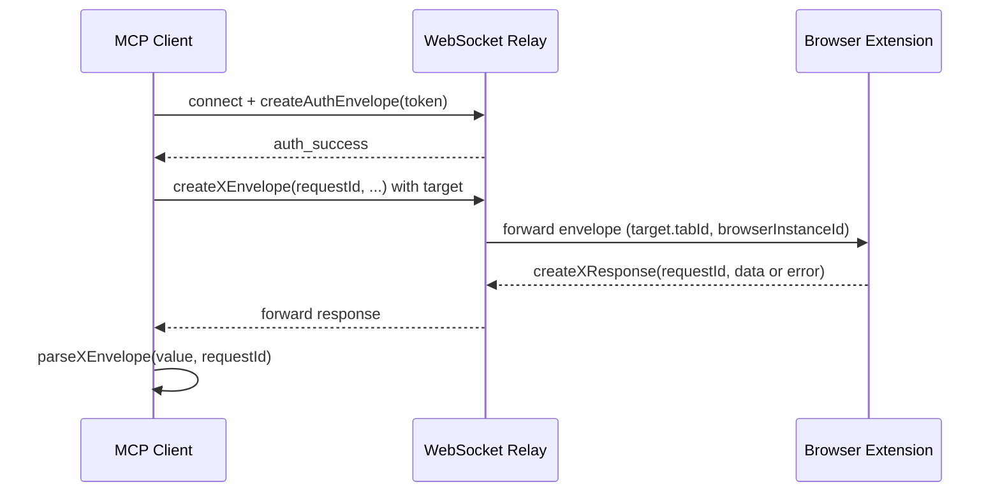
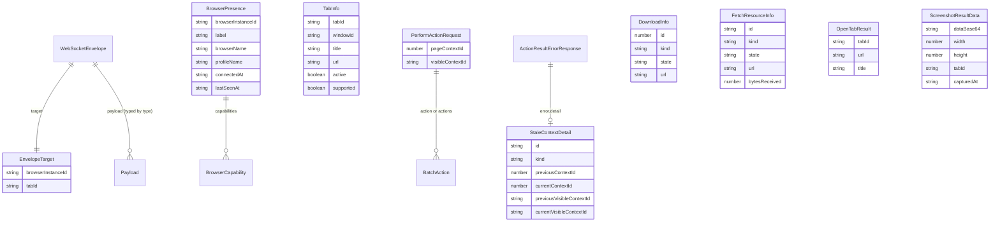

# Protocol and Data Model Guide

This page is the canonical reference for the shared data structures and protocol shapes that flow over the WebSocket relay between the MCP server and the browser extensions. Two files own these shapes:

- `packages/shared/src/protocol.ts` — the shared source of truth for the envelope, payloads, and response/result types imported by both the relay and the extensions.
- `servers/mcp/src/protocol.ts` — the MCP-side protocol module (~2195 lines) that contains envelope builders (`create*Envelope`), type guards (`is*Envelope`), and response parsers (`parse*Envelope`) used by the MCP WebSocket client to construct and validate relay messages. It is aligned with the shared protocol but lives on the MCP side and adds the `BrijioResourceResult<T>` result/parse families the MCP tools consume.

Anything that crosses package boundaries — the MCP server, the WebSocket relay, and the Chrome/Safari extensions — must keep these shapes in agreement.

## Design history

The protocol evolved through a series of architecture decisions:

- **ADR 0060 — Explicit tab listing and selection.** Introduced `list_tabs` / `tab_list_response` and the principle of per-call, stateless tab targeting rather than hidden session-level "selected tab" state.
- **ADR 0062 — Thread `tabId` through the action stack.** Wired the envelope's `target.tabId` from the MCP tool input all the way through the extension to `chrome.tabs.sendMessage(tabId, ...)` / `chrome.tabs.update(tabId, ...)`, with an active-tab fallback when `tabId` is absent.
- **ADR 0063 — Open tab action.** Added the `open_tab` / `open_tab_response` message pair so the agent can create a new tab without destroying current page state.
- **ADR 0064 — Visual action verification (screenshot).** Added the `capture_screenshot` / `screenshot_response` message pair returning a viewport JPEG.

## The canonical envelope

Every relayed message is wrapped in `WebSocketEnvelope` (aliased as `BrijioEnvelope`):

```ts
interface WebSocketEnvelope {
  type: "message";
  id?: string;
  target?: { browserInstanceId?: string; tabId?: string };
  payload: unknown;
}
```

- `type` is always `'message'` for normal messages; `'error'` is reserved for `BrijioErrorEnvelope` (relay/router errors).
- `id` is the request correlation id. The MCP server generates `mcp-<timestamp>-<random>` ids; response parsers compare `value.id === requestId` and return `{ ok: false, ignored: true }` for messages whose id does not match, so unrelated messages are not mistaken for the awaited reply.
- `target` carries explicit routing: `browserInstanceId` selects which connected browser acts, and `tabId` selects which tab within that browser. Targeting is **explicit and per-call** — there is no hidden session-level selected-tab state.
- `payload` is the typed request or response body.

`parseBrijioEnvelope(rawMessage)` is the entry validator: it JSON-parses and checks for an object with `type: 'message'` and a `payload` property, returning a `BrijioErrorEnvelope` (`invalid_json` or `invalid_message`) on failure. The MCP WebSocket client additionally checks `parseRouterErrorEnvelope` on every incoming message to surface relay-level errors (`auth_required`, `browser_unavailable`, `ambiguous_browser_target`, etc.), forwarding the original error code rather than replacing it.

### Auth and presence

Connections authenticate before any action flows:

```ts
type BrijioRole = "extension" | "mcp";

interface AuthPayload {
  type: "auth";
  role: BrijioRole;
  token: string;
}
interface AuthSuccessPayload {
  type: "auth_success";
}
```

`createAuthEnvelope` accepts either a bare token (defaults to the `extension` role) or an `{ token, role, requestId }` object; the MCP server sends the `mcp` role. After the relay responds with `auth_success`, the extension announces itself:

```ts
interface BrowserPresence {
  browserInstanceId: string;
  label: string;
  browserName: string;
  profileName: string;
  connectedAt?: string;
  lastSeenAt?: string;
  capabilities: BrowserCapability[];
}
```

`BrowserPresenceAnnouncePayload` extends `BrowserPresence` with `type: 'browser_presence_announce'`. The extension re-announces presence on `auth_success` and on any `browser_presence_request` from the relay. `BrowserPresence` also appears inside `BrijioErrorEnvelope.error.browsers` so that `browser_unavailable` / `ambiguous_browser_target` errors can list the currently connected browsers and help the agent pick a target.

## Browser capabilities

Capabilities are a closed string union advertised by each connected extension:

```ts
type BrowserCapability =
  | "page_context"
  | "page_content"
  | "click"
  | "fill_input"
  | "fill_editable"
  | "set_checked"
  | "select_options"
  | "submit_form"
  | "navigate"
  | "batch"
  | "upload_file"
  | "download_status"
  | "download_file"
  | "fetch_resource"
  | "screenshot";
```

The capability list lets the agent discover, before acting, whether a given browser supports a feature. On the extension side, the `BrijioBackgroundController` checks for the corresponding adapter before dispatching: if `pageOpenTab`, `pageScreenshot`, `download`, or `tabLister` is not provided, it returns a `*_response` with `ok: false` and a `not_supported` / `capability_not_supported` code rather than crashing.

## Tab listing and tab targeting

Tab awareness was introduced by ADR 0060 and threaded end-to-end by ADR 0062:

```ts
interface TabInfo {
  tabId: string; // opaque raw Chrome/Safari tab ID as string
  windowId: string; // opaque window ID as string
  title: string;
  url: string; // HTTP/HTTPS only
  active: boolean; // currently focused tab
  supported: boolean; // eligible for Brijio actions
}

interface ListTabsRequestPayload {
  type: "list_tabs";
}
interface TabListResponsePayload {
  type: "tab_list_response";
  ok: true;
  data: { tabs: TabInfo[] };
}
interface TabListErrorResponsePayload {
  type: "tab_list_response";
  ok: false;
  error: { code: string; message: string };
}
```

`list_tabs` is on-demand: the extension does not stream tab updates. The envelope `target.tabId` is the targeting axis for all subsequent tool calls. On the extension side, `extractTabId(message)` reads `message.target.tabId`, parses it to a number, and returns `undefined` when absent — in which case the page reader/action handlers fall back to the active foreground tab.

The MCP WebSocket client's `targetEnvelope` helper stamps `target: { browserInstanceId, tabId }` onto the request envelope only when those values are provided, keeping the envelope minimal when no explicit target is needed.

## Action requests and the stale-context pattern

Page-mutating tools share a common target/validation pattern. Each `perform_action` and `perform_batch` request carries optional context guards:

```ts
interface PerformActionRequest {
  type: "perform_action";
  pageContextId?: number;
  visibleContextId?: string;
  action:
    | PerformClickAction
    | PerformWriteTextAction
    | PerformSetCheckedAction
    | PerformSelectOptionsAction
    | PerformSubmitFormAction
    | PerformUploadFileAction;
}
```

- `pageContextId` is the numeric snapshot id from the most recent `get_page_context` read.
- `visibleContextId` is a string fingerprint of the visible interactive controls.

If the page changed since the snapshot, the extension returns an `action_result` error with code `stale_context` (or `page_navigated` inside batches, which the MCP batch parser maps back to `stale_context`). The structured `StaleContextDetail` carries expected-vs-found values for the targeted element plus `previousContextId` / `currentContextId` and `previousVisibleContextId` / `currentVisibleContextId`, so the agent can re-read and retry rather than guessing. Several action result types (`WriteTextActionResultData`, `SetCheckedActionResultData`, `SelectOptionsActionResultData`, `UploadFileActionResultData`) additionally report a `contextStale` / `contextStaleReason: 'visible_controls_changed'` soft warning with the `currentVisibleContextId`.

`ApprovalMetadata` (`actionUUID?`, `approvalRequest?`) is mixed into the action union and into `submit_form`, `download_file`, and `fetch_resource` requests; approval-gated actions (`submit_form`, `download_file`, `fetch_resource`) use a longer timeout (`approvalTimeoutMs`) on the MCP side and a session-grant set on the extension side.

### Batch

`perform_batch` (ADR 0044) bundles up to `BATCH_MAX_ACTIONS = 20` actions in one round trip:

```ts
interface PerformBatchRequest {
  type: "perform_batch";
  pageContextId?: number;
  visibleContextId?: string;
  actions: BatchAction[];
  continueOnError?: boolean;
  readAfterActions?: boolean;
}
```

`isPerformBatchEnvelope` enforces the 1–20 bound and validates every action with `isBatchAction`. The response is `BatchResultResponse` (`type: 'batch_result'`), whose `results` array holds per-action outcomes (`BatchActionOutcome`) plus an optional trailing `BatchReadOutcome` when `readAfterActions` is set. The MCP `parseBatchResultEnvelope` treats a batch-level error (no `results` field) as a hard failure, and a results-bearing partial-failure response as success-with-data so individual action errors remain inspectable. `mapBatchErrorCode` normalizes `page_navigated` to `stale_context`.

## Open tab (ADR 0063)

`open_tab` creates a new tab without disturbing the page the agent was working on, and returns the new tab's id so the agent can immediately target it:

```ts
interface OpenTabRequest {
  type: "open_tab";
  url: string;
}
interface OpenTabResult {
  tabId: string;
  url: string;
  title: string;
}
interface OpenTabResponse {
  type: "open_tab_response";
  ok: true;
  data: OpenTabResult;
}
interface OpenTabErrorResponse {
  type: "open_tab_response";
  ok: false;
  error: { code: OpenTabErrorCode; message: string };
}
type OpenTabErrorCode = "unsupported_scheme" | "open_tab_failed" | "timeout";
```

Only HTTP/HTTPS URLs are allowed (the same `isRegularPageUrl` check used by `navigate_to_url`). The extension's `handleOpenTabRequest` delegates to the `PageOpenTabAdapter.openTab(url)` adapter; if no adapter is configured it returns `not_supported`. `OpenTabResponse | OpenTabErrorResponse` is part of the `ExtensionResponse` union, and `parseOpenTabEnvelope` validates the result shape with `isOpenTabResultData`.

## Screenshot (ADR 0064)

`capture_screenshot` returns a viewport-only JPEG from the active tab:

```ts
interface CaptureScreenshotRequest {
  type: "capture_screenshot";
}
interface CaptureScreenshotResponse {
  type: "screenshot_response";
  ok: true;
  data: {
    dataBase64: string;
    width: number;
    height: number;
    tabId: string;
    capturedAt: string;
  };
}
type ScreenshotErrorCode =
  "capability_not_supported" | "capture_failed" | "no_visible_tab" | "timeout";
```

The extension captures via `tabs.captureVisibleTab({ format: 'jpeg', quality: 80 })`. Because `captureVisibleTab` only captures the visible tab, the tool is active-tab only; the agent can `list_tabs` and `open_tab` to capture a specific page. `parseScreenshotEnvelope` validates the data with `isScreenshotResultData` (requiring `dataBase64`, numeric `width`/`height`, string `tabId`, and `capturedAt`).

## Downloads and fetch

The download/fetch surface (ADR 0047) defines three request families plus streaming sub-messages for fetch:

```ts
type DownloadState = "in_progress" | "complete" | "interrupted";

interface DownloadInfo {
  id: number;
  kind: "download";
  filename;
  url;
  mime;
  size;
  state;
  error?;
  danger?;
}
interface FetchResourceInfo {
  id: string;
  kind: "fetch";
  url;
  contentType;
  bytesReceived;
  totalBytes;
  state: DownloadState | "streaming";
  error?;
}

interface DownloadStatusRequest {
  type: "download_status";
  ids?: Array<number | string>;
  browserInstanceId?: string;
}
interface DownloadStatusResponse {
  type: "download_status_response";
  ok: true;
  capability: "full" | "not_supported";
  items: Array<DownloadInfo | FetchResourceInfo>;
}

interface DownloadFileRequest extends ApprovalMetadata {
  type: "download_file";
  url;
  filename?;
  conflictAction?: "uniquify" | "overwrite";
  browserInstanceId?: string;
}
interface DownloadFileResponse {
  type: "download_file_response";
  ok: true;
  downloadId: number | null;
  status: "initiated" | "initiated_fire_and_forget";
}

interface FetchResourceRequest extends ApprovalMetadata {
  type: "fetch_resource";
  url;
  maxSizeBytes?;
  timeout?;
  browserInstanceId?: string;
}
```

`download_file` and `fetch_resource` are approval-gated: the extension's `handleDownloadFileRequest` / `handleFetchResourceRequest` call `ensureApprovedAction` before performing the operation, and both fall back to a `not_supported` error when no `DownloadAdapter` is configured. `download_file_response.status` distinguishes a tracked download (`initiated`) from a fire-and-forget fallback (`initiated_fire_and_forget`).

`fetch_resource` uses a streaming protocol with start/chunk/complete/error sub-messages (`FetchResourceStreamMessage`). The extension currently uses a single-message fast path that emits `fetch_resource_complete` directly with `dataBase64`, `sha256`, and `totalBytes`; the MCP `parseFetchResourceEnvelope` reassembles this final message (or maps `fetch_resource_error` to a `browser_error`-coded result). `download_status` is the polling counterpart: it returns a `capability` of `'full'` or `'not_supported'` plus the current `items`.

### Staged file uploads

Separate from the action surface, `stage_file_upload_*` payloads support chunked upload staging: `stage_file_upload_start` (uploadId, file metadata, chunkSize, totalChunks), `stage_file_upload_chunk` (index, dataBase64), `stage_file_upload_complete` (optional sha256), with `stage_file_upload_staged` / `stage_file_upload_ack` acknowledgements and `stage_file_upload_error` for failures. Upload error codes are constrained to `invalid_file_payload | checksum_mismatch | file_too_large | invalid_file_name | invalid_file_type | upload_expired`. These staged uploads back the `upload_file` action's `FileUploadPayload` (fileName, mimeType, contentBase64, sizeBytes, optional lastModified).

## Error model

Relay-level errors use `BrijioErrorEnvelope`:

```ts
type BrijioErrorCode =
  | "invalid_json"
  | "invalid_message"
  | "auth_required"
  | "auth_failed"
  | "invalid_auth_message"
  | "browser_unavailable"
  | "ambiguous_browser_target"
  | "invalid_browser_target"
  | "timeout"
  | "unsupported_action"
  | "batch_failed"
  | "invalid_file_payload"
  | "checksum_mismatch"
  | "file_too_large"
  | "invalid_file_name"
  | "invalid_file_type"
  | "upload_staging_failed"
  | "upload_not_staged"
  | "target_not_file_input"
  | "upload_expired"
  | "download_not_found"
  | "fetch_resource_failed";

interface BrijioErrorEnvelope {
  type: "error";
  error: {
    code: BrijioErrorCode;
    message: string;
    browsers?: BrowserPresence[];
  };
}
```

`createErrorEnvelope(code, message, browsers?)` builds these. The shared `parseBrijioEnvelope` returns `invalid_json` / `invalid_message` variants; the MCP `parseRouterErrorEnvelope` forwards any string code (including codes outside the MCP union, such as `invalid_message`) so the agent sees the real error. The MCP side also exposes `invalidResponse`, `timeoutResponse`, `connectionFailedResponse`, `unsupportedSchemeResponse`, and `authRequiredResponse` builders for transport-level failures. `parseErrorPayload` deliberately preserves `stale_context` and `page_navigated` codes with their structured `StaleContextDetail`, and forwards other extension error codes verbatim.

## Request/response lifecycle

The MCP WebSocket client (`servers/mcp/src/websocket-client.ts`) is the runtime consumer of this protocol. Each tool is a thin `requestBrijio` call that (1) opens a WebSocket, (2) sends `createAuthEnvelope(token)`, (3) on `auth_success` sends the targeted request envelope, and (4) resolves with the first non-ignored parsed result or a timeout/connection error:



The sequence diagram shows the correlation-id handshake and explicit per-call targeting shared by every tool — page reads, actions, batch, navigation, open-tab, screenshot, downloads, and fetch.

## Data model

The protocol types form a small entity graph. The envelope routes a payload to a browser/tab target; payloads are either requests (from MCP) or responses/results (from the extension), and several result types carry stale-context diagnostics.



The diagram grounds the relationships in the inspected types: `EnvelopeTarget` lives on `WebSocketEnvelope`; `BrowserPresence` aggregates `BrowserCapability`; `TabInfo` is returned by `list_tabs`; `PerformActionRequest`/`PerformBatchRequest` carry the `pageContextId`/`visibleContextId` guards and a list of `BatchAction`; and `StaleContextDetail` decorates `stale_context`/`page_navigated` errors.

## Where to make changes

- **Shared shapes** (`packages/shared/src/protocol.ts`): the envelope, payloads, response unions, capability union, and shared `create*`/`is*` helpers. Exported via `packages/shared/src/index.ts`.
- **MCP-side builders and parsers** (`servers/mcp/src/protocol.ts`): `create*Envelope` request builders, `is*Envelope` guards used by the extension dispatcher, and `parse*Envelope` response parsers plus the `BrijioResourceResult<T>` / `*ParseResult` families. This module also redefines a few MCP-local types (`FillInputTarget`, `ClickElementTarget`, `StaleContextDetail`) that mirror the shared ones.
- **Extension dispatcher** (`packages/shared/src/background-controller.ts`): `BrijioBackgroundController.handleSocketMessage` switches on `is*Envelope` guards and delegates to optional adapters (`tabLister`, `pageOpenTab`, `pageScreenshot`, `download`), each guarded by a `not_supported` / `capability_not_supported` fallback. It extracts `tabId` via `extractTabId` and threads it to the page readers and action handlers.
- **MCP transport** (`servers/mcp/src/websocket-client.ts`): `requestBrijio` plus the per-tool `request*` functions that pair a `create*Envelope` with a `parse*Envelope`, stamp `target` via `targetEnvelope`, and resolve on the first matching reply.

Changing any payload shape without updating all three (shared protocol, MCP protocol module, extension controller) will usually break interoperability. The capability union and the `ExtensionResponse` union in `packages/shared/src/protocol.ts` are the two places where adding a new message type touches every consumer.

## Related pages

- [/openwiki/architecture.md](/openwiki/architecture.md) — overall architecture.
- [/openwiki/architecture/mcp-extension-flow.md](/openwiki/architecture/mcp-extension-flow.md) — the MCP-to-extension request flow in more detail.
- [/openwiki/domains.md](/openwiki/domains.md) — domain boundaries.
- [/openwiki/security.md](/openwiki/security.md) — auth, approval, and URL-scheme constraints.
- [/openwiki/workflows/multi-tab.md](/openwiki/workflows/multi-tab.md) — multi-tab workflows built on these primitives.

## Related source files

- `packages/shared/src/protocol.ts`
- `packages/shared/src/index.ts`
- `packages/shared/src/background-controller.ts`
- `servers/mcp/src/protocol.ts`
- `servers/mcp/src/websocket-client.ts`
- `docs/architecture/decisions/0060-explicit-tab-listing-and-selection.md`
- `docs/architecture/decisions/0062-thread-tabid-through-action-stack.md`
- `docs/architecture/decisions/0063-open-tab-action.md`
- `docs/architecture/decisions/0064-visual-action-verification.md`
