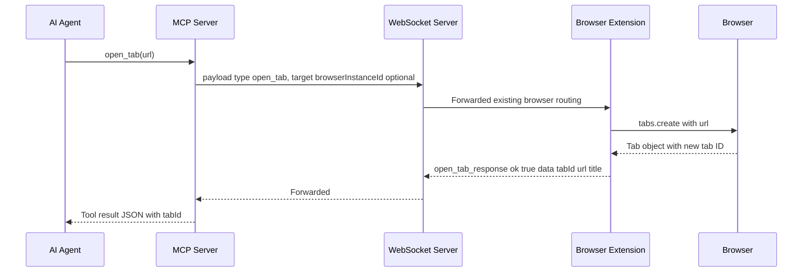

# Protocol and Data Model Guide

This page is the canonical OpenWiki home for the shared data structures and
protocol shapes that flow between the MCP server, the WebSocket relay, and the
browser extensions. The single source of truth for these shapes is
`packages/shared/src/protocol.ts`; per the AGENTS.md ownership rule, protocol
definitions live in `packages/shared` only and must not be duplicated. The MCP
server keeps its own envelope builders, parsers, and result types in
`servers/mcp/src/protocol.ts`, but those import the canonical types from
`@brijio/shared` rather than redefining them.

## Ownership and the cross-layer change path

AGENTS.md fixes the ownership boundaries:

- **Shared protocol and browser-agnostic logic** belong in `packages/shared`.
- **Relay authentication, presence, and routing** belong in `servers/websocket`.
- **Agent-facing tools, resources, prompts, and skills** belong in `servers/mcp`.
- **Browser-specific integration** belongs in `clients/extensions/chrome` and
  `clients/extensions/safari`; keep adapters thin and shared behavior shared.

Because the WebSocket envelope is the wire contract between every layer,
changing a shape without updating the relay, MCP server, and both extensions
will usually break interoperability. For a protocol or browser-capability change
that cuts across layers, check the full path:

```text
shared protocol -> WebSocket relay -> MCP surface -> shared controller
                -> Chrome adapter -> Safari adapter -> integration tests
```

A typical tool-input or capability change therefore requires coordinated edits in
`packages/shared/src/protocol.ts` (or `servers/mcp/src/protocol.ts` envelope
helpers) **and** the background controller together: the envelope shape, the type
guard, and the response builder must all stay aligned.

## The canonical envelope

`packages/shared/src/protocol.ts` defines the message envelope used across the
relay and browser clients:

```ts
export interface WebSocketEnvelope {
  type: "message";
  id?: string;
  target?: {
    browserInstanceId?: string;
    tabId?: string;
  };
  payload: unknown;
}

export type BrijioEnvelope = WebSocketEnvelope;
```

The envelope is intentionally simple and explicit. Two design invariants follow
directly from its shape:

- **Targeting is explicit and per-call.** Routing information lives in
  `envelope.target`, which carries an optional `browserInstanceId` and an
  optional `tabId`. There is no hidden "selected browser" or "selected tab"
  session state; every tool call states which browser and which tab it addresses.
  AGENTS.md requires preserving this: do not introduce hidden
  selected-browser or selected-tab session state.
- **When `tabId` is absent, fall back to the active tab.** ADR 0062 threaded
  `tabId` from the MCP tool input through the relay envelope and the shared
  background controller down to `chrome.tabs.sendMessage(tabId, …)` /
  `chrome.tabs.update(tabId, …)` in the extension, with a backward-compatible
  fallback to `chrome.tabs.query({ active: true, currentWindow: true })` when no
  `tabId` is provided. The MCP-side `PageContextRequestOptions` carries the
  `tabId` field and the WebSocket client places it into `envelope.target.tabId`;
  the WS server forwards the full envelope — including `target` — to the
  extension unchanged.

### Auth and presence

The envelope carries a small set of control payloads for connection setup and
browser discovery:

- `BrijioRole` — `'extension' | 'mcp'`
- `AuthPayload` — `type: 'auth'`, `role`, `token`
- `AuthSuccessPayload` — `type: 'auth_success'`
- `BrowserPresenceRequestPayload` — `type: 'browser_presence_request'`
- `BrowserPresenceAnnouncePayload` — extends `BrowserPresence` with
  `type: 'browser_presence_announce'`

`createAuthEnvelope`, `createAuthSuccessEnvelope`,
`createBrowserPresenceRequestEnvelope`, and
`createBrowserPresenceAnnounceEnvelope` build these envelopes; matching
`is…Envelope` type guards validate them on the receiving side.

## Browser presence and capabilities

`BrowserPresence` describes a connected browser instance:

```ts
export interface BrowserPresence {
  browserInstanceId: string;
  label: string;
  browserName: string;
  profileName: string;
  connectedAt?: string;
  lastSeenAt?: string;
  capabilities: BrowserCapability[];
}
```

`BrowserCapability` is the named feature-flag union the extension advertises so
the MCP server and relay know which operations a browser supports:

```ts
export type BrowserCapability =
  | "page_context"
  | "page_content"
  | "click"
  | "fill_input"
  | "fill_editable"
  | "set_checked"
  | "select_options"
  | "submit_form"
  | "navigate"
  | "batch"
  | "upload_file"
  | "download_status"
  | "download_file"
  | "fetch_resource"
  | "screenshot";
```

`screenshot` (ADR 0064) is the most recent addition. These shapes are used by the
WebSocket relay's browser discovery and the MCP-facing `list_browsers` flow.

## Tab listing and tab targeting

ADR 0060 introduced explicit multi-tab awareness on top of the existing
multi-browser targeting. The tab primitives are:

```ts
export interface TabInfo {
  tabId: string; // opaque raw Chrome/Safari tab ID as string
  windowId: string;
  title: string;
  url: string; // HTTP/HTTPS only
  active: boolean;
  supported: boolean; // always true for listed tabs
}

export interface ListTabsRequestPayload {
  type: "list_tabs";
}
export interface TabListResponsePayload {
  type: "tab_list_response";
  ok: true;
  data: { tabs: TabInfo[] };
}
export interface TabListErrorResponsePayload {
  type: "tab_list_response";
  ok: false;
  error: { code: string; message: string };
}
```

Tab listing is on demand only — the extension does not continuously stream tab
updates. The agent calls `list_tabs`, receives a `tabId`, and then passes that
`tabId` on subsequent tool calls via `envelope.target.tabId`. The companion ADR
0062 made that targeting actually reach the browser: previously the `tabId`
parameter was accepted by the MCP schema but silently dropped at the extension
layer, so every action operated on the active foreground tab. Now `tabId` is
threaded end-to-end, with the documented active-tab fallback when it is omitted.

## open_tab — creating a new tab (ADR 0063)

ADR 0063 added an `open_tab` action so the agent can create a new tab without
destroying the page state it was working on (unlike `navigate_to_url` on the
current tab) and without losing JavaScript rendering (unlike `fetch_resource`).
It mirrors `navigate_to_url` in shape and flows through the same WS server →
extension routing:


```mermaid
sequenceDiagram
    participant Agent as AI Agent
    participant MCP as MCP Server
    participant WS as WebSocket Server
    participant Ext as Browser Extension
    participant Browser as Browser
    Agent->>MCP: open_tab(url)
    MCP->>WS: payload type open_tab, target browserInstanceId optional
    WS->>Ext: Forwarded existing browser routing
    Ext->>Browser: tabs.create with url
    Browser-->>Ext: Tab object with new tab ID
    Ext-->>WS: open_tab_response ok true data tabId url title
    WS-->>MCP: Forwarded
    MCP-->>Agent: Tool result JSON with tabId
```

### Shared protocol types

In `packages/shared/src/protocol.ts`:

```ts
export interface OpenTabRequest {
  type: "open_tab";
  url: string;
}

export interface OpenTabResult {
  tabId: string; // raw Chrome/Safari tab ID as string
  url: string; // the URL the tab was opened with
  title: string; // may be empty until the page loads
}

export interface OpenTabResponse {
  type: "open_tab_response";
  ok: true;
  data: OpenTabResult;
}

export interface OpenTabErrorResponse {
  type: "open_tab_response";
  ok: false;
  error: { code: OpenTabErrorCode; message: string };
}

export type OpenTabErrorCode =
  "unsupported_scheme" | "open_tab_failed" | "timeout";
```

Only HTTP/HTTPS URLs are allowed, validated with the same `isRegularPageUrl()`
check used by `list_tabs` and `navigate_to_url`. The shared file provides
`isOpenTabEnvelope` (validates a `message` envelope whose payload is an
`open_tab` request with a string `url`), `createOpenTabResponse`, and
`createOpenTabErrorResponse`, and adds `OpenTabResponse | OpenTabErrorResponse`
to the `ExtensionResponse` union. The MCP side (`servers/mcp/src/protocol.ts`)
adds `createOpenTabEnvelope`, `parseOpenTabEnvelope`, and `isOpenTabResultData`.

The new tab's `tabId` is returned so the agent can immediately target it with
`read_current_page` or other tools. `close_tab` and ownership tracking are
deferred (P2.5); the agent can `list_tabs` to discover tabs it opened.

## capture_screenshot — visual action verification (ADR 0064)

ADR 0064 added a `capture_screenshot` action returning a JPEG of the **active
(visible) tab only** — full-page scroll-stitch is deferred to a later tier. It
uses `chrome.tabs.captureVisibleTab()` / `browser.tabs.captureVisibleTab()`,
which is available on both Chrome and Safari 14+. Capturing a background tab
would require switching focus (user-disruptive), so the agent is expected to
`open_tab` a dedicated tab when it needs a screenshot of a specific page.

### Shared protocol types

In `packages/shared/src/protocol.ts`:

```ts
export interface CaptureScreenshotRequest {
  type: "capture_screenshot";
}

export interface CaptureScreenshotResponse {
  type: "screenshot_response";
  ok: true;
  data: {
    dataBase64: string; // base64-encoded JPEG (data URL without prefix)
    width: number;
    height: number;
    tabId: string; // the tab that was captured
    capturedAt: string;
  };
}

export interface CaptureScreenshotErrorResponse {
  type: "screenshot_response";
  ok: false;
  error: { code: ScreenshotErrorCode; message: string };
}

export type ScreenshotErrorCode =
  "capability_not_supported" | "capture_failed" | "no_visible_tab" | "timeout";
```

`capability_not_supported` is the defensive fallback for runtime permission
errors even on browsers that nominally support `captureVisibleTab`. The shared
file provides `isCaptureScreenshotEnvelope`, `createScreenshotResponse`, and
`createScreenshotErrorResponse`, and adds `CaptureScreenshotResponse |
CaptureScreenshotErrorResponse` to the `ExtensionResponse` union. The MCP side
adds `createCaptureScreenshotEnvelope`, `parseScreenshotEnvelope`,
`isScreenshotResultData`, and the `BrijioScreenshotResult` /
`ScreenshotParseResult` types. The MCP tool converts the captured JPEG into MCP
image content (`{ type: 'image', data: base64, mimeType: 'image/jpeg' }`).

## File uploads

The staged file-upload protocol (ADR 0046) transfers file bytes from the MCP
server to the browser extension in chunks before an `upload_file` action is
performed against a form control. The shared file defines the full
start/chunk/complete/ack/error flow:

- `StageFileUploadStartPayload` — `type: 'stage_file_upload_start'`, `uploadId`,
  `file` (`name`, `size`, optional `type`/`sha256`), `chunkSize`, `totalChunks`
- `StageFileUploadChunkPayload` — `type: 'stage_file_upload_chunk'`, `uploadId`,
  `index`, `dataBase64`
- `StageFileUploadCompletePayload` — `type: 'stage_file_upload_complete'`,
  `uploadId`, optional `sha256`
- `StageFileUploadStagedPayload` — `type: 'stage_file_upload_staged'`, `uploadId`
- `StageFileUploadAckPayload` — `type: 'stage_file_upload_ack'`, `uploadId`
- `StageFileUploadErrorPayload` — `type: 'stage_file_upload_error'`, `uploadId`,
  and an `error` whose `code` is one of `invalid_file_payload`,
  `checksum_mismatch`, `file_too_large`, `invalid_file_name`,
  `invalid_file_type`, or `upload_expired`

Each request payload has a corresponding `…Envelope` form carrying
`target: { browserInstanceId?: string }`; the ack and error envelopes have an
optional `target`. Integrity is verified with `sha256`.

## Download and fetch status

ADR 0047 added download awareness and resource fetching. The shared file
defines:

```ts
export type DownloadState = "in_progress" | "complete" | "interrupted";

export interface DownloadInfo {
  id: number;
  kind: "download";
  filename: string;
  url: string;
  mime: string | null;
  size: number | null;
  state: DownloadState;
  error?: string;
  danger?: string;
}

export interface FetchResourceInfo {
  id: string;
  kind: "fetch";
  url: string;
  contentType: string | null;
  bytesReceived: number;
  totalBytes: number | null;
  state: DownloadState | "streaming";
  error?: string;
}
```

Both share a status query surface:

- `DownloadStatusRequest` — `type: 'download_status'`, optional `ids` and
  `browserInstanceId`
- `DownloadStatusResponse` — `type: 'download_status_response'`, `ok: true`,
  `capability: 'full' | 'not_supported'`, and `items: Array<DownloadInfo |
FetchResourceInfo>`
- `DownloadStatusErrorResponse` — `type: 'download_status_response'`, `ok: false`,
  `error: { code, message }`

`download_file` and `fetch_resource` are separate tools with separate risk
profiles built on the same protocol foundation. `fetch_resource` fetches a URL
using the browser's active session cookies and streams the response back via the
chunked staging protocol (the reverse of the upload flow).

## The structured ToolResult error model

Across the MCP tools, results follow a single discriminated-union convention so
that every outcome is either explicit success data or an explicit structured
error — never an ad hoc string or thrown exception. The shared/extension layer
uses it in the response payloads (`ok: true` with `data`, or `ok: false` with
`error: { code, message }`), and the MCP layer formalizes it as:

```ts
// servers/mcp/src/page-reading-tool.ts
export type BrijioToolResult<T> =
  | { ok: true; data: T }
  | {
      ok: false;
      error: {
        code: BrijioToolErrorCode;
        message: string;
        detail?: StaleContextDetail;
      };
    };

// servers/mcp/src/protocol.ts
export type BrijioResourceResult<T> =
  | { ok: true; data: T }
  | {
      ok: false;
      error: {
        code: string;
        message: string;
        detail?: StaleContextDetail;
        browsers?: BrowserPresence[];
      };
    };
```

`BrijioToolResult<T>` is the convention every MCP tool module returns
(`ClickElementResult`, `OpenTabResult`, `CaptureScreenshotResult`,
`DownloadStatusResult`, `BrijioBatchResult`, etc. are all
`BrijioToolResult<…>`). `BrijioResourceResult<T>` is the parallel type used for
parsed extension responses, where the `error` may additionally carry `browsers`
(for discovery fallback) and a `StaleContextDetail` describing how a target
became stale. `BrijioErrorCode` enumerates the cross-tool error codes
(`auth_required`, `browser_unavailable`, `ambiguous_browser_target`,
`connection_failed`, `timeout`, `invalid_response`, `browser_error`,
`stale_context`, `page_navigated`, `unsupported_scheme`, etc.), and helper
constructors (`invalidResponse`, `timeoutResponse`, `connectionFailedResponse`,
`authRequiredResponse`, `unsupportedSchemeResponse`) build common error shapes
consistently.

AGENTS.md codifies this as a coding standard: return predictable structured
results with explicit success data or error codes.

## Why this file matters

If you are changing anything that crosses a package boundary, start by checking
`packages/shared/src/protocol.ts`. That file is the source of truth for:

- envelope shape (including `target.tabId` alongside `target.browserInstanceId`)
- auth and presence
- tab identity and listing
- browser capabilities
- `open_tab` and `capture_screenshot` request/response/error shapes
- download, fetch, and file-upload routing

Keep protocol definitions in `packages/shared` and do not duplicate them;
preserve explicit per-call `browserInstanceId` and `tabId` targeting; and re-read
page context after navigation or any mutation that can invalidate short-lived
target IDs.

## Related source files

- [packages/shared/src/protocol.ts](../packages/shared/src/protocol.ts) — canonical shapes, type guards, response builders
- [packages/shared/src/index.ts](../packages/shared/src/index.ts) — re-exports the shared protocol surface
- [servers/mcp/src/protocol.ts](../servers/mcp/src/protocol.ts) — MCP-side envelope builders, parsers, and `BrijioResourceResult` / `BrijioErrorCode`
- [servers/mcp/src/page-reading-tool.ts](../servers/mcp/src/page-reading-tool.ts) — `BrijioToolResult<T>` definition
- [docs/architecture/decisions/0060-explicit-tab-listing-and-selection.md](../docs/architecture/decisions/0060-explicit-tab-listing-and-selection.md)
- [docs/architecture/decisions/0062-thread-tabid-through-action-stack.md](../docs/architecture/decisions/0062-thread-tabid-through-action-stack.md)
- [docs/architecture/decisions/0063-open-tab-action.md](../docs/architecture/decisions/0063-open-tab-action.md)
- [docs/architecture/decisions/0064-visual-action-verification.md](../docs/architecture/decisions/0064-visual-action-verification.md)
