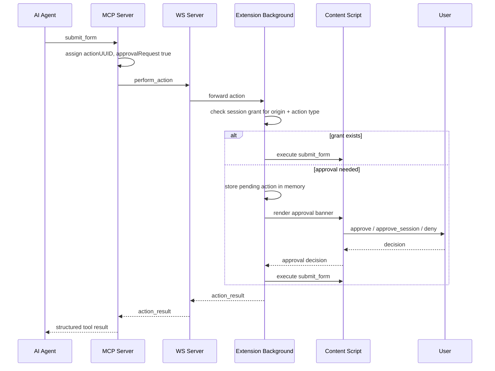

# Protocol and Data Model Guide

Brijio has three cooperating surfaces — the AI agent, the local MCP server, and the browser extension — that talk over a single relayed WebSocket channel. For them to interoperate, they must agree on a shared message vocabulary. This page is the canonical reference for that vocabulary: the WebSocket envelope, auth and presence, browser capabilities, tab primitives, the page-context/page-content split, downloads, fetch, screenshot, the action-approval protocol, and error-code forwarding.

## Source of truth

`packages/shared/src/protocol.ts` is the **source of truth for every cross-package protocol shape**. The WebSocket relay, the browser extension, and the MCP server all import the types and validators from the shared package. `servers/mcp/src/protocol.ts` mirrors and forwards the shared shapes (building/validating envelopes for MCP tool calls), and it also defines MCP-only result types — but it does **not** redefine the wire types that the relay or extension consume.

Two consequences follow:

- Start cross-package protocol changes in `packages/shared/src/protocol.ts`. The relay, MCP server, and extensions must be updated together with it.
- Do not duplicate protocol definitions outside `packages/shared`. Changing a shape in only the MCP server or only the extension will silently desynchronize the wire format and break interoperability.

## The WebSocket envelope

Every message on the relay is wrapped in one envelope, defined in `packages/shared/src/protocol.ts`:

```ts
export interface WebSocketEnvelope {
  type: "message";
  id?: string;
  target?: { browserInstanceId?: string; tabId?: string };
  payload: unknown;
}
```

The envelope is deliberately thin. Three things matter:

- **`id`** is the request/response correlation key. A request envelope carries an `id`; the response echoes it so the MCP server (or relay) can match the reply to the pending request. `id` is optional — fire-and-forget messages and server-initiated announcements omit it.
- **`target`** carries explicit routing. `browserInstanceId` selects which connected browser extension receives the message (multi-browser targeting); `tabId` selects which tab inside that browser receives it (multi-tab targeting). Targeting is always per-call and lives **in the envelope**, never in hidden session state.
- **`payload`** is the typed message body. Its `payload.type` string discriminates the message kind (`auth`, `browser_presence_announce`, `list_tabs`, `perform_action`, `capture_screenshot`, …).

`parseBrijioEnvelope` validates that an incoming frame is a well-formed envelope (`type === 'message'`, optional string `id`, optional `target`, and a `payload`), returning a structured `BrijioErrorEnvelope` (`code: 'invalid_json'` or `'invalid_message'`) instead of throwing.

## Auth and presence

Connection setup uses two payload families:

- `AuthPayload` (`type: 'auth'`) carries a `role` of `'extension' | 'mcp'` (`BrijioRole`) and a `token`. The relay authenticates the WebSocket connection on this first message and replies with an `AuthSuccessPayload` (`type: 'auth_success'`). `createAuthEnvelope` is overloaded to accept either a bare token (extension role) or an explicit `{ token, role, requestId }`.
- Presence is discovered with `BrowserPresenceRequestPayload` (`type: 'browser_presence_request'`) and announced with `BrowserPresenceAnnouncePayload` (`type: 'browser_presence_announce'`, which extends `BrowserPresence`).

`BrowserPresence` describes one connected browser instance:

```ts
export interface BrowserPresence {
  browserInstanceId: string;
  label: string;
  browserName: string;
  profileName: string;
  connectedAt?: string;
  lastSeenAt?: string;
  capabilities: BrowserCapability[];
}
```

`isBrowserPresenceAnnouncePayload` validates the announce payload, requiring non-empty `browserInstanceId`/`label`/`browserName`/`profileName` and a `capabilities` array whose every element is a valid `BrowserCapability`.

## Browser capabilities

Capabilities are named feature flags the extension advertises in its `BrowserPresence`. `BrowserCapability` is the closed union the extension may announce:

```ts
export type BrowserCapability =
  | "page_context"
  | "page_content"
  | "click"
  | "fill_input"
  | "fill_editable"
  | "set_checked"
  | "select_options"
  | "submit_form"
  | "navigate"
  | "batch"
  | "upload_file"
  | "download_status"
  | "download_file"
  | "fetch_resource"
  | "screenshot";
```

These let the MCP server and relay reason about what a given browser supports before routing an action (for example, gating `capture_screenshot` behind the `screenshot` capability). `isBrowserCapability` is the validator that the presence guard uses. Note that `servers/mcp/src/protocol.ts` keeps its own `BrowserPresence` mirror with `capabilities: string[]` and required `connectedAt`/`lastSeenAt`, but the wire-time validation of capability strings lives in the shared package.

## Tab listing and targeting

ADR 0060 introduced tab awareness; ADR 0062 threaded `tabId` end-to-end through the action stack. The shared protocol exposes:

- `TabInfo` — `tabId`, `windowId` (both opaque raw browser IDs as strings), `title`, `url` (HTTP/HTTPS only), `active`, `supported`.
- `ListTabsRequestPayload` (`type: 'list_tabs'`), and `TabListResponsePayload` / `TabListErrorResponsePayload` (both `type: 'tab_list_response'`, discriminated by `ok`).

The defining design choice, stated in ADR 0060 and reinforced by ADR 0062, is that **tab targeting is explicit and per-call**. A tool call passes `tabId` in `envelope.target.tabId`; there is no hidden session-level "selected tab" state, mirroring how `browserInstanceId` already works. When `tabId` is absent, the extension falls back to the active foreground tab. This keeps the protocol stateless: the agent can read context from one tab, fill a form in another, and navigate a third without the relay or MCP server remembering a selection.

## Page context vs page content

Brijio exposes a page through two distinct surfaces, defined in `packages/shared/src/protocol.ts` and assembled by `packages/shared/src/page-context.ts` and `packages/shared/src/page-content.ts`:

- **`PageContext`** is the structured, accessibility-oriented snapshot. It carries `url`, `title`, `timestamp`, `selectedText`, a `preview` (a truncated readable-content chunk), and a `structure` object with `headings`, `landmarks`, `links`, `images`, `forms`, `editables`, and `actions`. It is what an agent uses to reason about interactive elements. It also carries a `content` block describing how to fetch the full readable content (`requestType: 'get_page_content'`, `firstIndex: 1`, `defaultMaxPayloadBytes`).
- **`PageContent`** is one chunk of the readable content. It is fetched on demand via `get_page_content` with a 1-based `index`, and carries `content`, `truncated`, and `maxPayloadBytes`. `page-content.ts` chunks the rendered Markdown into byte-bounded pieces (`splitContent` splits on blank-line block boundaries, then falls back to character splitting) using `defaultPageContentMaxPayloadBytes = 131072`. `chunkReadableContent` throws `invalid_index` for out-of-range or non-positive indices.

The two are related but separate: `PageContext` is the "what is on this page and what can I do" map; `PageContent` is the "give me the next chunk of readable text" stream. Requests use `get_page_context` and `get_page_content` respectively; responses use `page_context_response` / `page_content_response` with the shared `{ ok, data | error }` shape.

### Context versioning and stale-context detection

Because positional element IDs (`bb-1`, `bb-2`, …) can go stale between a read and an action (page navigation, SPA re-render, lazy load), the protocol carries two independent freshness tokens on action requests: `pageContextId` (a number) and `visibleContextId` (a string).

- **`pageContextId` / `pageContextVersion`** (ADR 0036, ADR 0043) is a module-scoped counter in the content script (`packages/shared/src/content-handler.ts`, `CONTENT_SCRIPT_VERSION = 2`). It increments on every `pageshow` navigation event. `extract_page_context` stamps the returned `PageContext` with the current `pageContextId`. When an action request carries a `pageContextId` that no longer equals `pageContextVersion`, `handleContentRequest` returns a `page_navigated` error with a `StaleContextDetail` (`previousContextId`/`currentContextId`). ADR 0043 made re-injection of the content script idempotent so this counter does not drift across duplicate `pageshow` listeners: the content script stores its listener reference on `globalThis` and removes the previous one before adding its own.
- **`visibleContextId`** (ADR 0045) is a deterministic hash of the visible form-interaction surface, computed by `computeVisibleContextId`. If an action request's `visibleContextId` does not match the live document, the handler returns a `stale_context` error with `reason: 'visible_controls_changed'` and the previous/current visible IDs. This catches SPA re-renders that change the form surface (e.g. a new conditional control appearing) without a full navigation.

Both checks happen before any action executes in `handleContentRequest`, and the batch runner (`packages/shared/src/batch-handler.ts`) performs the same `visibleContextId` guard up front, returning an aborted `stale_context` result before touching the action list.

## Browser actions and batches

Action requests (`PerformActionRequest`, `type: 'perform_action'`) wrap one of six action kinds in `action` — `click`, `write_text`, `set_checked`, `select_options`, `submit_form`, `upload_file` — each with its own target shape (`ClickActionTarget`, `FormControlTarget`, `EditableActionTarget`, `FormSubmitTarget`, `FileUploadPayload`). Targets carry optional validation fields (`expectedText`, `expectedHref`, `expectedRole`, `expectedLabel`) that the content script checks before acting; a mismatch yields a `stale_context` error rather than a wrong-element click (ADR 0036).

Batches (`PerformBatchRequest`, `type: 'perform_batch'`, ADR 0044) execute up to `BATCH_MAX_ACTIONS = 20` actions sequentially in the content script. The batch result is a `BatchResultResponse` (`type: 'batch_result'`) with one `BatchResultEntry` per action (or a trailing read entry when `readAfterActions` is set). Key invariants:

- **`continueOnError`** (default `false`) aborts remaining actions on any element-level error; `true` records the failure and continues.
- **Page navigation always aborts.** After each action the batch runner compares `environment.locationHref` to its pre-batch value; if it changed, remaining actions are marked `aborted: true` with `page_navigated`. This overrides `continueOnError`.
- A `visibleContextId` mismatch aborts the whole batch up front with a single `stale_context` entry.
- `readAfterActions: true` appends a fresh `PageContext` as the final result entry.

## Downloads, fetch, and screenshot

These message families form the file/media surface (ADRs 0047, 0064).

### Staged file upload

Staged uploads stream a file to the extension before an `upload_file` action references it. The protocol defines a start/chunk/complete handshake plus ack and error messages, all keyed by `uploadId`:

- `stage_file_upload_start` — `uploadId`, file metadata (`name`, `size`, `type?`, `sha256?`), `chunkSize`, `totalChunks`.
- `stage_file_upload_chunk` — `uploadId`, `index`, `dataBase64`.
- `stage_file_upload_complete` — `uploadId`, optional `sha256`.
- `stage_file_upload_staged` / `stage_file_upload_ack` — extension acknowledgement.
- `stage_file_upload_error` — `uploadId` and a typed error (`invalid_file_payload` | `checksum_mismatch` | `file_too_large` | `invalid_file_name` | `invalid_file_type` | `upload_expired`).

### Download status and download file

`DownloadInfo` (kind `'download'`) and `FetchResourceInfo` (kind `'fetch'`) describe tracked transfers with a shared `DownloadState` of `'in_progress' | 'complete' | 'interrupted'` (fetch adds `'streaming'`). `DownloadStatusRequest` (`type: 'download_status'`, optional `ids`, optional `browserInstanceId`) queries status; `DownloadStatusResponse` replies with `capability: 'full' | 'not_supported'` and an `items` array, or a `DownloadStatusErrorResponse`. `DownloadFileRequest` (`type: 'download_file'`, extends `ApprovalMetadata`) initiates a browser download of a `url` with optional `filename` and `conflictAction`.

### Fetch resource

`FetchResourceRequest` (`type: 'fetch_resource'`, extends `ApprovalMetadata`, with `url`, optional `maxSizeBytes`, `timeout`) streams a response back as a sequence: `fetch_resource_start`, one or more `fetch_resource_chunk` (`fetchId`, `index`, `dataBase64`), `fetch_resource_complete` (`sha256`, `totalBytes`), or `fetch_resource_error`. `FetchResourceStreamMessage` is the union.

### Screenshot (ADR 0064)

`CaptureScreenshotRequest` (`type: 'capture_screenshot'`) returns a `CaptureScreenshotResponse` (`type: 'screenshot_response'`, `ok: true`) carrying base64 JPEG `dataBase64`, `width`, `height`, the `tabId` captured, and `capturedAt`. Errors use `ScreenshotErrorCode` (`capability_not_supported | capture_failed | no_visible_tab | timeout`). The MCP `captureScreenshot` tool wraps the result as an MCP image content block with `mimeType: 'image/jpeg'`. Screenshots are viewport-only and active-tab-only by design — capturing a background tab would require a focus switch.

## Action-approval protocol (ADR 0048)

A small, hardcoded set of browser-mutating operations require explicit in-browser user approval before they execute: `submit_form`, `fetch_resource`, and `download_file`. The gated set is hardcoded in `getApprovalActionType` inside `packages/shared/src/background-controller.ts`; the ADR keeps policy evaluation behind that one function so it can later delegate to local or enterprise policy.

The protocol shape, defined as `ApprovalMetadata` in `packages/shared/src/protocol.ts`:

```ts
export interface ApprovalMetadata {
  actionUUID?: string;
  approvalRequest?: boolean;
}
```

Approval-gated operations carry a unique `actionUUID` and `approvalRequest: true`. For `perform_batch`, **every** batch action carries an `actionUUID` (so each can be identified), and approval-gated items additionally carry `approvalRequest: true`. The WebSocket envelope `id` remains the request/response correlation key; the `actionUUID` identifies one action _within_ a request or batch. `isPerformActionEnvelope` and `isBatchAction` validate `actionUUID` (must be a non-empty string when present) and `approvalRequest` (must be boolean) via `hasValidApprovalMetadata`.


```mermaid
sequenceDiagram
  participant Agent as AI Agent
  participant MCP as MCP Server
  participant WS as WS Server
  participant BG as Extension Background
  participant CS as Content Script
  participant User as User
  Agent->>MCP: submit_form
  MCP->>MCP: assign actionUUID, approvalRequest true
  MCP->>WS: perform_action
  WS->>BG: forward action
  BG->>BG: check session grant for origin + action type
  alt grant exists
    BG->>CS: execute submit_form
  else approval needed
    BG->>BG: store pending action in memory
    BG->>CS: render approval banner
    CS->>User: approve / approve_session / deny
    User-->>CS: decision
    CS-->>BG: approval decision
    BG->>CS: execute submit_form
  end
  BG-->>WS: action_result
  WS-->>MCP: action_result
  MCP-->>Agent: structured tool result
```

Approval semantics, enforced by `ensureApprovedAction`:

- **State is memory-only.** Pending actions and session grants live in the extension background and are cleared on bridge disconnect, extension reload, or session end. Nothing is persisted to `localStorage`, extension storage, or IndexedDB.
- **`approve_session`** is scoped to `{ origin, actionType }` and stored in `approvalSessionGrants` (keyed `origin\u0000actionType`). Before executing an approved action the extension re-checks the active tab origin; if it changed, the action fails with `approval_origin_changed` instead of reusing the grant.
- **Timeout** is application-level and owned by Brijio. The default `approvalTimeoutMs` is `55000` (the HTTP request timeout minus a safety buffer), so Brijio returns a structured `approval_timeout` error before the MCP HTTP server's generic timeout fires. On timeout the banner is hidden and the pending approval cancelled.
- **Batches** treat each action independently: a denied action returns `approval_denied` for its `actionUUID` and the runner continues to the next action. Approval timeout returns a partial `batch_result` — completed actions keep their results, the timed-out action records `approval_timeout`, and unexecuted actions are returned as focused failed entries the agent can retry.

Approval error codes (`ActionResultErrorCode`): `approval_denied`, `approval_timeout`, `approval_unavailable` (no `actionUUID`, or the approval adapter or active origin is unavailable), and `approval_origin_changed`.

## Error codes and forwarding (ADR 0061)

Errors flow back over the chain `Extension → WS Server → MCP Server → Agent`. The protocol defines `BrijioErrorEnvelope` (`type: 'error'`, `error: { code: BrijioErrorCode, message, browsers? }`) for router-level errors, and per-response `error` objects for action-level errors.

`BrijioErrorCode` in `packages/shared/src/protocol.ts` is the authoritative union the WS server and extension emit (`invalid_json`, `invalid_message`, `auth_required`, `auth_failed`, `invalid_auth_message`, `browser_unavailable`, `ambiguous_browser_target`, `invalid_browser_target`, `timeout`, `unsupported_action`, `batch_failed`, plus the upload/download/fetch codes). The MCP server keeps its _own_ narrower `BrijioErrorCode` union for constructing local responses (`connection_failed`, `invalid_response`, `browser_error`, `stale_context`, `page_navigated`, `invalid_resource_uri`, `unsupported_scheme`).

ADR 0061's core decision: the MCP server must **forward the original error code and message** rather than collapsing unknown codes into generics. Concretely in `servers/mcp/src/protocol.ts`:

- `parseRouterErrorEnvelope` forwards any string `code` and string `message` from a `{ type: 'error' }` envelope as-is; it only returns `invalidResponse()` when the envelope structure itself is malformed (missing `error` object or non-string `message`). Codes the MCP union does not know (e.g. `invalid_message`, `invalid_json`) now reach the agent instead of being flattened to `"Received an invalid Brijio response."`.
- `parseErrorPayload` preserves `stale_context` and `page_navigated` with their structured `StaleContextDetail` (the agent relies on that detail), and forwards any other string `code` from the extension (e.g. `not_supported`, `cors_blocked`, `http_error`) instead of wrapping it as `browser_error`. The `message` is always preserved.
- The result types (`BrijioResourceResult`, `BrijioToolResult`) use `code: string` rather than the constrained union, because the extension and WS server may emit codes the MCP server does not know.

The implication for changing these shapes: the shared `BrijioErrorCode` union and the MCP server's union are **deliberately out of sync and must stay that way** — the MCP union is for construction, the shared union is for emission, and forwarding bridges them. Do not try to "fix" the mismatch by making them identical; doing so reintroduces the bug ADR 0061 removed.

## Message flow overview

The diagram below shows how a single tool call maps to the envelope, presence, and result families.

<!-- openwiki: mermaid parse failed and this diagram was converted to a text fence so it does not break rendering. Fix the diagram source and restore the mermaid fence. Parser error: Heuristic: a semicolon inside a label breaks rendering; rephrase the label. -->

```text
flowchart TD
  Conn[Extension connects, sends auth envelope] --> Auth[Relay authenticates, replies auth_success]
  Auth --> Pres[Relay requests browser_presence]
  Pres --> Announce[Extension announces BrowserPresence with capabilities]
  Announce --> Tool[Agent invokes MCP tool]
  Tool --> Env[MCP builds WebSocketEnvelope with id, target, typed payload]
  Env --> Relay[WS server forwards envelope to extension]
  Relay --> Ext[Extension executes; content handler stamps pageContextId]
  Ext --> Resp[Extension returns response envelope: page_context_response, action_result, batch_result, screenshot_response, ...]
  Resp --> MCP2[MCP parses envelope, forwards error code/message]
  MCP2 --> Agent[Agent receives BrijioToolResult]
```

## Related pages

- [Architecture](architecture.md) — overall system topology and component responsibilities.
- [MCP Extension Flow](architecture/mcp-extension-flow.md) — the end-to-end tool-call path through the MCP server, relay, and extension.
- [Security](security.md) — the privacy boundary and approval model this protocol enforces.

## Related source files

- `packages/shared/src/protocol.ts` — source of truth for all wire shapes, validators, and envelope builders.
- `packages/shared/src/page-context.ts` — `PageContext` extraction and `visibleContextId` computation.
- `packages/shared/src/page-content.ts` — readable-content chunking (`chunkReadableContent`).
- `packages/shared/src/content-handler.ts` — `CONTENT_SCRIPT_VERSION`, `pageContextVersion`, and the `pageContextId`/`visibleContextId` stale checks.
- `packages/shared/src/batch-handler.ts` — `perform_batch` execution engine (ADR 0044).
- `packages/shared/src/background-controller.ts` — action-approval enforcement (`ensureApprovedAction`, `getApprovalActionType`).
- `servers/mcp/src/protocol.ts` — MCP-side envelope builders, parsers, and error-code forwarding (ADR 0061).
- `docs/architecture/decisions/0048-client-side-action-approval.md`
- `docs/architecture/decisions/0061-forward-error-codes-through-mcp.md`
- `docs/architecture/decisions/0064-visual-action-verification.md`
- `docs/architecture/decisions/0060-explicit-tab-listing-and-selection.md`
- `docs/architecture/decisions/0062-thread-tabid-through-action-stack.md`
- `docs/architecture/decisions/0036-stale-context-validation.md`
- `docs/architecture/decisions/0041-reliable-target-identity-and-stale-target-handling.md`
- `docs/architecture/decisions/0043-idempotent-content-script-injection.md`
- `docs/architecture/decisions/0045-user-visible-form-state-model.md`
