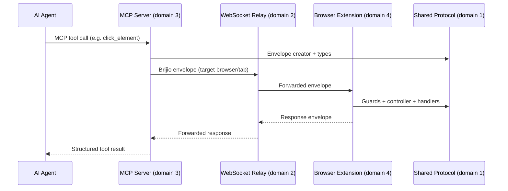

# Major Domains

This repository has a few clear domains that future agents should keep separate when making changes. A request that spans domains always flows the same way: the agent calls an MCP tool, the MCP server turns it into a WebSocket envelope, the relay forwards it to a connected extension, and the extension performs the browser work and returns a structured result.

## 1. Shared protocol and browser-agnostic logic

**Primary source:** `packages/shared`

This domain owns the data model and reusable logic that both servers and browser extensions depend on. The most important file is `packages/shared/src/protocol.ts`, which defines:

- the WebSocket envelope
- auth and presence messages
- browser capability names
- browser presence metadata
- tab-listing shapes
- staged file upload messages
- download and fetch status shapes

The shared package also contains page-context extraction, page-content chunking, the background controller, the page reader, the content handler, the batch handler, popup helpers (messages, parsers, init), bridge settings, content helpers, timers, and logger utilities. The background controller and content handler are adapter-driven and contain no browser API calls, so Chrome and Safari can reuse them by contributing only browser-specific wiring.

> Note: there is a second, large `protocol.ts` at `servers/mcp/src/protocol.ts`. It is a distinct MCP-side protocol module (tab-info and page-context shapes used by the MCP tool layer) and is **not** the shared `packages/shared/src/protocol.ts` that defines the WebSocket envelope and cross-domain message types. When a change touches message shapes, update the shared protocol first; the MCP-side module consumes those shared types.

## 2. WebSocket relay

**Primary source:** `servers/websocket`

This service is the transport and routing layer. It authenticates clients with the local pairing token and routes messages between the MCP server and connected browser extensions. It is intentionally state-light: presence is runtime-only and disappears when the socket closes.

## 3. MCP server

**Primary source:** `servers/mcp`

This is the agent-facing surface. It exposes browser resources, tool calls, and skills through the Model Context Protocol. It uses the WebSocket relay to reach connected browser extensions and returns structured results to the agent.

The MCP server registers the full tool surface in `servers/mcp/src/mcp-server.ts`:

- **Read/discovery:** `list_browsers`, `list_tabs`, `read_current_page`
- **Navigation:** `navigate_to_url`, `open_tab`
- **Action tools:** `click_element`, `fill_input`, `fill_editable`, `set_checked`, `select_options`, `upload_file`, `submit_form`, `perform_batch`
- **Downloads/fetch:** `download_status`, `download_file`, `fetch_resource`
- **Visual verification:** `capture_screenshot`

It also registers MCP **resources**: `current-page-context` (`browser://page/current`), `current-page-content` (`browser://page/current/content/{index}` resource template), and one resource per skill markdown file under `servers/mcp/skills/`. Finally it registers the `brijio-context` prompt, which injects connected browsers, available skills, and key pitfalls into the agent's session context.

The server also ships a browser-friendly demo site under `servers/mcp/demo` and skill markdown under `servers/mcp/skills`.

## 4. Browser extensions

**Primary sources:** `clients/extensions/chrome`, `clients/extensions/safari`, `clients/extensions/firefox`

Chrome and Safari are the implemented extensions. They differ in API surface and packaging, but share the same product rules:

- user-controlled activation
- explicit request/response behavior
- no continuous streaming
- page context before page content
- action targeting through short-lived IDs

Chrome is the first implementation. Safari is a parallel implementation with platform-specific manifests and MV2/MV3 differences (`browser.*` namespace, text-only badge, broad host permissions at install time, `popup.html` overlay instead of a setup page).

The Firefox extension is a **placeholder**: `clients/extensions/firefox` is README-only, planned, and not implemented. Firefox packaging, permissions, and user-control behavior should be designed in a separate ADR before implementation starts. For the current support status across browsers, see the [canonical capability matrix](../../docs/project/CAPABILITY_MATRIX.md).

## 5. Product and business framing

**Primary sources:** `README.md`, `docs/project/POSITIONING.md`, `docs/project/CAPABILITY_MATRIX.md`

These docs explain what Brijio is for and what it is not. The product is positioned around authenticated browser sessions, privacy, and explicit control, not generic browser automation. The capability matrix is the single source of truth for capability names, statuses, and browser support; extension READMEs, the MCP surface, and roadmap documents should use the same capability names defined there.

## 6. Security and trust

**Primary sources:** `docs/security/THREAT_MODEL.md`, `docs/security/TRUST_BOUNDARIES.md`, `docs/security/SECURITY_GUARANTEES.md`

Security docs explain the trust assumptions behind the bridge and why the project avoids credential export, browser cloning, and ambient browser surveillance.

## 7. Docs and design history

**Primary sources:** `docs/architecture/decisions/*`, `docs/artifacts/*`, `docs/project/*`

The docs tree contains the design history and the current product contract. ADRs are especially valuable when changing browser actions, protocol shapes, or connection behavior. Recent ADRs that shape the current surface include:

- **ADR 0063 — Open Tab Action:** adds the `open_tab` MCP tool, `open_tab` / `open_tab_response` protocol pair, and `openTab` adapter method on Chrome and Safari, so the agent can create a new HTTP/HTTPS tab without destroying the current page state.
- **ADR 0064 — Visual Action Verification (Screenshot Tool):** adds the `capture_screenshot` MCP tool returning viewport JPEG (quality 80) from the active tab via `captureVisibleTab`, with `screenshot_response` protocol types and a `PageScreenshotAdapter`.

## Practical rule for future changes

If a change touches more than one domain, update the shared protocol or ADR first, then the relay/server, then the browser adapters. This keeps the repo's explicit-contract style intact and reduces hidden coupling.
