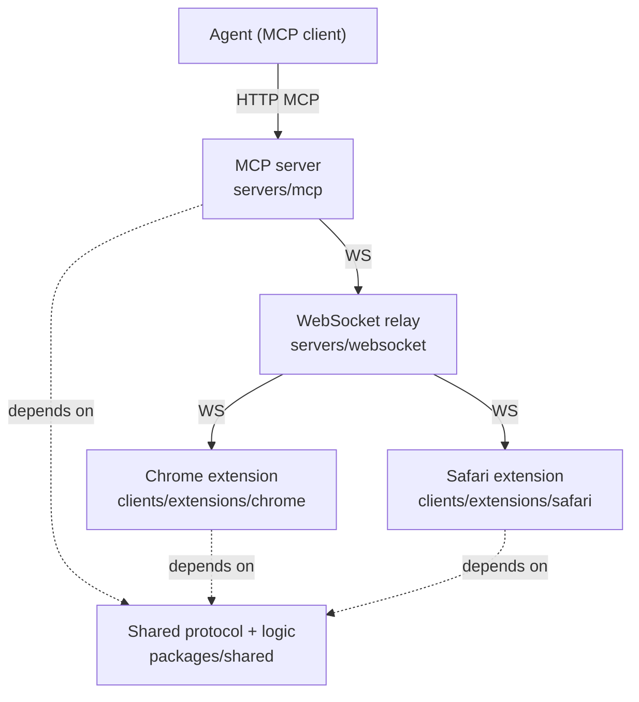

# Major Domains

Brijio is a monorepo of a few clear domains. Keeping changes inside the right
domain — and updating shared contracts before dependents — is what preserves the
project's explicit-contract style. The domains map onto a layered runtime: an
agent talks to the MCP server, which talks over the WebSocket relay to a
browser extension, all of which share a single protocol package.

```mermaid
flowchart TD
  Agent["Agent (MCP client)"]
  MCP["MCP server\nservers/mcp"]
  Relay["WebSocket relay\nservers/websocket"]
  Shared["Shared protocol + logic\npackages/shared"]
  Chrome["Chrome extension\nclients/extensions/chrome"]
  Safari["Safari extension\nclients/extensions/safari"]

  Agent -->|HTTP MCP| MCP
  MCP -->|WS| Relay
  Relay -->|WS| Chrome
  Relay -->|WS| Safari

  MCP -.->|depends on| Shared
  Chrome -.->|depends on| Shared
  Safari -.->|depends on| Shared
```

The diagram shows control flow (solid) and the shared dependency that all
code uses for protocol types and browser-agnostic logic (dashed).

## Practical rule for cross-domain changes

If a change touches more than one domain, update the **shared protocol or ADR
first**, then the **relay/server**, then the **browser adapters**. The shared
package is depended on by both the server and the extension code, so a protocol
shape change must land in `packages/shared` before any caller is edited. ADRs
under `docs/architecture/decisions` record the design decisions behind protocol
shapes, connection behavior, and browser actions; read the relevant ADR before
changing those contracts.

## 1. Shared protocol and browser-agnostic logic

**Primary source:** `packages/shared`

This domain owns the data model and reusable logic that **both servers and
browser extensions depend on**. It is the explicit contract the rest of the
repo is built against. Its public surface is re-exported from a single barrel:

- `packages/shared/src/index.ts` — exports `protocol`, `page-content`,
  `page-context`, `timers`, `background-controller`, `content-handler`,
  `popup-messages`, `popup-parsers`, `bridge-settings`, `content-helpers`,
  `page-reader`, `popup-init`, `logger`, and `batch-handler`.

The most important file is `packages/shared/src/protocol.ts`, which defines the
WebSocket envelope (`BrijioEnvelope`), the `BrijioRole` values (`extension` |
`mcp`), `BrowserPresence` and its capability list, the auth and presence
payloads, tab-listing shapes, staged file-upload messages, download/fetch
status shapes, and the response creators and type guards that callers build
envelopes with. `background-controller.ts` contains the adapter-driven
`BrijioBackgroundController` — it has no direct browser API dependency and is
wired by each extension's thin adapter. `page-context.ts`, `page-content.ts`,
`content-handler.ts`, and `batch-handler.ts` are pure DOM logic; `page-reader.ts`
and `bridge-settings.ts` hold the browser-API adapter interfaces and settings
normalization.

**Ownership:** define the protocol, presence, page extraction, content
handling, batch handling, and the adapter-driven controller here. Browser- or
server-specific wiring belongs in its own domain and must stay out of this
package.

## 2. WebSocket relay

**Primary source:** `servers/websocket`

This service is the **transport and routing layer** between the MCP server and
connected browser extensions. `servers/websocket/src/server.ts` builds the
`ws` server: every connection starts unauthenticated and must send an `auth`
envelope carrying a pairing token before anything else is accepted. Once a
`mcp` or `extension` role authenticates, the server derives a `scopeKey` (a
SHA-256 hash of the token, defined in `servers/websocket/src/protocol.ts`) so
all parties sharing a token see one another's presence.

The relay is intentionally **state-light and runtime-only**: presence is held in
an in-memory `Map` keyed by scope + browser instance ID, and is deleted when the
socket closes. MCP requests are forwarded to a selected browser, with
`pendingRequests` correlating an extension's response back to the originating
MCP socket by message id. It routes messages without needing to inspect
payloads. The relay re-exports its protocol primitives (envelope creators,
guards, `parseBrijioEnvelope`) from `@brijio/shared`.

**Ownership:** auth, presence, routing, and request/response correlation. It
holds no durable state and no business logic; capability semantics live in the
shared protocol and the extension.

## 3. MCP server

**Primary source:** `servers/mcp`

This is the **agent-facing surface**. `servers/mcp/src/mcp-server.ts` builds an
`McpServer` and registers tools, resources, and prompts over the Model Context
Protocol. Tools (`list_browsers`, `list_tabs`, `read_current_page`,
`click_element`, `fill_input`, `fill_editable`, `set_checked`,
`select_options`, `submit_form`, `navigate_to_url`, `open_tab`,
`perform_batch`, `download_status`, `download_file`, `fetch_resource`,
`capture_screenshot`) each delegate to a tool module that calls the WebSocket
client. Resources expose `browser://page/current`, a paginated
`browser://page/current/content/{index}` template, and one `skill://{name}`
resource per skill directory. The `brijio-context` prompt injects connected
browsers, available skills, and pitfalls into a session.

The server reaches browsers through `servers/mcp/src/websocket-client.ts`,
which authenticates as the `mcp` role and sends/receives protocol envelopes. It
is served over HTTP by `servers/mcp/src/http-server.ts` using the streamable
HTTP transport; `servers/mcp/src/index.ts` is the process entrypoint.
Operational commands live here too: `daemon.ts` (install/run/start/stop/status
as a launchd/systemd service), `doctor.ts` (preflight checks), `print-config.ts`
(ready-to-paste config blocks for agent clients), and `demo-server.ts` (a
static site for verifying the full stack, per ADR 0039). Skill markdown is
served from `servers/mcp/skills`.

**Ownership:** the agent-facing tool/resource/prompt surface, the WebSocket
client that talks to the relay, and the process/operational tooling. It depends
on `@brijio/shared` for protocol types and on the relay for transport.

## 4. Browser extensions

**Primary sources:** `clients/extensions/chrome`, `clients/extensions/safari`

These packages implement the browser-side bridge. They differ in API surface
and packaging, but share the same product rules: user-controlled activation,
explicit request/response behavior, no continuous streaming, page context
before page content, and action targeting through short-lived IDs.

Chrome is the **first implementation** and uses the `chrome.*` namespace with a
Manifest V3 service worker. Safari is a **parallel implementation** with
platform-specific manifests and MV2/iOS non-persistent-background differences.
Shared behavior — protocol types, the background controller, page extraction,
content handling, and timers — stays in `packages/shared`; the Safari package
contributes only thin browser-specific adapters (`background.ts`,
`background-entry.ts`, `content-script-entry.ts`, `popup.ts`,
`popup-entry.ts`, `permissions.ts`).

The Safari lifecycle differences are recorded in the ADRs and matter for any
extension change:

- **ADR 0019** — extract shared logic into `@brijio/shared` and add a
  Safari-specific adapter layer for feature parity with Chrome.
- **ADR 0050** — make the Safari background page non-persistent
  (`"persistent": false`) so it can pass iOS/iPadOS App Store validation; the
  runtime must treat WebSocket connections, pending requests, and timers as
  volatile and recreate them on wake.
- **ADR 0051** — split Safari build output: `dist-ios` (non-persistent, for
  iOS/iPadOS) and `dist-macos` (persistent, for desktop), generated from one
  iOS-safe source manifest.
- **ADR 0052** — persist Safari client-side desired connection state and
  reconnect on wake when the user previously chose Connect; page-activity
  messages are wake hints only, not a guarantee the background stays live.

**Firefox** (`clients/extensions/firefox`) is a **placeholder only**: support
is planned but not implemented, and packaging/permissions should be designed in
a separate ADR before any implementation.

**Ownership:** browser-specific wiring and platform adapters. Shared behavior
stays in `packages/shared`; adapters stay thin.

## 5. Product and business framing

**Primary sources:** `README.md`, `docs/project/POSITIONING.md`,
`docs/project/CAPABILITY_MATRIX.md`, `docs/project/ROADMAP.md`

These docs explain what Brijio is for and what it is not. Brijio is positioned
around existing authenticated browser sessions, privacy, and explicit control —
giving an agent access to the browser the user already controls, not generic
browser automation. The capability matrix is the canonical product contract:
it lists every tool, resource, prompt, and skill with status, browser support,
and what is intentionally unsupported (no cookie export, no session cloning, no
continuous streaming, no credential extraction).

**Ownership:** product positioning, capability status, and the roadmap. These
docs define scope boundaries that the code domains must respect.

## 6. Security and trust

**Primary sources:** `docs/security/THREAT_MODEL.md`,
`docs/security/TRUST_BOUNDARIES.md`, `docs/security/SECURITY_GUARANTEES.md`

Security docs explain the trust assumptions behind the bridge. The threat
model covers malicious agents, a compromised relay, network attackers, and
malicious websites; mitigations center on the explicit request/response
protocol, no continuous streaming, user-controlled connections, and
least-privilege permissions. Trust boundaries define where trust is placed
(pairing token for browser identity, separate MCP auth token for agent
authorization), minimized (relay routes without content inspection; E2E
encryption planned), and explicitly not assumed (network). Guarantees state
Brijio does not export cookies, clone sessions, or act as remote desktop
software, and that password fields return `browser_error` on fill attempts.

**Ownership:** trust assumptions and security guarantees that constrain every
other domain. These should only change with care, and code changes that touch
data exposure must be checked against them.

## 7. Docs and design history

**Primary sources:** `docs/architecture/decisions/*`, `docs/artifacts/*`,
`docs/project/*`

The docs tree holds the design history and the current product contract. ADRs
(`docs/architecture/decisions/`) are especially valuable when changing browser
actions, protocol shapes, or connection behavior — they record the reasoning
behind capabilities like the WebSocket single channel (0002), shared extension
package (0019/0031), skill system (0027), batch requests (0044), file upload
(0046), downloads (0047), client-side approval (0048), tab listing (0060), open
tab (0063), and visual verification (0064). `docs/artifacts/` holds supporting
reference material (configuration examples, demo layouts, FAQ); these are
historical/explanatory rather than normative.

**Ownership:** decision records and reference artifacts. Update or add an ADR
when a domain change alters an established contract or behavior.
