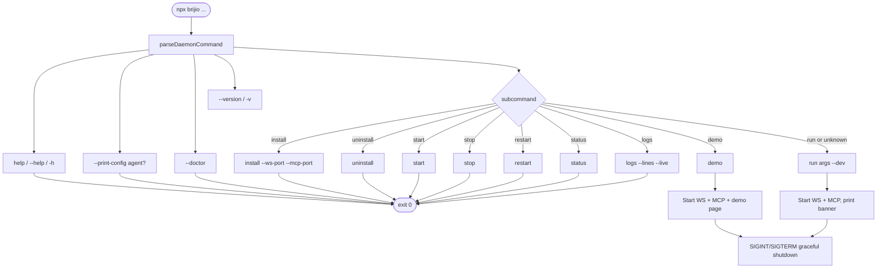

# Operations: Daemon, CLI, and Health

Brijio ships as a single combined entry point, `bin/brijio.mjs` (published as `dist/bin/brijio.js`), that starts both the WebSocket relay and the MCP HTTP server in one process and manages graceful shutdown on `SIGINT`/`SIGTERM`. The same binary exposes a set of subcommands for foreground use, self-contained demos, diagnostics, and an optional persistent daemon. This page covers the CLI command surface, env/config resolution, health endpoints, the `--doctor` and `--print-config` diagnostics, the startup banner, and the Docker image.

For the broader runtime architecture (Agent → MCP → WebSocket relay → extension), see [Architecture](architecture.md). For the protocol and message flow, see [Data and Protocol](data-and-protocol.md).

## The brijio binary and command surface

The npm package `@brijio/mcp` declares two `bin` entries — `brijio` and the deprecated `browserbridge` alias — both pointing at `dist/bin/brijio.js`. Running `npx @brijio/mcp` with no subcommand is the "one-command startup" path (ADR 0029): it auto-generates tokens, starts both servers, and prints connection info.

`bin/brijio.mjs` parses `process.argv` into a `DaemonCommand` via `parseDaemonCommand` in `servers/mcp/src/daemon.ts`. The dispatch order matters: top-level flags are handled before subcommand parsing, and `--dev` is extracted so it does not collide with `run`-mode server args.



The full command surface, matching `usage()` and the README:

| Command                                       | Description                                            |
| --------------------------------------------- | ------------------------------------------------------ |
| `brijio`                                      | Run WebSocket and MCP servers interactively (default)  |
| `brijio demo`                                 | Run servers plus the demo page for quick verification  |
| `brijio --dev`                                | Run in dev mode (bind WS/MCP to `127.0.0.1` only)      |
| `brijio --print-config [agent]`               | Print ready-to-copy MCP client config for an agent     |
| `brijio --doctor`                             | Run diagnostic preflight checks                        |
| `brijio --version` / `-v`                     | Print package version and exit                         |
| `brijio install [--ws-port N] [--mcp-port N]` | Install daemon, generate tokens, start service         |
| `brijio uninstall`                            | Remove the daemon service (preserves config and logs)  |
| `brijio start`                                | Start the installed daemon                             |
| `brijio stop`                                 | Stop the daemon                                        |
| `brijio restart`                              | Restart the daemon                                     |
| `brijio status`                               | Show daemon state and health probe results             |
| `brijio logs [--lines N] [--live]`            | View (`-n`/`--lines`) or stream (`--live`) daemon logs |
| `brijio help` / `--help` / `-h`               | Print usage                                            |

A few parsing details that affect operators:

- `--print-config` is a top-level flag, not a subcommand. It accepts an optional positional agent name; if the next token looks like a flag (`-`-prefixed), no agent is assumed.
- `--dev` is a top-level flag for `run` mode. It is stripped from `run` args so it never reaches the server modules as an unknown flag.
- Unknown first tokens fall through to `run` mode and are passed to the servers as interactive args (e.g. `brijio --port 8788`).
- `install` rejects unknown options and validates ports as integers in `1..65535`; `logs` accepts `--lines`/`-n` (positive integer, default 100) and `--live`.

## Env and config resolution

Server modules read `process.env` at evaluation time, so `bin/brijio.mjs` sets defaults **before** dynamically importing the server modules in run mode. For `--print-config` and `--doctor`, env is applied early so the commands have token values without starting servers.

### `.env` file fallback chain

`loadBrijioEnv` (in `daemon.ts`) resolves a `.env` file from this candidate list, using the first one that exists:

1. `BRIJIO_ENV_FILE` — explicit override env var
2. `<cwd>/.env`
3. `~/.brijio/.env`

`applyBrijioEnv` then copies loaded values into `process.env`, but **only for keys that are unset or empty** — real environment variables always take precedence over `.env` values. `.env` parsing is a simple `KEY=VALUE` reader that skips comments/blank lines and strips surrounding quotes.

### Variables, defaults, and aliases

The MCP HTTP server reads its options via `getMcpHttpServerOptionsFromEnv` in `http-server.ts`; the page-context config (the MCP→relay connection) is read via `getPageContextConfigFromEnv` in `page-context.ts`. The WebSocket server reads its own options directly in `server.ts`. The combined defaults, consistent with `../.env.example` and the README:

| Variable                            | Default               | Notes                                                            |
| ----------------------------------- | --------------------- | ---------------------------------------------------------------- |
| `WEBSOCKET_HOST`                    | `0.0.0.0`             | `127.0.0.1` in `--dev`/demo mode                                 |
| `WEBSOCKET_PORT`                    | `8787`                |                                                                  |
| `BRIJIO_PAIRING_TOKEN`              | _auto-generated_      | Required; ephemeral unless persisted                             |
| `MCP_HTTP_HOST`                     | `0.0.0.0`             | `127.0.0.1` in `--dev`/demo mode                                 |
| `MCP_HTTP_PORT`                     | `8788`                |                                                                  |
| `MCP_HTTP_PATH`                     | `/mcp`                | Normalised to start with `/`                                     |
| `MCP_HTTP_AUTH_TOKEN`               | _auto-generated_      | Required; the MCP HTTP server throws if empty after auto-gen     |
| `MCP_HTTP_ALLOWED_ORIGINS`          | (empty)               | Comma-separated; empty means no CORS restriction                 |
| `BRIJIO_WS_URL`                     | `ws://127.0.0.1:8787` | WS URL the MCP server connects to for the relay                  |
| `BRIJIO_REQUEST_TIMEOUT_MS`         | `5000`                | Timeout for forwarded relay requests                             |
| `BRIJIO_MCP_HTTP_TIMEOUT_MS`        | `60000`               | MCP HTTP server/request timeout                                  |
| `BRIJIO_APPROVAL_TIMEOUT_BUFFER_MS` | `5000`                | Buffer subtracted from the HTTP timeout for the approval timeout |
| `BRIJIO_BROWSER_INSTANCE_ID`        | (unset)               | Optional; when set, MCP tools target that browser by default     |
| `BRIJIO_DEMO_PORT`                  | `8789`                | Demo page port (only for `brijio demo`)                          |

Backward-compatible aliases are still accepted during the transition window (ADR 0037 rename). The resolution helper prefers the new name when both are set and emits a warning:

| Canonical name               | Accepted aliases                                                       |
| ---------------------------- | ---------------------------------------------------------------------- |
| `BRIJIO_PAIRING_TOKEN`       | `BROWSERBRIDGE_PAIRING_TOKEN`, `BRIJIO_TOKEN`                          |
| `BRIJIO_WS_URL`              | `BROWSERBRIDGE_WEBSOCKET_URL`, `BRIJIO_WEBSOCKET_URL`, `WEBSOCKET_URL` |
| `BRIJIO_REQUEST_TIMEOUT_MS`  | `BROWSERBRIDGE_REQUEST_TIMEOUT_MS`                                     |
| `BRIJIO_BROWSER_INSTANCE_ID` | `BROWSERBRIDGE_BROWSER_INSTANCE_ID`                                    |

The README lists `BRIJIO_TOKEN`, `BRIJIO_WEBSOCKET_URL`, and `BRIJIO_BROWSER_INSTANCE_ID` explicitly as accepted aliases. When `brijio` auto-generates a pairing token, it mirrors it into `BROWSERBRIDGE_PAIRING_TOKEN` for compatibility, and mirrors `BRIJIO_WS_URL`/`BRIJIO_REQUEST_TIMEOUT_MS` into their `BROWSERBRIDGE_` counterparts.

### Tokens and persistence

Auto-generated tokens are produced with `crypto.randomBytes(32).toString('base64url')`. They are **ephemeral**: new values on every process restart unless persisted. The startup banner labels auto-generated tokens `[ephemeral]` and reminds the operator to set `BRIJIO_PAIRING_TOKEN` and `MCP_HTTP_AUTH_TOKEN` for persistent tokens. The daemon `install` command is the persistence path — it writes generated tokens to `~/.brijio/.env`.

### Approval timeout derivation

The MCP server's approval timeout is not configured directly. In `http-server.ts`, `approvalTimeoutMs` is derived as:

```ts
approvalTimeoutMs = Math.max(1000, httpTimeoutMs - approvalTimeoutBufferMs);
```

where `httpTimeoutMs` comes from `BRIJIO_MCP_HTTP_TIMEOUT_MS` (default `60000`) and `approvalTimeoutBufferMs` from `BRIJIO_APPROVAL_TIMEOUT_BUFFER_MS` (default `5000`). The floor of `1000ms` guarantees the approval window never collapses to zero. This keeps user-visible approval windows shorter than the enclosing HTTP request timeout by a safety buffer.

## Health endpoints and structured logging

Both servers expose `GET /health` (ADR 0033). The health shapes differ because the two servers hold different state.

**WebSocket relay** (`servers/websocket/src/server.ts`) reports connected extensions from its in-memory presence table:

```json
{
  "status": "ok",
  "version": "0.3.0",
  "uptimeSeconds": 3621,
  "extensions": {
    "count": 2,
    "browsers": [
      { "browserInstanceId": "chrome-default", "label": "Chrome Default" }
    ]
  }
}
```

Only browsers whose socket is still `OPEN` are counted. `list_browsers` is answered directly from this presence table, while `list_tabs` and all browser reads/actions are forwarded to the extension.

**MCP HTTP server** (`servers/mcp/src/http-server.ts`) has no persistent WS connections — it creates a throwaway WS client per tool call — so its health endpoint reports the configured WS URL and a reachability status:

```json
{
  "status": "ok",
  "version": "0.3.0",
  "uptimeSeconds": 3621,
  "websocket": {
    "url": "ws://127.0.0.1:8787",
    "status": "unknown"
  }
}
```

The `reachable`/`unknown` probe is an optional lightweight WS handshake with a short timeout; on failure or timeout it reports `"unknown"` rather than blocking the health response. Version is read from `package.json` at module load.

### Structured logging

Both servers use the shared `createLogger` from `@brijio/shared`, emitting single-line JSON to **stderr** (so it never interferes with MCP stdio transport or HTTP response pipes). Log entries include `timestamp` (ISO 8601), `level`, `message`, `service` (`websocket` | `mcp`), and arbitrary fields. This makes logs OCI-compatible and usable with `docker logs`, `journalctl`, and structured shippers.

## Diagnostics: `--doctor` and `--print-config`

### `--doctor` (ADR 0038)

`brijio --doctor` runs preflight checks via `runDoctorChecks` in `servers/mcp/src/doctor.ts` and prints a human-readable report. The checks are:

1. **Config file** — whether a config path was detected and is readable (warns if none).
2. **Ports** — whether the configured MCP HTTP port and WebSocket port are available (`EADDRINUSE` → fail with guidance to use `--mcp-port`/`--ws-port`).
3. **Network detection** — runs `detectNetworkPaths` and reports reachable paths (Tailscale, mDNS, localhost).
4. **Node.js version** — fails if the major version is below 18.

The command exits `1` if any check has status `fail`, `0` otherwise (warnings do not fail the exit code). Network detection (`servers/mcp/src/network.ts`) probes Tailscale (via `tailscale status --json`, with a 2s timeout, plus a `100.64.0.0/10` interface scan fallback), mDNS (resolving `<hostname>.local`), and always includes localhost. The best host priority is Tailscale > mDNS > localhost.

### `--print-config` (ADR 0038)

`brijio --print-config [agent]` emits a ready-to-copy MCP client config block to **stdout** and a short "where to paste" hint to **stderr**. Config formatters live in `servers/mcp/src/print-config.ts` and `print-config-commands.ts`. Supported agents and their formats:

- **claude-desktop / cursor / cline** — `mcpServers` JSON with a `Bearer` header
- **vscode** — `servers` JSON with `type: "http"`
- **codex** — shell command (`codex mcp add ... --bearer-token-env-var`)
- **claude-code** — shell command (`claude mcp add --transport http ...`)
- **gemini** — shell command (`gemini mcp add --transport http ...`)
- **hermes** — YAML config
- **windsurf** — `mcpServers` JSON with `${env:MCP_HTTP_AUTH_TOKEN}` interpolation
- **zed** — `context_servers` JSON
- **continue** — YAML with metadata
- **goose** — instructional note (Goose only supports stdio; HTTP requires a bridge)

The command resolves agent names and aliases via `resolveAgentName`. With no agent argument and a TTY, it presents an interactive picker; with no TTY, it falls back to the default `mcpServers` JSON. In non-`--dev` mode it uses `detectNetworkPaths` to pick the best MCP host (e.g. a Tailscale address) for the emitted URL. Ephemeral tokens are annotated in the output.

## Startup banner

`formatStartupBanner` (`servers/mcp/src/startup-banner.ts`) produces the "🚀 Brijio ready!" banner, written to **stderr** so stdout stays clean for piping. The banner shows:

- All reachable WS/MCP URL pairs (one line per detected network address: Tailscale, mDNS, localhost) when not in dev mode; otherwise a single `localhost` pair.
- The pairing token and MCP auth token, each marked `[ephemeral]` when auto-generated, with a warning that ephemeral tokens change on restart.
- A dev-mode indicator when `--dev` is active.
- The demo page URL when running `brijio demo`.

When `brijio demo` detects an already-running daemon on the WS port, it starts only the demo page server and prints a banner variant noting it connected to the existing daemon (its WS/MCP URLs and tokens belong to the daemon process, not this one).

## Run and demo modes

### Run mode (default)

`brijio` (or `brijio run`/unknown args) dynamically imports `createWebSocketServer` from `@brijio/websocket/server` and `startBrijioMcpHttpServer` from `http-server.ts`, starts both, and installs `SIGINT`/`SIGTERM` handlers that close both servers (and the demo server if present) before exiting `0`. If a port is already in use (`EADDRINUSE`), it prints a focused error pointing to `brijio --doctor` and exits `1`. `--dev` forces `WEBSOCKET_HOST` and `MCP_HTTP_HOST` to `127.0.0.1`.

### Demo mode (ADR 0039)

`brijio demo` starts the full stack plus a static demo page for self-contained tool verification — no Docker, no browser extension, no external dependencies. It binds WS/MCP to `127.0.0.1` for security but the demo static server to `0.0.0.0` (the page has no auth concerns). The demo page is served from `clients/test-page/` (the single source of truth), resolved via `BRIJIO_DEMO_DIR` env override, a walk-up search for `clients/test-page/index.html` (monorepo dev), then a `demo/` folder (npm-bundled `dist/demo`), then `<cwd>/clients/test-page`. Default demo port is `8789` (`BRIJIO_DEMO_PORT`, with a `BROWSERBRIDGE_DEMO_PORT` alias).

Before starting WS/MCP, demo mode probes the existing WS health endpoint; if a daemon is already running, it attaches to it (demo-server-only) to avoid port-binding conflicts and pairing-token scope mismatches.

## Daemon install model (ADR 0037)

For persistent use, `brijio install` registers Brijio as a login-started background service. The platform abstraction lives in `servers/mcp/src/daemon.ts`. Daemon install supports `darwin` and `linux` only (other platforms throw).

### Install layout

`planDaemonInstall` creates `~/.brijio/`:

```
~/.brijio/
├── .env                    # Persistent tokens and config (mode 0600)
├── .env.example            # Template (written on first install if missing)
├── bin/brijio              # sh wrapper that execs node <binaryPath>
├── brijio.log               # macOS only (LaunchAgent redirects stdout/stderr here)
├── com.redvex.brijio.plist  # macOS: LaunchAgent definition
└── brijio.service          # Linux: systemd user unit
```

- **macOS**: writes a LaunchAgent plist with label `com.redvex.brijio` to `~/.brijio/com.redvex.brijio.plist`, then symlinks it to `~/Library/LaunchAgents/com.redvex.brijio.plist`. The plist sets `RunAtLoad` and `KeepAlive` to `true`, a `WorkingDirectory` of `~/.brijio`, and redirects stdout/stderr to `~/.brijio/brijio.log`. It deliberately omits `EnvironmentVariables` — the `.env` file is the single source of truth.
- **Linux**: writes a systemd user unit (`brijio.service`) to `~/.brijio/brijio.service`, symlinked to `~/.config/systemd/user/brijio.service`. The unit uses `EnvironmentFile=%h/.brijio/.env`, `Restart=on-failure`, `RestartSec=5`, and `WantedBy=default.target`.

The `bin/brijio` wrapper is a small `sh` script that `exec`s `node <sourceBinaryPath> "$@"`, recording the resolved binary path at install time to avoid `npx` resolution lag on every start.

### Token and port handling

`install` generates `BRIJIO_PAIRING_TOKEN` and `MCP_HTTP_AUTH_TOKEN` via `crypto.randomBytes(32).toString('base64url')` and writes them to `~/.brijio/.env` (mode `0600`). Install is **idempotent**: if `.env` already exists, it preserves existing tokens and only fills missing ones; new `--ws-port`/`--mcp-port` flags override existing `WEBSOCKET_PORT`/`MCP_HTTP_PORT` values. The `brijio.service`/plist run with `WorkingDirectory=~/.brijio`, so the daemon always finds its `.env` regardless of where it was launched.

### Lifecycle commands

| Command     | macOS                                                    | Linux                                                          |
| ----------- | -------------------------------------------------------- | -------------------------------------------------------------- |
| `install`   | `launchctl unload` then `load` the link                  | `systemctl --user daemon-reload`, `enable --now`               |
| `uninstall` | `launchctl unload`, remove the link                      | `systemctl --user disable --now`, `daemon-reload`, remove link |
| `start`     | `launchctl load <link>`                                  | `systemctl --user start brijio.service`                        |
| `stop`      | `launchctl unload <link>`                                | `systemctl --user stop brijio.service`                         |
| `restart`   | `launchctl unload` then `load` (unload errors swallowed) | `systemctl --user restart brijio.service`                      |
| `logs`      | `tail -n N [-f] ~/.brijio/brijio.log`                    | `journalctl --user -u brijio.service -n N [--follow]`          |

`uninstall` stops the daemon and removes the service link but **preserves** `~/.brijio/.env` and logs; it prints `rm -rf ~/.brijio` as the command for full removal.

### `status`

`getDaemonStatus` loads `~/.brijio/.env` for ports, checks whether the daemon is loaded (macOS: `launchctl list com.redvex.brijio`; Linux: `systemctl --user is-active --quiet`), then probes `http://127.0.0.1:<wsPort>/health` and `http://127.0.0.1:<mcpPort>/health` with a 1500ms timeout each. `formatStatus` prints a table of: daemon loaded (yes/no), config path, binary path, WebSocket health, and MCP health. This is the quick way to verify both endpoints and the service manager in one command.

## Docker (ADR 0035)

Brijio ships as a single combined Docker image running both services under s6-overlay process supervision. The root `Dockerfile` builds the bundled `dist/` output (via `tsup`, the same output as the npm package) in stage 1, then in a `node:22-alpine` runtime stage installs s6-overlay and copies the s6 service definitions. `docker/s6-rc.d/brijio/run` is a `longrun` service that `exec node dist/bin/brijio.js` from `/app`, so the same token auto-generation and startup banner logic applies inside the container. The image `EXPOSE`s `8787` and `8788` and uses `ENTRYPOINT ["/init"]`.

Default env in the image sets `WEBSOCKET_HOST=0.0.0.0`, `WEBSOCKET_PORT=8787`, `MCP_HTTP_HOST=0.0.0.0`, `MCP_HTTP_PORT=8788`, `MCP_HTTP_PATH=/mcp`, `BRIJIO_WEBSOCKET_URL=ws://127.0.0.1:8787`, and `BRIJIO_REQUEST_TIMEOUT_MS=5000`. Tokens auto-generate if empty and are printed to stdout on first startup. Because both processes share the container network namespace, the MCP server connects to its own loopback at `ws://127.0.0.1:8787`.

A key operational note: `127.0.0.1` binding does **not** work with Docker port mapping — inside a container it binds only the container loopback, unreachable from the host even with `-p`. Users wanting strictly local-only access must use `npx` (not Docker) or `docker run --network=host` with `127.0.0.1` binding. The `0.0.0.0` default plus auth tokens is the intended security boundary for Docker.

### Docker Compose profiles

`../docker-compose.yml` defines three services, each behind a profile. Per the AGENTS.md guidance, derive the current profiles from `docker-compose.yml` and do not assume a profile exists:

- `brijio` — the combined image, profile `runtime`, exposing `8787` and `8788`.
- `browserbridge` — `extends: brijio`, profile `legacy-runtime` (the deprecated alias).
- `test-page` — `nginx:1.27-alpine` serving `clients/test-page`, profile `test`, on `TEST_PAGE_PORT` (default `8080`).

The test page is Docker-only for the `test` profile; `brijio demo` is the zero-Docker equivalent for local verification. Both serve from the same `clients/test-page/` directory.

## Verification

The daemon command parser and install planner are covered by `servers/mcp/src/daemon.test.ts` (command parsing, port validation, env file fallback, install idempotency and token preservation, `0600` file mode) and the doctor report formatting by `servers/mcp/src/doctor.test.ts`. End-to-end server behavior is covered by the integration tests in `servers/mcp/src/integration.test.ts`. The quickest manual end-to-end check is `brijio demo`, which starts the full stack plus a demo page designed to exercise every MCP tool (pagination, forms, dynamic content) — see `../clients/test-page/smoke-test.md` for the checklist.
