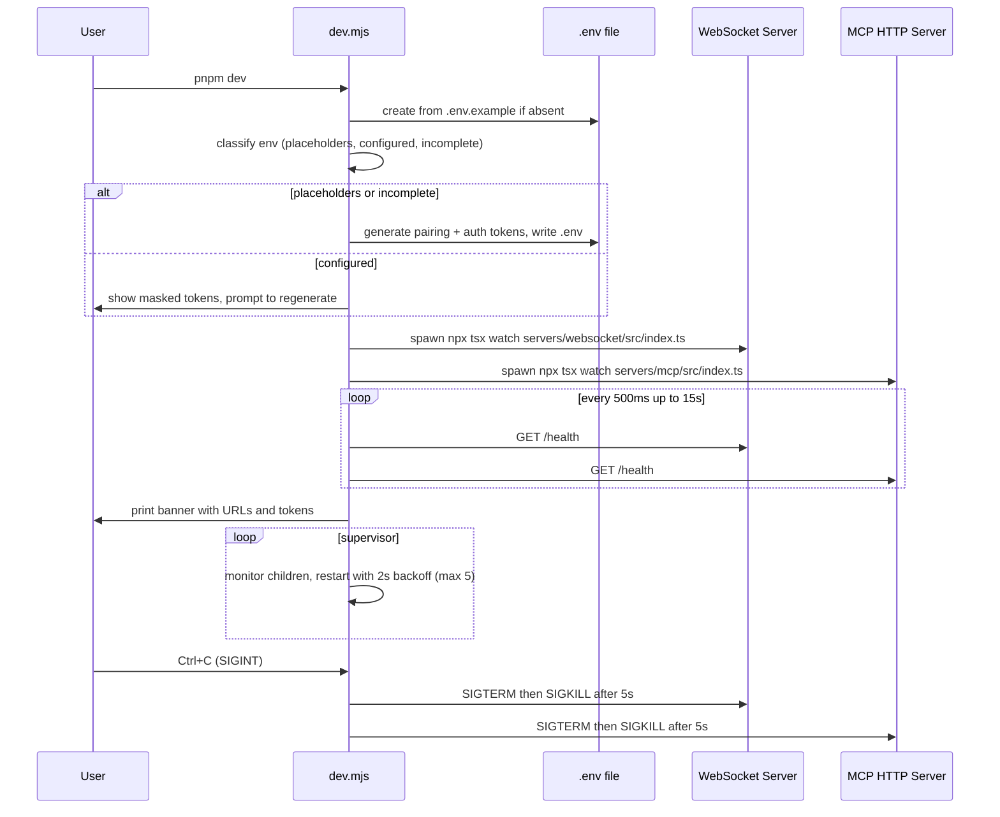

# Runtime, Daemon, and Deployment

Brijio runs as two cooperating services: a **WebSocket companion server** (port 8787, relays between the MCP server and browser extensions) and an **MCP server** exposed over **MCP Streamable HTTP** (port 8788, `/mcp` by default, the entrypoint for AI agents). The WebSocket companion is never a standalone product — it only exists to relay messages for the MCP server — so Brijio ships as a single combined runtime that starts both.

There are three supported ways to run Brijio, all sharing the same entry point and environment model:

1. **Local dev** — `pnpm dev` orchestrator (watches source, auto-generates tokens, waits for health).
2. **Daemon** — `npx @brijio/mcp install` registers a login-started background service (launchd on macOS, systemd on Linux) with persisted tokens.
3. **Container** — the combined Docker image runs both servers under s6-overlay supervision; `docker-compose.yml` exposes `runtime`, `legacy-runtime`, and `test` profiles.

All three converge on the same configuration: an `.env` file of `KEY=VALUE` lines, a pairing token (`BRIJIO_PAIRING_TOKEN`) for MCP↔WebSocket↔extension routing, and a separate MCP auth token (`MCP_HTTP_AUTH_TOKEN`) for agent→MCP access. Tokens are auto-generated when absent (and printed to stdout/stderr at startup) but are then **ephemeral** — they change on every restart unless persisted.

## One-command local dev: `pnpm dev`

`pnpm dev` runs `scripts/dev.mjs`, a Node orchestrator that manages the full local startup lifecycle (ADR-0029). It is the primary path for contributors; it is **not** the end-user daemon.

_Caption: the `pnpm dev` orchestrator lifecycle — env setup, supervised spawn, health-gated readiness, graceful shutdown._

The orchestrator behaves as follows:

- **Env bootstrapping.** If `.env` does not exist it is copied from `.env.example`. The file is then classified: `placeholders` (token fields still contain `replace-with-generated-token` / `replace-with-generated-mcp-token`), `configured` (both real tokens present), or `incomplete`. For `placeholders`/`incomplete` it generates a fresh config and writes it back, preserving order/comments and only replacing the placeholder token fields. For `configured` it shows the current tokens masked and asks whether to regenerate (skipped under `--yes` or `CI=true`).
- **Token generation** uses `scripts/token-utils.mjs`: both `generatePairingToken()` and `generateAuthToken()` are `crypto.randomBytes(32).toString('base64url')`. `pnpm token` re-exports `generatePairingToken` for manual pairing-token generation via `scripts/brijio-token.mjs`.
- **Compatibility aliases.** `withCompatibilityAliases()` mirrors the resolved Brijio values onto legacy `BROWSERBRIDGE_*` names (`BROWSERBRIDGE_PAIRING_TOKEN`, `BROWSERBRIDGE_WEBSOCKET_URL`, `BROWSERBRIDGE_REQUEST_TIMEOUT_MS`, `BROWSERBRIDGE_BROWSER_INSTANCE_ID`) so older clients still resolve them during the transition.
- **Supervised spawn.** Both servers are spawned with `npx tsx watch …` so source changes reload. Child stdout/stderr is line-prefixed `[ws]` / `[mcp]`. On unexpected exit the orchestrator restarts the child after a 2s backoff, up to `MAX_RESTART_ATTEMPTS` (5); exceeding that exits the orchestrator with code 1.
- **Health gating.** Before printing readiness the orchestrator polls `GET /health` on both servers (500ms interval, 15s timeout, treating HTTP 200 as ready). If either health check fails it shuts down all children and exits 1.
- **Graceful shutdown.** `SIGINT`/`SIGTERM` send `SIGTERM` to all children, then `SIGKILL` after `SHUTDOWN_GRACE_MS` (5s); if all children exit first the orchestrator exits immediately.
- The dev banner is printed to **stdout** (and tokens are shown unmasked in dev mode), unlike the production `brijio` banner which goes to stderr.

`pnpm dev:ws` and `pnpm dev:mcp` bypass the orchestrator and run a single server with `tsx watch` for targeted development. The Docker test page is **not** started by `pnpm dev` — it remains a Docker-only nginx service.

## Environment configuration

Brijio reads a simple `KEY=VALUE` `.env` file (no comments/inline quoting expected for the daemon file). The resolution order for `.env` location is: `BRIJIO_ENV_FILE` (explicit override) → `CWD/.env` → `~/.brijio/.env`. Daemon invocations set the working directory to `~/.brijio`, so the daemon always finds its `.env` there. When the file is loaded, values are applied to `process.env` only for keys that are unset or blank, so explicit shell exports take precedence.

`.env.example` documents every variable. The full set:

| Variable                     | Default               | Purpose                                                            |
| ---------------------------- | --------------------- | ------------------------------------------------------------------ |
| `WEBSOCKET_HOST`             | `0.0.0.0`             | WebSocket server bind host (`127.0.0.1` in `--dev`/`demo`)         |
| `WEBSOCKET_PORT`             | `8787`                | WebSocket server bind port                                         |
| `BRIJIO_WS_URL`              | `ws://127.0.0.1:8787` | WebSocket URL the MCP server connects to                           |
| `BRIJIO_PAIRING_TOKEN`       | auto-generated        | Token for MCP↔WebSocket↔extension routing                          |
| `BRIJIO_BROWSER_INSTANCE_ID` | (empty)               | Default browser instance to target                                 |
| `BRIJIO_REQUEST_TIMEOUT_MS`  | `5000`                | Timeout for MCP↔WebSocket request/response                         |
| `MCP_HTTP_HOST`              | `0.0.0.0`             | MCP HTTP server bind host (`127.0.0.1` in `--dev`/`demo`)          |
| `MCP_HTTP_PORT`              | `8788`                | MCP HTTP server bind port                                          |
| `MCP_HTTP_PATH`              | `/mcp`                | MCP endpoint path                                                  |
| `MCP_HTTP_AUTH_TOKEN`        | auto-generated        | Required bearer token for MCP HTTP clients                         |
| `MCP_HTTP_ALLOWED_ORIGINS`   | (empty)               | Comma-separated allowed CORS origins (supports `*.host` wildcards) |
| `TEST_PAGE_PORT`             | `8080`                | Docker test-page nginx port (Docker only)                          |

Additional tuning variables read by the MCP HTTP server: `BRIJIO_MCP_HTTP_TIMEOUT_MS` (HTTP request timeout, default 60000) and `BRIJIO_APPROVAL_TIMEOUT_BUFFER_MS` (default 5000), from which the per-request approval timeout is derived as `max(1000, httpTimeoutMs - buffer)`.

**Legacy `BROWSERBRIDGE_*` aliases are still accepted.** The entry point resolves renamed env via a new-name → old-names preference order (`BRIJIO_PAIRING_TOKEN` over `BROWSERBRIDGE_PAIRING_TOKEN`/`BRIJIO_TOKEN`; `BRIJIO_WS_URL` over `BROWSERBRIDGE_WEBSOCKET_URL`/`BRIJIO_WEBSOCKET_URL`/`WEBSOCKET_URL`; `BRIJIO_REQUEST_TIMEOUT_MS` over `BROWSERBRIDGE_REQUEST_TIMEOUT_MS`; `BRIJIO_BROWSER_INSTANCE_ID` over `BROWSERBRIDGE_BROWSER_INSTANCE_ID`) and warns if both new and old are set with conflicting values. Host-allow-list variables from earlier ADRs (`MCP_HTTP_ALLOWED_HOSTS`, `MCP_HTTP_ALLOW_TAILSCALE_HOSTS`, `MCP_HTTP_ALLOW_LOCAL_HOSTS`) were removed; network-level reachability is left to firewalls/VPN, and access is controlled by the auth tokens.

## MCP HTTP transport, auth, and CORS

The MCP server is exposed via MCP Streamable HTTP using the official SDK `StreamableHTTPServerTransport` (ADR-0023), making it a stateless network endpoint instead of a stdio child process. `servers/mcp/src/http-server.ts` builds a single `http.Server`; `GET /health` is handled inline and all other requests are routed through `handleMcpHttpRequest`.

Request handling order is significant and security-critical:

1. **Health** — `GET /health` returns the health JSON (see below) and short-circuits before auth.
2. **Path match** — requests not matching `MCP_HTTP_PATH` get a `404 not_found`.
3. **CORS preflight** — `OPTIONS` returns `204`.
4. **Origin validation** — if an `Origin` header is present and not in `MCP_HTTP_ALLOWED_ORIGINS` (with `*.host` wildcard support), the request is rejected with `403 forbidden_origin`. No `Origin` header means no check (non-browser clients).
5. **Auth** — the `Authorization` header must be exactly `Bearer <MCP_HTTP_AUTH_TOKEN>`, otherwise `401 unauthorized`. `MCP_HTTP_AUTH_TOKEN` is **required** — `getMcpHttpServerOptionsFromEnv()` throws if it is empty/whitespace, so the server cannot start without it.
6. **Method guard** — only `GET`, `POST`, `DELETE` are allowed (`405` otherwise).
7. **MCP handling** — a fresh `StreamableHTTPServerTransport` (stateless, `sessionIdGenerator: undefined`, `enableJsonResponse: true`) is created per request, connected to a freshly built MCP server, and closed in `finally`.

The MCP auth token is intentionally separate from the WebSocket pairing token: the auth token guards agent→MCP access, while the pairing token guards MCP↔WebSocket↔extension routing. Both default to bind `0.0.0.0` (reachable on LAN/Tailscale) outside `--dev`/`demo`, relying on the tokens for security.

## Daemon lifecycle

`npx @brijio/mcp` (or the deprecated `browserbridge` alias) is the published npm binary (`servers/mcp/bin/brijio.mjs`, bundled to `dist/bin/brijio.js` via tsup). It implements both the foreground run mode and the daemon subcommands (ADR-0037). The package `bin` field exposes two names — `brijio` (preferred) and `browserbridge` (legacy, prints a deprecation warning) — pointing at the same entry.

The command grammar (parsed in `servers/mcp/src/daemon.ts`):

| Command                                       | Effect                                                                |
| --------------------------------------------- | --------------------------------------------------------------------- |
| `brijio` (no subcommand)                      | Run both servers in the foreground; auto-generate tokens if absent    |
| `brijio --dev`                                | Run bound to `127.0.0.1` only                                         |
| `brijio demo`                                 | Run servers plus a static demo page for quick verification            |
| `brijio --print-config [agent]`               | Print a ready-to-paste MCP client config block for an agent           |
| `brijio --doctor`                             | Run preflight diagnostic checks                                       |
| `brijio install [--ws-port N] [--mcp-port N]` | Install as a login-started daemon                                     |
| `brijio uninstall`                            | Remove the daemon service (preserves `~/.brijio/`)                    |
| `brijio start` / `stop` / `restart`           | Control the installed service                                         |
| `brijio status`                               | Show service-loaded flag, config/binary paths, and both health probes |
| `brijio logs [--lines N] [--live]`            | Tail daemon logs                                                      |

### Install and the config directory

`install` is idempotent. `planDaemonInstall()` creates `~/.brijio/` (and a `bin/` subdirectory), writes `~/.brijio/.env` (mode `0o600`) with generated `BRIJIO_PAIRING_TOKEN` and `MCP_HTTP_AUTH_TOKEN` — preserving existing values if the file already exists — and applies optional `--ws-port`/`--mcp-port` overrides. It also writes `~/.brijio/.env.example` on first install if missing.

The service definition is platform-specific:

- **macOS (launchd):** a plist labelled `com.redvex.brijio` written to `~/.brijio/com.redvex.brijio.plist` and symlinked into `~/Library/LaunchAgents/`. It sets `RunAtLoad` and `KeepAlive` (start at login, auto-restart on crash), `WorkingDirectory` to `~/.brijio`, stdout/stderr to `~/.brijio/brijio.log`, and runs a wrapper script at `~/.brijio/bin/brijio` that `exec`s `node <resolved binary>`.
- **Linux (systemd user unit):** `~/.brijio/brijio.service` symlinked to `~/.config/systemd/user/brijio.service`, with `Restart=on-failure`, `RestartSec=5`, `EnvironmentFile=%h/.brijio/.env`, and `WantedBy=default.target` (no `sudo`).

Tokens live in `.env` rather than `EnvironmentVariables` in the plist/unit so they are not visible in the user-readable service file, and so the same `.env` works for both daemon and interactive runs. `install` finishes by loading/starting the service (`launchctl load` / `systemctl --user enable --now`).

`uninstall` stops and disables the service, removes the symlink, but deliberately **does not** delete `~/.brijio/` (it prints the `rm -rf` instruction). `start`/`stop`/`restart` wrap `launchctl load`/`unload` (macOS) or `systemctl --user start|stop|restart` (Linux). `logs` tails `~/.brijio/brijio.log` on macOS or `journalctl --user -u brijio.service` on Linux; `--live` follows. The daemon install path only supports `darwin` and `linux` (other platforms throw).

### `status`

`getDaemonStatus()` reports the platform, whether the service is loaded (`launchctl list com.redvex.brijio` or `systemctl --user is-active --quiet`), the resolved `~/.brijio/.env` and `~/.brijio/bin/brijio` paths, and live health probes against `http://127.0.0.1:<wsPort>/health` and `http://127.0.0.1:<mcpPort>/health` (ports read from the daemon `.env`). `formatStatus()` prints these as an aligned table.

### `--print-config`

Generates a copy-paste MCP client config for a named agent. `servers/mcp/src/print-config.ts` knows claude-desktop, cursor, vscode, cline, codex, hermes, claude-code, gemini, windsurf, zed, continue, and goose (with aliases). Each formatter emits the `brijio` entry referencing the MCP URL and a `Bearer <token>` header; CLI agents (codex, claude-code, gemini) get shell commands, JSON agents get an `mcpServers`/`servers`/`context_servers` block, hermes gets YAML. Auto-generated (ephemeral) tokens are annotated so the user knows they change on restart. The MCP host is chosen from detected network paths (Tailscale > mDNS > localhost) unless `--dev` forces `127.0.0.1`. Goose (stdio-only) prints an explanatory message and a manual bridge workaround.

## Doctor preflight checks

`brijio --doctor` runs `runDoctorChecks()` in `servers/mcp/src/doctor.ts` and prints a diagnostic report. It checks, in order:

1. **Config file** — `warn` if no config path was detected (using env/auto-config), `pass` if the path is readable, otherwise `warn` (will use env/auto-generate).
2. **MCP HTTP port** and **WebSocket port** — binds a temporary `net.Server` to each port; `pass` if available, `fail` (`EADDRINUSE`) if already bound, with a hint to use `--mcp-port`/`--ws-port` or stop the conflicting process.
3. **Network detection** — runs `detectNetworkPaths()`; `pass` reporting the count of reachable paths (Tailscale IP, mDNS hostname, localhost) or `warn` if detection throws.
4. **Node.js version** — `fail` if major < 18, else `pass` (prints the running version).

`formatDoctorReport()` renders the results with pass/fail/warn icons and a summary line; the process exits 1 if any check failed, 0 otherwise (warnings do not fail the run).

## Health endpoints

Both servers expose `GET /health`, returning JSON and HTTP 200. The orchestrator, daemon `status`, and `--doctor` all rely on these to confirm readiness.

- **WebSocket server** (`servers/websocket/src/server.ts`): returns `{ status: "ok", version, uptimeSeconds, extensions: { count, browsers: [{ browserInstanceId, label }] } }`. `extensions.count` is the number of currently-connected browser extensions (open sockets that have completed presence registration), with their instance IDs and labels.
- **MCP HTTP server** (`servers/mcp/src/http-server.ts`): returns `{ status: "ok", version, uptimeSeconds, websocket: { url, status: "unknown" } }`. The `websocket.status` is statically `"unknown"` — the MCP health endpoint does not actively probe the WebSocket server; it only reports the configured WebSocket URL. (The MCP→WebSocket reachability is exercised by actual tool calls, not by health.)

## Docker deployment

The repo-root `Dockerfile` builds a **single combined image** running both servers under s6-overlay (ADR-0035). The build stage uses `node:22-alpine`, installs the `@brijio/mcp` workspace filter, and runs `pnpm --filter @brijio/mcp build` (tsup bundles workspace deps and internal modules into `dist/`, keeping `ws`, `zod`, and `@modelcontextprotocol/sdk` external). The runtime stage installs s6-overlay v3, copies `dist/` and `package.json` (with `workspace:` deps stripped so `npm install --omit=dev` works), copies `docker/s6-rc.d/` service definitions, sets default env, exposes `8787 8788`, and uses `ENTRYPOINT ["/init"]`.

The single s6 `longrun` service `docker/s6-rc.d/brijio/run` runs `node dist/bin/brijio.js` from `/app` — the same bundled entry point used by `npx`. Both servers therefore share one network namespace; the MCP server connects to the WebSocket server on loopback (`ws://127.0.0.1:8787`). The entry point auto-generates and prints tokens when the env vars are empty; to persist them, pass `BRIJIO_PAIRING_TOKEN` and `MCP_HTTP_AUTH_TOKEN` explicitly.

> **Note on loopback in Docker:** inside a container `127.0.0.1` binds only to the container's loopback, which is unreachable from the host even with `-p` port mapping. The Docker defaults therefore bind `0.0.0.0` and rely on the auth tokens for security. Strictly local-only access requires `--network=host` with `127.0.0.1` binding, or `npx` instead of Docker.

`docker-compose.yml` defines three profiles:

| Profile          | Service         | Purpose                                                                                                                          |
| ---------------- | --------------- | -------------------------------------------------------------------------------------------------------------------------------- |
| `runtime`        | `brijio`        | Builds and runs the combined image; publishes `8787` and `8788`; passes both tokens and `BRIJIO_REQUEST_TIMEOUT_MS` from `.env`. |
| `legacy-runtime` | `browserbridge` | `extends: brijio` — same image/ports under the old name for the transition window.                                               |
| `test`           | `test-page`     | `nginx:1.27-alpine` serving `clients/test-page` on `${TEST_PAGE_PORT:-8080}` read-only.                                          |

Typical commands: `docker compose --profile runtime up --build` to run Brijio, `docker compose --profile test up test-page` for the static test page. There is no separate `websocket`/`mcp` service or profile — the combined image replaced the earlier two-container setup.

## Related pages

- [Architecture](../architecture.md) — overall component model and ADR index.
- [Domains](../domains.md) — the MCP tools/resources and WebSocket protocol domains.
- [Security](../security.md) — token model, auth boundaries, and CORS.
- [Workflows](../workflows.md) — end-to-end request flows across MCP, WebSocket, and the browser extension.
