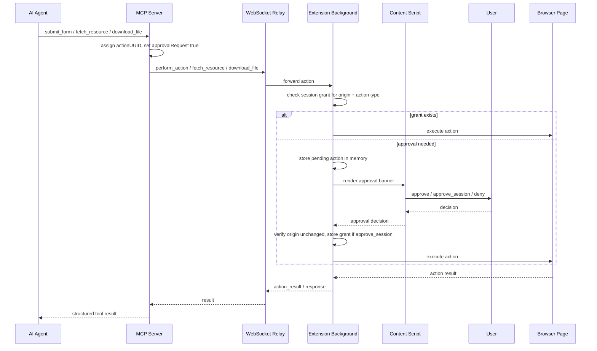

# Security and Trust Model

Brijio connects remote AI agents to the browser session the user already controls. Its
security posture is built around **explicit control** and **minimal trust**: the browser is
the source of truth for authenticated state, the extension is reactive rather than ambient,
and agents receive data only through explicit, validated requests. Many of Brijio's
architectural choices (explicit request/response, no streaming, user-controlled connection,
progressive disclosure, approval-gated actions) are security choices as much as they are
product choices.

## Core trust assumptions

The threat model (`docs/security/THREAT_MODEL.md`) assumes that AI agents, networks, cloud
infrastructure, and third-party services may be imperfect or untrusted. It rests on four
trust assumptions:

- The user explicitly starts and controls browser connections.
- Authentication tokens are kept secret by authorized parties.
- The browser session belongs to the user.
- The relay transports messages without requiring content inspection.

These assumptions shape the trust boundaries documented in
`docs/security/TRUST_BOUNDARIES.md`. Trust is placed deliberately (pairing token for browser
identity, a separate MCP auth token for agent authorization, the relay for routing only,
the user for connection state, the extension for structured DOM reads) and deliberately
minimized elsewhere — the relay does not need to inspect payloads, the agent is never
assumed to limit itself, and website content is read as data, never executed.

## Security goals

The security docs define the project's goals as:

- Protect browser sessions.
- Avoid credential exposure.
- Minimize unnecessary data transfer.
- Reduce trust in relay infrastructure.
- Maintain user control.

These goals are reinforced by the non-negotiable product invariants in `AGENTS.md`: the
user explicitly starts and stops the bridge, browser state is available only while the
user-controlled extension is connected, every browser read or action is initiated by an
explicit MCP tool or resource request, and permissions are kept minimal and documented.

## Threat classes and mitigations

The threat model names four classes of attacker. The mitigations are primarily
architectural rather than purely defensive code patterns.

| Threat class                 | What it tries                                                                                 | Architectural mitigations                                                                                                                                                |
| ---------------------------- | --------------------------------------------------------------------------------------------- | ------------------------------------------------------------------------------------------------------------------------------------------------------------------------ |
| **Malicious agent**          | Access data beyond what was requested, exfiltrate browser state, perform unauthorized actions | Explicit request/response protocol; no continuous streaming by design; user-controlled browser connection; progressive disclosure limits data exposure                   |
| **Compromised relay server** | Inspect, modify, or log traffic between agents and browsers                                   | Relay routes messages without requiring content access; user-controlled infrastructure allows self-hosting; future end-to-end encryption will prevent content inspection |
| **Network attacker**         | Intercept traffic on the path between agent, relay, and browser                               | TLS for all transports; authentication tokens for all connections; future E2E encryption adds defense in depth                                                           |
| **Malicious website**        | Exploit the extension or inject content that misleads the agent                               | Extension follows a least-privilege permission model; structured protocol prevents arbitrary code execution; page content is read, not evaluated                         |

The guiding rule from the trust-boundaries doc applies to every new feature: _does this
change expand trust in any party that should not be trusted?_ If yes, the feature needs
additional safeguards before it can be accepted.

## Architectural mitigations

The mitigations above are realized through concrete, observable behaviors:

- **Explicit request/response.** No data flows without an explicit MCP tool or resource
  call. The extension is reactive — it answers specific requests and returns specific
  results; it does not publish ambient browser state.
- **No continuous streaming.** Brijio does not push page updates, DOM changes, screenshots,
  or browser history to agents. Agents poll via `read_current_page` when they need fresh
  state.
- **User-controlled connection.** The bridge is inactive until the user explicitly
  connects. The extension disconnects on explicit user action, and approval grants are
  cleared when the bridge disconnects.
- **No background data transmission.** Keepalive messages are sent every 20 seconds and
  contain no browser state, only a `extension_keepalive` payload.
- **Progressive disclosure.** Agents receive structured context (URL, title, headings,
  links, forms) before larger page content or visual data, returning only what is needed.

## High-risk tools and the action-approval boundary

Three MCP tools are designated **approval-gated** because they can send user-entered data to
a site, trigger navigation or server-side side effects, or expose session-protected
content:

- **`submit_form`** — submits user-entered data to the current site and can trigger
  navigation or server-side side effects.
- **`fetch_resource`** — fetches a URL using the browser's session (cookies, auth) with a
  credentials-included fetch, exposing session-protected content to the agent. The MCP tool
  description explicitly calls it "a high-risk tool that exposes session-protected content
  to the agent."
- **`download_file`** — initiates a file download in the browser.

For these tools the MCP server assigns a unique `actionUUID` and sets
`approvalRequest: true` on the request payload before forwarding it through the relay. The
approval mechanism is defined in ADR 0048 (Client-Side Action Approval) and implemented in
the shared `BackgroundController`; see the [Action Approval workflow](/openwiki/workflows/action-approval.md)
page for the end-to-end mechanism.

### Approval flow

_Approval-gated tools require an explicit browser-side user decision before execution,
unless an in-memory session grant already covers the origin and action type._

### Approval state and lifecycle

The approval boundary is enforced entirely in the **extension background** and held
**in memory only**. The background script owns the pending-action queue, approval timeout
timers, session approval grants, and batch sequencing. Pending actions and grants are
never written to page `localStorage`, extension storage, IndexedDB, or other persistent
stores.

- **Approval-gated set is hardcoded.** `getApprovalActionType()` recognizes exactly
  `submit_form`, `fetch_resource`, and `download_file`; any other action type returns
  `undefined` and passes through without approval. Inside `perform_batch`, only
  `submit_form` is approval-gated; the standalone tools are not batch actions.
- **`approve_session` grants are scoped** to `{ origin, actionType }`, where the origin is
  computed from the active tab URL at approval time. A grant is stored as a `Set` keyed by
  `origin\u0000actionType` and lets future matching actions during the same bridge
  connection execute without a new prompt.
- **Origin is re-verified before execution.** After the user decides, the extension
  re-reads the active tab origin; if it changed, the action fails with
  `approval_origin_changed` instead of reusing the grant.
- **Grants are cleared on disconnect.** The `approvalSessionGrants` set is cleared when the
  bridge disconnects, so approvals never survive across bridge connections or browser
  restarts.
- **Pending approvals time out** before the local MCP HTTP request timeout
  (`approvalTimeoutMs`, default 55000 ms) so Brijio returns a structured approval error
  instead of a generic HTTP timeout.

### Approval error codes

The extension returns structured, `actionUUID`-tagged errors so agents can distinguish
approval failures from other failures:

| Code                      | Meaning                                                                                                                        |
| ------------------------- | ------------------------------------------------------------------------------------------------------------------------------ |
| `approval_denied`         | The user denied the action.                                                                                                    |
| `approval_timeout`        | The user did not respond before `approvalTimeoutMs`.                                                                           |
| `approval_unavailable`    | The extension could not render the approval UI, or approval is not available (e.g. missing `actionUUID` or active-tab origin). |
| `approval_origin_changed` | The active tab origin changed between approval and execution.                                                                  |

For batches, denial or timeout of one action is a focused per-action outcome, not a reason
to abort the whole batch. A denied action records `approval_denied` for its `actionUUID`
and the batch continues with the remaining actions; a timed-out action records
`approval_timeout`, the banner is hidden, and a partial `batch_result` is returned with
focused failed entries for the timed-out and unexecuted actions.

## Credential-extraction boundary

Brijio intentionally refuses to handle credentials. Two concrete boundaries enforce this:

- **Password fields are not fillable.** `fill_input` targets form controls by short-lived
  `formId`/`controlId`, but the shared content handler's `isSupportedTextControl()` allow-list
  excludes `type="password"` (it supports only text, search, email, url, tel, number, date,
  time, datetime-local, month, week, color, range, plus `textarea`). A write attempt
  against a password field returns `unsupported_control`, which the MCP server surfaces to
  the agent as `browser_error`. The skill guidance and capability matrix both document this
  as a security boundary, not a bug.
- **Readonly and disabled inputs are blocked.** The same handler returns
  `target_readonly` / `target_disabled` (also surfaced as `browser_error`) for readonly or
  disabled controls.

Combined with the non-goals below, this means Brijio never exports cookies, passwords,
passkeys, or MFA codes.

## Screenshot capture is explicit, never continuous

Screenshots are available only through the explicit `capture_screenshot` MCP tool, which
captures a single JPEG (quality 80) of the active tab's visible viewport on demand (ADR
0064). There is no automatic, periodic, or background screenshot capture. The capability
matrix records continuous screenshots and browser recording as intentionally
unsupported. `capture_screenshot` is a per-call operation: the extension background calls
the browser's `captureVisibleTab` adapter, returns the base64 image data in a
`screenshot_response`, and stops.

## Explicit non-goals (product boundaries)

The capability matrix and security-guarantees doc mark several capabilities as
🚫 **intentionally unsupported**. These are deliberate product boundaries, not missing
features:

- **No cookie export** — violates the authenticated-session model; the browser is the
  source of truth.
- **No session cloning** — the browser remains the source of truth for authenticated
  state.
- **No browser mirroring** — Brijio is not remote desktop software.
- **No continuous screenshots** — privacy and token efficiency; screenshots are per-call
  only.
- **No continuous DOM streaming** — data is exchanged only on explicit request.
- **No background surveillance** — the bridge is inactive until the user connects.
- **No browser history collection** — outside project scope.
- **No credential extraction** — password fields return `browser_error` on fill attempts.
- **No MFA interception** — MFA challenges belong to the user.

## Change guidance

If you change authentication, routing, browser-state exposure, or page-reading behavior,
re-check the security docs first. Many design choices are security choices, not just
implementation choices. Concretely:

- Changing which actions are approval-gated, the approval grant scope, or the in-memory-only
  grant lifecycle requires revisiting ADR 0048 and the approval tests in
  `packages/shared/src/background-controller.test.ts`.
- Exposing new browser state (e.g. continuous capture, history, cookies, or DOM streaming)
  conflicts with the non-goals and product invariants; such a change needs an ADR and a
  security review before implementation.
- Changing the `fill_input` supported-control allow-list (especially whether `password` or
  other sensitive types become fillable) affects the credential-extraction boundary.
- Changes to the screenshot path must preserve explicit, per-call capture only.

The security-guarantees document notes these guarantees are part of the project's identity
and should only change with extreme care, and that future end-to-end encryption is the
planned path to strengthen the relay boundary.
