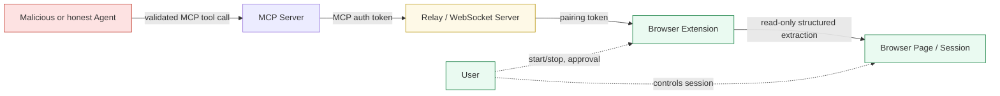
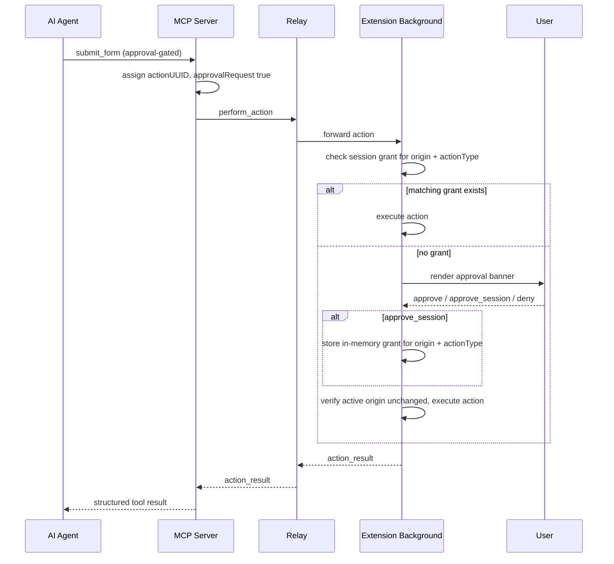

# Security and Trust Model

Brijio connects remote AI agents to a browser session the user already controls. The security model is built around explicit control and minimal trust: the user starts and stops the bridge, data only flows in response to explicit requests, and the relay is treated as a transport, not a data processor. Many design choices that look like feature gaps are deliberate security boundaries.

## Architecture and trust boundaries

Requests traverse five boundaries, each with a defined trust relationship. The agent is untrusted; the browser session and the user are the source of truth.



The trust boundaries and how trust is placed, minimized, or explicitly withheld at each one.

| Boundary                            | Trust relationship                                                                                        | How trust is minimized                                                                        |
| ----------------------------------- | --------------------------------------------------------------------------------------------------------- | --------------------------------------------------------------------------------------------- |
| Agent ↔ MCP Server                  | The MCP server does not trust the agent to limit itself; every request is validated against the protocol. | Explicit request/response protocol; no assumption of good agent behavior.                     |
| MCP Server ↔ Relay                  | Separate auth tokens; the relay trusts the MCP server only as an authorized consumer.                     | Relay routes messages without needing to inspect content.                                     |
| Relay ↔ Browser Extension           | A pairing token authenticates the WebSocket connection.                                                   | The extension does not trust the relay for confidentiality; end-to-end encryption is planned. |
| Browser Extension ↔ Browser Session | The extension operates with the permissions the user granted and does not trust web page content.         | Page data is read as structured context, not executed or evaluated.                           |
| Agent → Credentials                 | The agent is never trusted with credentials.                                                              | Brijio never exports cookies, passwords, or MFA codes; password fields reject fills.          |

## Core trust assumptions

From the threat model, the root README, and the agent invariants, Brijio assumes:

- The user explicitly starts and controls browser connections; the bridge is inactive until the user connects.
- Authentication tokens are held only by authorized parties (the MCP server uses an MCP auth token; the extension uses a separate pairing token).
- The browser session belongs to the user; the browser is the source of truth for authenticated state.
- The relay transports messages without needing to inspect their content; future E2E encryption will strengthen this.

## Security goals

The security docs state Brijio's main goals as:

- Protect browser sessions (the session stays local and user-controlled).
- Avoid credential exposure (no cookies, passwords, passkeys, or MFA codes are collected or exported).
- Minimize unnecessary data transfer (progressive disclosure; no continuous streaming).
- Reduce trust in relay infrastructure (relay is transport, not a data processor).
- Maintain user control (the user can disconnect at any time).

## Threat classes and mitigations

The threat model identifies four classes of attacker. Mitigations are architectural, not just defensive code patterns.

### Malicious agent

An agent that attempts to access data beyond what was requested, exfiltrate browser state, or perform unauthorized actions.

Mitigations:

- Explicit request/response protocol — the extension only answers explicit MCP tool/resource requests.
- No continuous streaming of pages, DOM, screenshots, history, or browser state.
- User-controlled browser connection — nothing happens while the bridge is disconnected.
- Progressive disclosure — agents receive structured context first, then larger content or visual data only when requested.
- Client-side action approval for sensitive operations (see below).

### Compromised relay server

A relay that attempts to inspect, modify, or log traffic between agents and browsers.

Mitigations:

- The relay routes messages between authenticated parties without requiring content access.
- Separate tokens for the MCP server and the extension limit what a relay compromise can impersonate.
- User-controlled infrastructure allows self-hosting the relay.
- Future end-to-end encryption will prevent content inspection entirely.

### Network attacker

An attacker on the network path between agent, relay, and browser.

Mitigations:

- TLS for all transports.
- Authentication tokens for all connections.
- Future E2E encryption adds defense in depth on top of transport security.

### Malicious website

A website that attempts to exploit the extension or inject content that misleads the agent.

Mitigations:

- The extension follows a least-privilege permission model and documents why each permission is needed.
- A structured protocol prevents arbitrary code execution by the agent.
- Page content is read as structured data, not evaluated or executed.

## Explicit non-goals

The capability matrix marks several capabilities as intentionally unsupported. These are product boundaries, not missing features. Brijio deliberately does not provide:

| Non-goal                   | Reason                                                                        |
| -------------------------- | ----------------------------------------------------------------------------- |
| Cookie export              | Violates the authenticated-session model; the browser is the source of truth. |
| Session cloning            | The browser remains the source of truth for authenticated state.              |
| Browser mirroring          | Brijio is not remote-desktop software.                                        |
| Continuous screenshots     | Privacy and token efficiency; screenshots are explicit-request-only.          |
| Continuous DOM streaming   | Privacy and efficiency; data is exchanged only on explicit request.           |
| Background surveillance    | User control first; the bridge is inactive until the user connects.           |
| Browser history collection | Outside project scope.                                                        |
| Credential extraction      | Security boundary; password fields return `browser_error` on fill attempts.   |
| MFA interception           | Security boundary; MFA challenges belong to the user.                         |

## Password and credential boundary

Credential protection is enforced in the page-reading and writing layer, not just in policy:

- `fill_input` rejects password fields. In the content handler, password inputs are not in the set of supported text controls, so a fill returns `unsupported_control`, which surfaces to the agent as `browser_error`.
- `fill_input` also rejects readonly and disabled inputs (`target_readonly`, `target_disabled`).
- Brijio does not collect, export, or stream cookies, passwords, passkeys, or MFA codes at any layer.
- Page context extraction reads form control _metadata_ (type, label, readonly state) without exporting values.

## Client-side action approval

ADR 0048 establishes a browser-side approval step for selected browser-mutating operations, so an agent cannot perform sensitive actions silently once a tool call reaches the connected extension. This approval must be preserved; the agent invariants forbid bypassing approval checks.

### What requires approval

Approval is not required for every action — only for operations with side effects beyond the page. In the current implementation the approval-gated operations are hardcoded:

- `submit_form`
- `fetch_resource`
- `download_file`

Other actions (click, write text, set checked, select options, navigation) do not require approval. The policy is intentionally kept behind a small `getApprovalActionType` check so it can later delegate to local configuration or an enterprise policy API without changing the action pipeline.

### Approval protocol

Every approval-gated operation carries a unique `actionUUID`; for `perform_batch`, every batch action carries one so approved, denied, or timed-out actions are identifiable inside the batch. Approval-gated requests also carry `approvalRequest: true`.

The approval lifecycle, owned by the extension background controller:



### Approval decisions and scope

The user has three choices:

- `approve` — approve only the current action.
- `approve_session` — approve this action and future matching actions during the same bridge connection.
- `deny` — reject the current action.

`approve_session` grants are scoped to a `{ origin, actionType }` pair, where `origin` is computed from the active tab URL at approval time. Before executing an approved action, the extension re-checks the active tab origin; if it changed, the action fails with `approval_origin_changed` rather than reusing the grant.

### In-memory only, cleared on disconnect

Approval state is held in memory only — pending actions and session grants live in the extension background controller and are never persisted to `localStorage`, extension storage, IndexedDB, or other persistent stores. The in-memory grant set is cleared when the bridge disconnects, the extension reloads, or the browser session ends. This keeps policy state outside the web page and out of durable storage, and keeps the MCP server stateless across per-tool invocations.

### Timeout behavior

Approval-gated requests use an application-level timer owned by Brijio. The approval timeout is computed from the local MCP HTTP timeout so Brijio can return a structured approval error before the HTTP server or client produces a generic timeout:

```text
approvalTimeoutMs = httpRequestTimeoutMs - approvalTimeoutBufferMs
```

If the user does not respond before `approvalTimeoutMs`, the extension hides the approval banner, cancels the pending action, and returns a structured `approval_timeout` error. The agent-visible timeout is therefore roughly 30–60 seconds depending on the configured local MCP HTTP timeout.

### Approval error codes

- `approval_denied` — the user denied the action.
- `approval_timeout` — the user did not respond before the computed approval timeout.
- `approval_unavailable` — the extension could not render the approval UI (e.g. restricted pages).
- `approval_origin_changed` — the active tab origin changed before the approved action could run.

Errors include the `actionUUID` when available; batch errors follow existing batch-result conventions including `aborted`.

### Batch behavior

In an approval-aware batch, actions execute in order. The extension treats each action independently: non-gated actions execute normally; a gated action with a matching session grant executes without prompting; a gated action with no grant shows the approval banner for that action only. The batch continues after a denied or timed-out action — denial is a focused per-action outcome, not a reason to abort the whole batch. If the approval timer fires while waiting, the timed-out action records `approval_timeout` and the batch returns a partial `batch_result` with focused failed entries for the timed-out and remaining unexecuted actions.

## Screenshots are explicit-request-only

Screenshots are not continuous or automatic. The `capture_screenshot` MCP tool (ADR 0064) returns a single viewport JPEG only on an explicit tool call — there is no auto-capture, screencast, or background capture. This keeps visual data inside the explicit-request model and aligns with the "no continuous screenshots" non-goal. Full-page scroll-stitch, annotation, and redaction are explicitly out of scope for the current screenshot tool.

## Connection and relay protocol boundaries

The relay protocol reinforces the trust model at the message level:

- **Manual connect/disconnect**: the extension connects and disconnects only on explicit user action via the popup; there is no background auto-connect.
- **Pairing token authentication**: the extension must authenticate with a configured token before sending any data; the MCP server uses a separate auth token.
- **Keepalive carries no state**: `extension_keepalive` is sent every 20 seconds and contains no browser state, so an open connection does not leak ambient page data.
- **Explicit request/response**: no data flows without an explicit MCP tool or resource call; the extension is reactive, not a publisher.
- **Connection state is user-visible**: the extension badge (ON/OFF/ERR) and distinguishable error messages (bad token, unreachable server, auth failure) keep the connection status observable.

## Change guidance

If you change authentication, routing, browser-state exposure, page-reading behavior, or the approval policy, re-check the security docs first — many design choices here are security choices, not just implementation choices.

- Changing auth or token handling affects the relay/extension and MCP/relay trust boundaries; write an ADR before implementation.
- Changing routing or targeting must preserve explicit per-call browser and `tabId` targeting; do not introduce hidden selected-browser or selected-tab session state.
- Changing browser-state exposure (reads, screenshots, screenshots, downloads, fetches) must stay inside the explicit-request model and the non-goals above.
- Changing the approval-gated operation set must go through the approval policy path (`getApprovalActionType` / `hasApprovalGatedAction`), and must not bypass the in-memory, session-scoped approval mechanism.
- Do not add continuous page, DOM, screenshot, history, or browser-state streaming, and do not implement silent background surveillance, cookie export, credential extraction, session cloning, or MFA interception.

The guiding rule from the trust-boundaries document: when evaluating a new feature, ask whether it expands trust in any party that should not be trusted. If it does, the feature needs additional safeguards before it can be accepted.

## Related source files

- `docs/security/THREAT_MODEL.md` — threat actors, mitigations, trust assumptions.
- `docs/security/TRUST_BOUNDARIES.md` — boundary-by-boundary trust placement and minimization.
- `docs/security/SECURITY_GUARANTEES.md` — the project's security guarantees.
- `docs/project/CAPABILITY_MATRIX.md` — Security Properties table and intentional non-goals.
- `docs/architecture/decisions/0048-client-side-action-approval.md` — client-side action approval design.
- `docs/architecture/decisions/0064-visual-action-verification.md` — explicit screenshot tool.
- `README.md` — key principles and architecture.
- `packages/shared/src/background-controller.ts` — approval-gated action execution, session grants, timeouts.
- `packages/shared/src/content-handler.ts` — password/readonly/disabled input rejection.
