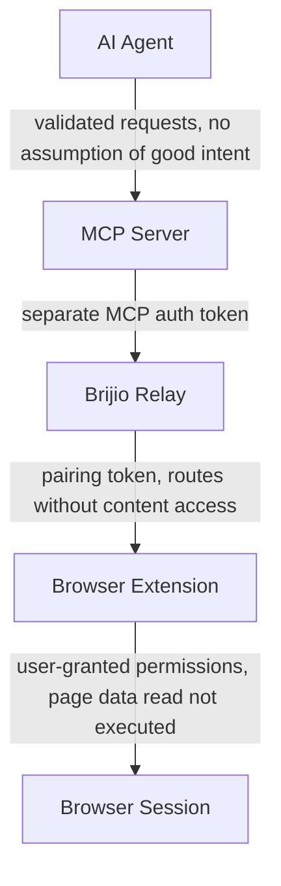

# Security and Trust Model

Brijio is a user-controlled bridge between AI agents and the authenticated browser sessions the user already owns. Its security posture is built around **explicit control** and **minimal trust**: information moves only on explicit request, the browser session stays local, and every party that is not the user is treated as potentially untrusted.

## Core trust assumptions

From `docs/security/THREAT_MODEL.md` and `docs/security/TRUST_BOUNDARIES.md`:

- The user explicitly starts and controls browser connections; the bridge is inactive until the user connects.
- Authentication tokens are kept secret by authorized parties.
- The browser session belongs to the user.
- The relay transports messages without requiring content inspection.

These are assumptions the design relies on, not properties it enforces on the user. The design enforces the corollaries: no data flows without an explicit MCP tool call, keepalive messages carry no browser state, and the extension reads page data as structured context rather than executing it.

## Security goals

The threat model names the primary goals:

- Protect browser sessions.
- Avoid credential exposure.
- Minimize unnecessary data transfer.
- Reduce trust in relay infrastructure.
- Maintain user control.

User control is first among these: users can disconnect Brijio at any time, and the browser remains under user control.

## Trust boundaries

`docs/security/TRUST_BOUNDARIES.md` defines four boundaries. Trust is placed deliberately at each one, minimized where possible, and explicitly not assumed where it cannot be.

_Figure: the four trust boundaries and what is trusted, minimized, or not assumed across each._

- **Agent ↔ MCP Server.** The agent trusts the MCP server to relay requests accurately and return responses without modification. The MCP server does **not** trust the agent to limit itself; all requests are validated against the protocol specification.
- **MCP Server ↔ Brijio Relay.** MCP and relay authenticate with separate tokens. The relay trusts the MCP server to be an authorized consumer; the MCP server trusts the relay to route messages to the intended browser. Communication is authenticated, but the relay does not need to inspect payloads.
- **Relay ↔ Browser Extension.** Relay and extension authenticate with a pairing token. The relay routes between authenticated parties without requiring content access. The extension does **not** trust the relay to protect confidentiality; planned end-to-end encryption will make this boundary stronger by ensuring the relay cannot inspect payloads.
- **Extension ↔ Browser Session.** The extension operates inside the user's browser with the permissions the user granted. It does **not** trust web page content: page data is read as structured context, never executed or evaluated.

The guiding rule for any new feature: _"Does this change expand trust in any party that should not be trusted?"_ If yes, the feature needs additional safeguards before it can be accepted.

## Threat classes and architectural mitigations

The threat model assumes AI agents, networks, cloud infrastructure, and third-party services may be imperfect or untrusted. It calls out four classes of attacker, and the mitigations are **architectural** rather than purely defensive code patterns.

| Threat            | What it attempts                                                                                         | Architectural mitigation                                                                                                                               |
| ----------------- | -------------------------------------------------------------------------------------------------------- | ------------------------------------------------------------------------------------------------------------------------------------------------------ |
| Malicious agent   | Access data beyond what was explicitly requested, exfiltrate browser state, perform unauthorized actions | Explicit request/response protocol; no continuous streaming by design; user-controlled browser connection; progressive disclosure limits data exposure |
| Compromised relay | Inspect, modify, or log traffic between agents and browsers                                              | Relay routes without requiring content access; planned E2E encryption prevents inspection; user-controlled infrastructure allows self-hosting          |
| Network attacker  | Attack the path between agent, relay, and browser                                                        | TLS for all transports; authentication tokens for all connections; planned E2E encryption adds defense in depth                                        |
| Malicious website | Exploit the browser extension or inject content that misleads the agent                                  | Least-privilege extension permissions; structured protocol prevents arbitrary code execution; content is read, not evaluated                           |

Because the mitigations are architectural, they cannot be restored by a code-level patch after the fact if a change breaks them. Any change to the explicit-request model, the no-streaming stance, or user-controlled connection lifecycle must be evaluated against these threats first.

## Explicit non-goals

The capability matrix marks the following as **intentionally unsupported** (`🚫`), not missing features. These are product boundaries:

- Cookie export (authentication/session cookies, browser storage) — violates the authenticated-session model; the browser is the source of truth.
- Session cloning — the browser remains the source of truth for authenticated state.
- Browser mirroring / remote desktop / desktop streaming — Brijio is not remote desktop software.
- Continuous screenshots — privacy and token efficiency.
- Continuous DOM streaming — privacy and efficiency; data is exchanged only on explicit request.
- Background surveillance — user control first; the bridge is inactive until the user connects.
- Browser history collection — outside project scope.
- Credential extraction — security boundary; password fields return `browser_error` on fill attempts.
- MFA interception — security boundary; MFA challenges belong to the user.

Brijio never exports cookies, passwords, passkeys, or MFA codes. The browser session remains local.

## The screenshot boundary: explicit vs. continuous

The "no continuous screenshots" non-goal is deliberately distinct from the bounded **explicit** screenshot capability.

- **Continuous screenshots** (unsupported): no automatic, periodic, or background capture of the browser. The capability matrix lists this as intentionally unsupported, alongside browser mirroring and continuous DOM streaming.
- **`capture_screenshot`** (ADR 0064, Proposed): an explicit, on-demand, viewport-only JPEG tool. The agent invokes it as a normal MCP tool call; the extension calls `tabs.captureVisibleTab({ format: 'jpeg', quality: 80 })` on the active tab and returns the image as MCP image content. There is no auto-capture, no background tab capture, no full-page scroll-stitch, and no screencast/video. `tabId` is accepted for forward compatibility but resolves only to the active tab for this stage.

This is the same explicit-request boundary that governs page reads: the extension is reactive and answers explicit requests with structured results; it never publishes ambient browser state. The explicit screenshot tool is a separate, bounded capability, not a relaxation of the no-continuous-screenshots rule.

## Higher-risk surfaces: download and fetch

`download_file` and `fetch_resource` are explicit-request tools, but they carry a higher risk profile than reads or simple DOM actions because they operate on the user's authenticated session.

- **`download_file`** initiates a browser download to the user's Downloads folder. The agent receives only metadata (a download ID and an `initiated` status, or `initiated_fire_and_forget` on Safari). The privacy boundary is enforced: filenames are basename-only with no directory paths, no file contents are delivered to the agent, the download registry is session-scoped (no history before the bridge connected), and the `downloads.open` permission is explicitly excluded so the agent cannot open files.
- **`fetch_resource`** is the highest-risk tool. The extension performs `fetch(url, { credentials: 'include' })` using the browser's live session cookies and auth, then streams the response back to the agent over a chunked staging protocol. Because this **exfiltrates session-protected content** from the browser's authenticated context to the agent, ADR 0047 classifies it as a high-risk tool and records that it will require explicit per-invocation user approval once the approvals system ships.

Both tools are approval-gated by ADR 0048. `submit_form`, `fetch_resource`, and `download_file` require client-side user approval: each approval-gated operation carries a unique `actionUUID` and `approvalRequest: true`, the extension renders an approval banner, and the user can `approve` (one action), `approve_session` (same origin + action type for the connection), or `deny`. Approval state is memory-only and is cleared when the bridge disconnects, the extension reloads, or the session ends. If the active tab origin changes before execution, the action fails with `approval_origin_changed` rather than reusing a grant. Pending approvals time out before the local MCP HTTP request timeout and return a structured `approval_timeout` error.

`fetch_resource` enforces additional bounds: a `maxSizeBytes` limit applied at both the extension and MCP level, a fetch timeout, and a `sha256` integrity check so the agent can verify the received content matches what the extension fetched. Safari cannot observe downloads and reports `fetch_resource` CORS failures honestly (`cors_blocked`) rather than as a generic "not supported".

## Change guidance

Many design choices in Brijio are security choices, not just implementation choices. If you change **authentication, routing, browser-state exposure, or page-reading behavior**, re-check the security docs first:

- `docs/security/THREAT_MODEL.md` — threat classes and mitigations.
- `docs/security/TRUST_BOUNDARIES.md` — the four trust boundaries and where trust is placed, minimized, or not assumed.
- `docs/security/SECURITY_GUARANTEES.md` — the guarantees that are part of the project's identity and should only change with extreme care.
- `docs/project/CAPABILITY_MATRIX.md` — the canonical product contract, including the intentionally-unsupported security properties.

AGENTS.md elevates these to non-negotiable invariants: do not add continuous page/DOM/screenshot/history/browser-state streaming; do not implement silent background surveillance, cookie export, credential extraction, session cloning, or MFA interception; do not persist page content unless an accepted ADR explicitly requires it; preserve explicit per-call browser and `tabId` routing; and do not bypass client-side action approval. An ADR is required before implementing any change that alters authentication, authorization, privacy, storage, a trust boundary, or browser routing/targeting/lifecycle semantics.

## Related pages

- [Architecture](/openwiki/architecture.md)
- [MCP Extension Flow](/openwiki/architecture/mcp-extension-flow.md)
- [Data and Protocol](/openwiki/data-and-protocol.md)
- [Domains](/openwiki/domains.md)
- [Quickstart](/openwiki/quickstart.md)
