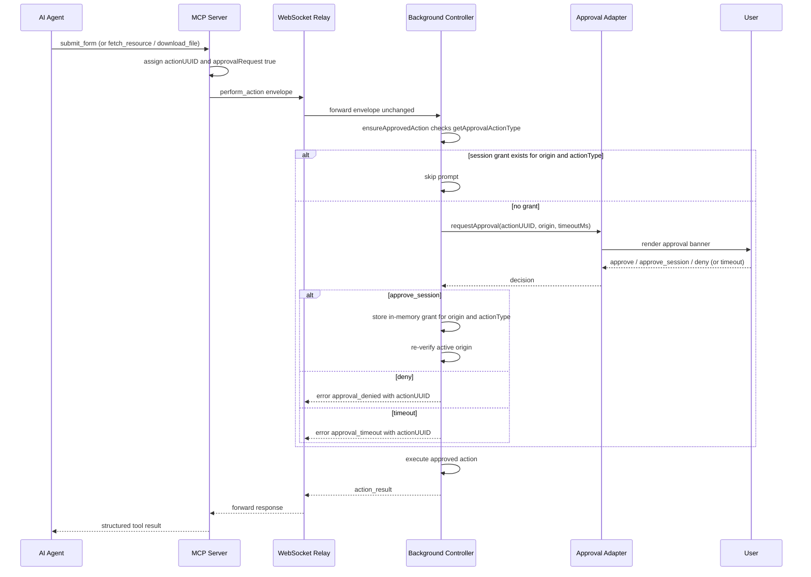

# Security and Trust Model

Brijio connects a remote AI agent to the browser session the user already controls. Its security posture is built around **explicit control and minimal trust**: the agent, the network, the relay, and the visited website are all assumed to be imperfect or untrusted, and the browser remains the source of truth for authenticated state.

The architecture this protects is described in [Architecture Overview](architecture.md) and the end-to-end request path in [MCP ↔ WebSocket ↔ Extension Flow](architecture/mcp-extension-flow.md); the wire shapes that carry these guarantees are in [Protocol and Data Model](data-and-protocol.md).

## Core trust assumptions

The threat model (`docs/security/THREAT_MODEL.md`) and trust boundaries (`docs/security/TRUST_BOUNDARIES.md`) state four assumptions the rest of the design rests on:

- **The user explicitly starts and controls the browser connection.** The bridge is inactive until the user connects the extension, and the user can disconnect at any time.
- **Authentication tokens are held only by authorized parties.** Browser identity is authenticated by a pairing token; agent authorization uses a separate MCP auth token. Raw tokens never appear in logs, responses, or presence state.
- **The browser session belongs to the user.** Brijio operates on the session the user already controls; it does not create duplicate authenticated environments.
- **The relay transports messages without inspecting content.** The relay routes envelopes between authenticated peers and is intended as transport, not a data processor.

These are assumptions about where trust _is_ placed. The trust-boundaries document also records where trust is deliberately **minimized** (agent→browser by the explicit request protocol; relay→payload by routing without content inspection; website→extension by read-only structured extraction) and where it is **not assumed** (the network, cloud relay privacy, agent intent, and website content).

## Security goals

The threat model names five goals that the architecture is meant to deliver:

- Protect browser sessions
- Avoid credential exposure
- Minimize unnecessary data transfer
- Reduce trust in relay infrastructure
- Maintain user control

These goals are enforced architecturally — explicit request/response, no continuous streaming, user-controlled connections, and progressive disclosure — rather than by defensive code patterns alone.

## Threat classes and architectural mitigations

The threat model calls out four classes of attacker. Each is mitigated primarily by a structural property of the design.

| Threat            | What it tries                                                                                 | Primary mitigations                                                                                                                                                           |
| ----------------- | --------------------------------------------------------------------------------------------- | ----------------------------------------------------------------------------------------------------------------------------------------------------------------------------- |
| Malicious agent   | Access data beyond what was requested, exfiltrate browser state, perform unauthorized actions | Explicit request/response protocol; no continuous streaming; user-controlled connection; progressive disclosure limits data exposure; client-side action approval (see below) |
| Compromised relay | Inspect, modify, or log traffic between agents and browsers                                   | Relay routes without requiring content access; user-controlled infrastructure allows self-hosting; end-to-end encryption is planned                                           |
| Network attacker  | Tamper with traffic on the path between agent, relay, and browser                             | TLS for all transports; authentication tokens for all connections; end-to-end encryption planned as defense in depth                                                          |
| Malicious website | Exploit the extension or inject content that misleads the agent                               | Least-privilege permission model; structured protocol prevents arbitrary code execution; page content is read, not evaluated                                                  |

The mitigating property is the same throughout: the extension is **reactive** — it answers explicit requests and returns structured results, and does not publish ambient browser state. Keepalive messages contain no browser state.

## Client-side action approval

The most important security control beyond the request/response model is **client-side action approval** (ADR 0048, Accepted). It exists to preserve Brijio's core privacy boundary: agents must not gain silent background authority over the browser. Some browser-mutating operations can send user-entered data to a site or trigger navigation or server-side side effects, so they require an explicit, browser-side user approval step before executing.

### What is gated

Approval is required for exactly three operations, and the gated set is a hardcoded local policy:

- `submit_form` — submits a form, which can send user data to the current site and trigger navigation or server-side effects.
- `fetch_resource` — fetches a URL using the browser's authenticated session.
- `download_file` — initiates a browser download.

Every other action (click, write text, set checked, select options, upload file, navigation, screenshots, reads) executes without an approval prompt. The approval system deliberately does **not** require approval for every action.

### How the gate works

Every approval-gated operation carries a unique `actionUUID` and `approvalRequest: true`. The MCP server assigns the `actionUUID` when it builds the request envelope — `submit_form`, `fetch_resource`, and `download_file` each get a fresh UUID plus `approvalRequest: true`; inside `perform_batch`, every batch action gets a `actionUUID` and `submit_form` items additionally get `approvalRequest: true`. The WebSocket relay forwards these envelopes unchanged to the extension.

The extension's shared background controller (`BrijioBackgroundController`) is the gate. For each action it runs `ensureApprovedAction`, which:

1. Checks `getApprovalActionType(action.type)` — returns the type only for `submit_form`, `fetch_resource`, or `download_file`; any other type, or any action without `approvalRequest: true`, passes through immediately.
2. Requires a non-empty `actionUUID`; a missing one returns `approval_unavailable`.
3. Looks up a session grant keyed by `{ origin, actionType }`; if one exists, the action proceeds without a prompt.
4. Otherwise renders an in-page approval banner and waits for a user decision (`approve`, `approve_session`, or `deny`) or an approval timeout.
5. After an approval decision, re-reads the active tab origin; if it changed, the action fails with `approval_origin_changed` instead of reusing the grant.
6. On `approve_session`, stores an in-memory grant for `{ origin, actionType }` so later matching actions during the same connection proceed without another prompt.


```mermaid
sequenceDiagram
    participant Agent as AI Agent
    participant MCP as MCP Server
    participant WS as WebSocket Relay
    participant Ctrl as Background Controller
    participant Adapter as Approval Adapter
    participant User as User

    Agent->>MCP: submit_form (or fetch_resource / download_file)
    MCP->>MCP: assign actionUUID and approvalRequest true
    MCP->>WS: perform_action envelope
    WS->>Ctrl: forward envelope unchanged
    Ctrl->>Ctrl: ensureApprovedAction checks getApprovalActionType
    alt session grant exists for origin and actionType
        Ctrl->>Ctrl: skip prompt
    else no grant
        Ctrl->>Adapter: requestApproval(actionUUID, origin, timeoutMs)
        Adapter->>User: render approval banner
        User-->>Adapter: approve / approve_session / deny (or timeout)
        Adapter-->>Ctrl: decision
        alt approve_session
            Ctrl->>Ctrl: store in-memory grant for origin and actionType
            Ctrl->>Ctrl: re-verify active origin
        else deny
            Ctrl-->>WS: error approval_denied with actionUUID
        else timeout
            Ctrl-->>WS: error approval_timeout with actionUUID
        end
    end
    Ctrl->>Ctrl: execute approved action
    Ctrl-->>WS: action_result
    WS-->>MCP: forward response
    MCP-->>Agent: structured tool result
```

_The client-side action-approval gate. The relay only forwards; the approval decision is made browser-side and the grant is held in extension memory only._

### In-memory-only state and the stateless MCP server

Approval state lives **in memory only**, in the extension background script: a `Set` of session-grant keys plus the pending-action queue, approval timers, and batch sequencing. Pending actions and grants are never written to page `localStorage`, extension storage, IndexedDB, or any other persistent store. Grants are cleared when the bridge disconnects — `disconnect()` calls `this.approvalSessionGrants.clear()` — and therefore also clear on extension reload or browser session end.

This placement is intentional. The MCP server is commonly instantiated per tool invocation, so it must **not** be the long-lived holder of approval state. Continuity belongs to the extension and relay, which already represent the live browser session and connection-routing boundary. Keeping the MCP server stateless across per-invocation processes is an explicit design consequence of the approval model.

### Approval scope, timeout, and error codes

`approve_session` is scoped narrowly to a `{ origin, actionType }` pair, where `origin` is computed from the active tab URL at approval time. This limits the risk of over-broad approval while reducing repeated prompts on the same site, and the origin re-check before execution means a grant cannot be silently reused after the page navigates.

The approval timeout is derived from the local MCP HTTP timeout so Brijio can return a structured approval error before the HTTP server produces a generic timeout:

```text
approvalTimeoutMs = max(1000, BRIJIO_MCP_HTTP_TIMEOUT_MS - BRIJIO_APPROVAL_TIMEOUT_BUFFER_MS)
```

With defaults `60000` ms HTTP timeout and `5000` ms buffer, the computed approval timeout is `55000` ms (the extension controller also falls back to `55000` when no timeout is configured). When the timer fires the extension hides the banner, cancels the pending approval, and returns a structured `approval_timeout`. For remote or enterprise deployments behind infrastructure Brijio does not control, the timeout must be explicitly configured below the shortest expected client, proxy, gateway, or load-balancer timeout.

Approval failures are reported with focused, structured error codes so the agent gets an unambiguous result rather than a generic failure:

- `approval_denied` — the user denied the action.
- `approval_timeout` — the user did not respond before the computed approval timeout.
- `approval_unavailable` — the extension could not render the approval UI (or no approval adapter is configured, or no active tab origin).
- `approval_origin_changed` — the active tab origin changed between approval and execution.

Errors include the `actionUUID` when available. Inside `perform_batch`, each action is treated independently: a denied or timed-out action returns its own error and the batch continues to later actions unless page navigation aborts the remainder. A timed-out batch returns a partial `batch_result` with focused errors for the timed-out and unexecuted actions.

### Policy evolution

The hardcoded list is stage one of a three-stage plan. The implementation keeps policy evaluation behind a small local function so the action-execution pipeline does not need to change as policy evolves: stage two is configurable local policy, and stage three is an enterprise policy API that returns the approval-gated set. Agent polling for approval status and a WebSocket-server approval status registry are explicitly out of scope for this ADR.

## Explicit non-goals

The capability matrix marks these as 🚫 **Intentionally unsupported** — deliberate product boundaries, not missing features. The security guarantees document frames them as part of the project's identity.

| Boundary                              | Why it is out of scope                                                         |
| ------------------------------------- | ------------------------------------------------------------------------------ |
| No cookie export                      | Violates the authenticated-session model; the browser is the source of truth.  |
| No session cloning                    | The browser remains the source of truth for authenticated state.               |
| No browser mirroring / remote desktop | Brijio is not remote desktop software.                                         |
| No continuous screenshots             | Privacy and token efficiency; screenshots are explicit-request only (planned). |
| No continuous DOM streaming           | Data is exchanged only on explicit request.                                    |
| No background surveillance            | User control first; the bridge is inactive until the user connects.            |
| No browser history collection         | Outside project scope.                                                         |
| No credential extraction              | Security boundary; password fields return `browser_error` on fill attempts.    |
| No MFA interception                   | Security boundary; MFA challenges belong to the user.                          |

The password-field block is a concrete enforcement point: `fill_input` returns `browser_error` for `type="password"` fields, and readonly/disabled inputs are similarly blocked.

## Change guidance

Many design choices in Brijio are security choices. AGENTS.md lists non-negotiable product invariants that any change must preserve, and several categories of change require an ADR before implementation.

### Non-negotiable invariants

- The user explicitly starts and stops the browser bridge.
- Browser state is available only while the user-controlled extension is connected.
- Every browser read or action is initiated by an explicit MCP tool or resource request.
- Do not add continuous page, DOM, screenshot, history, or browser-state streaming.
- Do not implement silent background surveillance, cookie export, credential extraction, session cloning, or MFA interception.
- Do not persist page content unless an accepted ADR explicitly requires it.
- Preserve authenticated, private browser and tab routing with explicit request IDs, structured errors, and timeouts.
- Preserve user-visible connection state and configured client-side action approval. **Do not bypass approval checks.**
- Keep permissions minimal and document why each browser permission is needed.
- Prefer progressive disclosure: return structured context before larger page content or visual data.

### Re-check security first

If a change touches **authentication, routing, browser-state exposure, page-reading, or the approval-gated action set**, re-check the security docs (`docs/security/*`) first. An ADR is required before implementation when a change introduces or alters a product capability, a cross-package protocol or schema, an architectural or ownership boundary, **authentication, authorization, privacy, storage, or a trust boundary**, or browser routing/targeting/lifecycle semantics. The guiding rule from the trust-boundaries document is: when evaluating a new feature, ask whether it expands trust in any party that should not be trusted — if yes, the feature needs additional safeguards before it can be accepted.

## Related source files

- `AGENTS.md` — non-negotiable invariants and the ADR-required change categories.
- `docs/security/THREAT_MODEL.md` — security goals, threat actors, mitigations, and trust assumptions.
- `docs/security/TRUST_BOUNDARIES.md` — where trust is placed, minimized, and not assumed.
- `docs/security/SECURITY_GUARANTEES.md` — the guarantees that define the project's identity.
- `docs/project/CAPABILITY_MATRIX.md` — the canonical Security Properties table and explicit non-goals.
- `docs/architecture/decisions/0048-client-side-action-approval.md` — the client-side approval ADR.
- `packages/shared/src/background-controller.ts` — the in-extension approval gate (`ensureApprovedAction`, `getApprovalActionType`, session grants).
- `servers/mcp/src/websocket-client.ts` — MCP assignment of `actionUUID` and `approvalRequest`.
- `servers/mcp/src/http-server.ts` — the approval-timeout derivation from the HTTP timeout.
- `servers/websocket/src/server.ts` — content-blind relay routing.
