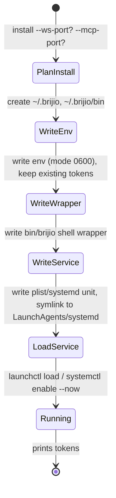

# Workflows

This page captures the repo-level workflows that matter most when editing Brijio: which commands to run, how to verify a change in the smallest scope, how the daemon/operations lifecycle works, and the protocol/browser-targeting change patterns that tend to cut across packages.

## Common commands

The root `package.json` defines the top-level scripts. Treat the manifests as the authority for available commands; do not copy a mutable full inventory elsewhere.

- `pnpm build` — build all workspace packages (`pnpm -r build`)
- `pnpm check` — type-check across all packages (`pnpm -r check`)
- `pnpm test` — run workspace tests plus repo scripts (`pnpm -r test && node --test scripts/*.test.mjs`)
- `pnpm lint` — TypeScript (`ts-standard`) and Markdown (`prettier`) linting
- `pnpm dev` — start the local development helper, which sets up `.env`, spawns the WebSocket and MCP servers in watch mode, runs health checks, and prints a banner
- `pnpm dev:ws` — run the WebSocket server in watch mode (`tsx watch servers/websocket/src/index.ts`)
- `pnpm dev:mcp` — run the MCP server in watch mode (`tsx watch servers/mcp/src/index.ts`)
- `pnpm token` / `pnpm brijio` — generate and print a Brijio pairing token (`node scripts/brijio-token.mjs`)

Each workspace package also defines its own `build`, `check`, `test`, and (where meaningful) `dev`/`pack` scripts in its own `package.json`. Run package-specific scripts via `pnpm --filter <pkg-name> <script>`.

The `Makefile` mirrors the common build/check/test/lint targets and adds platform-specific Safari helpers (`make safari`, `make safari-ios`, `make safari-macos`) that build the Safari extension and convert it into Xcode projects via `xcrun safari-web-extension-converter`, plus `make chrome` to build the Chrome extension.

## What to run after making changes

Run the smallest verification set that exercises the modified domain, then widen only when a change spans layers. From `AGENTS.md`:

| Changed area                  | Verification                                                                                     |
| ----------------------------- | ------------------------------------------------------------------------------------------------ |
| Shared protocol or page logic | `pnpm --filter @brijio/shared test` and `pnpm --filter @brijio/shared check`                     |
| Relay / routing (WebSocket)   | `pnpm --filter @brijio/websocket test` and `pnpm --filter @brijio/websocket check`               |
| MCP tool or resource          | `pnpm --filter @brijio/mcp test` and `pnpm --filter @brijio/mcp check`                           |
| Chrome extension              | `pnpm --filter @brijio/chrome-extension test` and `pnpm --filter @brijio/chrome-extension check` |
| Safari extension              | `pnpm --filter @brijio/safari-extension test` and `pnpm --filter @brijio/safari-extension check` |

For cross-package changes, run the workspace-level `pnpm test` and `pnpm check`. Before a PR is ready, match CI with `pnpm lint`, `pnpm build`, and `pnpm test`, and report exactly what passed and what could not be run.

### Docker validation

Use Docker validation only when container or runtime behavior changes, and derive the current profiles and commands from `docker-compose.yml` rather than assuming a profile exists. The compose file defines:

- `runtime` profile — the `brijio` service exposing WebSocket on `8787` and MCP HTTP on `8788` (defaults overridable via `WEBSOCKET_PORT` / `MCP_HTTP_PORT`), with `MCP_HTTP_PATH` set to `/mcp`.
- `legacy-runtime` profile — a `browserbridge` service that `extends` the `brijio` service, kept as a backwards-compatible alias during the BrowserBridge→Brijio rename transition.
- `test` profile — a `test-page` service (`nginx:1.27-alpine`) serving `clients/test-page` on port `8080`.

## Change workflow and AGENTS.md conventions

The root `AGENTS.md` is the contract for coding agents in this repo. Classify a change before editing.

### ADR required

Write an ADR (Proposed, with Mermaid diagrams when architecture or message flow is relevant, and wait for explicit user approval before implementing) when a change introduces or alters:

- a product capability or intentional user-visible behavior;
- a cross-package protocol or schema;
- an architectural boundary or ownership decision;
- authentication, authorization, privacy, storage, or a trust boundary;
- browser routing, targeting, or lifecycle semantics;
- a dependency or framework that materially changes the architecture.

A request to implement a feature does not by itself approve the ADR written for that feature. Before assigning a number, list existing ADRs and use the next unused number; never reuse an ADR number. After approval, mark the ADR `Accepted` and record superseding/superseded relationships.

### ADR usually not required

An ADR is normally unnecessary for a bug fix that restores documented/tested behavior, tests for existing behavior, documentation-only corrections, behavior-preserving refactors, narrowly scoped tooling or dependency maintenance, or implementation already covered by an accepted ADR. If a supposedly narrow change requires a new design decision, stop and follow the ADR workflow.

### Implementation

For behavior changes, use TDD: write or adjust a test that fails for the expected reason, implement the smallest change that makes it pass, refactor only when necessary, and run the relevant verification commands. For documentation, configuration, or tooling changes where a failing test is not meaningful, validate with the narrowest applicable formatter, linter, build, or direct inspection.

Keep changes small and atomic: one coherent step per commit (an ADR, tests, implementation, documentation, or tooling), stage files explicitly (avoid `git add .` / `git add -A` unless the whole tree is confirmed as PR scope), and keep PR titles/descriptions matching the actual goal and scope.

### Ownership boundaries

- Shared protocol shapes and browser-agnostic behavior belong in `packages/shared` — do not duplicate protocol definitions elsewhere.
- Relay authentication, presence, and routing belong in `servers/websocket`.
- Agent-facing tools, resources, prompts, and skills belong in `servers/mcp`.
- Browser-specific integration belongs in `clients/extensions/chrome` and `clients/extensions/safari`; keep adapters thin and shared behavior shared.

## Change patterns to watch for

### Protocol or schema changes

Cross-package message shapes start in `packages/shared` and then propagate through the relay, MCP server, and browser adapters. The full path to check is:

```text
shared protocol -> WebSocket relay -> MCP surface -> shared controller
                -> Chrome adapter -> Safari adapter -> integration tests
```

When tool behavior changes, update its tests, MCP registration, relevant skills under `servers/mcp/skills`, the capability matrix, and relevant OpenWiki workflow pages.

### Browser-targeting / tabId changes

The repo strongly prefers threading `tabId` explicitly through every layer rather than storing hidden selected-tab session state; preserve that pattern unless a new ADR says otherwise. When `tabId` is optional, preserve the documented active-tab fallback. Browser-targeting and tabId changes tend to span `packages/shared`, `servers/mcp`, `servers/websocket`, and both extension packages, so plan for cross-layer verification. The relevant ADRs:

- [ADR 0060: Explicit Tab Listing and Selection](../../docs/architecture/decisions/0060-explicit-tab-listing-and-selection.md) — adds `list_tabs` and an optional per-call `tabId` on tab-operating tools, with stateless per-call targeting (no `select_tab` default).
- [ADR 0062: Thread tabId Through the Action Stack](../../docs/architecture/decisions/0062-thread-tabid-through-action-stack.md) — completes the extension side so `tabId` reaches `chrome.tabs.sendMessage(tabId, …)` / `chrome.tabs.update(tabId, …)` instead of being silently dropped.
- [ADR 0063: Open Tab Action](../../docs/architecture/decisions/0063-open-tab-action.md) — adds the `open_tab` tool that creates a tab and returns its `tabId` for subsequent targeting.

See [Multi-tab Workflow](workflows/multi-tab.md) for the agent-facing usage pattern.

### Extension UI or manifest changes

Chrome and Safari have different manifest and runtime constraints (e.g. Safari produces separate `dist-ios`/`dist-macos` builds via `create-platform-manifest.mjs`; Chrome produces a single `dist` and a `pack` zip). Consider both browsers for shared browser behavior, and document and test intentional platform differences. Check the package READMEs before changing popup behavior, host permissions, or background lifecycle assumptions.

### Demo and docs changes

Demo pages and docs artifacts live under `servers/mcp/demo`, `clients/test-page`, `docs/artifacts`, and `scripts/`. They are useful for validating UX and layout assumptions but are not the main runtime path. `brijio demo` starts the demo server alongside the runtime stack (see below).

## Daemon and operations lifecycle

ADR 0037 defines a daemon install path so Brijio can run as a persistent, login-started service without manual sysadmin work. The implementation lives in `servers/mcp/src/daemon.ts` and is surfaced through the `brijio` binary (the `@brijio/mcp` package exposes `brijio` as the preferred command and keeps `browserbridge` as a backwards-compatible alias). The combined entry point `servers/mcp/bin/brijio.mjs` starts both the WebSocket and MCP servers in `run` mode and dispatches the lifecycle subcommands.

### Commands

```
brijio                         Run WebSocket and MCP servers interactively
brijio demo                    Run servers with the demo page for quick verification
brijio --dev                   Run in dev mode (bind to 127.0.0.1 only)
brijio --print-config [agent]  Print MCP client config for an agent
brijio --doctor                Run diagnostic checks
brijio install [--ws-port N] [--mcp-port N]
brijio uninstall
brijio start
brijio stop
brijio restart
brijio status
brijio logs [--lines N] [--live]
```

`install`/`uninstall`/`start`/`stop`/`restart`/`status`/`logs` are **subcommands**, not flags; server flags (`--port`, `--token`) remain flags when running interactively. `--dev` forces `WEBSOCKET_HOST`/`MCP_HTTP_HOST` to `127.0.0.1`; `demo` mode similarly binds the runtime servers to loopback but serves the static demo page on `0.0.0.0` so it is reachable over LAN/Tailscale.

### Token and env handling

The entry point loads env early (`loadBrijioEnv`) before any command dispatch so `--print-config` and `--doctor` see token values without starting servers. The env load falls back through `BRIJIO_ENV_FILE` (explicit override), `CWD/.env`, then `~/.brijio/.env`. When `BRIJIO_PAIRING_TOKEN` (or its legacy aliases `BROWSERBRIDGE_PAIRING_TOKEN` / `BRIJIO_TOKEN`) or `MCP_HTTP_AUTH_TOKEN` are unset, the binary auto-generates them with `crypto.randomBytes(32).toString('base64url')` and **mirrors the pairing token back into the legacy `BROWSERBRIDGE_PAIRING_TOKEN` env var** for compatibility with existing extension/relay configurations. The WebSocket URL and request-timeout env vars follow the same renamed-vs-legacy alias resolution and mirroring. `dev.mjs` performs analogous token generation/aliasing for the local dev workflow.

### Install and the daemon config directory

`install` is idempotent. It creates `~/.brijio/` (with a `bin/` subdirectory and an `.env.example` template on first install), and persists `BRIJIO_PAIRING_TOKEN`, `MCP_HTTP_AUTH_TOKEN`, and any `--ws-port`/`--mcp-port` overrides into `~/.brijio/.env` (mode `0o600`). If `.env` already exists, existing tokens and ports are preserved rather than regenerated; new port flags override existing values.

The installer resolves the binary path, writes a small shell wrapper (`~/.brijio/bin/brijio`) that `exec`s `node <resolved-source-binary> "$@"`, and writes a platform-specific service definition:

- **macOS** — a LaunchAgent plist at `~/.brijio/com.redvex.brijio.plist` with `RunAtLoad` and `KeepAlive` set to true, `WorkingDirectory` pointed at `~/.brijio`, and stdout/stderr sent to `~/.brijio/brijio.log`. The plist is symlinked into `~/Library/LaunchAgents/`.
- **Linux** — a systemd user unit at `~/.brijio/brijio.service` with `WorkingDirectory=%h/.brijio`, `ExecStart=%h/.brijio/bin/brijio`, `Restart=on-failure`, and `EnvironmentFile=%h/.brijio/.env`. The unit is symlinked into `~/.config/systemd/user/`.

After writing the service definition, `install` loads it (`launchctl load` on macOS, `systemctl --user daemon-reload && enable --now` on Linux) and prints the generated tokens to stdout with instructions to save them. `uninstall` stops and disables the service and removes the link, but deliberately preserves `~/.brijio/` (config and logs), printing the `rm -rf` command the user can run to fully remove.

The diagram below summarizes the install lifecycle:



### Runtime control and status

`start`/`stop`/`restart` wrap the platform service manager (`launchctl load|unload` on macOS, `systemctl --user start|stop|restart brijio.service` on Linux) and do not modify `~/.brijio/.env`. `status` reports whether the daemon is loaded and probes both health endpoints (`http://127.0.0.1:<wsPort>/health` and `http://127.0.0.1:<mcpPort>/health`), reading the configured ports from the loaded env. `logs` tails `~/.brijio/brijio.log` on macOS (or `journalctl --user -u brijio.service` on Linux); `logs --live` follows. The daemon platform is restricted to `darwin` and `linux` — other platforms throw.

### Run mode and startup

In `run` mode (or `demo`), the binary sets sensible defaults (`WEBSOCKET_HOST` `0.0.0.0`, `WEBSOCKET_PORT` `8787`, `MCP_HTTP_HOST` `0.0.0.0`, `MCP_HTTP_PORT` `8788`, `MCP_HTTP_PATH` `/mcp`, `BRIJIO_REQUEST_TIMEOUT_MS` `5000`) before dynamically importing the server modules, so `--doctor`/`--print-config` never trigger the full server cascade. If a port is already in use (`EADDRINUSE`), it prints a focused error pointing at `brijio --doctor` and the port env vars rather than a raw stack trace. In `demo` mode it first checks whether a daemon is already healthy on the WS port; if so, it starts only the demo server to avoid a `SO_REUSEPORT` scope mismatch. Startup banner and tokens are written to stderr, and `SIGINT`/`SIGTERM` trigger a graceful shutdown that closes the WS server, MCP runtime, and demo server.

## Related pages

- [Architecture](architecture.md)
- [MCP ↔ WebSocket ↔ Extension flow](architecture/mcp-extension-flow.md)
- [Domains](domains.md)
- [Multi-tab Workflow](workflows/multi-tab.md)
