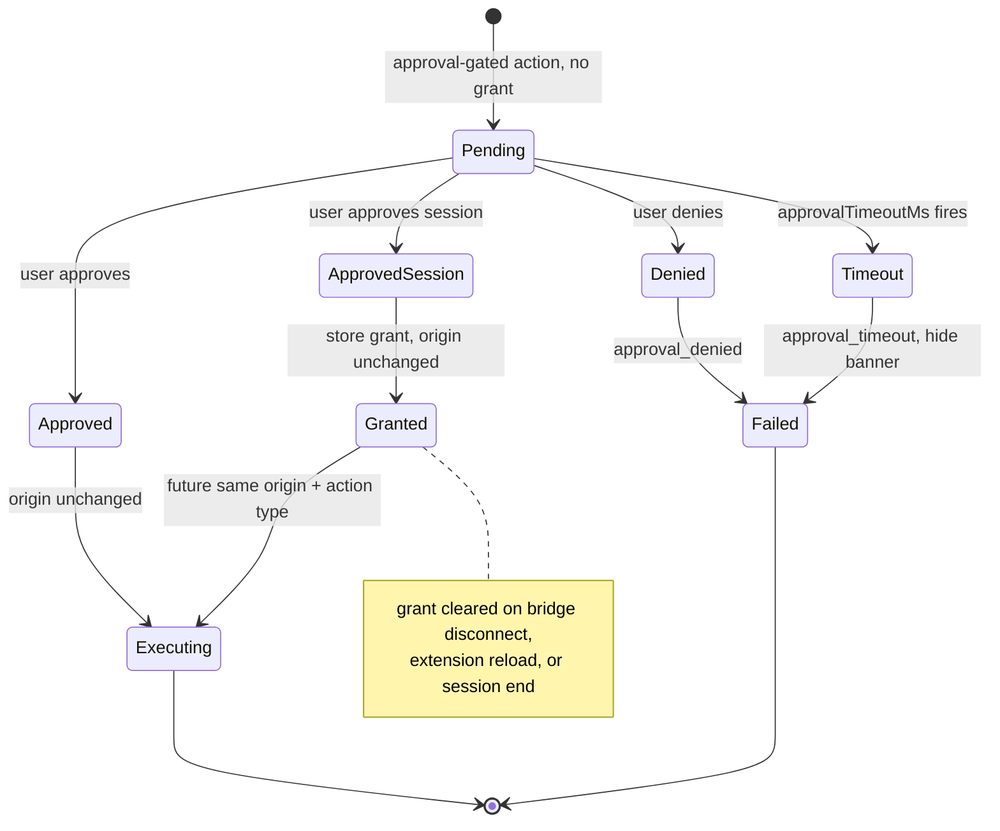
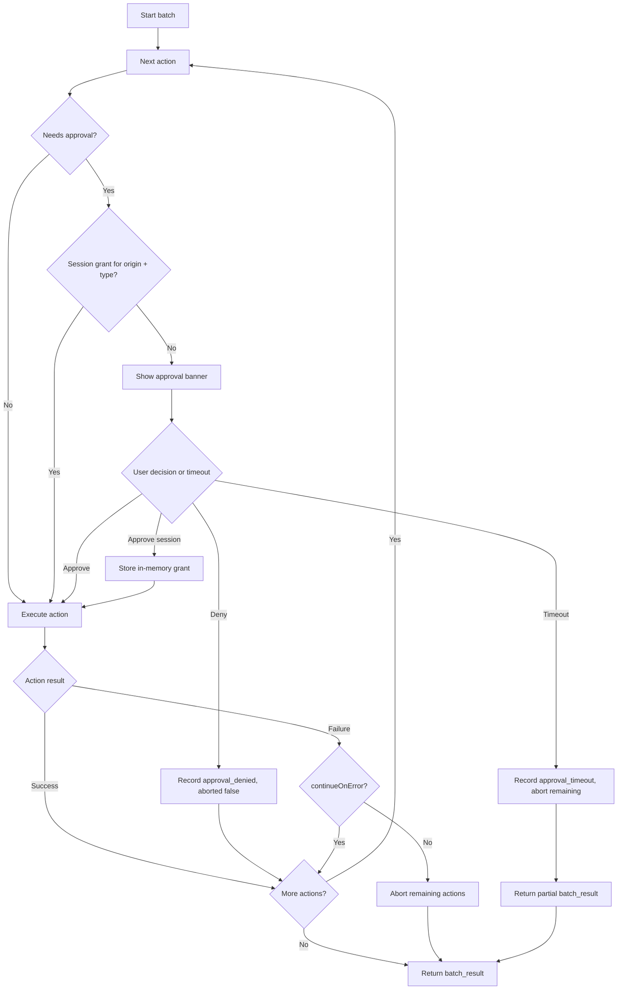

# Client-Side Action Approval Workflow

Brijio lets remote AI agents drive the browser the user already controls, but a small
set of operations can send user-entered data to a site, fetch authenticated resources, or
start downloads. ADR 0048 requires those operations to be **explicitly approved by the user
in the browser** before they execute. This page documents how that approval is requested,
granted, denied, timed out, and cleared, and how it threads through the MCP server, the
WebSocket relay, the extension background controller, and the content-script banner.

The approval system is a product invariant: `AGENTS.md` requires that user-visible
connection state and configured client-side action approval be preserved, and that
approval checks are not bypassed. ADR 0048 is the authoritative design
(`docs/architecture/decisions/0048-client-side-action-approval.md`).

## Scope: the approval-gated operation list

Only three operations require approval. The list is **hardcoded**:

- `submit_form`
- `fetch_resource`
- `download_file`

Every other action (`click`, `write_text`, `set_checked`, `select_options`,
`upload_file`, navigation, screenshot, page reads) executes without an approval step.
The hardcoded gate is enforced in two places that must stay in sync:

- `getApprovalActionType()` in the background controller returns the action type only for
  these three, and `undefined` otherwise.
- The MCP WebSocket client marks exactly these three single-action tools with
  `approvalRequest: true`, and marks `submit_form` items inside `perform_batch` with
  `approvalRequest: true`.

Adding an approval-gated operation is an ADR-required change (see _Editing guidance_
below); the list is not a runtime-configurable setting in the first implementation. ADR
0048 describes a future migration path (configurable local policy, then an enterprise
policy API) behind a small `requiresApproval(operation)`-style function, but the current
gate is a literal hardcoded check.

## Protocol shape: actionUUID and approvalRequest

Every approval-gated operation carries a unique `actionUUID` and `approvalRequest: true`
in its request payload. The shared protocol models these as the `ApprovalMetadata`
fields (`actionUUID?: string`, `approvalRequest?: boolean`) that all action and
download/fetch request types extend. Non-gated actions may also carry an `actionUUID`
(for identification) but do not set `approvalRequest`.

The MCP server assigns the `actionUUID` and the `approvalRequest` flag at envelope
construction time, not the agent:

- For the standalone `submit_form`, `download_file`, and `fetch_resource` tools,
  `createApprovalRequestOptions()` generates a fresh `actionUUID` of the form
  `action-<timestamp>-<random>` and sets `approvalRequest: true`.
- For `perform_batch`, `addBatchActionApprovalMetadata()` gives **every** batch action a
  unique `actionUUID` (preserving a caller-supplied one when present) and adds
  `approvalRequest: true` only to `submit_form` items. `fetch_resource` and
  `download_file` are standalone tools, not batch actions, so they are never batch-gated.

The WebSocket envelope `id` remains the request/response correlation identifier; the
`actionUUID` identifies a specific action within a single-action request or a batch.
Approval error responses echo the `actionUUID` so the agent can map a failure back to the
action that caused it.

## The approval adapter and decision types

The background controller depends on an `ApprovalAdapter` to render the user-facing
prompt and read the active tab origin. The interface and decision union live in
`packages/shared/src/background-controller.ts`:

```ts
export type ApprovalDecision = "approve" | "approve_session" | "deny";

export interface ApprovalRequest {
  actionUUID: string;
  actionType: ApprovalActionType;
  origin: string;
  timeoutMs: number;
}

export interface ApprovalAdapter {
  getActiveOrigin: () => Promise<string | undefined>;
  requestApproval: (request: ApprovalRequest) => Promise<ApprovalDecision>;
  hideApproval: (actionUUID: string) => Promise<void>;
}
```

`ApprovalActionType` is the same hardcoded union: `'submit_form' | 'fetch_resource' |
'download_file'`.

The three decisions mean:

- `approve` — approve only this one action.
- `approve_session` — approve this action and store a session grant so future matching
  actions skip the prompt (see _Session grants_).
- `deny` — reject this action.

`getActiveOrigin` computes the origin of the active tab (used both to scope grants and to
fail closed if the page changes). `requestApproval` renders the prompt and resolves with
the user's decision. `hideApproval` removes the prompt (used on timeout and cleanup).

## How approval threads through the components

```mermaid
sequenceDiagram
  participant Agent as AI Agent
  participant MCP as MCP Server
  participant WS as WebSocket Relay
  participant BG as Background Controller
  participant CS as Content Script
  participant User as User

  Agent->>MCP: submit_form / fetch_resource / download_file
  MCP->>MCP: assign actionUUID, approvalRequest true
  MCP->>WS: perform_action / download_file / fetch_resource
  WS->>BG: forward envelope
  BG->>BG: ensureApprovedAction: check session grant
  alt grant exists for origin + action type
    BG->>CS: execute action
    CS-->>BG: action result
  else no grant
    BG->>CS: show_brijio_approval (actionUUID, actionType, origin, timeoutMs)
    CS->>User: render Approve / Approve session / Deny banner
    User-->>CS: decision
    CS-->>BG: approval decision
    BG->>BG: re-check active origin; store grant if approve_session
    BG->>CS: execute action
    CS-->>BG: action result
  end
  BG-->>WS: action_result / download_file_response / fetch_resource_complete
  WS-->>MCP: response
  MCP-->>Agent: structured tool result
```

The sequence above shows the single-action path. Batch and standalone tool paths differ
only in the envelope type and response shape; the approval gate (`ensureApprovedAction`)
is shared.

### MCP server side

The MCP tool layer (`servers/mcp/src/form-action-tools.ts`,
`servers/mcp/src/fetch-resource-tool.ts`, `servers/mcp/src/download-file-tool.ts`) only
normalizes tool input and delegates to `page-actions.ts`, which calls the WebSocket
client. The approval-aware behavior is in `servers/mcp/src/websocket-client.ts`:

- `requestSubmitForm`, `requestDownloadFile`, and `requestFetchResource` each call
  `createApprovalRequestOptions()` to attach a fresh `actionUUID` and
  `approvalRequest: true`, then send the envelope over the bridge.
- These approval-gated requests use `options.approvalTimeoutMs ?? options.timeoutMs` as
  the WebSocket request timeout, so the MCP-side wait aligns with the approval budget
  rather than the shorter default action timeout.
- `requestPerformBatch` maps every action through
  `addBatchActionApprovalMetadata()`, detects whether any action is approval-gated, and
  only then uses the longer `approvalTimeoutMs`; otherwise it uses the normal
  `timeoutMs`.

The MCP HTTP server derives `approvalTimeoutMs` from the configured HTTP request
timeout and a safety buffer (see _Timeout behavior_) and passes it down through
`BrijioPageActionsConfig.approvalTimeoutMs`. The MCP process is per-invocation and
stateless; it owns no approval state.

### Extension background controller

`BrijioBackgroundController` (`packages/shared/src/background-controller.ts`) is the
single owner of approval state. Each inbound envelope is dispatched in
`handleSocketMessage`:

- `perform_action` → `handlePerformActionRequest`, which calls `ensureApprovedAction`
  before `performPageAction`.
- `download_file` → `handleDownloadFileRequest`, which calls `ensureApprovedAction`
  before `download.downloadFile`.
- `fetch_resource` → `handleFetchResourceRequest`, which calls `ensureApprovedAction`
  before `download.fetchResource`.
- `perform_batch` → `handlePerformBatchRequest`, which routes to
  `performApprovalAwareBatch` when `hasApprovalGatedAction(actions)` is true, or to the
  content-script batch adapter otherwise.

If approval fails, the controller sends the matching structured error response
(`action_result` / `download_file_response` / `fetch_resource_complete` with
`ok: false` and an approval error code) and does not execute the action.

### Chrome approval adapter

The Chrome extension supplies the adapter via `createChromeApprovalAdapter()` in
`clients/extensions/chrome/src/background.ts`:

- `getActiveOrigin()` queries the active tab and returns `new URL(tab.url).origin` for
  regular page URLs, or `undefined` for restricted/non-page URLs.
- `requestApproval()` ensures the content script is injected (`content.js`), then sends
  a `show_brijio_approval` message carrying `actionUUID`, `actionType`, `origin`, and
  `timeoutMs` to the tab. It resolves with `parseApprovalDecision(response)`, which
  returns the user's `'approve' | 'approve_session' | 'deny'` or defaults to `'deny'`
  for any malformed/missing response.
- `hideApproval()` sends a `hide_brijio_approval` message keyed by `actionUUID`.

### Content-script banner

`clients/extensions/chrome/src/content-script-entry.ts` renders the banner in the page.
On `show_brijio_approval` it prepends a fixed-position dialog labelled "Brijio wants to
`<actionType>` on `<origin>`" with three buttons — **Approve**, **Approve session**,
**Deny**. Clicking a button removes the banner and `sendResponse({ ok: true, decision })`.
On `hide_brijio_approval` it removes the banner matching that `actionUUID`. The banner is
DOM-only and never persists anything.

## The approval check: `ensureApprovedAction`

`ensureApprovedAction` is the gate every approval-gated path funnels through. Its
ordered checks fail closed at each step:

1. **Not gated?** `getApprovalActionType(action.type)` returns `undefined`, or
   `action.approvalRequest !== true` → return `{ ok: true }` and execute. A non-gated
   action type never triggers approval even if it somehow carries `approvalRequest`.
2. **Missing actionUUID?** `actionUUID` is absent or empty → `approval_unavailable`
   ("Approval request is missing an actionUUID.").
3. **No approval adapter?** `options.approval` is `undefined` → `approval_unavailable`
   ("Action approval is not available.").
4. **No active origin?** `approval.getActiveOrigin()` returns `undefined` or empty →
   `approval_unavailable` ("Active tab origin is not available for approval.").
5. **Existing session grant?** `approvalSessionGrants.has(grantKey)` → return
   `{ ok: true }` without prompting.
6. **Prompt with timeout.** Call `waitForApprovalDecision`, which races
   `approval.requestApproval` against a `timers.setTimeout` of `timeoutMs`. The timeout
   calls `approval.hideApproval(actionUUID)` and resolves `'timeout'`.
7. **Map the decision:**
   - `'timeout'` → `approval_timeout` ("Timed out waiting for user approval.").
   - `'deny'` → `approval_denied` ("User denied approval for `<actionType>`.").
   - `'approve'` or `'approve_session'` → continue, but first re-read the active
     origin. If it changed → `approval_origin_changed` ("Active tab origin changed
     before approved action could run."). Otherwise, for `approve_session`, add the
     grant key to `approvalSessionGrants`.

The re-check after approval (step 7) means even an approved action is not executed if the
user navigated the tab away from the origin that was approved.

## Session grants

`approve_session` stores an in-memory grant keyed by `createApprovalGrantKey(origin,
actionType)`, which joins origin and action type with a NUL separator
(`${origin}\u0000${actionType}`). A later approval-gated action with the same origin and
action type hits step 5 and executes without a prompt, for the lifetime of the current
bridge connection.

Grant invariants:

- Grants live only in the `BrijioBackgroundController.approvalSessionGrants` `Set`, in
  background-process memory. They are never written to `localStorage`, IndexedDB,
  extension storage, or any other persistent store.
- Grants are cleared when the bridge disconnects: `disconnect()` calls
  `this.approvalSessionGrants.clear()`. A reconnect starts with no grants.
- Grants are cleared when the extension reloads (process restart loses the in-memory
  set) and when the browser session ends.
- Grants are scoped to `{ origin, actionType }`. A different origin, or the same origin
  for a different action type, prompts again. A grant never spans action types or sites.
- Before reusing a grant, the gate does not re-prompt, but execution itself still runs
  against the live page; the post-approval origin re-check (step 7) only applies to the
  prompt path, not the grant-hit path.

## Approval lifecycle



A pending approval is one specific `{ actionUUID, actionType, origin }` awaiting a user
decision. Only one prompt is in flight per request; batches prompt one action at a time
(see _Batches_). `approve` resolves the current pending action only; `approve_session`
resolves it and creates a grant for future matching actions; `deny` and `timeout` resolve
it as a failure.

## Timeout behavior

The approval timeout is an application-level timer owned by Brijio, derived from the
local MCP HTTP request timeout so that Brijio returns a structured approval error before
the HTTP server or client produces a generic timeout.

The MCP HTTP server computes:

```text
approvalTimeoutMs = max(1000, httpTimeoutMs - approvalTimeoutBufferMs)
```

with defaults `BRIJIO_MCP_HTTP_TIMEOUT_MS=60000` and
`BRIJIO_APPROVAL_TIMEOUT_BUFFER_MS=5000`, yielding `approvalTimeoutMs=55000`. This value
flows into `BrijioPageActionsConfig.approvalTimeoutMs` and is used as the WebSocket
request timeout for approval-gated single actions and approval-gated batches. The
background controller uses `options.approvalTimeoutMs ?? 55000` as the prompt timer
(`timeoutMs` on the `ApprovalRequest` sent to the content script).

When the timer fires, `waitForApprovalDecision` calls `hideApproval(actionUUID)` to
dismiss the banner and resolves `'timeout'`, which becomes a structured
`approval_timeout` error carrying the `actionUUID`. Keeping the approval timeout below
the HTTP timeout by the configured buffer is what guarantees the agent sees a structured
approval error rather than an ambiguous HTTP timeout.

For remote or enterprise deployments behind infrastructure Brijio does not control, the
timeout must be configured below the shortest expected client, proxy, gateway, or
load-balancer timeout.

## Error codes

Approval failures use dedicated error codes, all optionally carrying `actionUUID`:

- `approval_denied` — the user denied the action.
- `approval_timeout` — the user did not respond before `approvalTimeoutMs`.
- `approval_unavailable` — the extension could not render the approval UI (no adapter,
  no active tab, missing `actionUUID`, or no active origin).
- `approval_origin_changed` — the active tab origin changed between approval and
  execution.

Batch errors additionally include the `aborted` flag following existing batch result
conventions.

## Batches

When a `perform_batch` contains at least one approval-gated action, the controller
routes to `performApprovalAwareBatch`, which runs a background-level batch runner instead
of delegating the whole batch to the content script. The runner treats every action
independently and preserves ADR 0044's ordered batch semantics:

1. If the action does not require approval, execute it.
2. If it requires approval and a matching session grant exists, execute it.
3. If it requires approval and no grant exists, prompt for that action only, one prompt
   at a time.
4. Continue with the next action only after the current action succeeds, is denied, or
   times out.

Per-action outcomes:

- **Deny** is a focused per-action result: the action returns `approval_denied` with its
  `actionUUID` and `aborted: false`, and the batch continues to later actions. Brijio
  tries its best to perform the remaining actions because batch actions use explicit IDs,
  not positional selectors.
- **Timeout** is request-level, not per-action: when the approval timer fires while a
  batch is waiting, the current action records `approval_timeout` with
  `aborted: true`, the banner is hidden, remaining unexecuted actions are returned as
  focused `approval_timeout` "Skipped because approval timed out before this action."
  entries with `aborted: true`, and the batch returns a partial `batch_result` with
  `aborted: true`. Already-completed actions keep their results.
- **approve_session** inside a batch stores a grant, so a later `submit_form` in the same
  batch (and same origin) reuses it and does not prompt again.

The `continueOnError` flag continues to apply to execution failures after an action is
approved (stale targets, unsupported controls, browser errors). Page navigation remains
special: if an executed action navigates the page, remaining actions abort because
previously read page IDs may no longer be valid.



## Invariants and failure semantics

- **Approval state is memory-only.** Pending prompts and session grants live only in
  background-controller memory and the DOM banner. They are never persisted to
  `localStorage`, IndexedDB, extension storage, or any other store.
- **Grants are cleared on disconnect, reload, or session end.** `disconnect()` clears the
  grant set; an extension reload or session end loses it implicitly.
- **Fail closed.** Missing adapter, missing actionUUID, missing active origin, or a
  malformed content-script response all resolve to a non-success decision (`deny` for
  malformed responses, `approval_unavailable` for missing prerequisites) rather than
  silently executing.
- **Origin must match at execution.** The post-approval origin re-check ensures an
  approved action does not run against a page the user navigated away to.
- **One prompt at a time.** Batches prompt sequentially; there is no concurrent approval
  UI for multiple actions.
- **Timeout precedes HTTP timeout.** The buffer keeps the structured `approval_timeout`
  ahead of the generic HTTP timeout.
- **The agent is never trusted to self-limit.** The MCP server attaches the
  `actionUUID`/`approvalRequest` metadata; the background controller enforces the gate
  regardless of what the agent sent. An action that is gated by type but missing
  `approvalRequest` is treated as not-gated only because the controller requires both
  `getApprovalActionType(type) !== undefined` **and** `approvalRequest === true`.

## Configuration and operations

- `BRIJIO_MCP_HTTP_TIMEOUT_MS` — local MCP HTTP request timeout (default `60000`).
- `BRIJIO_APPROVAL_TIMEOUT_BUFFER_MS` — buffer subtracted from the HTTP timeout to derive
  the approval timeout (default `5000`).
- The derived `approvalTimeoutMs` is floored at `1000`.
- The background controller falls back to `55000` when `approvalTimeoutMs` is not
  supplied.
- The approval-gated operation list and the timeout buffer must be kept in sync with
  `http-server.ts`'s derivation and the hardcoded `getApprovalActionType`/`addBatchActionApprovalMetadata`
  lists.

## Editing guidance

- **Do not bypass approval checks.** Every gated path must go through
  `ensureApprovedAction`; do not add a code path that executes `submit_form`,
  `fetch_resource`, or `download_file` without it.
- **Do not add an approval-gated operation without an ADR.** A new gated operation
  requires updating `getApprovalActionType`, `hasApprovalGatedAction`, the MCP
  `createApprovalRequestOptions`/`addBatchActionApprovalMetadata` call sites, the
  `ApprovalActionType` union, and an accepted ADR.
- **Keep the approval-gated list and the timeout buffer in sync** with
  `http-server.ts`'s `approvalTimeoutMs` derivation and the controller default.
- **Do not persist approval state.** Keep grants and pending prompts in
  background-controller memory only; do not add `localStorage`/IndexedDB/extension-storage
  backing.
- Preserve the user-visible connection state (badge/state machine) alongside approval;
  approval is part of the same user-controlled bridge lifecycle.

## Tests

Approval behavior is covered across the three packages ADR 0048 names:

- `packages/shared/src/background-controller.test.ts` — the `FakeApprovalAdapter` harness
  verifies: approval is requested before gated `submit_form` and the action executes
  after `approve`; `deny` returns `approval_denied`; the approval timer fires and hides
  the banner returning `approval_timeout`; `approve_session` reuses the grant for a
  second same-origin/type action without a second prompt; the active origin changing
  after approval returns `approval_origin_changed`; `download_file` and `fetch_resource`
  request approval before executing; batches continue after a denied gated action, return
  a partial `batch_result` with skipped entries on timeout, and reuse an `approve_session`
  grant for a second gated batch action.
- `servers/mcp/src/protocol.test.ts` — verifies `submit_form`, `download_file`, and
  `fetch_resource` envelopes carry `actionUUID` and `approvalRequest: true`.
- `servers/mcp/src/websocket-client.test.ts` — verifies the assigned `actionUUID` matches
  the `^action-` shape.
- `servers/mcp/src/http-server.test.ts` — verifies `approvalTimeoutMs` is derived as
  `httpTimeoutMs - approvalTimeoutBufferMs` (e.g. `60000 - 5000 = 55000`).

Run with `pnpm --filter @brijio/shared test`, `pnpm --filter @brijio/chrome-extension
test`, `pnpm --filter @brijio/mcp test`, or `pnpm test`.

## Related pages

- [/openwiki/architecture/mcp-extension-flow.md](/openwiki/architecture/mcp-extension-flow.md)
  — the end-to-end MCP → relay → extension request flow that approval gates into.
- [/openwiki/architecture/mcp-tools-and-skills.md](/openwiki/architecture/mcp-tools-and-skills.md)
  — the tool layer that normalizes input and delegates to the approval-aware WebSocket
  client.
- [/openwiki/data-and-protocol.md](/openwiki/data-and-protocol.md) — the shared envelope
  and `ApprovalMetadata` protocol fields.
- [/openwiki/security.md](/openwiki/security.md) — the trust model and approval-gated
  high-risk tools this workflow enforces.
