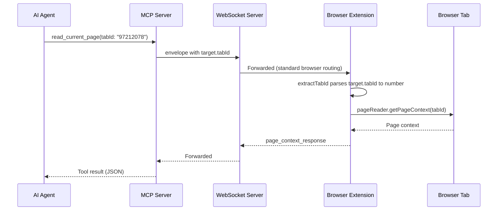
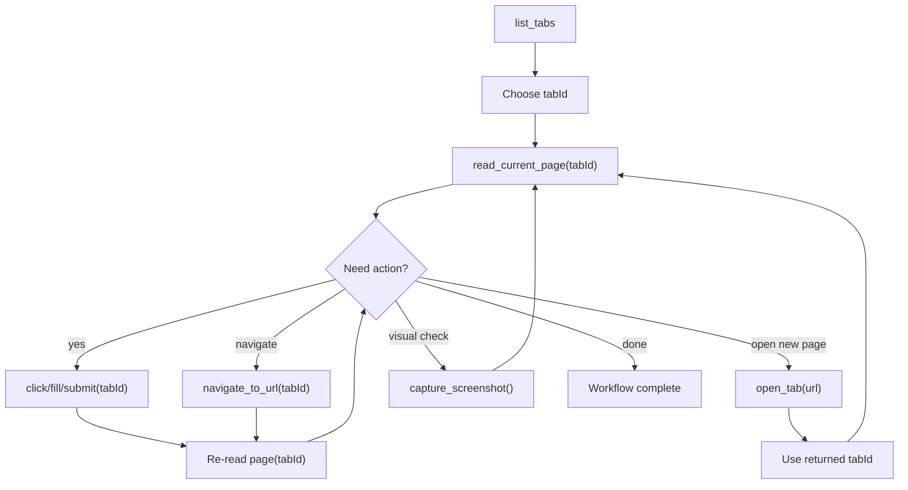
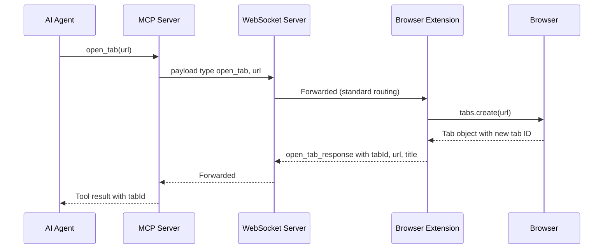

# Multi-tab Workflow

Brijio supports explicit per-call tab targeting through `tabId` for the main
browser interaction path. Every tool that touches page state — reads, actions,
batched actions, navigation, and new-tab creation — accepts an optional `tabId`
string. When `tabId` is omitted the call falls back to the active foreground
tab, so single-tab workflows need no change while multi-tab workflows become
explicit and unambiguous.

The `capture_screenshot` tool is the exception: it is active-tab-only by design,
because the underlying `captureVisibleTab` browser API can only capture the
visible tab. It is a complementary visual-verification tool used after actions,
not a per-tab read.

## Canonical source files

- `servers/mcp/skills/using-brijio/SKILL.md` — agent-facing multi-tab workflow guidance
- `servers/mcp/skills/navigation/SKILL.md` — navigation and open_tab workflow guidance
- `servers/mcp/src/mcp-server.ts` — tool registration, shared `tabIdInput` schema
- `servers/mcp/src/list-tabs-tool.ts` — `list_tabs` thin wrapper
- `servers/mcp/src/open-tab-tool.ts` — `open_tab` input normalization and URL validation
- `servers/mcp/src/capture-screenshot-tool.ts` — `capture_screenshot` input normalization
- `servers/mcp/src/page-reading-tool.ts` — `read_current_page` with `tabId`
- `servers/mcp/src/page-actions.ts` — action wrappers that thread `tabId` through to the WebSocket client
- `servers/mcp/src/navigate-to-url-tool.ts` — `navigate_to_url` wrapper
- `servers/mcp/src/batch-tool.ts` — `perform_batch` wrapper
- `servers/mcp/src/websocket-client.ts` — `requestBrijio` and `targetEnvelope` routing
- `servers/mcp/src/protocol.ts` — `TabInfo`, `ScreenshotResultData`, envelope creators/parsers
- `packages/shared/src/background-controller.ts` — `extractTabId`, adapter dispatch, `PageOpenTabAdapter`, `PageScreenshotAdapter`, `TabListerAdapter`
- `packages/shared/src/page-reader.ts` — shared active-tab page reading
- `docs/architecture/decisions/0063-open-tab-action.md` — ADR for `open_tab`
- `docs/architecture/decisions/0064-visual-action-verification.md` — ADR for `capture_screenshot`
- `docs/project/CAPABILITY_MATRIX.md` — canonical capability and browser-support contract
- `docs/project/ROADMAP.md` — milestone status (milestone C: multi-tab, milestone D: screenshots)

## How tabId flows from tool call to browser

`tabId` is an optional string on every tab-aware tool. The MCP server declares
it once as a shared Zod schema (`tabIdInput`) and attaches it to `list_tabs`,
`read_current_page`, `click_element`, `fill_input`, `fill_editable`,
`set_checked`, `select_options`, `submit_form`, `perform_batch`,
`navigate_to_url`, `list_tabs`, and `capture_screenshot`. `open_tab` is the one
tab-state tool that does not accept `tabId` — it creates a tab and _returns_ the
new `tabId` instead.

The control flow has three layers:

1. **Tool layer** (`*-tool.ts`): normalizes raw input, rejecting non-string or
   empty `tabId` with `invalid_tool_input`, and delegates to `page-actions.ts`
   or `page-context.ts`.
2. **Action layer** (`page-actions.ts`): resolves `tabId ?? config.defaultTabId`
   and passes it into the WebSocket client request options. Every action wrapper
   (`clickCurrentPageElement`, `navigateToCurrentPageUrl`, `performBatch`, …)
   follows the same `tabId: tabId ?? config.defaultTabId` pattern, so a
   server-configured `defaultTabId` can pin a workflow to one tab without the
   agent passing it each call.
3. **Transport layer** (`websocket-client.ts`): `targetEnvelope` only adds a
   `target` object to the envelope when `browserInstanceId` or `tabId` is
   present, then `requestBrijio` authenticates and sends the targeted envelope.
   On the extension side, `BrijioBackgroundController.handleSocketMessage` calls
   `extractTabId(message)`, which reads `message.target.tabId` (a string) and
   parses it to a `number` for the browser APIs. When no `tabId` is present,
   `extractTabId` returns `undefined` and the extension's `pageReader`,
   `pageActions`, and `pageNavigation` adapters operate on the active tab.

## Recommended workflow

1. Call `list_tabs` to discover connected browser tabs.
2. Choose the tab you want to work on.
3. Pass that tab's `tabId` into subsequent read, action, batch, and navigation
   calls.
4. Keep using the same `tabId` until you intentionally switch tabs.
5. Re-read page context after navigation or other changes that may invalidate
   the page snapshot.

Caption: the multi-tab loop — discover, target, act, re-read, and optionally
verify visually. Every branch carries the chosen `tabId` forward except
`capture_screenshot`, which captures the active tab.

### Active-tab fallback

When no `tabId` is provided, the system uses the active foreground tab. This is
intentional and preserved across the whole tool surface: `extractTabId` returns
`undefined`, and the extension adapters' `tabId?: number` parameters default to
the active tab via `chrome.tabs.query({ active: true, currentWindow: true })`.
Single-tab workflows and existing skills therefore keep working unchanged.

## list_tabs

`list_tabs` returns every open tab in the connected browser, including
background tabs. Each entry is a `TabInfo` with `tabId` (string), `windowId`,
`title`, `url`, `active`, and `supported`. Only HTTP/HTTPS tabs are listed — the
extension filters with `isRegularPageUrl` before returning. Tabs that are not
HTTP/HTTPS (e.g. `chrome://`, `about:`) are excluded.

The tool accepts `browserInstanceId` and `tabId` in its input schema, but
`tabId` is not meaningful for listing (the list covers the whole browser); the
parameter is present for schema consistency with the other tab-aware tools.

If the connected extension does not provide a `TabListerAdapter`, the
controller responds with `not_supported` ("Tab listing is not supported by this
browser."). Both Chrome and Safari ship a `tabLister` adapter built on
`tabs.query({})`.

## open_tab

The `open_tab` tool opens a new browser tab at a given HTTP(S) URL and returns
the new `tabId`. Use it when a workflow requires two pages open simultaneously
(e.g. comparison tasks, cross-referencing) without disrupting the user's
current tab. `navigate_to_url` would destroy the page state the agent was
working on (form input, scroll position, dynamic content); `open_tab` leaves
the original tab untouched.

`open_tab` does **not** accept a `tabId` parameter — it creates a tab, so there
is no existing tab to target. The returned `tabId` must be passed to all
subsequent reads and actions on the new tab, because the new tab may not be the
active foreground tab and omitting `tabId` would target the wrong page.

### Request and response shape

The request flows through the existing WS → extension routing, mirroring
`navigate_to_url`:

The response data is `{ tabId, url, title }`. `title` may be empty until the
page loads. The tool validates the URL scheme with `parseUrl` and rejects
non-HTTP(S) schemes with `unsupported_scheme`. Error codes include
`unsupported_scheme`, `open_tab_failed`, `not_supported` (extension lacks the
adapter), `browser_unavailable`, and `connection_failed`.

`close_tab` and tab ownership tracking are deferred (P2.5). The agent can
`list_tabs` to discover tabs it opened. See ADR 0063 for the full design.

## capture_screenshot

`capture_screenshot` (ADR 0064) captures the **viewport of the active/current
tab** as JPEG (quality 80) and returns MCP image content. It complements
`read_current_page` for visual verification after actions — CAPTCHA detection,
layout debugging, and "did the click work?" confirmation — scenarios where a
structured accessibility-tree snapshot is insufficient.

### Active-tab-only by design

`capture_screenshot` is active-tab-only because it is built on the browser's
`captureVisibleTab` API (`chrome.tabs.captureVisibleTab` /
`browser.tabs.captureVisibleTab`), which can only capture the visible tab in a
window. Capturing a background tab would require switching focus, which is
user-disruptive. The tool therefore does **not** route a `tabId` to the
extension's capture call even though it accepts one in its input schema; the
extension always captures whatever tab is currently visible. If you need a
screenshot of a specific background page, `open_tab` it into a dedicated tab
first.

This is the one tab-aware tool where the `tabId` parameter is effectively
inert: `captureScreenshot` in `page-actions.ts` threads `tabId` into the
`requestCaptureScreenshot` options like any other action, but the extension
adapter (`pageScreenshot.captureScreenshot()`) takes no argument and captures
the active tab regardless.

### Return format

On success the MCP server returns a two-block `content` array:

- an `image` block (`{ type: 'image', data: <base64>, mimeType: 'image/jpeg' }`)
- a `text` block with JSON metadata: `width`, `height`, `tabId`, `capturedAt`

The extension strips the `data:image/jpeg;base64,` prefix from the data URL
before returning. Chrome and Safari both return `width: 0` / `height: 0` in the
current implementation (real dimensions are not decoded at capture time); the
`tabId` and `captAt` ISO timestamp are populated. A text content note advises
that a vision-capable agent is required to interpret the image.

If the extension does not provide a `PageScreenshotAdapter`, the controller
responds with `capability_not_supported` ("Screenshot capture is not supported
by this browser."). Runtime permission errors are also mapped to
`capability_not_supported`; other capture failures map to `capture_failed`.
Other error codes include `no_visible_tab` and `timeout`.

### Scope boundaries

Per ADR 0064, viewport-only capture is intentionally scoped: full-page
scroll-stitch, annotation/highlighting, screencast/video, policy
redaction, and background-tab capture are all out of scope and deferred to P4.5
(Visual Evidence). Screenshots are explicit only — there is no auto-capture or
continuous streaming, consistent with Brijio's privacy-by-design model.

## Why this matters

The `tabId` work makes multi-tab behavior explicit instead of implicit. That
reduces ambiguity when an extension has more than one connected tab and lets
agents keep a stable tab target across a workflow. `open_tab` closes the core
multi-tab gap (create without disrupting), and `capture_screenshot` adds a
visual-verification path that structured reads cannot provide.

## What to watch for when editing this area

- If you change any MCP tool that touches page state, confirm whether it should
  accept `tabId`. The shared `tabIdInput` schema in `mcp-server.ts` is the
  single place most tools get the parameter; `open_tab` intentionally omits it.
- Update the `using-brijio` and `navigation` skills together with tool behavior
  changes — they document the `tabId` workflow, `open_tab` return value, and
  when to use `tabId` vs. the active tab.
- Preserve the active-tab fallback: when no `tabId` is provided, `extractTabId`
  returns `undefined` and the extension adapters operate on the active tab. Do
  not make `tabId` required.
- `capture_screenshot` is active-tab-only by design (the `captureVisibleTab`
  API). Do not wire its `tabId` input into per-tab capture without revisiting
  ADR 0064 and the browser API constraints.
- `close_tab` and tab ownership tracking are not yet implemented (P2.5). The
  agent discovers opened tabs via `list_tabs`.

## Related docs

- [Architecture: MCP ↔ WebSocket ↔ Extension flow](../architecture/mcp-extension-flow.md)
- [Capability matrix](../../docs/project/CAPABILITY_MATRIX.md)
- [Roadmap](../../docs/project/ROADMAP.md)
- ADR 0063: `docs/architecture/decisions/0063-open-tab-action.md`
- ADR 0064: `docs/architecture/decisions/0064-visual-action-verification.md`
